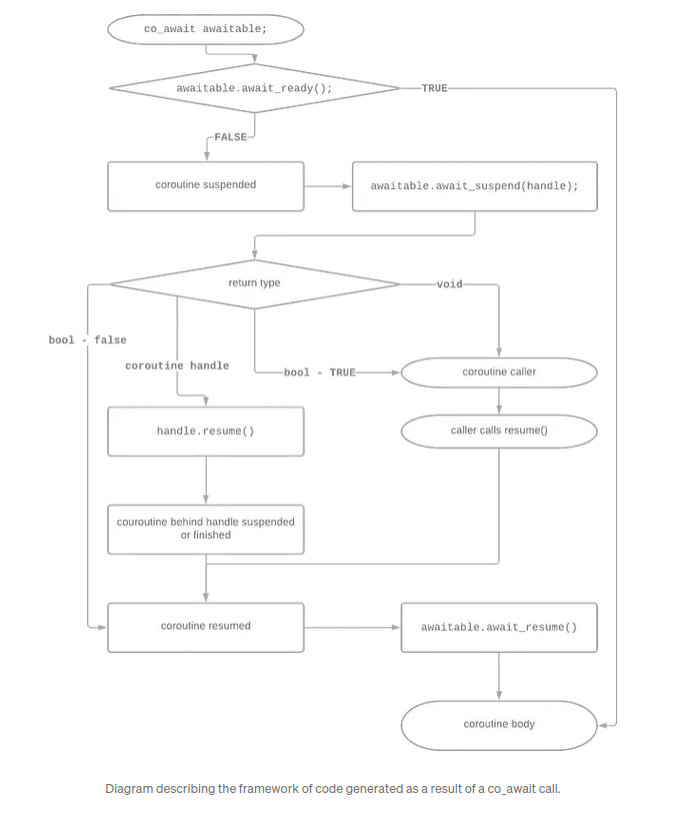

# C++20 Coroutine examples

##### Example

```cpp
struct ReturnType {
	struct promise_type {
	};
};

ReturnType my_coroutine() {
	co_await something();

	co_yield value;

	co_return; // void
	co_return value;
}
```

##### simplest 

```cpp
#include <coroutine>

// The caller-level type
struct Task {
    // The coroutine level type
    struct promise_type {
        Task get_return_object() { return {}; }
        std::suspend_never initial_suspend() { return {}; }
        std::suspend_never final_suspend() noexcept { return {}; }
        void return_void() { }
        void unhandled_exception() { }
    };
};

Task myCoroutine() {
    co_return; // make it a coroutine
}

int main() {
    auto c = myCoroutine();
}
```

##### simplest-instrumented

```cpp
#include <coroutine>
#include <iostream>

auto dbg = [](const char* s) {
    std::cerr << "Function " << s << " called.\n";
};

// The caller-level type
struct Task {
    // The coroutine level type
    struct promise_type {
        promise_type() {
            dbg(__PRETTY_FUNCTION__);
        }
        ~promise_type() {
            dbg(__PRETTY_FUNCTION__);
        }
        Task get_return_object() {
            dbg(__PRETTY_FUNCTION__);
            return {};
        }
        std::suspend_never initial_suspend() {
            dbg(__PRETTY_FUNCTION__);
            return {};
        }
        std::suspend_never final_suspend() noexcept {
            dbg(__PRETTY_FUNCTION__);
            return {};
        }
        void return_void() {
            dbg(__PRETTY_FUNCTION__);
        }
        void unhandled_exception() {
            dbg(__PRETTY_FUNCTION__);
        }
    };
    Task() {
        dbg(__PRETTY_FUNCTION__);
    }
    ~Task() {
        dbg(__PRETTY_FUNCTION__);
    }
};

Task myCoroutine() {
    std::cerr << "Inside coroutine.\n";
    co_return; // make it a coroutine
}

int main() {
    std::cerr << "Before coroutine call.\n";
    auto c = myCoroutine();
    std::cerr << "After coroutine call.\n";
}
```

```cpp
// Coroutine is created on the heap before anything.
Before coroutine call.
Function Task::promise_type::promise_type() called. // promise type instance constructed 
    
Function Task Task::promise_type::get_return_object() called. // get return object is called and stored as a local variable
    
Function Task::Task() called. // call our constructor from get_return_object()
    
Function std::__n4861::suspend_never Task::promise_type::initial_suspend() called. // the compiler now calls co_await in initial_suspend and in the suspend_never case, we do not suspend and continue with the execution of the coroutine body (and therefore do not return to the caller)
    
Inside coroutine. // We now execute the body of our coroutine
    
Function void Task::promise_type::return_void() called. // we hit our co_return and as we return nothing we call our promise_type return void_function (could have been return_value if we wish to return some actual value)
    
Function std::__n4861::suspend_never Task::promise_type::final_suspend() called. // generated code calls co_await in the final_suspend fucntion, in this case it never suspends so our coroutine has now exited
    
Function Task::promise_type::~promise_type() called. // destroy the coroutine calling the destructor, we deallocate any state in the 'coroutine frame' and its local frame.
After coroutine call. // We have finished our coroutine call
Function Task::~Task() called. // main out of scope, the return object dies.
```

##### simplest-leaking

```cpp
#include <coroutine>

// The caller-level type
struct Task {
    // The coroutine level type
    struct promise_type {
        Task get_return_object() { return {}; }
        
  
        std::suspend_always initial_suspend() { return {}; }
        std::suspend_never final_suspend() noexcept { return {}; }
        void return_void() { }
        void unhandled_exception() { }
    };
};

Task myCoroutine() {
    co_return; // make it a coroutine
}

int main() {
    auto c = myCoroutine();
}
```

##### simplest-leaking-instrumented

```cpp
#include <coroutine>
#include <iostream>

auto dbg = [](const char* s) {
        std::cerr << "Function " << s << " called.\n";
};

// The caller-level type
struct Task {
    // The coroutine level type
    struct promise_type {
        promise_type() {
            dbg(__PRETTY_FUNCTION__);
        }
        ~promise_type() {
            dbg(__PRETTY_FUNCTION__);
        }
        Task get_return_object() {
            dbg(__PRETTY_FUNCTION__);
            return {};
        }
        std::suspend_always initial_suspend() {
            dbg(__PRETTY_FUNCTION__);
            return {};
        }
        std::suspend_never final_suspend() noexcept {
            dbg(__PRETTY_FUNCTION__);
            return {};
        }
        void return_void() {
            dbg(__PRETTY_FUNCTION__);
        }
        void unhandled_exception() {
            dbg(__PRETTY_FUNCTION__);
        }
    };
    Task() {
        dbg(__PRETTY_FUNCTION__);
    }
    ~Task() {
        dbg(__PRETTY_FUNCTION__);
    }
};

Task myCoroutine() {
    std::cerr << "Inside coroutine.\n";
    co_return; // make it a coroutine
}

int main() {
    std::cerr << "Before coroutine call.\n";
    auto c = myCoroutine();
    std::cerr << "After coroutine call.\n";
}
```

```cpp
Before coroutine call. // Start as normal
// Allocate coroutine state on the heap
Function Task::promise_type::promise_type() called. // construct our promise type object
Function Task Task::promise_type::get_return_object() called. // return object to the caller
Function Task::Task() called. // constructor for the return to the caller
Function std::__n4861::suspend_always Task::promise_type::initial_suspend() called. // we hit initial suspend and always suspend i.e return to our caller, in this case we have LEAKED the coroutine because its in a suspended state
After coroutine call.

// No promise_type destructor called
    
Function Task::~Task() called. // destroy the object returned
```

##### simplest-fixed

```cpp
#include <coroutine>

// The caller-level type
struct Task {
    // The coroutine level type
    struct promise_type {
        using Handle = std::coroutine_handle<promise_type>;

        Task get_return_object() {
            return Task{Handle::from_promise(*this)};
        }
        std::suspend_always initial_suspend() { return {}; }
        std::suspend_never final_suspend() noexcept { return {}; }
        void return_void() { }
        void unhandled_exception() { }
    };

    explicit Task(promise_type::Handle coro) : coro_(coro) {}
    Task(const Task&) = delete;
    Task& operator=(const Task&) = delete;
    Task(Task&& t) noexcept : coro_(t.coro_) { t.coro_ = {}; }
    Task& operator=(Task&& t) noexcept {
        if (this == &t) return *this;
        if (coro_) coro_.destroy();
        coro_ = t.coro_;
        t.coro_ = {};
        return *this;
    }
    ~Task() {
        if (coro_ && !coro_.done())
            coro_.destroy();
    }

    void destroy() { coro_.destroy(); }
    void resume() { coro_.resume(); }

private:
    promise_type::Handle coro_;
};

Task myCoroutine() {
    co_return; // make it a coroutine
}

int main() {
    auto c = myCoroutine();
    c.resume();
    // c.destroy();
}
```

##### simplest-fixed-instrumented

```cpp
#include <coroutine>
#include <iostream>

auto dbg = [](const char* s) {
        std::cerr << "Function " << s << " called.\n";
};

// The caller-level type
struct Task {
    // The coroutine level type
    struct promise_type {
        using Handle = std::coroutine_handle<promise_type>;
        promise_type() {
            dbg(__PRETTY_FUNCTION__);
        }
        ~promise_type() {
            dbg(__PRETTY_FUNCTION__);
        }
        Task get_return_object() {
            dbg(__PRETTY_FUNCTION__);
            return Task{Handle::from_promise(*this)};
        }
        std::suspend_always initial_suspend() {
            dbg(__PRETTY_FUNCTION__);
            return {};
        }
        std::suspend_always final_suspend() noexcept {
            dbg(__PRETTY_FUNCTION__);
            return {};
        }
        void return_void() {
            dbg(__PRETTY_FUNCTION__);
        }
        void unhandled_exception() {
            dbg(__PRETTY_FUNCTION__);
        }
    };
    explicit Task(promise_type::Handle coro) : coro_(coro) {
        dbg(__PRETTY_FUNCTION__);
    }
    Task(const Task&) = delete;
    Task& operator=(const Task&) = delete;
    Task(Task&& t) noexcept : coro_(t.coro_) {
        dbg(__PRETTY_FUNCTION__);
        t.coro_ = {};
    }
    Task& operator=(Task&& t) noexcept {
        dbg(__PRETTY_FUNCTION__);
        if (this == &t) return *this;
        if (coro_) coro_.destroy();
        coro_ = t.coro_;
        t.coro_ = {};
        return *this;
    }
    ~Task() {
        dbg(__PRETTY_FUNCTION__);
        if (coro_ && !coro_.done())
            coro_.destroy();
    }

    void destroy() { coro_.destroy(); }
    void resume() { coro_.resume(); }
private:
    promise_type::Handle coro_;
};

Task myCoroutine() {
    std::cerr << "Inside coroutine.\n";
    co_return; // make it a coroutine
}

int main() {
    std::cerr << "Before coroutine call.\n";
    auto c = myCoroutine();
    std::cerr << "After call, before resume.\n";
    c.resume();
    std::cerr << "After resume.\n";
}
```

```cpp
Before coroutine call.
Function Task::promise_type::promise_type() called.
Function Task Task::promise_type::get_return_object() called.
Function Task::Task(promise_type::Handle) called.
Function std::__n4861::suspend_always Task::promise_type::initial_suspend() called.
After call, before resume.
Inside coroutine.
Function void Task::promise_type::return_void() called.
Function std::__n4861::suspend_never Task::promise_type::final_suspend() called.
Function Task::promise_type::~promise_type() called.
After resume.
Function Task::~Task() called.
```

##### generator

```cpp
#include <coroutine>
#include <iostream>

// The caller-level type
struct Generator {
    // The coroutine level type
    struct promise_type {
        using Handle = std::coroutine_handle<promise_type>;

        Generator get_return_object() {
            return Generator{Handle::from_promise(*this)};
        }
        std::suspend_always initial_suspend() { return {}; }
        std::suspend_always final_suspend() noexcept { return {}; }
        std::suspend_always yield_value(int value) {
            current_value = value;
            return {};
        }
        void unhandled_exception() { }
        int current_value;
    };

    explicit Generator(promise_type::Handle coro) : coro_(coro) {}
    // Make move-only
    Generator(const Generator&) = delete;
    Generator& operator=(const Generator&) = delete;
    Generator(Generator&& t) noexcept : coro_(t.coro_) { t.coro_ = {}; }
    Generator& operator=(Generator&& t) noexcept {
        if (this == &t) return *this;
        if (coro_) coro_.destroy();
        coro_ = t.coro_;
        t.coro_ = {};
        return *this;
    }

    int get_next() {
        coro_.resume();
        return coro_.promise().current_value;
    }

private:
    promise_type::Handle coro_;
};

Generator myCoroutine() {
    int x = 0;
    while (true) {
        co_yield x++;
    }
}

int main() {
    auto c = myCoroutine();
    int x = 0;
    while ((x = c.get_next()) < 10) {
        std::cout << x << "\n";
    }
}
```

##### generator-intsrumented

```cpp
#include <coroutine>
#include <iostream>

auto dbg = [](const char* s) {
    std::cout << "Function " << s << " called.\n";
};

// The caller-level type
struct Generator {
    // The coroutine level type
    struct promise_type {
        using Handle = std::coroutine_handle<promise_type>;

        Generator get_return_object() {
            dbg(__PRETTY_FUNCTION__);
            return Generator{Handle::from_promise(*this)};
        }
        std::suspend_always initial_suspend() {
            dbg(__PRETTY_FUNCTION__);
            return {};
        }
        std::suspend_always final_suspend() noexcept {
            dbg(__PRETTY_FUNCTION__);
            return {};
        }
        std::suspend_always yield_value(int value) {
            dbg(__PRETTY_FUNCTION__);
            current_value = value;
            return {};
        }
        void unhandled_exception() {
            dbg(__PRETTY_FUNCTION__);
        }
        int current_value;
    };

    explicit Generator(promise_type::Handle coro) : coro_(coro) {
        dbg(__PRETTY_FUNCTION__);
    }
    // Make move-only
    Generator(const Generator&) = delete;
    Generator& operator=(const Generator&) = delete;
    Generator(Generator&& t) noexcept : coro_(t.coro_) {
        dbg(__PRETTY_FUNCTION__);
        t.coro_ = {};
    }
    Generator& operator=(Generator&& t) noexcept {
        dbg(__PRETTY_FUNCTION__);
        if (this == &t) return *this;
        if (coro_) coro_.destroy();
        coro_ = t.coro_;
        t.coro_ = {};
        return *this;
    }

    int get_next() {
        dbg(__PRETTY_FUNCTION__);
        coro_.resume();
        return coro_.promise().current_value;
    }

private:
    promise_type::Handle coro_;
};

Generator myCoroutine() {
    int x = 0;
    while (true) {
        co_yield x++;
    }
}

int main() {
    auto c = myCoroutine();
    int x = 0;
    while ((x = c.get_next()) < 3) {
        std::cout << x << "\n";
    }
}
```

```cpp
Function Generator Generator::promise_type::get_return_object() called.
Function Generator::Generator(promise_type::Handle) called.
Function std::__n4861::suspend_always Generator::promise_type::initial_suspend() called.
Function int Generator::get_next() called.
Function std::__n4861::suspend_always Generator::promise_type::yield_value(int) called.
0
Function int Generator::get_next() called.
Function std::__n4861::suspend_always Generator::promise_type::yield_value(int) called.
1
Function int Generator::get_next() called.
Function std::__n4861::suspend_always Generator::promise_type::yield_value(int) called.
2
Function int Generator::get_next() called.
Function std::__n4861::suspend_always Generator::promise_type::yield_value(int) called.
```

##### Awaitable 


```cpp
struct awaitable {
    bool await_ready();

    // one of:
    void await_suspend(std::coroutine_handle<>) {}
    bool await_suspend(std::coroutine_handle<>) {}
    std::coroutine_handle<> await_suspend(std::coroutine_handle<>) {}

    void await_resume() {}
};
```

##### custom-awaitable

```cpp
#include <coroutine>
#include <iostream>
#include <chrono>
#include <thread>

struct Sleeper {
    constexpr bool await_ready() const noexcept { return false; }
    void await_suspend(std::coroutine_handle<> h) const {
        auto t = std::jthread([h,l = length] {
            std::this_thread::sleep_for(l);
            h.resume();
        });
    }
    constexpr void await_resume() const noexcept {}
    const std::chrono::duration<int, std::milli> length;
};

struct Task {
    // The coroutine level type
    struct promise_type {
        Task get_return_object() { return {}; }
        std::suspend_never initial_suspend() { return {}; }
        std::suspend_never final_suspend() noexcept { return {}; }
        void return_void() { }
        void unhandled_exception() { }
    };
};


Task myCoroutine() {
    using namespace std::chrono_literals;
    auto before = std::chrono::steady_clock::now();
    std::cout << "Going to sleep on thread " <<
	    std::this_thread::get_id() << "\n";
    co_await Sleeper{200ms};
    auto after = std::chrono::steady_clock::now();
    std::cout << "Slept for " << (after-before) / 1ms << " ms\n";
    std::cout << "Now on thread " << std::this_thread::get_id() << "\n";
}

int main() {
    myCoroutine();
}
```


### C++20 Coroutines complete guide


Awaitable



- false return type  for `await_suspend` = resume coroutine body
- true return type for `await_suspend` = pass control back to caller, same with returning `void`.
