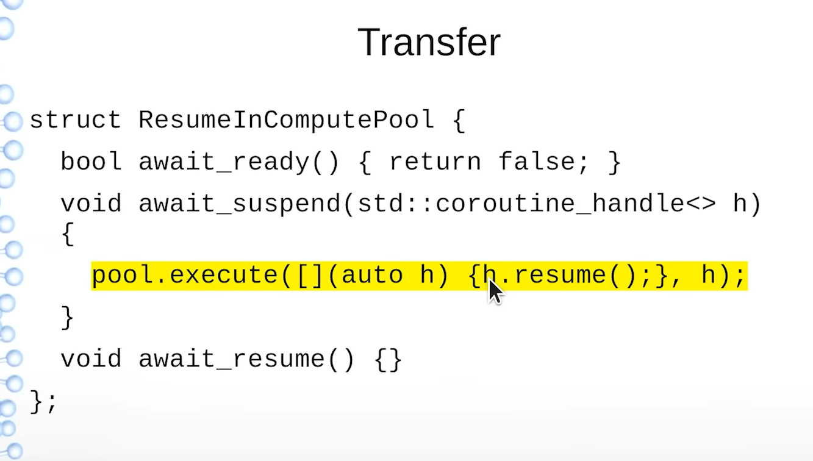
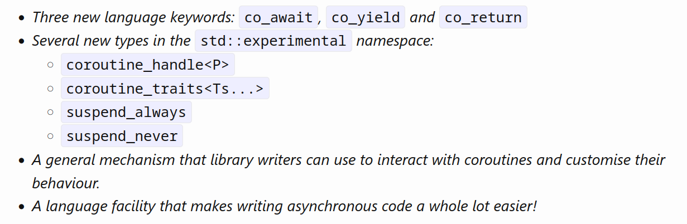
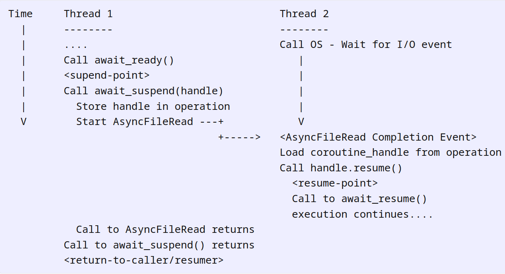
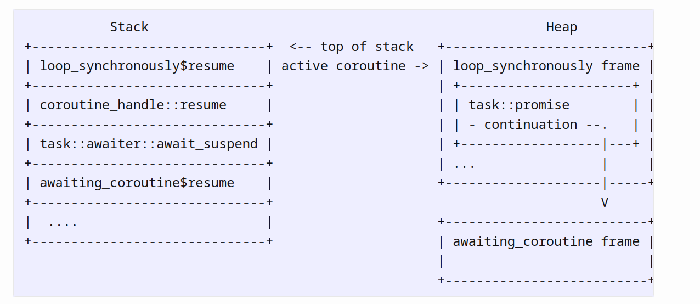
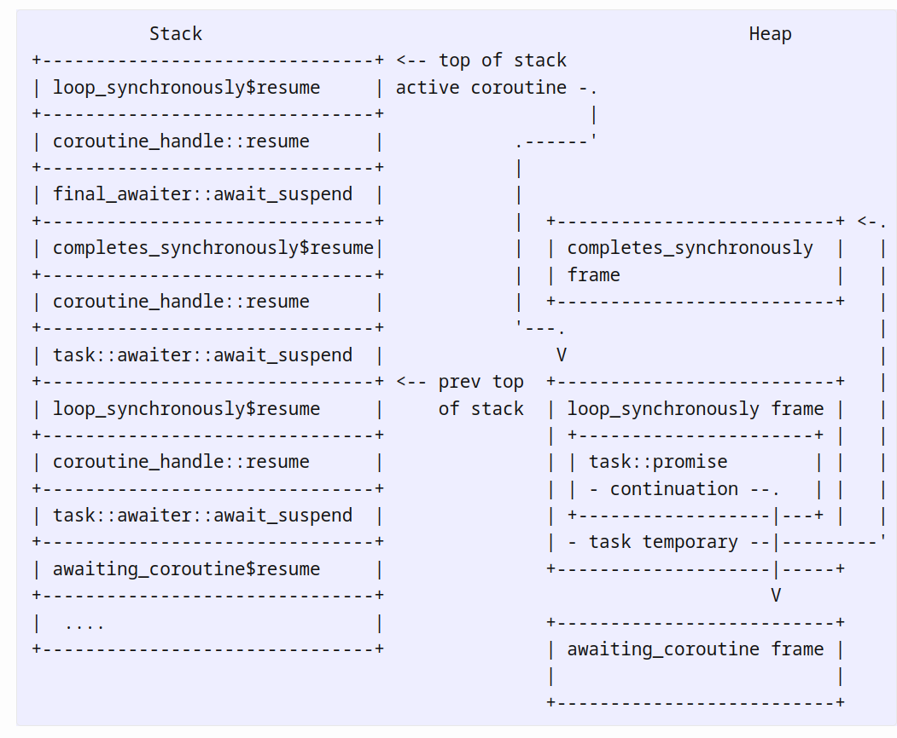

# C++20 Coroutines

> Resources
>
> - [Lewis Baker](https://lewissbaker.github.io/2017/09/25/coroutine-theory)
>
> - [C++20 Coroutines - Complete Guide](https://www.youtube.com/watch?v=w-dmOHhBX9o)
>
> - [Deciphering C++ Coroutines](https://www.youtube.com/watch?v=J7fYddslH0Q&)
>
> - [A map through major coroutine series](https://devblogs.microsoft.com/oldnewthing/20210504-01/?p=105178)
>
> - [Debugging coroutines](https://clang.llvm.org/docs/DebuggingCoroutines.html)
>
> - [C# awaitable / awaiter pattern](https://weblogs.asp.net/dixin/understanding-c-sharp-async-await-2-awaitable-awaiter-pattern)
>
> - [new cppcoro](https://github.com/andreasbuhr/cppcoro)
>
> - [From problem to Coroutine: Reducing I/O latency](https://www.youtube.com/watch?v=N__eTyrLAF0)
>
>   

## Coroutine Theory

- A coroutine is a **generalisation of a function** that allows the function to be **suspended** and then **later resumed**.

### Normal functions

- Normal have functions have two operations: **Call** and **Return** 

> Throwing exceptions is broadly under **Return**

- A **Call** operation:
  1. Creates an **activation frame**
  2. suspends execution of the calling function
  3. Transfers execution to the start of the function being called.
- A **Return** operation:
  1. Destroys the **activation frame**
  2. Resumes the execution of the caller just after the point at it which it called the function.

##### Activation frames

- An **activation frame** is a block of memory that holds the current state of a particular invocation of a function which includes:
  - Values of the parameters passed to it
  - Values of any local variables
  
- In normal functions, the activation frame also includes and describe the *continuation* of the function call.

  > These describe which invocation of which function should continue executing at which point when this function completes

  - The *return-address* . This is the address of the instruction to transfer execution to upon returning from the function. 
  - The address of the activation frame for invocation of the calling function.

- All activation frames in normal functions have strictly *nested lifetimes*. This gives us efficient memory allocation data structure for allocating and freeing the activation frames for each of the function calls. Called **the stack**. 

- An activation frame being allocated on the stack is called a **stack frame**.

- The stack frame is common so there is a dedicated `rsp` register for it. Allocating space for a new activation frame, you can increment this register by the **frame-size** and to free space for an activation frame you can decrement the register by the frame size.

##### Call operation

- When a function calls another function, the caller must first prepare itself for suspension. 
- The **suspend** step saves current CPU register values to memory for later restoration when the function resumes. This process depends on the **calling convention**, determining whether the caller or callee saves these registers. Typically, this is considered part of the **Call operation**.
- Caller *stores the parameters* passed to the called function into the *new activation frame*, to be accessed by the function.
- Caller writes the address of the resumption point of the caller to the new activation frame and transfers execution to the start of the called function. On `x86` this operation has its own `call` instruction that writes the address of the next instruction onto the stack, decrements the stack register by the size of this address and then jumps to address specified in the instructions operand (typically the name of  the function)

##### Return operation

- When a function returns via a `return` statement. The function stores the return value (if it exists) where the caller can access it. This is either in the callers activation frame or the functions activation frame.
- The function now destroys the activation frame by:
  1. Destroying any local variables in-scope at the return-point.
  2. Destroying any parameter objects.
  3. Freeing memory used by the activation frame.
- After those steps we can then resume execution of the caller by:
  1. Restoring the activation frame of the caller by setting the stack register to point to the activation frame of the caller and restoring any registers that were clobbered by the function.
  2. Jump to the resume point of the caller that was stored during the call operation.
- These functions may be split between the caller and callee function instructions.

### Coroutines

- Coroutines generalise the operations of a function by separating out some of the steps performed in the **Call** and **Return** operations  to extra operations: **Suspend, Resume, Destroy**.
- **Suspend** operation will suspend execution of the coroutine at the current point within the function and transfer execution back to the caller or resumer **without destroying the activation frame**. Any objects in the scope at the point of the suspension remain alive after the coroutine execution is suspended.
- Like a function **Return**, a coroutine can only be suspended from within the coroutine itself at *well-defined suspend points*.
- **Resume** operation resumes the execution of a suspended coroutine at the point at which it was suspended. This reactivates the coroutines activation frame.

- **Destroy** operation destroys the activation frame without resuming execution of the coroutine.

##### Coroutine activation frames

- Coroutines can be suspended without destroying its activation frame, there is **no guarantee that the activation frame lifetimes are strictly nested**. Therefore activation frames often **cannot be allocated using the stack** therefore use the **heap**.

> If the compiler can prove the lifetime of the coroutine is strictly nested within the lifetime of its caller, the compiler can avoid heap allocations

- Some parts of the the activation frame need to be preserved on suspending, and some that only need to be around when the coroutine is executing. So the lifetime of a variable with a scope that does not span coroutine suspend-points can potentially be stored on the stack.
- So the **coroutine activation frame** is comprised of two parts:
  1. *Stack frame*. This only exists while the coroutine is executing and is freed when it suspends and transfers execution back to the caller or resumer.
  2. *Coroutine frame*. Holds part of the coroutine activation frame that persist while the coroutine is suspended.

##### Suspend operation

- The **suspend operation** of a coroutine allows the coroutine to suspend execution in the middle of the function. It will then transfer execution back to the caller or resumer of the coroutine.
- There are specific points in a coroutine that are **suspend points**, these are identified by usages of:
  - `co_await` 
  - `co_yield` 
- When a coroutine hits one of these suspend-points, it first prepares the coroutine for resumption by
  - Ensuring any values held in registers are written to the coroutine frame.
  - Writing a value to the coroutine frame that indicates which suspend point the coroutine is being suspended at. This allows a subsequent **Resume** operation to know where to resume execution of the coroutine or so a **Destroy** knows what values were in scope and must be destroyed.

- After resumption preparation, the coroutine is ***suspended***.
- The coroutine then has the opportunity to execute additional logic before execution is transferred to the caller / resumer. This logic is given a handle to the coroutine frame that is used to later resume or destroy it.

> The ability to execute logic after the coroutine enters the **suspended** state enables the coroutine to be scheduled for resumption without synchronisation. This synchronisation would be required if the coroutine was scheduled for resumption prior to entering the suspended state due to potential for suspending and resumption of the coroutine to race.

- Coroutine can choose to either immediately resume / continue execution of the coroutine or choose to transfer execution back to the caller / resumer.
- If execution is transferred to the caller/ resumer, the stack-frame part of the coroutines activation frame is freed and popped off the stack.

##### **Resume operation**

- This operation may be performed on a coroutine in the **suspended state**.
- When a function wants to resume a coroutine it needs to *call* into the middle of a particular invocation of the function. The method of identifying the particular invocation to resume is by calling `void resume()` on the coroutine frame handle provided to the correspond **Suspend** operation.
- The call to `resume()` allocates a normal new stack frame and stores the return address of the caller in this stack frame before transferring execution to the function
- It transfers execution to the point in the function at which it was last suspended, not at the start. This is achieved by loading the resume point from the coroutine frame and jumping to that.
- When the coroutine next suspends or runs to completion this call to `resume()` will return and resume execution of the calling function.

##### Destroy operation

- The **Destroy** operation destroys the coroutine frame without resuming execution of the coroutine.
- This can only be performed on a suspended coroutine
- Similar to **Resume** in that it re-activates the coroutines activation frame, including allocating a new stack-frame and storing the return-address of the caller of the **Destroy** operation.
- Instead of transferring execution to the coroutine body at the last suspend point, it will instead transfer execution to an alternative code path that calls the destructors of all local variables in-scope at the suspend point before freeing the memory used by the coroutine frame.
- Similar to **Resume** operation, the **Destroy** operation identifies the particular activation frame to destroy by calling `void destroy()` method on the coroutine-frame handle provided during the corresponding **Suspend** operation.

##### **Call operation**

- The **Call** operation of a coroutine is similar to a normal function. A caller cannot see a difference.
- The coroutine will return to the caller either when it runs to completion but also when it reaches the first suspend point.
- When performing the **Call** operation on a coroutine, the caller performs same steps as normal function.
  - Allocates a new stack frame
  - Writes the parameters to the stack frame
  - Writes the return address to the stack-fram
  - Transfers execution to the coroutine
- The coroutine itself allocates a coroutine-frame on the heap and copy/move parameters from the stack-frame to the coroutine frame so the lifetime of those parameters extends beyond the first suspend point.

##### **Return operation**

- The **Return** operation of a coroutine differs from a normal function.
- When it calls a `co_return` operation it stores the return-value somewhere (customised by the coroutine) and then destructs any in-scope local variables (not parameters).
- Coroutine can execute additional logic before transferring execution back to the caller / resumer. This might perform some operation to publish the return value, or it might resume another coroutine that was waiting for the result. Completely custom.
- The coroutine performs either a **Suspend** operation (keeps the coroutine frame alive) or a **Destroy** operation (destroying the coroutine-frame).
- Execution is then transferred back to the caller / resumer as per the **Suspend / Destroy** operation semantics, popping the stack frame component of the activation frame off the stack.
- The return-value passed to the **Return** operation is not the same as the return value returned from **Call** as the return operation may be executed long after the caller resumed from the initial **Call** operation.

## C++ Coroutines: Understanding operator co_await

- The key concept is the ability to **suspend a coroutine** and then later **resume it**. This functionality is provided by the `co_await` operator.

- The coroutines library give us:



- Essentially *low level assembly language for coroutines*.
- The coroutines TS does not define the semantics of a coroutine
  - No definition of how to produce the value returned to the caller.
  - No definition of what to do with the return value passed to `co_return`.
  - No definition on handling exceptions that propagates out of the coroutine.
- Provides a *general mechanism* for library code to create custom behaviour by implementing types conforming to a specific interface. Similar to `begin()` and `end()` for `iterator`.
  - coroutine to produce some singular value asynchronously
  - coroutine that produces a sequence of values lazily
  - coroutine that simplifies control flow for consuming `optional<T>` by early exit if `nullopt` value is encountered.
- There are **two interfaces** defined by the TS
  - **Promise**
  - **Awaitable**
- **Promise** specifies methods for customising the behaviour of the coroutine itself
  - Customise what happens when the coroutines returns (normal / exception)
  - Customise the behaviour of the `co_await` or `co_yield` expression with the coroutine.
- **Awaitable** interface specifies the methods that control the *semantics* of `co_await` expressions.
  - When you `co_await ` some value, the code is translated to a series of calls to methods on the awaitable object that allow it to specify
    - Whether we suspend the current coroutine
    - Execute the logic after it has suspended to schedule the coroutine for later resumption
    - Execute logic after the coroutine resumes to produce the result of `co_await` expression.

### Awaiters and Awaitables: understand `co_await`

- `co_await` is a unary operator that may be applied to a value 

```cpp
co_await value
```

- `co_await` can only be used within the context of a coroutine.
- A type that supports the `co_await` operator is an **Awaitable type**.
- `co_await` may or may not be applied to a type and it depends on the *context* in which the `co_await` expression appears
  - The promise type used for a coroutine can alter the meaning of a `co_await` expression via `await_transform`. 
- **Normally awaitable** describes a type that supports the `co_await` operator in a coroutine context whose promise type **does not have `await_transform`** on its member.
- **Contextually awaitable** describes a type that supports `co_await` operator in the context of certain types of coroutines due to the presence of an `await_transform` method in the coroutine promise. 
- **Awaiter** is a type that implements the three special methods that are called as part of `co_await` expression: `await_ready`, `await_suspend` and `await_resume`.
- A type can be an **Awaitable** and **Awaiter**.
- When the compiler sees a `co_await <expr>` expression there are a number of things it could be translated to depending on the types involved.

### Obtaining the Awaiter

- The compiler first generates code to obtain the **Awaiter** object for the awaited value.
- Assume the promise object for the awaiting coroutine has type `P` and that `promise` is an *lvalue* reference to the promise object for the current coroutine.
- If the promise type `P`, has a member called `await_transform` then `expr` is first passed into a call to `promise.await_transform(expr)` to obtain the **Awaitable value**, `awaitable`. 
- If the promise type does **not have** an `await_transform` member then we use the result of evaluation `expr` directly as the **Awaitable** object `awaitable`.
- If the **Awaitable** object, `awaitable`, has an applicable `operator co_await()` overload then this is called to obtain the **Awaiter** object, otherwise `awaitable` is used directly as the awaiter object. 
- Encoding this into functions `get_awaitable()` and `get_awaiter()`:

```cpp
template<typename P, typename T>
decltype(auto) get_awaitable(P& promise, T&& expr)
{
  if constexpr (has_any_await_transform_member_v<P>)
    return promise.await_transform(static_cast<T&&>(expr));
  else
    return static_cast<T&&>(expr);
}

template<typename Awaitable>
decltype(auto) get_awaiter(Awaitable&& awaitable)
{
  if constexpr (has_member_operator_co_await_v<Awaitable>)
    return static_cast<Awaitable&&>(awaitable).operator co_await();
  else if constexpr (has_non_member_operator_co_await_v<Awaitable&&>)
    return operator co_await(static_cast<Awaitable&&>(awaitable));
  else
    return static_cast<Awaitable&&>(awaitable);
}

```

### Awaiting the Awaiter

- So we have encapsulated the logic for turning `expr` result into an **Awaiter** object into the above functions.
- The semantics of `co_await expr` can be translated roughly as follows:

```cpp
{
  auto&& value = <expr>;
  auto&& awaitable = get_awaitable(promise, static_cast<decltype(value)>(value));
  auto&& awaiter = get_awaiter(static_cast<decltype(awaitable)>(awaitable));
  if (!awaiter.await_ready())
  {
    using handle_t = std::experimental::coroutine_handle<P>;

    using await_suspend_result_t =
      decltype(awaiter.await_suspend(handle_t::from_promise(p)));

    <suspend-coroutine>

    if constexpr (std::is_void_v<await_suspend_result_t>)
    {
      awaiter.await_suspend(handle_t::from_promise(p));
      <return-to-caller-or-resumer>
    }
    else
    {
      static_assert(
         std::is_same_v<await_suspend_result_t, bool>,
         "await_suspend() must return 'void' or 'bool'.");

      if (awaiter.await_suspend(handle_t::from_promise(p)))
      {
        <return-to-caller-or-resumer>
      }
    }

    <resume-point>
  }

  return awaiter.await_resume();
}

```

- `void` version of `await_suspend()` unconditionally transfers execution back to the caller / resumer of the coroutine when the call to `await_suspend()` returns
- `bool` allows the awaiter object to conditionally resume the coroutine immediately without returning to the caller / resumer.
- `bool` version is useful in scenarios where the `awaiter` might start an async operation that can sometimes complete synchronously.
  - If synchronous completion is okay $\to$ return `false` to say the coroutine should be immediately resumed and continue executing.
- At `<suspend-coroutine>` , the compiler generates code to save the state of the coroutine and prepare for resumption.
  - Includes storing the location of the `<resume-point>` as well as spilling any values currently held in registers into the coroutine frame memory.
- The current coroutine is considered suspended after the `<suspend-coroutine>` operation completes.
- The first point that we observe this suspended coroutine is inside `await_suspend()`. Once the coroutine is suspended it is then able to be **resumed** or **destroyed**.
- It is up to `await_suspend()` method to **schedule the coroutine** for resumption (or destruction) at some point in the future once the operation has completed. Returning `false` from `await_suspend` counts as scheduling the coroutine for immediate resumption on the current thread.
- The purpose of `await_ready()` is to allow you to avoid the **cost** of `<suspend-coroutine>` operation in cases where it is known that the operation will complete synchronously without needing to suspend.
- At the `<return-to-caller-or-resumer>` point, execution is transferred back to the caller or resumer, thus popping the local stack frame but keeping the coroutine frame alive.
- When / If the suspended coroutine is resumed eventually, the execution resumes at `<resume-point>`  i.e immediately before `await_resume()` method is called to obtain the result of the operation.
- The **return value** of `await_resume()` call becomes the **result** of the `co_await` expression. The `await_resume()` method may throw exceptions in which case will this propagates out of the `co_await` expression.
- If an exception propagates out of the `await_suspend()` call then the coroutine is **automatically resumed** and the exception propagates out of the `co_await` without calling `await_resume()`.

### Coroutine Handles

- The `coroutine_handle<P>` is passed to `await_suspend()` call of a `co_await` expression.
- This represents a **non-owning handle** to the coroutine frame and may be used to **resume execution** of the coroutine or **destroy the coroutine frame**. 
- It also is used to **provide access** to the coroutines promise object.

```cpp
namespace std::experimental
{
  template<typename Promise>
  struct coroutine_handle;

  template<>
  struct coroutine_handle<void>
  {
    bool done() const;

    void resume();
    void destroy();

    void* address() const;
    static coroutine_handle from_address(void* address);
  };

  template<typename Promise>
  struct coroutine_handle : coroutine_handle<void>
  {
    Promise& promise() const;
    static coroutine_handle from_promise(Promise& promise);

    static coroutine_handle from_address(void* address);
  };
}
```

- When implementing **Awaitable types**, the key method used on the `coroutine_handle` is `.resume()`. This should be called when the operation has completed and you want to resume execution of the awaiting coroutine.
- Calling `.resume()` on a `coroutine_handle` reactivates a suspend coroutine at the `<resume-point>`. 
- The call to `.resume()` will return when the coroutine next hits a `<return-to-caller-or-resumer>` point.
- `.destroy()` method destroys the coroutine frame, calling destructors of any in-scope variables and freeing memory used by the coroutine frame. 
  - Rarely need to use this unless you are a library writer implementing the coroutine promise type.
  - Coroutine frames will be owned by some kind of RAII type returned from the call to the coroutine normally, therefore calling `.destroy()` without cooperation with the RAII could lead to double destruction bug.
- `.promise()` method returns reference to the coroutines promise object. This is only useful when authoring coroutine promise types. The coroutines promise object is an **internal implementation** detail of the coroutine. For most **normally awaitable types**, you should use `coroutine_handle<void>` as the parameter type to `await_suspend` instead of `coroutine_handle<Promise>`.
- `coroutine_handle<P>::from_promise(P& promise)` function allows reconstructing the coroutine handle from a **reference to the coroutine's promise object**
  - Ensure that the type `P` exactly matches the concrete promise type for the coroutine frame
  - Constructing a `coroutine_handle<Base>` when the concrete promise type is `Derived` can lead to UB.
- `.address() / from_address()` allow converting a coroutine handle to/from a `void*`.
  - This is intend to allow passing as a context parameter into existing C-style API's, so you may find useful in implementing **Awaitable** types in some circumstances.
  - Typically store the handle in a struct and passing a pointer to the struct in the 'context' parameter rather than using `.address()` return-value.

### Synchronisation-free async code

- A powerful design-feature of `co_await` is the ability to execute code after the coroutine has been suspended but *before* the execution is returned to the caller / resumer.
- This allows an **Awaiter** object to initiate an async operation after the coroutine is already suspended, passing the `coroutine_handle`  of the suspended coroutine to the operation which it can safely resume when the operation completes (potentially on another thread) without any synchronisation required.
- By starting an async-read operation inside `await_suspend()` when the coroutine is already suspended means that we can just resume the coroutine when the operation completes without needing thread synchronisation to coordinate the thread that started the operation and the thread that completed the operation.



- Be careful, as soon as you start this operation which **publishes the coroutine handle** to other threads, then another thread may resume the coroutine on another thread before `await_suspend()` returns and may continue executing concurrently with the rest of  the `await_suspend()`.
- A coroutine will call `await_resume()` when it first resumes to obtain the result and then typically destroys the **Awaiter** object (*this* pointer of `await_suspend()` call).
  - Coroutine could potentially run to completion, destructing the coroutine and promise object, all before `await_suspend()` returns. 
- Within the `await_suspend()` method, when it is possible for the coroutine to be resumed concurrently on another thread, you need to make sure you avoid accessing `this` or the `coroutine's` `.promise()` object as both could be destroyed.
  - The only safe things to access after the operation has started and the coroutine is scheduled for resumption are **local variables** within `await_suspend()`.

### Comparison to Stackful Coroutines

- `boost::context` and `Win32` fibers, as stackful coroutines, employ a context switch mechanism, where logic execution after suspending one coroutine and before starting another is typically not possible.
- In these coroutines, to execute an asynchronous operation, it must be initiated before suspending the coroutine. There's a risk that the operation may complete on a different thread before the coroutine suspension, necessitating thread synchronization to manage this potential race condition.
- An alternative approach involves using a 'trampoline context', which initiates operations after the original context is suspended. However, this method requires additional infrastructure and an extra context switch, potentially incurring more overhead than the thread synchronization it aims to replace.

### Avoiding memory allocations

- Async operations require per-operation state to track progress, which lasts for the operation's duration and is freed post-completion.
- Example: Async Win32 I/O functions need an OVERLAPPED structure pointer, kept valid until operation completion.
- Traditionally, callback-based APIs necessitate heap allocation for this state, especially for multiple operations, potentially using a custom allocator for performance.
- With coroutines, heap allocation for operation state is unnecessary, as local variables in the coroutine frame stay alive while suspended.
- Per-operation state is stored in the Awaiter object, using coroutine frame memory during the co_await expression and freeing it upon completion.
- Although the coroutine frame might be heap-allocated, it facilitates multiple asynchronous operations with a single allocation.
- The coroutine frame serves as an efficient arena memory allocator, predetermined at compile time, allocating memory to local variables without overhead.

## C++ Coroutines: Understanding the promise type

- The **Promise** interface specifies methods for customising the behaviour of the coroutine itself.
- The library write can customise what happens when the coroutine is called, what happens when the coroutine returns (normal / exception) and customise the behaviour of `co_await` and `co_yield`.

### Promise Objects

- The **Promise** object defines and controls the behaviour of the coroutine itself by implementing methods to be called at specific points during a coroutines execution.

> *Before we go on, I want you to try and rid yourself of any preconceived notions of what a “promise” is. While, in some use-cases, the coroutine promise object does indeed act in a similar role to the* `std::promise` *part of a* `std::future` *pair, for other use-cases the analogy is somewhat stretched. It may be easier to think about the coroutine’s promise object as being a “coroutine state controller” object that controls the behaviour of the coroutine and can be used to track its state.*

- An instance of this object is **constructed** within the coroutine frame for **each invocation of the coroutine function**.
- The compiler generates calls to certain methods on the promise object at key points during coroutine execution.
- Below code, the promise object is `promise` for an invocation of the coroutine.
- When you write a coroutine function that has a body `<body-statement>` which contains one of the coroutine keywords, the body of the coroutine is transformed to the following:

```cpp
{
  co_await promise.initial_suspend();
  try
  {
    <body-statements>
  }
  catch (...)
  {
    promise.unhandled_exception();
  }
FinalSuspend:
  co_await promise.final_suspend();
}
```

- When a coroutine function is called there are a number of steps that are performed before its execution in the source of the coroutine body that differ to regular functions.
  1. Allocate a coroutine frame using `operator new` (optional).
  2. Copy any function parameters to the coroutine frame.
  3. Call the constructor for the promise object of type, `P`.
  4. Call the `promise.get_return_object()` method to obtain the result to return to the caller when the coroutine first suspends. Save the result as a local variable.
  5. Call the `promise.initial_suspend()` method and `co_await` the result.
  6. When the `co_await promise.initial_suspend()` expression resumes (either immediately or asynchronously), then the coroutine starts executing the coroutine body statements that you wrote.
- Some additional steps are executed when execution reaches `co_return`
  1. Call `promise.return_void()` or `promise.return_value(<expr>)`
  2. Destroy all variables with automatic storage duration in reverse order they were created.
  3. Call `promise.final_suspend()` and `co_await` the result.
- If instead execution leaves `<body-statement>` due to unhandled exception
  1. Catch the exception and call `promise.unhandled_exception()` from within the catch-block.
  2. Call `promise.final_suspend()` and `co_await` the result.
- Once the execution propagates outside of the coroutine body then the coroutine **frame is destroyed**. Destroying the frame involves a few steps
  1. Call the destructor of the promise object.
  2. Call the destructors of the function parameter copies.
  3. Call `operator delete` to free the memory used by the coroutine frame (optional)
  4. Transfer execution back to the caller/resumer.
- When execution reaches `<return-to-caller-or-resumer>` point inside a `co_await` expression, or if the coroutine runs to completion without hitting that point, then the coroutine is either suspended or destroyed and the **return object** previously returned from the call to `promise.get_return_object` is returned to the caller of the coroutine.

### Allocation of a coroutine frame

- The compiler initially allocates memory for the coroutine frame using `operator new`.

- If the promise type `P` has a custom `operator new`, it's used; otherwise, the global `operator new` is called.
- The size for `operator new` isn't `sizeof(P)` but the size of the entire coroutine frame, which the compiler determines. This size includes parameters, the promise object, local variables, and other coroutine state management storage.
- The compiler might optimize by not calling `operator new` if:
  - The coroutine frame's lifetime is strictly within the caller's lifetime.
  - The compiler knows the coroutine frame's size at the call site.
- In such cases, the coroutine frame can be allocated in the caller's activation frame (stack or coroutine frame).
- The Coroutines TS doesn't guarantee allocation elision, so code must consider potential `std::bad_alloc` failures. Coroutine functions shouldn't be declared `noexcept` unless `std::terminate()` is acceptable on allocation failure.
- For environments where exceptions are disallowed (like embedded or high-performance systems), a fallback exists:
  - If `P` has a `P::get_return_object_on_allocation_failure()` static function, `operator new(size_t, nothrow_t)` is used instead.
  - If this returns `nullptr`, the coroutine calls `P::get_return_object_on_allocation_failure()` and returns its result instead of throwing an exception.

### Customising coroutine frame memory allocation

- The promise type may define an overload of `operator new()` that will be called instead of global scope new if the compiler needs to allocate memory for a coroutine frame that uses your promise type.

```cpp
struct my_promise_type
{
  void* operator new(std::size_t size)
  {
    void* ptr = my_custom_allocate(size);
    if (!ptr) throw std::bad_alloc{};
    return ptr;
  }

  void operator delete(void* ptr, std::size_t size)
  {
    my_custom_free(ptr, size);
  }

  ...
};
```

- Custom allocators can be integrated with coroutines by overloading `P::operator new()`.
- This custom `operator new` can accept additional arguments and is called with lvalue references to coroutine function parameters, if a suitable overload is available.
- The purpose is to enable `operator new` to use an `allocate()` method from an allocator passed as an argument to the coroutine function.
- To use the allocator for memory deallocation, extra steps are required:
  - Since parameters aren't passed to `operator delete` and are stored in the coroutine frame, which is destructed by the time `operator delete` is called, you need to copy the allocator inside the allocated memory.
  - Implement `operator new` to allocate additional space beyond the coroutine frame.
  - Use this extra space to store a copy of the allocator, which will then be used to free the coroutine frame memory.

```cpp
template<typename ALLOCATOR>
struct my_promise_type
{
  template<typename... ARGS>
  void* operator new(std::size_t sz, std::allocator_arg_t, ALLOCATOR& allocator, ARGS&... args)
  {
    // Round up sz to next multiple of ALLOCATOR alignment
    std::size_t allocatorOffset =
      (sz + alignof(ALLOCATOR) - 1u) & ~(alignof(ALLOCATOR) - 1u);

    // Call onto allocator to allocate space for coroutine frame.
    void* ptr = allocator.allocate(allocatorOffset + sizeof(ALLOCATOR));

    // Take a copy of the allocator (assuming noexcept copy constructor here)
    new (((char*)ptr) + allocatorOffset) ALLOCATOR(allocator);

    return ptr;
  }

  void operator delete(void* ptr, std::size_t sz)
  {
    std::size_t allocatorOffset =
      (sz + alignof(ALLOCATOR) - 1u) & ~(alignof(ALLOCATOR) - 1u);

    ALLOCATOR& allocator = *reinterpret_cast<ALLOCATOR*>(
      ((char*)ptr) + allocatorOffset);

    // Move allocator to local variable first so it isn't freeing its
    // own memory from underneath itself.
    // Assuming allocator move-constructor is noexcept here.
    ALLOCATOR allocatorCopy = std::move(allocator);

    // But don't forget to destruct allocator object in coroutine frame
    allocator.~ALLOCATOR();

    // Finally, free the memory using the allocator.
    allocatorCopy.deallocate(ptr, allocatorOffset + sizeof(ALLOCATOR));
  }
}
```

- To use a custom promise type (`my_promise_type`) for coroutines that take `std::allocator_arg` as the first parameter, specialize the `coroutine_traits` class.
- Here's an example of how to do this:

  ```cpp
  namespace std::experimental {
    template<typename ALLOCATOR, typename... ARGS>
    struct coroutine_traits<my_return_type, std::allocator_arg_t, ALLOCATOR, ARGS...> {
      using promise_type = my_promise_type<ALLOCATOR>;
    };
  }
  ```

- Even with a customised memory allocation strategy, the compiler can still opt to elide calls to your memory allocator in coroutines.

### Copying parameters to the coroutine frame

- Coroutines copy parameters from the original caller into the coroutine frame to maintain their validity after suspension.
- Parameters passed by value are copied using the type's move-constructor.
- Parameters passed by reference (either lvalue or rvalue) are copied as references, not the actual values they point to.
- For types with trivial destructors, the compiler may skip copying parameters not used after a `<return-to-caller-or-resumer>` point in the coroutine.
- Caution is advised when passing references to coroutines, as they may not remain valid throughout the coroutine's lifetime. Techniques like perfect-forwarding may cause undefined behaviour in coroutines.
- Toby Allsopp's article provides detailed insights into this topic.
- If a parameter's copy/move constructor throws an exception, already constructed parameters are destructed, the coroutine frame is freed, and the exception is propagated to the caller.

### Construction of the promise object

- Once all of the parameters have been **copied into the coroutine frame,** the coroutine then **constructs the promise object**.

- The reason the parameters are **copied prior to the promise object** being constructed is to **allow the promise object to be given access** to the **post-copied parameters in its constructor**.

- First, the compiler checks to see if there is an **overload of the promise constructor** that can **accept lvalue references** to each of the copied parameters. If the compiler finds such an overload then the compiler generates a call to that constructor overload. If it does not find such an overload then the compiler **falls back** to **generating a call to the promise type’s default constructor**.

  > Note that the ability for the promise constructor to “peek” at the parameters was a relatively recent change to the Coroutines TS, being adopted in [N4723](http://wg21.link/N4723) at the Jacksonville 2018 meeting. See [P0914R1](http://wg21.link/P0914R1) for the proposal. Thus it may not be supported by some older versions of Clang or MSVC.

- If the promise constructor throws an exception then the parameter copies are destructed and the coroutine frame freed during stack unwinding before the exception propagates out to the caller.

### Obtaining the return object

- The first thing a coroutine does with the promise object is obtain the `return-object` by calling `promise.get_return_object()`.
- The `return-object` is the value that is returned to the caller of the coroutine function when the coroutine first suspends or after it runs to completion and execution returns to the caller.
- Think of the control flow:

```cpp
// Pretend there's a compiler-generated structure called 'coroutine_frame'
// that holds all of the state needed for the coroutine. It's constructor
// takes a copy of parameters and default-constructs a promise object.
struct coroutine_frame { ... };

T some_coroutine(P param)
{
  auto* f = new coroutine_frame(std::forward<P>(param));

  auto returnObject = f->promise.get_return_object();

  // Start execution of the coroutine body by resuming it.
  // This call will return when the coroutine gets to the first
  // suspend-point or when the coroutine runs to completion.
  coroutine_handle<decltype(f->promise)>::from_promise(f->promise).resume();

  // Then the return object is returned to the caller.
  return returnObject;
}
```

- We need to obtain the return-object before starting the coroutine body since the coroutine frame (and thus promise object) may be destroyed prior to the call to `coroutine_handle::resume()` returning, either on this thread or possibly on another thread, and so it would be unsafe to call `get_return_object()` after starting the execution of the coroutine body.

### Initial-suspend point

- The next thing executed once the coroutine frame has been initialised and return object obtained is execute the statement `co_await promise.initial_suspend();`
- This enables the author of the `promise_type` to control whether the coroutine should suspend before executing the coroutine body that appears in the source code or **immediately start** executing the coroutine body.
- If the coroutine suspends here, then it may be **resumed / destroyed** at a time of your choosing by calling `resume()` or `destroy()` on the coroutines `coroutine_handle`.
- The result of the `co_await promise.initial_suspend()` expression is discarded so implementations should generally return `void` from the `await_resume()` method of the awaiter.
  - This statement exists outside of the `try / catch` block that guards the rest of the coroutine
  - This means that any exception thrown from `co_await promise.initial_suspend()` prior to hitting its `<return-to-caller-or-resumer>` will be thrown back to the caller of the coroutine after destroying coroutine frame and the return object.
  - Be aware of this if you `return-object` has RAII semantics to destroy the coroutine frame on destruction. If this is the case then you want to make sure that `co_await promise.initial_suspend()` is `noexcept` to avoid double-free of coroutine frame.

- Typically just returns `suspend_always` (lazy started) or `suspend_never` (eagerly started) which are both `noexcept` awaitables so this is usually not an issue.

### Returning to the caller

- When the coroutine function reaches its first `<return-to-caller-or-resumer>` point (or if such point is reached then when execution of the coroutine runs to completion). The `return-object` returned from the `get_return_object()` is returned to the caller of the coroutine.
- The type of the `return-object` does not need to be the same type as the return type of the coroutine function. An implicit conversion from `return-object` to the return of the coroutine is performed if necessary.

### Returning from the coroutine via `co_return`

- When we reach a `co_return` statement, its translated into either a call or `promise.return_void()` or `promise.return_value(<expr>)` followed by a `goto FinalSuspend`.
- Rules for translation are as follows:
  - `co_return;`
    -> `promise.return_void();`
  - `co_return <expr>;`
    -> `<expr>; promise.return_void();` if `<expr>` has type `void`
    -> `promise.return_value(<expr>);` if `<expr>` does not have type `void`
- The *subsequent* `goto FinalSuspend` causes all local variables with automatic storage duration to be destructed in *reverse order* of the construction before evaluating `co_await promise.final_suspend()`.
- If execution runs off the end of a coroutine without a `co_return` statement then this is equivalent to having `co_return;` at the end of the function body. In this case, if the `promise_type` does not have a `return_void()` method then the behaviour is undefined. 
- If either the evaluation of `<expr>` or the call to `promise.return_void()` or `promise.return_value()` throws an exception then the exception still propagates to `promise.unhandled_exception()`.

### Handling exceptions that propagate out of the coroutine body 

- When an exception leaves a coroutine, it's caught and `promise.unhandled_exception()` is called.
- Implementations often use `std::current_exception()` to capture and store the exception for later rethrowing.
- Alternatively, exceptions can be rethrown immediately with `throw;` (e.g., as in `folly::Optional`), but this can destroy the coroutine frame and impact callers assuming `coroutine_handle::resume()` is noexcept.
- The current Coroutines TS is ambiguous about the effects of rethrowing exceptions in `unhandled_exception()` or other logic outside the try-block.
- The interpretation is that if a coroutine exits due to an exception (from `promise.initial_suspend()`, `promise.unhandled_exception()`, `promise.final_suspend()`) or completes, its frame is destroyed before returning to the caller/resumer. This interpretation has issues too.
- Future Coroutines specifications may clarify these aspects, but it's advised to avoid throwing exceptions from `initial_suspend()`, `final_suspend()`, or `unhandled_exception()` for now.

### Final suspend point

- Once execution exist the user-defined part of the coroutine body and the result has been captured via call to `return_void()`, `return_value()`  or `unhandled_exception()` and any local variables have been destroyed. The coroutine can execute some additional logic before execution is returned back to the caller / resumer.
- The coroutine executes the `co_await promise.final_suspend();` statement.
- This allows the coroutine to execute some logic such as publishing a result, signalling completion , resuming continuation. 
  - Also allows the coroutine to optionally suspend immediately before execution of the coroutine runs to completion and the coroutine frame is destroyed.
- It is **undefined behaviour** to `resume()` a coroutine that is suspend at the `final_suspend` point. The only thing you may do is `destroy()` it. 

> The rationale for this limitation, according to Gor Nishanov, is that this provides several optimisation opportunities for the compiler due to the reduction in the number of suspend states that need to be represented by the coroutine and a potential reduction in the number of branches required.

- It is recommended to suspend always at the final_suspend point where possible. This is because this forces you to call `.destroy()` on the coroutine from outside the coroutine, typically via a RAII object destructor. Makes it easier for the compiler to determine when the scope of the lifetime of the coroutine frame is nested inside the caller. This in turn makes it much more likely that the compiler can elide the memory allocation of the coroutine frame.

### How the compiler choose the promise type

- The type of the promise object is determined from the signature of the coroutine by using `std::coroutine_traits` class

```CPP
task<float> foo(std::string x, bool flag);
```

- The compiler will deduce the type of the coroutine's promise by passing the return type and parameter types as template arguments to `coroutine_traits`.

```cpp
typename coroutine_traits<task<float>, std::string, bool>::promise_type;
```

- If the function is a non-static member function then the class type is passed as the second template parameter to `coroutine_traits`. 
  - If your method is overloaded for rvalue references then the second template parameter will be an rvalue reference.

```cpp
task<void> my_class::method1(int x) const;
task<foo> my_class::method2() &&;
```

- Then the compiler will use the following types for promise.

```cpp
// method1 promise type
typename coroutine_traits<task<void>, const my_class&, int>::promise_type;

// method2 promise type
typename coroutine_traits<task<foo>, my_class&&>::promise_type;
```

- The default condition of `coroutine_traits` template defines the `promise_type` by looking for a nested `promise_type` typedef defined on the return type
  - Something like this (extra SFINAE magic so the `promise_type` is not defined if `RET::promise_type` is not defined).

```cpp
namespace std::experimental
{
  template<typename RET, typename... ARGS>
  struct coroutine_traits<RET, ARGS...>
  {
    using promise_type = typename RET::promise_type;
  };
}
```

- So for coroutine return-types that you have control over, you can just define a nested `promise_type` in your class to have the compiler use that type as the type of the promise object for coroutines that return your class.
- Examples:

```cpp
template<typename T>
struct task
{
  using promise_type = task_promise<T>;
  ...
};
```

- For coroutine return types that you do not have control over you can *specialised* coroutine_traits to define the promise type to use without needing to modify the type 
- For example, to define the promise-type to use a coroutine that returns `std::optional<T>` 

```cpp
namespace std::experimental
{
  template<typename T, typename... ARGS>
  struct coroutine_traits<std::optional<T>, ARGS...>
  {
    using promise_type = optional_promise<T>;
  };
}
```

### Identifying a specific coroutine activation frame

- When you call a coroutine, a coroutine frame is created. To resume the associated coroutine or destroy the coroutine frame you need some way to identify or refer to that particular coroutine frame.
- The mechanism the TS provides for this is the `coroutine_handle` type.

```cpp
namespace std::experimental
{
  template<typename Promise = void>
  struct coroutine_handle;

  // Type-erased coroutine handle. Can refer to any kind of coroutine.
  // Doesn't allow access to the promise object.
  template<>
  struct coroutine_handle<void>
  {
    // Constructs to the null handle.
    constexpr coroutine_handle();

    // Convert to/from a void* for passing into C-style interop functions.
    constexpr void* address() const noexcept;
    static constexpr coroutine_handle from_address(void* addr);

    // Query if the handle is non-null.
    constexpr explicit operator bool() const noexcept;

    // Query if the coroutine is suspended at the final_suspend point.
    // Undefined behaviour if coroutine is not currently suspended.
    bool done() const;

    // Resume/Destroy the suspended coroutine
    void resume();
    void destroy();
  };

  // Coroutine handle for coroutines with a known promise type.
  // Template argument must exactly match coroutine's promise type.
  template<typename Promise>
  struct coroutine_handle : coroutine_handle<>
  {
    using coroutine_handle<>::coroutine_handle;

    static constexpr coroutine_handle from_address(void* addr);

    // Access to the coroutine's promise object.
    Promise& promise() const;

    // You can reconstruct the coroutine handle from the promise object.
    static coroutine_handle from_promise(Promise& promise);
  };
}
```

- You can obtain a `coroutine_handle` for a coroutine in two ways:
  1. It is passed to the `await_suspend()` method during a `co_await` expression.
  2. If you have a reference to the coroutine’s promise object, you can reconstruct its `coroutine_handle` using `coroutine_handle<Promise>::from_promise()`.
- The `coroutine_handle` of the awaiting coroutine will be passed into the `await_suspend()` method of the awaiter after the coroutine has suspended at the `<suspend-point>` of a `co_await` expression. 
  - You can think of this `coroutine_handle` as representing the continuation of the coroutine in *continuation-passing style call*
- The `coroutine_handle` is **NOT** a RAII object. Manual `.destroy()` is required to destroy the coroutine frame and free its resources
  - Think of it as `void*` used to manage memory.
  - This performance reasons, making it RAII would add additional overhead such as reference counting.
- Try to use a higher level types that provides RAII semantics coroutines such as **cppcoro** or write your own higher level types that encapsulate the lifetime of the coroutine frame for the coroutine type.

### Custom co_await

- The promise type can optionally customise the behaviour of every `co_await` expression that appears in the body of the coroutine.
- Define an `await_transform()` on the promise type, the compiler transforms every `co_await <expr>` appearing in the body of the coroutine into `co_await promise.await_transform(<expr>)`.
-  This lets us **enable awaiting types that would not normally be awaitable**
  - Example is a promise type for coroutines with a `std::optional<T>` return type that might provide an `await_transform()` overload taking a `std::optional<U>` and that returns an awaitable type that either returns a value of type `U` suspends the coroutine if the awaited values contains `nullopt`.

```cpp
template<typename T>
class optional_promise
{
  ...

  template<typename U>
  auto await_transform(std::optional<U>& value)
  {
    class awaiter
    {
      std::optional<U>& value;
    public:
      explicit awaiter(std::optional<U>& x) noexcept : value(x) {}
      bool await_ready() noexcept { return value.has_value(); }
      void await_suspend(std::experimental::coroutine_handle<>) noexcept {}
      U& await_resume() noexcept { return *value; }
    };
    return awaiter{ value };
  }
};
```

- **It lets us disallow awaiting on certain types by declaring await_transform as deleted**
- For example, a promise type for `std::generator<T>` return-type might declare a deleted `await_transform()` template member function that accepts any type. This disables use of `co_await` within the coroutine.

```cpp
template<typename T>
class generator_promise
{
  ...

  // Disable any use of co_await within this type of coroutine.
  template<typename U>
  std::experimental::suspend_never await_transform(U&&) = delete;

};
```

- **It lets you adapt and change the behaviour of normally awaitable types**
- For example, you could define a type of coroutine that **ensured that the coroutine always resumed from every `co_await`** expression on an **associated executor** by wrapping the **awaitable** in a `resume_on()` operator (see `cppcoro::resume_on()`).

```cpp
template<typename T, typename Executor>
class executor_task_promise
{
  Executor executor;

public:

  template<typename Awaitable>
  auto await_transform(Awaitable&& awaitable)
  {
    using cppcoro::resume_on;
    return resume_on(this->executor, std::forward<Awaitable>(awaitable));
  }
}
```

- Its important to note that if the promise_type defines any `await_transform()` members then this triggers the compiler to transform all `co_await` expressions to call `promise.await_transform()`.
  - This means if you want to customise behaviour of `co_await` for just some types that you also need to provide a fallback overload of `await_transform()` that just forwards through the argument.

### Customising the behaviour of `co_yield`

- If the `co_yield` keyword appears in a coroutine then the compiler translates the expression `co_yield <expr>` into the expression `co_await promise.yield_value(<expr>)`. The promise type can therefore customise the behaviour of `co_yield` keyword by defining one or more `yield_value()` methods on the promise object.
- Unlike `await_transform`, there is no default behaviour of `co_yield` if the promise type does not define `yield_value()` method.
  - So while a promise type needs to explicitly opt out of allowing `co_await` by declaring a deleted `await_transform()`, a promise type needs to opt-in supporting `co_yield`.
- The typical example of a promise type with ` yield_value()` method is that of `generator<T>` type

```cpp
template<typename T>
class generator_promise
{
  T* valuePtr;
public:
  ...

  std::experimental::suspend_always yield_value(T& value) noexcept
  {
    // Stash the address of the yielded value and then return an awaitable
    // that will cause the coroutine to suspend at the co_yield expression.
    // Execution will then return from the call to coroutine_handle<>::resume()
    // inside either generator<T>::begin() or generator<T>::iterator::operator++().
    valuePtr = std::addressof(value);
    return {};
  }
};
```


## C++ Coroutines: Understand Symmetric Transfer

- However, the Coroutines TS, as it was originally specified, had a nasty limitation that could easily lead to stack-overflow if you weren’t careful. And if you wanted to avoid this stack-overflow then you had to introduce **extra synchronisation** overhead to safely guard against this in your `task<T>` type.

- Thankfully, a tweak was made to the design of coroutines in 2018 to add a capability called “symmetric transfer” which allows you to **suspend one coroutine** and **resume another coroutine** **without consuming any additional stack-space.** 

### How a task coroutine works

```cpp
task foo() {
  co_return;
}

task bar() {
  co_await foo();
}
```

- Assume we have a simple `task` type that **lazily executes the body** when another **coroutine awaits it**. This particular `task` type does not support returning a value.
- Unpack what is happening when `bar()` evaluates `co_await foo()`.
  1. **Overview of the Coroutine Process**
     - The `bar()` coroutine calls the `foo()` function. Note that from the caller’s perspective, a coroutine is just an ordinary function.

  2. **Invocation Steps of `foo()`**
     - Allocates storage for a coroutine frame (typically on the heap).
     - Copies parameters into the coroutine frame (in this case, there are no parameters, so this is a no-op).
     - Constructs the promise object in the coroutine frame.
     - Calls `promise.get_return_object()` to get the return value for `foo()`. This produces the task object, initializing it with a `std::coroutine_handle` that refers to the just-created coroutine frame.
     - Suspends execution of the coroutine at the initial-suspend point (i.e., the open curly brace).
     - Returns the task object back to `bar()`.

  3. **Process in `bar()` Coroutine**
     - The `bar()` coroutine evaluates the `co_await` expression on the task returned from `foo()`.
     - It suspends and calls the `await_suspend()` method on the returned task, passing it the `std::coroutine_handle` that refers to `bar()`’s coroutine frame.
     - The `await_suspend()` method stores `bar()`’s `std::coroutine_handle` in `foo()`’s promise object and resumes the `foo()` coroutine by calling `.resume()` on `foo()`’s `std::coroutine_handle`.

  4. **Execution of `foo()` Coroutine**
     - The `foo()` coroutine executes and runs to completion synchronously.

  5. **Final Steps in `foo()` Coroutine**
     - Suspends at the final-suspend point (i.e., the closing curly brace).
     - Resumes the coroutine identified by the `std::coroutine_handle` stored in its promise object (i.e., `bar()`’s coroutine).

  6. **Completion of `bar()` Coroutine**
     - The `bar()` coroutine resumes, executing until it reaches the end of the statement containing the `co_await` expression.
     - Calls the destructor of the temporary task object returned from `foo()`.

  7. **Destruction of Coroutine Resources**
     - The task destructor calls the `.destroy()` method on `foo()`’s coroutine handle, which destroys the coroutine frame along with the promise object and any argument copies.

#### Outline of a `task` implementation

```cpp
class task {
public:
  class promise_type { /* see below */ };

  task(task&& t) noexcept
  : coro_(std::exchange(t.coro_, {}))
  {}

  ~task() {
    if (coro_)
      coro_.destroy();
  }

  class awaiter /* technically awaitable */ { /* see below */ };

  awaiter operator co_await() && noexcept;

private:
  explicit task(std::coroutine_handle<promise_type> h) noexcept
  : coro_(h)
  {}

  std::coroutine_handle<promise_type> coro_;
};
```

- A task has **exclusive ownership** of the `std::coroutine_handle` that corresponds to the coroutine frame created during the invocation of the coroutine.
- The `task` object is a RAII object that ensures that `.destroy()` is called on the `std::coroutine_handle` when the `task` object goes out of scope. 

#### Implementing the `task::promise_type`

- `promise_type` member defines the type of the **Promise object** that is created within the coroutine frame and that controls the behaviour of the coroutine.
- First, we need to implement the `get_return_object()` to construct the `task` object to return when the coroutine is invoked. This method just **needs to initialise the task** with the `std::coroutine_handle` of the **newly create coroutine frame.**
- We can use the `std::coroutine_handle::from_promise()` method to We can use the `std::coroutine_handle::from_promise()` method to manufacture one of these handles from the promise object..

```cpp
class task::promise_type {
public:
  task get_return_object() noexcept {
    return task{std::coroutine_handle<promise_type>::from_promise(*this)};
  }
```

- Next, we want the coroutine to **initially suspend** at the **open curly brace** so that we can **later resume the coroutine from this point** when the returned `task` is awaited.

- There are several benefits of starting lazily:

  - It means that we can **attach the continuation’s** `std::coroutine_handle` **before**  **starting execution of the coroutine**. This means we **don’t need to use  thread-synchronisation** to **arbitrate the race** between attaching the continuation later and the coroutine running to completion.

  - It means that the `task` destructor can **unconditionally destroy** the  **coroutine frame** - we **don’t need to worry about whether the coroutine  is potentially executing on another thread** since the coroutine will  **not start executing** until we await it, and while it is executing the  **calling coroutine is suspended** and so **won’t attempt to call the task  destructor** until the **coroutine finishes executing**.  This gives the compiler a much better chance at inlining the allocation  of the coroutine frame into the frame of the caller.  

    > See [P0981R0](https://wg21.link/P0981R0) to read more about the **Heap Allocation eLision Optimisation (HALO)**.

  - It also **improves the exception-safety** of your coroutine code. If you don’t  immediately `co_await` the returned `task` and do something else that  can throw an exception that causes the stack to unwind and the `task` destructor  to run then we can **safely destroy the coroutine** since we **know it hasn’t  started yet**. We aren’t left with the **difficult choice between detaching,  potentially leaving dangling references**, **blocking in the destructor**, terminating  or undefined-behaviour.  This is something that I cover in a bit more detail in my  [CppCon 2019 talk on Structured Concurrency](https://www.youtube.com/watch?v=1Wy5sq3s2rg).

- To have the coroutine **initially suspend at the open curly brace** we define an `initial_suspend()` method that returns the builtin `suspend_always` type.

```cpp
  std::suspend_always initial_suspend() noexcept {
    return {};
  }
```

- Next, we need to define the `return_void()` method, called when you execute `co_return;` or when **execution runs off the end of the coroutine**. This method **doesn’t actually need to do anything**, it just needs to **exist so that the compiler knows** that `co_return;` is valid within this coroutine type.

```cpp
  void return_void() noexcept {}
```

- We also need to add an `unhandled_exception()` method that is called if an **exception escapes the body of the coroutine.** For our purposes we can just treat the task coroutine bodies as `noexcept` and call `std::terminate()` if this happens.

```cpp
  void unhandled_exception() noexcept {
    std::terminate();
  }
```

- Finally, when the coroutine execution **reaches the closing curly brace**, we want the coroutine to **suspend at the final-suspend point** and then **resume its continuation**. ie. the **coroutine that is awaiting the completion of this coroutine**.

- To support this, we need a **data-member in the promise** to hold the `std::coroutine_handle` of the **continuation**. We also need to define the `final_suspend()` method that **returns an awaitable object** that will **resume the continuation** after the **current coroutine** has **suspended at the final-suspend point**.

- It’s important to **delay resuming the continuation** until **after the current coroutine** has **suspended** because the **continuation may go on to immediately** call the `task` destructor which will call `.destroy()` on the coroutine frame. The `.destroy()` method is only valid to call on a **suspended coroutine** and so it would be **undefined-behaviour to resume the continuation** before the **current coroutine has suspended.**

```cpp
struct final_awaiter {
    bool await_ready() noexcept {
      return false;
    }

    void await_suspend(std::coroutine_handle<promise_type> h) noexcept {
      // The coroutine is now suspended at the final-suspend point.
      // Lookup its continuation in the promise and resume it.
      h.promise().continuation.resume();
    }

    void await_resume() noexcept {}
    };

    final_awaiter final_suspend() noexcept {
    return {};
    }

    std::coroutine_handle<> continuation;
};
```

- This is the complete `promise_type`. The final piece we need to implement is the `task::operator co_await()`.

### Implementing `task::operator co_await()`

- You may remember from the [Understanding operator co_await() post](https://lewissbaker.github.io/2017/11/17/understanding-operator-co-await) that when evaluating a `co_await` expression, the compiler will generate a call to `operator co_await()`, if one is defined, and then the object returned must have the `await_ready()`, `await_suspend()` and `await_resume()` methods defined.

- When a coroutine awaits a `task` we want the awaiting coroutine to always suspend and then, once it has suspended, store the awaiting coroutine’s handle in the promise of the coroutine we are about to resume and then call `.resume()` on the `task`’s `std::coroutine_handle` to start executing the task.

```cpp
class task::awaiter {
public:
  bool await_ready() noexcept {
    return false;
  }

  void await_suspend(std::coroutine_handle<> continuation) noexcept {
    // Store the continuation in the task's promise so that the final_suspend()
    // knows to resume this coroutine when the task completes.
    coro_.promise().continuation = continuation;

    // Then we resume the task's coroutine, which is currently suspended
    // at the initial-suspend-point (ie. at the open curly brace).
    coro_.resume();
  }

  void await_resume() noexcept {}

private:
  explicit awaiter(std::coroutine_handle<task::promise_type> h) noexcept
  : coro_(h)
  {}

  std::coroutine_handle<task::promise_type> coro_;
};

task::awaiter task::operator co_await() && noexcept {
  return awaiter{coro_};
}

```

- This is the necessary code for a functional `task` type.

### Stack overflow problem

- The limitation of this implementation arises, however, when you start writing loops within your coroutines and you `co_await` tasks that can potentially complete synchronously within the body of that loop.

```cpp
task completes_synchronously() {
  co_return; // when we return here we hit final_suspend which calls resume on the continuation.
}

task loop_synchronously(int count) {
  for (int i = 0; i < count; ++i) {
      
    // when we co_await, the handle of this tasks frame is stored as the continuation (parent to resume)
      // of the complete_synchronously coroutine
    co_await completes_synchronously();
  }
}
```

- With the naive `task` implementation described above, the `loop_synchronously()` function will (probably) work fine when `count` is 10, 1000, or even 100’000. But there will be a value that you can pass that will eventually cause this coroutine to start crashing.
- This will **crash** when we pass a million in.

- To understand why this code is causing a stack-overflow we need to take a look at what is happening when this code is executing. In particular, what is happening to the stack-frames.
- When the `loop_synchronously()` coroutine first starts executing it will be because some other coroutine `co_await`ed the `task` returned. This will in turn suspend the awaiting coroutine and call `task::awaiter::await_suspend()` which will call `resume()` on the task’s `std::coroutine_handle`.

- Stack will look something like this when `loop_synchronously()` starts.



> Note: When a coroutine function is compiled the compiler typically splits it into two parts:
  >
  > 1. the “ramp function” which deals with the construction of the coroutine frame, parameter copying, promise construction and producing the return-value, and
  > 2. the “coroutine body” which contains the user-authored logic from the body of the coroutine.
  >
  > I use the `$resume` suffix to refer to the “coroutine body” part of the coroutine.
  >
  > A later blog post will go into more detail about this split.

- Then when `loop_synchronously()` awaits the `task` returned from `completes_synchronously()` the current coroutine is suspended and calls `task::awaiter::await_suspend()`. The `await_suspend()` method then calls `.resume()` on the coroutine handle corresponding to the `completes_synchronously()` coroutine.
- This resumes the `completes_synchronously()` coroutine which then runs to completion synchronously and suspends at the final-suspend point. It then calls `task::promise::final_awaiter::await_suspend()` which calls `.resume()` on the coroutine handle corresponding to `loop_synchronously()`.
- The net result of all of this is that if we look at the state of the program just after the `loop_synchronously()` coroutine is resumed and just before the temporary `task` returned by `completes_synchronously()` is destroyed at the semicolon then the stack/heap should look



- Then the next thing this will do is call the `task` destructor which will destroy the `completes_synchronously()` frame. It will then increment the `count` variable and go around the loop again, creating a new `completes_synchronously()` frame and resuming it.

- In effect, what is happening here is that `loop_synchronously()` and `completes_synchronously()` end up recursively calling each other. Each time this happens we end up consuming a bit more stack-space, until eventually, after enough iterations, we overflow the stack and end up in undefined-behaviour land, typically resulting in your program promptly crashing.
