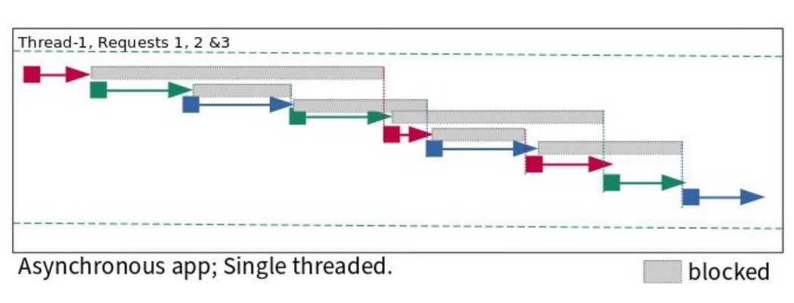
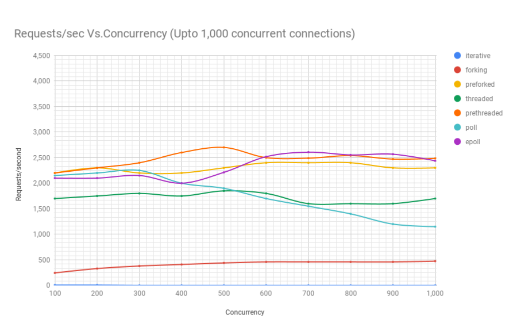

# Async Programming Under Linux

### Introduction

> https://unixism.net/loti/async_intro.html

- System call blocks $\to$ program blocks until this returns such as `read()` or `recv()`.

- Processes can be prempted by the OS when they are on a blocking call, so it may not actually be a direct sequence of events, but conceptually to us it is.
- Consider async programming to get over the operating system context switching overhead. This overhead scales a lot with huge processes and gradually effects our performance.

- **Iterative server**. Server that serves one request after another. Limit in how many requests the operating system can queue up. Linux queues up to 128 kernel versions below 5.4 and 4096 in newer ones.
- **Forking**. Create a new process for each thread. Each process serves a different request. This can utilise our CPU cores well.
- **Preforked**. Creates a process pool that are assigned requests as they come in. Only when the pool is full do incoming requests need to wait. Admins can tweak the number of processes in the pool depending on the load they experience.
- **Threaded**. Spawn a thread each time a request must be processed. Threads share lots of data with the main process therefore its less overhead slightly than forking.
- **Prethreaded**. Thread pool created. requests serviced by the pool and queued when pool busy.
- **Poll**. Single thread, uses `pool()` call to multiplex between requests. Has issues scaling to a large number of file descriptors. 
- **Epoll**. Single threaded, uses `epool()` in place of `poll()` 

> Poll, Epoll, Select all monitor file descriptors for a state of readiness. This readiness indicates that the descriptor is not being blocked i.e we can now move forward with our request.

- So basically at a huge number of concurrent users, the epoll does take over at 11k ish. 

- A good example of a library that abstracts these low-level operating system interfaces (in async programming) are [libevent](https://libevent.org/) and [libuv](https://libuv.org), which powers [NodeJS](https://nodejs.org/en/).

- In synchronous programming, calling `accept()` for example will block us. What if we must do something else, we can of course make threads. Block main on `accept()`. Threads can process other clients while main `accept()` client.
- When we have one thread that has to deal with lots of I/O such as `accept()` or reading / writing to file/socket then we introduce functions such as `select` , `poll` and `epoll`. These allow us to monitor a load of file descriptors (such as sockets).
- FTP server would listen on`accept` for new client requests. Program would tell `select`, `poll` or `epoll` family of sys calls to monitor these file descriptors and let the program know when there is any activity on one or more of them. This requires a big program change compared to how we would do it for just on one process or a thread.
- `aio` family of sys calls can deal async with files and sockets, but have limitations.

> When a file is opened in the O_DIRECT mode (direct I/O mode), **GPFS transfers data directly between the user buffer and the file on the disk**. Using direct I/O may provide some performance benefits in the following cases: The file is accessed at random locations. There is no access  locality.

- On a busy servers with many concurrent users downloading large files (FTP) many times. `read` and `write` can begin to block but `select` `poll` `epoll` wont help. These system calls will always tells regular files as being ready for I/O. File descriptors are non uniform under async programming, file descriptors backing regular files are discriminated against. `libuv` use a separate thread pool for I/O on regular files, exposing an API that hides this discrepancy from the user.

> epoll on regular files - https://stackoverflow.com/questions/8057892/epoll-on-regular-files

### Linux async APIs

##### `aio`

> https://github.com/littledan/linux-aio

- In the **asynchronous I/O (AIO) model**, the application  can submit one or many requests from a thread. Submitting a request does not cause the thread to block, and instead the thread can proceed to do other computations and submit further requests to the device while the  original request is in flight. The application is expected to process  completions and organise logical computations itself without depending  on threads to organise the use of data.
- The model
  - Open an I/O context to submit and reap I/O requests from.
  - Create one or more request objects and set them up to represent the desired operation
  - Submit these requests to the I/O context, which will send them down to the device driver to process on the device
  - Reap completions from the I/O context in the form of event completion objects,
  - Return to step 2 as needed.
- With regards to its comparison to `io_uring`, `io_uring` attempts to leverage independent shared memory queues for command submission and completion instead of system calls like with `aio`.

##### `epoll`

- A form of **IO multiplexing** to poll over a set of file descriptors.
- `epoll` scales well to a large number of watched file descriptors
- Can be **level triggered** and **edge triggered**
- **Edge triggered** is where the kernel notifies the application about an I/O event only for a state change, whereas **level triggered** notifies the application about an I/O event as long as the condition remains true.

##### `poll`

- This is similar to `epoll` but its only **level-triggered**.

##### `select` 

- Simple file descriptor readiness checker but with a limited size.

### io_uring

- The problem described above is gone with `io_uring` as its prevents a uniform interface for sockets / regular files.
- Due to the design of the API, programs can get data that is read or written to files descriptors directly rather than knowing when a file descriptor is ready and then starting an I/O operation on it  subsequently, as is done with `poll` or `epoll`.

