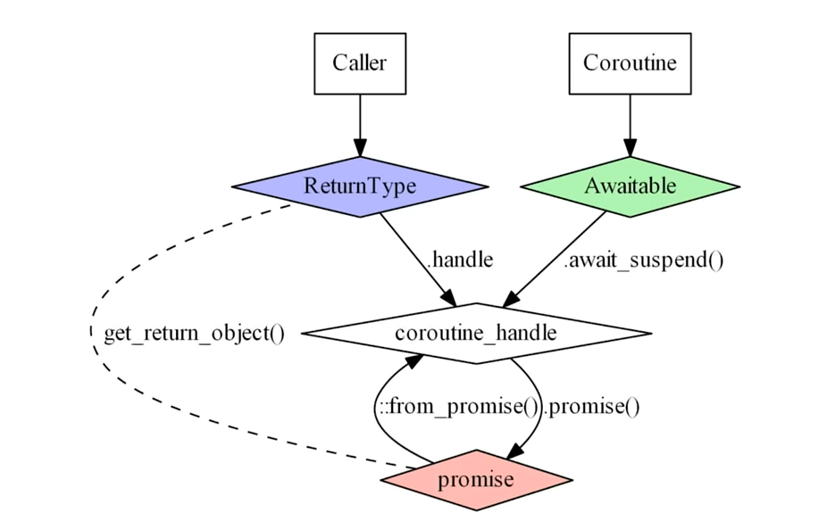

# Delivering C++ Coroutines

- The caller can see the `ReturnType`. This value has a member variable which is a`coroutine_handle` and therefore direct access to our `promise` via the conversions available.
- Coroutine can only see awaitables. When we `co_await` and thus call (if not ready) `await_suspend`, this `await_suspend` is where we obtain a handle to the coroutine and therefore can store a value in promise. 
- This therefore enables our caller to access the type of our awaitable.