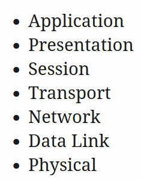
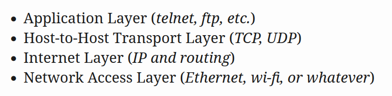
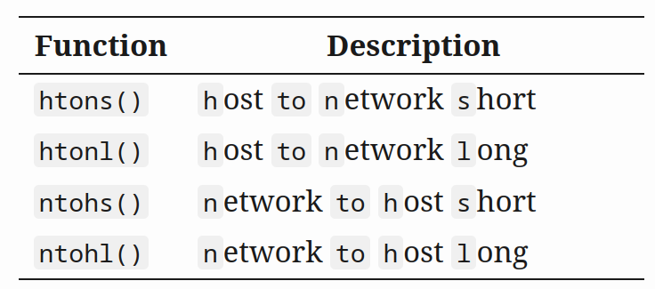
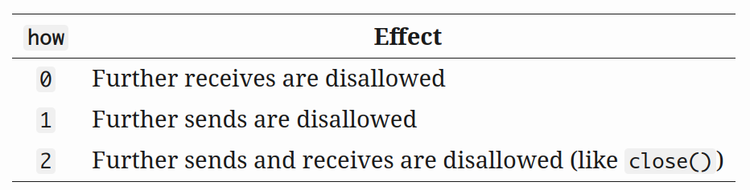

# Sockets

### Sockets

##### What is a socket?

- Unix programs I/O involves the use of reading and writing to a **file descriptor**.
- A *file descriptor* is an integer value associated with some network connection, file, FIFO, pipe, terminal, real on the disk file, or anything else.
- `socket()` call obtains our *socket descriptor*. We then communicate through it via `send()` and `recv()` (to name a couple)

##### Two Types of Internet Sockets

- **Stream sockets** (`SOCK_STREAM`) and **Datagram sockets** (`SOCK_DGRAM`) . 
- Datagram sockets are referred to as **connectionless sockets** (They can still utilise `connect()` however)
- Datagram sockets send datagram that **may arrive**, may arrive **out of order** and if it arrives , the packet is **error-free**.
- Stream sockets are **reliable** **two-way** connected communication streams. The items sent through this socket arrive the **intended order**. They are also **error-free**.
- Stream sockets use **TCP** **(Transmission Control Protocol)**. Example applications using them is *telnet* and *ssh*.
- TCP is part of **TCP/IP** where **IP (Internet Protocol)** deals with the internet routing portion and not responsible for data integrity. Datagram sockets also use IP for internet routing.
- Datagram sockets use **UDP (User Datagram Protocol)** instead of TCP.
- Datagram socket are connectionless as they can **construct a packet and send to the server without any connection** to be established first. This involves placing the IP header on it with some destination information.
- Use Datagram sockets when an **unreliable connection is suitable**, or when the **TCP stack is unavailable**. Examples include `tftp` (uses **ACK** packets on top of UDP for reliability) , `dhcpcd` , multiplayer games, streaming audio, video conferencing.
- Utilising the concept of an ACK is crucial in `SOCK_DGRAM` applications.
- UDP vs TCP is a matter of speed.

##### Low Level Network Theory

- Show how `SOCK_DGRAM` packet are built.


- **Data Encapsulation** is the concept of a packet being wrapped in a header by the first protocol, we then add another encapsulation for the second protocol. Keep repeating this process until we have the entire packet.
- When a computer obtains this packet, the hardware layer strips the Ethernet header, kernel strips the IP / UDP headers, TFTP program strips the TFTP header and now has the data.
- The **Layered Network Model (ISO/OSI)** describes the system of network functionality that has advantages over others.
- With the OSI model we can write sockets programs that are exactly the same without caring about how the data is physically transmitted (such as VIA Ethernet).



- A Unix layered model is more consistent with 



- We just need to `send()` data out to construct this stack (Stream sockets). For Datagram sockets we just need to `sendto()`.
- The kernel builds our transport layer and Internet Layer and the hardware does the network access layer.

### IP Addresses, `structs` , and Data Munging

##### IPv4 / IPv6

- **IPv4 (Internet Protocol Version 4)**. It was made up four bytes (4 *octets*) and was written such as `192.0.2.111`. Essentially every site on the internet uses this version.
- IPv4 addresses have a limited number that is not enough for modern day computing.
- IPv6 was created to add more address space, using **128 bits** as oppose to **32 bits**.
- IPv6 is represented via hexadecimal: `2001:0db8:c9d2:aee5:73e3:934a:a5ae:9551`. Each `:` is a seperate 16 bit chunk.
- Often, IP addresses have many zeros in it, we can therefore compress these between two colons `::`. Leave off leading zeros for each byte. Each of the following pairs of addresses is equivalent:


- `::1` is the **loopback address**. It refers to the machine we are currently running on. IPv4 loopback address is `127.0.0.1`.
- To represent the IPv4 address as an IPv6: `192.0.2.33` $\to$ `::ffff:192.0.2.33`.

##### Subnets

- Declare the parts of the IP address as being the **network portion** and **host portion**.
- Taking an IPv4 address as an example, we could have `192.0.2.12`. Declare the first 3 bytes as the network and the last byte as the host i.e host `12` on network `192.0.2.0` (zero out the byte that the host was).
- There are **network classes** to denote the various configurations regarding total number of hosts and networks (based on the bytes used) ranging from A-C (A has more more hosts / less networks and C has less hosts / more networks)
- The network portion is described by the **netmask**. You take the **bitwise-AND** with the IP address to obtain the network number. 
- The netmask looks something like `255.255.255.0` (Our IP is `192.0.2.12` , so the network of this using our netmask is `192.0.2.12` And `255.255.255.0` giving `192.0.2.0`)
- We can extend this to support **arbitrary number of bits** such as `255.255.255.252`, which is 30 network bits and 2 bits of host allowing for four hosts on the network. The netmask is *always* just a bunch of 1 bits follow by a bunch of  0 bits.
- We use `/` notation to compactly represent this idea. IPv4 for example is `192.0.2.12/30` that meant that 30 bits (reading from left to right) were used to represent the network, and 2 bits for the host portion.
- IPv6 has their own version like `2001:db8::/32` or `2001:db8:5413:4028::9db9/64`.

##### Port Numbers

- TCP and UDP both require a **port number**. This is a 16 bit number that is essentially the local address of the connection.
- This is necessary as we can run multiple services such as mail and web on one computer with a single IP address.
- Common ports: `http` (80) `telnet` (23), `SMTP` (25) 
- Ports under 1024 are often considered special and often require special OS privileges to use.

##### Byte Order

- Consider the two-byte hex number `b34f`. We can store the bytes `b3` followed by `4f`. In this example, the larger end of the number is stored first, this is **Big-Endian**.
- Sometimes this is reversed to form **Little-Endian**
- Big-Endian is also referred to as the **Network Byte Order** as the networks prefer this.
- The computer itself has its own order in **Host Byte Order**.
- We always assume the host byte order is incorrect. We call a function to convert for us to ensure our code is portable is different endianness.
- There are two types of numbers we may convert: **long (2)** and **short (2 bytes)**. These functions work for the `unsigned` variations as well. If you want to convert a `short` from Host byte Order to Network Byte Order.



- There is no 64-bit variant of this. To do floating point $\to$ view *serialisation section*.
- Always assume the notes here use Host Byte Order.

##### Structs

- A socket descriptor is simply an `int`.

---

- The `struct addrinfo` is used to prep the *socket address structures* for subsequent use. It will used be in host and service name lookups. 

```cpp 
struct addrinfo {
    int              ai_flags;     // AI_PASSIVE, AI_CANONNAME, etc.
    int              ai_family;    // AF_INET, AF_INET6, AF_UNSPEC
    int              ai_socktype;  // SOCK_STREAM, SOCK_DGRAM
    int              ai_protocol;  // use 0 for "any"
    size_t           ai_addrlen;   // size of ai_addr in bytes
    struct sockaddr *ai_addr;      // struct sockaddr_in or _in6
    char            *ai_canonname; // full canonical hostname, i.e the hostname used.

    struct addrinfo *ai_next;      // linked list, next node
};
```

- We load this struct up a bit, then call `getaddrinfo()`. This returns a pointer to a *new linked list* of these structures filled out with what we require.
- Use IPv4 or IPv6 in the `ai_family` field, or leave it as `AF_UNSPEC` to use whatever to be IP version agnostic.
- `ai_next` points to the next element that we can use, there may be several results and you use the first normally.
- You will see `ai_addr` field in the `struct addrinfo` is a pointer to `struct sockaddr`. 
- A call to `getaddrinfo()` to fill our `struct addrinfo` is often all we need, we then peer inside the structs to get the values out.
- Some structs are IPv4 and some are IPv6, whereas some may be both. 

---

- `struct sockaddr` holds socket address information for many types of sockets

```cpp
struct sockaddr {
    unsigned short    sa_family;    // address family, AF_xxx
    char              sa_data[14];  // 14 bytes of protocol address
};
```

- `sa_family` may be a variety of things but is typically `AF_INET` (IPv4) and `AF_INET6` (IPv6) for everything in this document.
- `sa_data` contains a destination address and port number for the socket. This is odd as we dont want to tediously pack the address in the `sa_data` by hand.

---

- We use `struct sockaddr_in` (in  = *internet*) when using IPv4. 

> A Pointer to `struct sockaddr_in` can be *cast* to a pointer to a `struct sockaddr` and vice versa
>
> `connect()` wants a `struct sockaddr*` but you can use  `sockaddr_in` and cast in the last minute.

```cpp
// (IPv4 only--see struct sockaddr_in6 for IPv6)

struct sockaddr_in {
    short int          sin_family;  // Address family, AF_INET
    unsigned short int sin_port;    // Port number
    struct in_addr     sin_addr;    // Internet address
    unsigned char      sin_zero[8]; // Same size as struct sockaddr
};

// Internet address (a structure for historical reasons)
struct in_addr {
    uint32_t s_addr; // that's a 32-bit int (4 bytes)
};
```

- If you have declared `ina` to be of type `struct sockaddr_in` then `ina.sin_addr.s_addr` references the 4-byte IP address in Network Byte Order.

---

- The IPv6 Version

```cpp
// (IPv6 only--see struct sockaddr_in and struct in_addr for IPv4)

struct sockaddr_in6 {
    u_int16_t       sin6_family;   // address family, AF_INET6
    u_int16_t       sin6_port;     // port number, Network Byte Order
    u_int32_t       sin6_flowinfo; // IPv6 flow information
    struct in6_addr sin6_addr;     // IPv6 address
    u_int32_t       sin6_scope_id; // Scope ID
};

struct in6_addr {
    unsigned char   s6_addr[16];   // IPv6 address
};
```

---

- `struct sockaddr_storage` is designed to hold both IPv4 and IPv6 structures.
- For some calls you dont know in advanced if its going to fill out your `struct sockaddr` with an IPv4 or IPv6 address, so pass into this parallel structure.
- This is similar to `struct sockaddr` except its large, and then we cast it to the type you need

```cpp
struct sockaddr_storage {
    sa_family_t  ss_family;     // address family

    // all this is padding, implementation specific, ignore it:
    char      __ss_pad1[_SS_PAD1SIZE];
    int64_t   __ss_align;
    char      __ss_pad2[_SS_PAD2SIZE];
};
```

- We can see the address family in the `ss_family` field. We check this to see if its `AF_INET` OR `AF_INET6` for IPv4 and IPv6.
- We then cast it to a `struct sockaddr_in` or `struct sockaddr_in6` if you want to.

##### IP Addresses

- Say we want to store an IP address such as `"10.12.110.57"` or `"2001:db8:63b3:1::3490"` into our `struct sockaddr_in ina`.
- `inet_pton()` will convert an IP address in numbers-and-dots notation into either a `struct in_addr` or a `struct in6_addr` depending if we set `AF_INET` or `AF_INET6`.

> `pton` = **presentation to network** ( *printable to network* to remember )

```cpp
struct sockaddr_in sa; // IPv4
struct sockaddr_in6 sa6; // IPv6

inet_pton(AF_INET, "10.12.110.57", &(sa.sin_addr)); // IPv4
inet_pton(AF_INET6, "2001:db8:63b3:1::3490", &(sa6.sin6_addr)); // IPv6
```

- `inet_pton()` returns `-1` in the result of an error or `0` if address is messed up. Check if the result is greater than `0` before using
- If we have `struct in_addr` and wish to print it in numbers-and-dots notation (or `struct in6_addr` to print in hex-and-colons notations). We can use `inet_ntop` (network to presentation)

```cpp
// IPv4:

char ip4[INET_ADDRSTRLEN];  // space to hold the IPv4 string
struct sockaddr_in sa;      // pretend this is loaded with something

inet_ntop(AF_INET, &(sa.sin_addr), ip4, INET_ADDRSTRLEN);

printf("The IPv4 address is: %s\n", ip4);


// IPv6:

char ip6[INET6_ADDRSTRLEN]; // space to hold the IPv6 string
struct sockaddr_in6 sa6;    // pretend this is loaded with something

inet_ntop(AF_INET6, &(sa6.sin6_addr), ip6, INET6_ADDRSTRLEN);

printf("The address is: %s\n", ip6);
```

- We pass the address type, a pointer to the string to hold the result and the maximum length of that string

> There are two macros that holds the string size required - `INET_ADDRSTRLEN` and `INET6_ADDRSTRLEN`

- These functions only work with numeric IP addresses. They do not do any nameserver DNS lookup on a hostname, like `www.example.com`. We use `getaddrinfo()` to do that.

---

- **Private (Or Disconnected) Networks**

  - Firewall exists to hide the network from the rest of the world for protection.
  - Firewall translates *internal* IP addresses to *external* IP addresses using a process called **NAT (Network Address Translation)** 
  - Logging into a computer will say that your address is `192.0.2.33` which is a public IP address assigned by an ISP. The local computer reports a different IP such as `10.0.0.5`. The firewall in this case does NAT.
  - `10.x.x.x` is one of a few reserved networks that are only to be used either on fully disconnected networks, or on networks that are behind firewalls. `x` = 0-255 normally. Less commonly `172.y.x.x` where `y` goes between 16 and 31.

  > Networks behind a "NATing" firewall do not need to be on one of these reserved networks but they commonly are.

  - IPv6 also has private networks. These start with `fdXX:` (maybe `fcXX:`) 
  - NAT and IPv6 generally do not mix. IPv6 has so many addresses, there is rarely a need. To allocate addresses for yourself on a network that wont route outside, this is how.

### IPv4 to IPv6

- Use `getaddrinfo()` to get all the `struct sockaddr` info instead of packing the structures by hand. This keeps us IP version agnostic and eliminates many subsequent steps.
- Any hardcoded place relating to IP version, wrap in a helper function.
- Change `AF_INET` to `AF_INET6`.
- Change `PF_INET` to `PF_INET6`. (**DONT USE**)
- Change `INADDR_ANY` assignments to `in6addr_any`, these are slightly different

```cpp
struct sockaddr_in sa;
struct sockaddr_in6 sa6;

sa.sin_addr.s_addr = INADDR_ANY;  // use my IPv4 address
sa6.sin6_addr = in6addr_any; // use my IPv6 address

// The value `IN6ADDR_ANY_INIT` can be used as an initializer when the `struct in6_addr` is declared like
struct in6_addr ia6 = IN6ADDR_ANY_INIT;
```

- Instead of `struct sockaddr_in` use `struct sockaddr_in6`. Ensure you ad `6` to the fields as appropriate. There is no `sin6_zero` field.
- Instead of `struct in_addr` use `struct in6_addr`, being sure to add `6` to the fields.
- `inet_aton()` / `inet_addr()` $\to$ `inet_pton()`
- `inet_ntoa()` $\to$ `inet_ntop()`
- Instead of `gethostbyname()` $\to$ `getaddrinfo()`.
- `gethostbyaddr` $\to$ `getnameinfo()` (`gethostbyaddr()` can still work with IPv6)
- `INADDR_BROADCAST` no longer works. Use IPv6 multicast instead.

### System Calls

##### `getaddrinfo()`

- Does various stuff such as DNS / Service name lookup and fills out the structs we need. This may not be necessary but is useful for a lot of programs. Once we have the struct we use this struct to create sockets that we then bind to start further network operations.

> Uses
>
> - DNS resolution. www.poo.com -> IP address
> - Service name resolution. HTTP -> 80
> - Protocol independence. Works when querying IPv6 or IPv4 addresses.

```cpp
#include <sys/types.h>
#include <sys/socket.h>
#include <netdb.h>

int getaddrinfo(const char *node,     // e.g. "www.example.com" or IP
                const char *service,  // e.g. "http" or port number
                const struct addrinfo *hints,
                struct addrinfo **res);
```

- Give 3 parameters and it gives us a pointer to a linked list, `res` , of results.
- `node` parameter is the host name to connect to, or an `IP` address.
- `service` can be a port number such as `80` or the name of a specific service such as `http` or `ftp`.
- `hints` points to `struct addrinfo` that we filled out already with relevant information. These are essentially preferences to use when doing the lookup.

> [what does hints actually mean](https://stackoverflow.com/questions/755308/whats-the-hints-mean-for-the-addrinfo-name-in-socket-programming)

```cpp
int status;
struct addrinfo hints;
struct addrinfo *servinfo;  // will point to the results

memset(&hints, 0, sizeof hints); // make sure the struct is empty
hints.ai_family = AF_UNSPEC;     // don't care IPv4 or IPv6
hints.ai_socktype = SOCK_STREAM; // TCP stream sockets
hints.ai_flags = AI_PASSIVE;     // fill in my IP for me

if ((status = getaddrinfo(NULL, "3490", &hints, &servinfo)) != 0) {
    fprintf(stderr, "getaddrinfo error: %s\n", gai_strerror(status));
    exit(1);
}

// servinfo now points to a linked list of 1 or more struct addrinfos

// ... do everything until you don't need servinfo anymore ....

freeaddrinfo(servinfo); // free the linked-list
```

- `AI_PASSIVE` fills in the IP based on the local host to the socket structures. We could put some specific address also but choose `NULL` in this case.
- `getaddrinfo` returns a *non-zero* value if there is an error. Print this using `gai_strerror()`.
- If it works, `servinfo` points to a linked list of `struct addrinfo`s, each containing a `struct sockaddr` of some kind that we use later.
- Call `freeaddrinfo` to free this linked list.
- Sample call if you are a client who wants to connect to some server such as "www.example.net" on port `3490`.

```cpp
int status;
struct addrinfo hints;
struct addrinfo *servinfo;  // will point to the results

memset(&hints, 0, sizeof(hints)); // make sure the struct is empty
hints.ai_family = AF_UNSPEC;     // don't care IPv4 or IPv6
hints.ai_socktype = SOCK_STREAM; // TCP stream sockets

// get ready to connect
status = getaddrinfo("www.example.net", "3490", &hints, &servinfo);

// servinfo now points to a linked list of 1 or more struct addrinfos

// etc.
```

- `servinfo` is a linked list with various kinds of address information.
- Program here that prints the IP addresses for whatever host you specify on the command line

```cpp
/*
** showip.c -- show IP addresses for a host given on the command line
*/

#include <stdio.h>
#include <string.h>
#include <sys/types.h>
#include <sys/socket.h>
#include <netdb.h>
#include <arpa/inet.h>
#include <netinet/in.h>

int main(int argc, char *argv[])
{
    using addrinfo = struct addrinfo;

    addrinfo hints, *res;
    int status;
    char ipstr[INET6_ADDRSTRLEN];

    if (argc != 2) {
        fprintf(stderr,"usage: showip hostname\n");
        return 1;
    }

    memset(&hints, 0, sizeof hints);
    hints.ai_family = AF_UNSPEC; // AF_INET or AF_INET6 to force version
    hints.ai_socktype = SOCK_STREAM;

    if ((status = getaddrinfo(argv[1], NULL, &hints, &res)) != 0) {
        fprintf(stderr, "getaddrinfo: %s\n", gai_strerror(status));
        return 2;
    }

    printf("IP addresses for %s:\n\n", argv[1]);

   	struct addrinfo *p;
    for(p = res;p != NULL; p = p->ai_next) {
        void *addr;
        char *ipver;

        // get the pointer to the address itself,
        // different fields in IPv4 and IPv6:
        if (p->ai_family == AF_INET) { // IPv4
            struct sockaddr_in *ipv4 = (struct sockaddr_in *)p->ai_addr;
            addr = &(ipv4->sin_addr);
            ipver = "IPv4";
        } else { // IPv6
            struct sockaddr_in6 *ipv6 = (struct sockaddr_in6 *)p->ai_addr;
            addr = &(ipv6->sin6_addr);
            ipver = "IPv6";
        }

        // convert the IP to a string and print it:
        inet_ntop(p->ai_family, addr, ipstr, sizeof ipstr);
        printf("  %s: %s\n", ipver, ipstr);
    }

    freeaddrinfo(res); // free the linked list

    return 0;
}
```

- `getaddrinfo()` call here fills out the linked lists based on the hostname we pass in.
- We can then iterate over the list to determine the addresses of each IP version resolved.
- Use these results to pass to other socket functions.

##### `socket()` 

```cpp
#include <sys/types.h>
#include <sys/socket.h>

int socket(int domain, int type, int protocol); 
```

- We can specify what type of socket we want with this: IPv4 or IPv6 , stream or datagram, TCP or UDP.
- protocol set to `0` to choose protocol based on `type`. `getprotobyname()` to look up protocol from string `TCP` or `UDP`. 
- `domain` could be `AF_INET` , `AF_INET6`.
- `type` is `SOCK_STREAM` or `SOCK_DGRAM` 

- We want to use the values from the results of the call to `getaddrinfo()` and feed into `socket()`.

```cpp
int s;
struct addrinfo hints, *res;

// do the lookup
// [pretend we already filled out the "hints" struct]
getaddrinfo("www.example.com", "http", &hints, &res);

// again, you should do error-checking on getaddrinfo(), and walk
// the "res" linked list looking for valid entries instead of just
// assuming the first one is good (like many of these examples do).
// See the section on client/server for real examples.

s = socket(res->ai_family, res->ai_socktype, res->ai_protocol);
```

- `socket()` returns us a socket descriptor that we use later for system calls, or `-1` if error.
- The global variable `errno` is set to errors value

##### `bind()`

- We must associate the socket we create with a port on our local machine.
- We do this when we must `listen()` for incoming connections on a specific port.
- Port number is used by the kernel to match an incoming packet to a certain process' socket descriptor.
- If we only use `connect()` (client not server) then this is likely not necessary. 

```cpp
#include <sys/types.h>
#include <sys/socket.h>

int bind(int sockfd, struct sockaddr *my_addr, int addrlen);
```

- `sockfd` is the socket file descriptor returned by `socket()`.
- `my_addr` is a pointer to a `struct sockaddr` that contains information about your address, namely, port and IP address.
- `addrlen` is the length in bytes of that address.

```cpp
struct addrinfo hints, *res;
int sockfd;

// first, load up address structs with getaddrinfo():
memset(&hints, 0, sizeof hints);
hints.ai_family = AF_UNSPEC;  // use IPv4 or IPv6, whichever
hints.ai_socktype = SOCK_STREAM;
hints.ai_flags = AI_PASSIVE;     // fill in my IP for me

getaddrinfo(NULL, "3490", &hints, &res); // start on port 3490

// make a socket:
sockfd = socket(res->ai_family, res->ai_socktype, res->ai_protocol);

// bind it to the port we passed in to getaddrinfo():
bind(sockfd, res->ai_addr, res->ai_addrlen);
```

- `AI_PASSIVE` signifies that we are binding to the IP of our host we are running on. We drop to bind to a specific IP.
- `bind()` returns `-1` on error and sets `errno` to the errors value.
- Old code packs the `struct sockaddr_in` before calling `bind()`. We use `getaddrinfo` to be IPv4 and IPv6 agnostic because this struct is not agnostic right now.

```cpp
// !!! THIS IS THE OLD WAY !!!

int sockfd;
struct sockaddr_in my_addr;

sockfd = socket(PF_INET, SOCK_STREAM, 0);

my_addr.sin_family = AF_INET;
my_addr.sin_port = htons(MYPORT);     // short, network byte order
my_addr.sin_addr.s_addr = inet_addr("10.12.110.57");
memset(my_addr.sin_zero, '\0', sizeof my_addr.sin_zero);

bind(sockfd, (struct sockaddr *)&my_addr, sizeof my_addr);
```

- Could also assign `INADDR_ANY` to the `s_addr` field if you wanted to bind to your local IP address (such as `AI_PASSIVE` flag).
- IPv6 Version of `INADDR_ANY` is a global variable `in6addr_any` that is assigned into the `sin6_addr` field of your `struct sockaddr_in6` (There is also a macro `IN6ADDR_ANY_INIT` that you can use in a variable).
- All ports below `1024` are reserved (unless you are a super user).
- Rerunning a server and `bind()` failing is a result of a socket still connected and hanging around. We could wait for it or add code to reuse:

```cpp
int yes=1;
//char yes='1'; // Solaris people use this

// lose the pesky "Address already in use" error message
if (setsockopt(listener,SOL_SOCKET,SO_REUSEADDR,&yes,sizeof yes) == -1) {
    perror("setsockopt");
    exit(1);
} 
```

- We only care about `bind()` if we care about the local port we are running on, otherwise we can call `connect()` and get an ephemeral port instead.

##### `connect()`

- `connect` is used to command our socket to connect to a specific address &  port.

```cpp
#include <sys/types.h>
#include <sys/socket.h>

int connect(int sockfd, struct sockaddr *serv_addr, int addrlen); 
```

- `sockfd` is the socket descriptor returned from `socket()`
- `serv_addr` is a `struct sockaddr` containing the destination port and IP.
- `addrlen` is the length in bytes of the server address structure.
- We obtained all this already from `getaddrinfo()`. 

```cpp
struct addrinfo hints, *res;
int sockfd;

// first, load up address structs with getaddrinfo():
memset(&hints, 0, sizeof(hints));
hints.ai_family = AF_UNSPEC;
hints.ai_socktype = SOCK_STREAM;

getaddrinfo("www.example.com", "3490", &hints, &res);

// make a socket:
sockfd = socket(res->ai_family, res->ai_socktype, res->ai_protocol);

// connect!
connect(sockfd, res->ai_addr, res->ai_addrlen);
```

- Old programs filled their own `struct sockaddr_in` to pass to `connect()` but prefer `getaddrinfo()`.
- Check the return value from `connect()` as it returns `-1` and set the variable `errno`.
- There is no `bind()` call as we dont care about our local port when making a connection, the kernel selects for us.

##### `listen()`

- We call this when we want to sit and wait for incoming connections to us and then handle.
- First `listen()` then `accept()`.

```cpp
int listen(int sockfd, int backlog); 
```

- `sockfd` is the socket file descriptor from `socket()`.
- `backlog` is the number of connections allowed on the incoming queue. Incoming connections wait in a queue until we `accept()`. This is the limit on how many we can queue up. Set to about `5` or `10`. Returns `-1` and sets `errno`.
- We must call `bind()` before `listen()` so our server is actually running on a specific port.

```cpp
getaddrinfo();
socket();
bind();
listen();
/* accept() goes here */ 
```

##### `accept()`

- Someone tries to `connect()` to our machine on a port that we are `listen()`ing on.
- Their connection will be queued up waiting to be `accept()`ed. You call `accept()` and you tell it get the pending connection. 
- This returns you a *brand new socket file descriptor* to use for this single connection. There are now two socket file descriptors.

```cpp
#include <sys/types.h>
#include <sys/socket.h>

int accept(int sockfd, struct sockaddr *addr, socklen_t *addrlen); 
```

- `sockfd` is the `listen()`ing socket. 
- `addr` is often a pointer to a local `struct sockaddr_storage`. We store the information about the incoming connection here. We can determine which host is calling us and which port they are on.
- `addrlen` is a local integer variable that should be set to `sizeof(struct sockaddr_storage)` before its address is passed to `accept()`.
- `accept()` will not pure more than that many bytes into `addr`. If fewer are placed in , then it will change the value of `addrlen` to reflect that.
- `accept()` returns `-1` and sets `errno`.

```cpp
#include <string.h>
#include <sys/types.h>
#include <sys/socket.h>
#include <netdb.h>

#define MYPORT "3490"  // the port users will be connecting to
#define BACKLOG 10     // how many pending connections queue will hold

int main(void)
{
    struct sockaddr_storage their_addr;
    socklen_t addr_size;
    struct addrinfo hints, *res;
    int sockfd, new_fd;

    // !! don't forget your error checking for these calls !!

    // first, load up address structs with getaddrinfo():

    memset(&hints, 0, sizeof hints);
    hints.ai_family = AF_UNSPEC;  // use IPv4 or IPv6, whichever
    hints.ai_socktype = SOCK_STREAM;
    hints.ai_flags = AI_PASSIVE;     // fill in my IP for me

    getaddrinfo(NULL, MYPORT, &hints, &res);

    // make a socket, bind it, and listen on it:

    sockfd = socket(res->ai_family, res->ai_socktype, res->ai_protocol);
    bind(sockfd, res->ai_addr, res->ai_addrlen);
    listen(sockfd, BACKLOG);

    // now accept an incoming connection:

    addr_size = sizeof their_addr;
    new_fd = accept(sockfd, (struct sockaddr *)&their_addr, &addr_size);

    // ready to communicate on socket descriptor new_fd!
```

- `close()` our listen socket now if we only want one connection.

##### `send()` and `recv() `

- These are for communicating over stream sockets or connected (`connect()`) datagram sockets.
- If you want to use regular unconnected datagram sockets, we use `sendto()` and `recvfrom()`.

```cpp
int send(int sockfd, const void *msg, int len, int flags); 
```

- `sockfd` is the `socket()` descriptor or the one you got from `accept()`.
- `msg` is a pointer to the data we want to send
- `len` is the length of that data in bytes.
- `flags` should be set to `0`

```cpp
char *msg = "Beej was here!";
int len, bytes_sent;
.
.
.
len = strlen(msg);
bytes_sent = send(sockfd, msg, len, 0);
```

- `send()` returns the number of bytes actually sent out, this may be less the number you told it to send.
- If the value returned by `send()` does not match the value returned by `send()` does not match `len()`. Small packets less than `1k` or so will probably send the whole message in one go.
- `-1` is returned error, and `errno` is set to the error number.

---

- `recv()` is similar

```cpp
int recv(int sockfd, void *buf, int len, int flags);
```

- `sockfd` is the socket descriptor.
- `buf` is the buffer to read the information into
- `len` is the maximum length of the buffer
- `flags` set to `0` 
- `recv()` can return `0` which means the remote side has closed the connection on us.

##### `sendto()` and `recvfrom()` 

- Datagram sockets are not connected to a remote host. We need the destination address before we send

```cpp
int sendto(int sockfd, const void *msg, int len, unsigned int flags,
           const struct sockaddr *to, socklen_t tolen); 
```

- Basically `send()` but we have `to` which is a pointer to a `struct sockadr` (would be `struct sockaddr_in` / `struct sockaddr_in6` / `struct sockaddr_storage` that is casted) that contains the IP and port.
- `tolen` is an `int` that is set to `sizeof *to` or `sizeof(struct sockaddr_storage)`. 
- We use `getaddrinfo()` to obtain this data, or from `recvfrom()` or by hand.
- Sends the number of bytes that it actually sent or `-1` from error.

---

- Similar to `recv()` is `recvfrom()`

```cpp
int recvfrom(int sockfd, void *buf, int len, unsigned int flags,
             struct sockaddr *from, int *fromlen); 
```

- `from` is a pointer to a `struct sockaddr_storage` filled with the IP address and port of the originating machine.
- `fromlen` is a pointer to a local int that should be initialised to `sizeof *from` or `sizeof(struct sockaddr_storage)`.
- When the function returns `fromlen` will contain the length of the address actually stored in `from`.
- returns `-1` and sets `errno`.

---

- We use `struct sockaddr_storage` as opposed to a specific such as `struct sockaddr_in` to not tie us down to IPv4 / IPv6. Its generic.

- This is to compensate for `struct sockaddr` being too small, so instead its casted to it.

---

- `connect()` from a datagram socket, you can use `send()` and `recv()` for the transactions.
- Socket will still be a datagram socket and the packets use UDP, but the interface will automatically add the destination source information for you.

##### `close()` and `shutdown()`

```cpp
close(sockfd); 
```

- `close()` prevents any more reads and writes to the socket. Anyone attempting to read or write the socket on the remote end will receive an error.

```cpp
int shutdown(int sockfd, int how); 
```

- `shutdown()` offers more control. It allows us to cut off communication in a certain direction, or both ways (same as `close()`) 
- `sockfd` is the socket descriptor to shutdown and `int `describes how, options:



- `shutdown()` returns `0` on success, and `-1` on error + `errno`.
- If we use `shutdown()` on unconnected datagram sockets, it makes the socket unavailable for further `send()` and `recv()` calls (we must call `connect()` on the datagram socket for this to work).

> `shutdown()` does not close the descriptor, it changes how its used, you must call `close()` to free it.

##### `getpeername()`

- Tells you who is at the other end of a connected stream socket

```cpp
#include <sys/socket.h>

int getpeername(int sockfd, struct sockaddr *addr, int *addrlen); 
```

- `sockfd` is the descriptor of the connected stream socket
- `addr` is a pointer to a `struct sockaddr / struct sockaddr_in` that holds the information about the other side of the connection.
- `addrlen` is a pointer to an `int` that is init to `sizeof *addr` or `sizeof(struct sockaddr)`.
- Returns `-1` on error and sets `errno` accordingly.
- When we have the address we can use `inet_ntop()` , `getnameinfo()` or `gethostbyaddr()` to print or get more information.

##### `gethostname()`

- Returns the name of the computer that your program is running on.
- The name can then be used by `getaddrinfo()` to determine the IP address of the local machine.

```cpp
#include <unistd.h>

int gethostname(char *hostname, size_t size); 
```

- `hostname` is a pointer to an array of chars that will contain the hostname upon the function's return
- `size` is the length in bytes of the hostname array
- returns `0` on success and `-1` on error, setting `errno` usual.