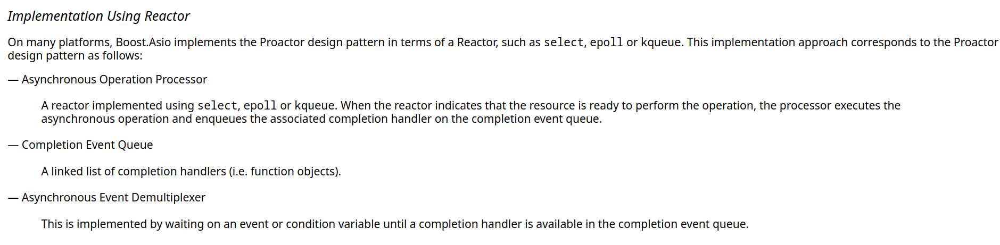
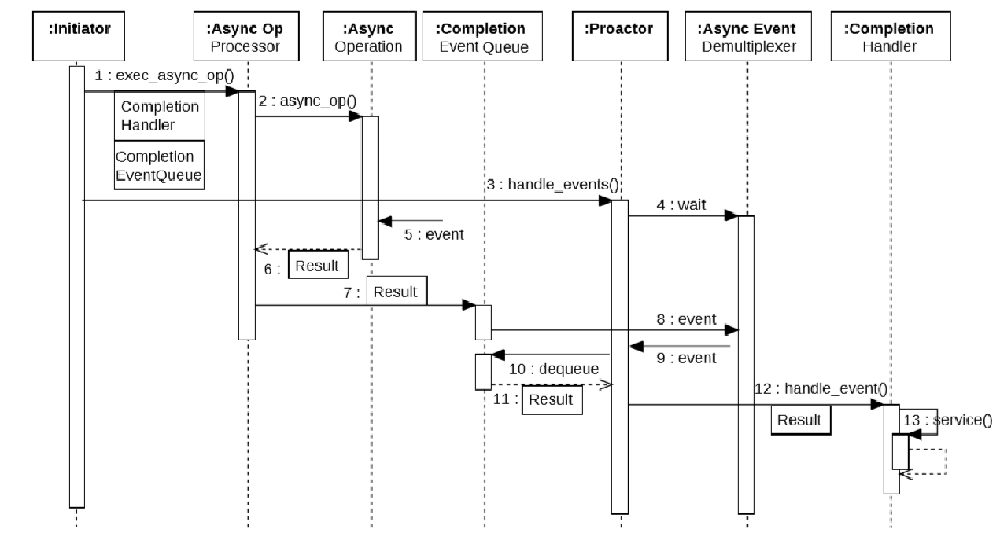

# Research topics

##### Reactor

- https://www.youtube.com/watch?v=pmtrUcPs4GQ

##### Proactor

> https://www.youtube.com/watch?v=rwOv_tw2eA4 - boost asio design

1. Initiate the asynchronous operation (main thread)
2. The async operation processor executes the async operation (operating system)
3. The initiator starts handling events (main thread)
4. We wait on events
5. the async op receives an event
6. Hand the result of the event back the async processor
7. Pass this result to a completion queue
8. Demultiplexer is notified off the new item in the queue
9. event about a new queue item is seen by the proactor
10. The proactor dequeues the event
11. The proactor now knows about the result
12. the proactor which handles events figures out what event handler to call with the result
13. Completion handler is executed with the result passed to it.

##### Thread pool

##### Active Object

##### Observer pattern

##### C10k Problem

##### Event Driven Programming

##### Context Switching

##### How do operating systems implement asynchronous I/O

##### How to avoid syscalls

##### Meltdown / Spectre

https://www.cloudflare.com/learning/security/threats/meltdown-spectre/
