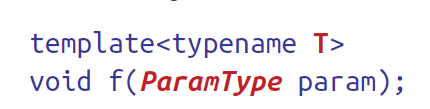

# Item 1 - Understand template type deduction

- Understand `auto` for template type deduction



- Call looks like:


- Use `expr` to deduce **two types**:
  1. one for `T` 
  2. one for `ParamType` 

- `ParamType` often contains adornments
  1. const
  2. reference qualifiers

---

- If the template declared like this

```c++
template <typename T>
void f(const T& param); // ParamType is const T&
```

- Call as such

```c++
int x = 0;
f(x);
```

- `T` deduced to be `int`, `ParamType` deduce to be `const int&`. 

---

- `T` does not always deduce as being the same value as `x`. 
- `T` depends on the `ParamType` too not just the type of `expr`. 

---

- Three cases
  1. Pointer or reference type (not universal reference)
  2. Universal reference
  3. Neither pointer nor reference.

## Case 1 - Reference / Pointer (not universal reference)

1. expr type is reference $\to$ ignore reference
2. pattern match expr type against `ParamType` to determine `T`.


- **r value** reference parameters work the same but this has nothing to do with **type deduction in general.**


- Adding const means `T` is deduced as `int` rather than `const int`. 

---

- Param being a **pointer / pointer to const** , essentially same way.

```c++
template<typename T>
void f(T* param); // param is now a pointer

int x = 27; // as before

const int *px = &x; // px is a ptr to a const int
f(&x); // T is int, param type is int*

f(px); //
```

