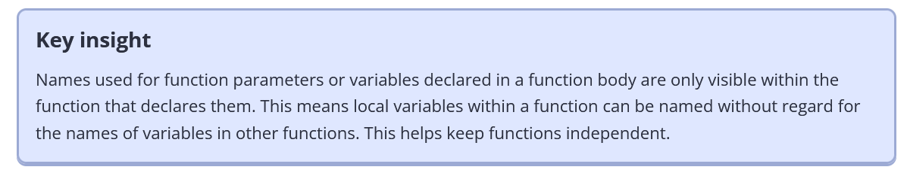
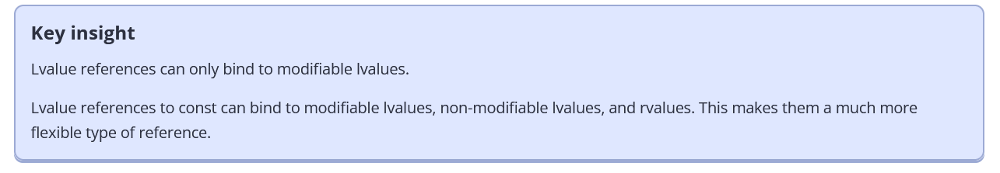
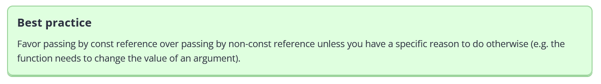
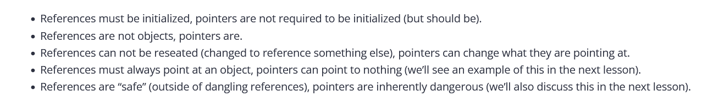

# Summary of missing information

## Chapter 0

- Review compiler , linker and libraries
  - Read book or CPPCON
- Build configurations
- Compiler extensions
- Warnings and error levels

## Chapter 1

###### Defining multiple variables

```c++
int a, b;
```

###### variable assignment

```c++
int width; 
width = 5; // copy assignment.
```

###### Initialisation 

```c++
int a; // no initializer, default init, often leaves it indeterminate.
int b = 5; // initializer after equals sign, copy initialisaiton
int c( 6 ); // initializer in parenthesis, direct initialisation
int d { 7 }; // initializer in braces, braze initialisation
```

- Brace prevents *narrowing conversions* such as *double* to *int*.

###### std::endl vs '\n'

- `std::endl` is inefficient.
  1. Moves cursor to a **new line**
  2. *Flushes* the *output* (so it shows on the screen immediately)
     - `std::cout` often does this automatically thus we dont really need this flush.
- `\n` simply just *moves to a new line* instead.

###### std::cin 

- Always initialise a variable before allowing user input into it

```c++
#include <iostream>  // for std::cout and std::cin

int main()
{
    int x{ }; // define variable x to hold user input (and zero-initialize it)
    int y{ }; // define variable y to hold user input (and zero-initialize it)
    std::cin >> x >> y; // get two numbers and store in variable x and y respectively
    return 0;
}
```

###### undefined behaviour and uninitialized variables


```c++
#include <iostream>
int main()
{
    // define an integer variable named x
    int x; // this variable is uninitialized because we haven't given it a value
    // print the value of x to the screen
    std::cout << x; // who knows what we'll get, because x is uninitialized
    return 0;
}
```

- Value sent is *unknown*.
- Visual studio sets the value as something default such as `-858993460` 

## Chapter 2

###### Function return value


- Remove redundancy by **following DRY principle**.

###### Local scope


- Key point $\to$ variables destroyed in *opposite order* as the function exits.




- Use local variables where they are used within *reason*.

###### Forward declarations


###### One Definition Rule

- Given some *file* $\to$ a *function / variable / type /template* may have a *single definition*
- Given some *program* $\to$ *variable / normal function* can only have *one definition* as programs *consist* of *multiple files*
- *Types / templates / inline functions / inline variables* $\to$ can *have multiple definitions* in different files.

###### Pure declarations

- Satisfy the *compiler* knowing the *existence* of some function via a *forward declaration*. Nothing on the not of *definition*.


###### Namespaces


###### Global Namespace

- Any name that is *not defined in a class* is *implicitly* defined in the **global namespace**.

###### Using directive

- A *using directive* tells the compiler to check some *specified namespace* when attempting to resolve an *identifier* with **no namespace prefix**.


###### Conditional compilation

```c++
#include <iostream>

#define PRINT_JOE

int main()
{
#ifdef PRINT_JOE
    std::cout << "Joe\n"; // will be compiled since PRINT_JOE is defined
#endif

#ifdef PRINT_BOB
    std::cout << "Bob\n"; // will be ignored since PRINT_BOB is not defined
#endif

    return 0;
}
```

###### #if 0

```c++
#include <iostream>

int main()
{
    std::cout << "Joe\n";

#if 0 // Don't compile anything starting here
    std::cout << "Bob\n";
    std::cout << "Steve\n";
#endif // until this point

    return 0;
}
```

###### macro scope

```cpp
#include <iostream>

void foo()
{
#define MY_NAME "Alex" /* works fine to use in main*/
}

int main()
{
	std::cout << "My name is: " << MY_NAME;
	return 0;
}
```

## Chapter 4

###### Fundamental data types 

- Short list of basic values.


###### integral vs integer.


###### _t suffix

- Specifies a *type* as we define them as such in the *backend*.

###### void

- Void nameless parameter specifies a function taking **no parameters**

```c++
int getValue(void) // void here means no parameters
{
    int x{};
    std::cin >> x;
    return x;
}
```


###### Size of fundamental types


###### Data type performance note


###### Signed integers


###### Signed integer ranges


###### Integer overflow

- Storing a value beyond the **boundaries** of what some data type can actually represent.
- This causes *data to be lost* as there is simply *not enough memory* to store everything.


- Always use a *bigger* value if the risk is there.

###### Unsigned integer range


###### Unsigned integer overflow


- If some *unsigned value* goes *out of range* $\to$ it is divided by **one greater** than the *largest number* of the *type* and the **remainder is kept**.


- This is referred to as *modulo wrapping*.

###### Controversy over unsigned numbers

- Should *avoid unsigned integers* down to the *issues described* 

```c++
#include <iostream>

int main()
{
	unsigned int x{ 3 };
	unsigned int y{ 5 };

	std::cout << x - y << '\n'; /*4294967294*, wraps around to the largest value/
	return 0;
}
```

```c++
#include <iostream>

int main()
{
    signed int s { -1 };
    unsigned int u { 1 };

    if (s < u) // -1 is implicitly converted to 4294967295, and 4294967295 < 1 is false
        std::cout << "-1 is less than 1\n";
    else
        std::cout << "1 is less than -1\n"; // this statement executes

    return 0;
}
```


###### When to use unsigned nubers

- Dealing with **bit manipulation**.
- Used in *encryption* and *random number generation*.
- Unsigned may be *converted* to *unsigned*.
- Must be used in array indexing sometimes.

###### Fixed width integers


- These are **not guaranteed** to be *defined on all architectures*. Fails to compile for those cases, unlikely.

###### Fast and least integers

https://stackoverflow.com/questions/46446453/what-is-a-fast-integer-what-defines-how-fast-an-integer-is

- Define types that are **guaranteed** to *be defined*.
- Obtain the *fastest integer type* for example with `std::int_fast32_t` that is *at least 32 bits*.

```c++
#include <cstdint> // for fixed-width integers
#include <iostream>
/* windows 32 bit application */
int main()
{
	std::cout << "least 8:  " << sizeof(std::int_least8_t) * 8 << " bits\n";
	std::cout << "least 16: " << sizeof(std::int_least16_t) * 8 << " bits\n";
	std::cout << "least 32: " << sizeof(std::int_least32_t) * 8 << " bits\n";
	std::cout << '\n';
	std::cout << "fast 8:  " << sizeof(std::int_fast8_t) * 8 << " bits\n";
	std::cout << "fast 16: " << sizeof(std::int_fast16_t) * 8 << " bits\n"; /* selects 32 as its faster on 32 bit application*/
	std::cout << "fast 32: " << sizeof(std::int_fast32_t) * 8 << " bits\n";

	return 0;
}
```

```c++
#include <cstdint> // for fixed-width integers
#include <iostream>

int main()
{
    std::uint_fast16_t sometype { 0 };
    --sometype; // intentionally overflow to invoke wraparound behavior

    std::cout << sometype;

    return 0;
}

/* 
	Produces different results dependning on the std::uint_fast16_t being 16/32/64 bits.
*/
```

###### std::int8 / std::uint8_t behave as chars in stead of integers

- Compilers treat these literally the *same* as **signed chars** and **unsigned chars**.


###### Integral best practices


###### std::size_t

- Ensured to be **unsigned** and *at least 16 bits*
- Often equivalent to the **address width** of the *application* 
- 32 bit architecture $\to$ its *32 bit unsigned integer* etc for 64 bit.
- Defined to always hold the **largest object creatable** on the *system*.

###### Limiting creatable object to half of maximum value defined by std::size_t


https://stackoverflow.com/questions/42428003/largest-possible-object-on-size-t-explanations/42428240#42428240

> However, fortunately (or unfortunately) implementations are not *required* to be able to store any difference between two pointers in `ptrdiff_t`. Which means that they have an excuse to define `ptrdiff_t` of the same width as `size_t`.
>
> Some implementations take advantage of that excuse: they define `size_t` and `ptrdiff_t` of the same width. They allow you to create objects as large as the max value of `size_t`. And also tell you to be careful when subtracting distant pointers: the result might not fit into `ptrdiff_t`, overflow and cause undefined behaviour.
>
> Other implementations follow a different approach: they also define `size_t` and `ptrdiff_t` of the same width, but they artificially limit the max object size by *half* the range of `size_t`. In such implementations any two pointers that point into the same array can always be safely subtracted. (But obviously you pay for that with  max object size reduced by the factor of 2

###### Floating point numbers


###### Printing floating point numbers

```c++
#include <iostream>

int main()
{
	std::cout << 5.0 << '\n';
	std::cout << 6.7f << '\n';
	std::cout << 9876543.21 << '\n';

	return 0;
}
```

###### Floating point range


###### Floating point precision

- **precision** is the number of significant digits used to represent a value

- use `std::setprecision` *output manipulator to alter this*

```c++
#include <iostream>
#include <iomanip> // for output manipulator std::setprecision()

int main()
{
    std::cout << std::setprecision(16); // show 16 digits of precision
    std::cout << 3.33333333333333333333333333333333333333f <<'\n'; // f suffix means float
    std::cout << 3.33333333333333333333333333333333333333 << '\n'; // no suffix means double

    return 0;
}
```


###### Rounding errors


###### printing boolean values

```c++
#include <iostream>

int main()
{
    std::cout << true << '\n';
    std::cout << false << '\n';

    std::cout << std::boolalpha; // print bools as true or false

    std::cout << true << '\n';
    std::cout << false << '\n';
    return 0;
}
```

###### int to boolean conversion

- Implicit conversion defined

```c++
#include <iostream>

int main()
{
	std::cout << std::boolalpha; // print bools as true or false
	bool b1 = 4 ; // copy initialization allows implicit conversion from int to bool
	std::cout << b1 << '\n';

	bool b2 = 0 ; // copy initialization allows implicit conversion from int to bool
	std::cout << b2 << '\n';
	return 0;
}
```

###### Initialising chars

```c++
char ch2{ 'a' }; // initialize with code point for 'a' (stored as integer 97) (preferred)
char ch1{ 97 }; // initialize with integer 97 ('a') (not preferred)
```

###### Escape sequences

- `\` is an escape sequence to obtain **special meaning**


```c++
#include <iostream>

int main()
{
    std::cout << "\"This is quoted text\"\n";
    std::cout << "This string contains a single backslash \\\n";
    std::cout << "6F in hex is char '\x6F'\n";
    return 0;
}
```

###### wchar

- avoid wchar
- use `char16_t` and `char32_t` mentioned in C++11
- `char8_t` in C++20.

###### std::int8_t acts like chars

```c++
#include <cstdint>
#include <iostream>

int main()
{
    std::int8_t myint{65}; // initialize myint with value 65
    std::cout << myint;    // you're probably expecting this to print 65 but its prints A.

    return 0;
}
```

###### std::ws

- Tells `std::cin` to *ignore* any *leading whitespace*
- Example is after pressing *enter* on the console this is captured by the *cin*. and thus forwards the value to output.

```c++
#include <string>
#include <iostream>

int main()
{
    std::cout << "Pick 1 or 2: ";
    int choice{};
    std::cin >> choice;

    std::cout << "Now enter your name: ";
    std::string name{};
    std::getline(std::cin >> std::ws, name); // note: added std::ws here, this 

    std::cout << "Hello, " << name << ", you picked " << choice << '\n';

    return 0;
}
```

```c++
Pick 1 or 2: 2
Now enter your name: Alex
Hello, Alex, you picked 2
```


###### Literal suffixes

https://en.cppreference.com/w/cpp/language/integer_literal


###### octal numbers

```c++
#include <iostream>

int main()
{
    int x{ 012 }; // 0 before the number means this is octal, output 10 decimal
    std::cout << x;
    return 0;
}
```

###### hex

```c++
#include <iostream>

int main()
{
    int x{ 0xF }; // 0x before the number means this is hexadecimal, output 15 decimal
    std::cout << x;
    return 0;
}
```

###### binary literals

```cpp
#include <iostream>

int main()
{
    int bin{};    // assume 16-bit ints
    bin = 0x0001; // assign binary 0000 0000 0000 0001 to the variable
    bin = 0x0002; // assign binary 0000 0000 0000 0010 to the variable
    bin = 0x0004; // assign binary 0000 0000 0000 0100 to the variable
    bin = 0x0008; // assign binary 0000 0000 0000 1000 to the variable
    bin = 0x0010; // assign binary 0000 0000 0001 0000 to the variable
    bin = 0x0020; // assign binary 0000 0000 0010 0000 to the variable
    bin = 0x0040; // assign binary 0000 0000 0100 0000 to the variable
    bin = 0x0080; // assign binary 0000 0000 1000 0000 to the variable
    bin = 0x00FF; // assign binary 0000 0000 1111 1111 to the variable
    bin = 0x00B3; // assign binary 0000 0000 1011 0011 to the variable
    bin = 0xF770; // assign binary 1111 0111 0111 0000 to the variable

    return 0;
}
```

###### C++14  binary literals and digit separators

```c++
#include <iostream>

int main()
{
    int bin{};        // assume 16-bit ints
    bin = 0b1;        // assign binary 0000 0000 0000 0001 to the variable
    bin = 0b11;       // assign binary 0000 0000 0000 0011 to the variable
    bin = 0b1010;     // assign binary 0000 0000 0000 1010 to the variable
    bin = 0b11110000; // assign binary 0000 0000 1111 0000 to the variable

    return 0;
}
```

- Add the ability to use **quotation marks** as *digit separators*

```c++
#include <iostream>

int main()
{
    int bin { 0b1011'0010 };  // assign binary 1011 0010 to the variable
    long value { 2'132'673'462 }; // much easier to read than 2132673462
    return 0;
    
}
```

###### printing octal / hex / binary

```c++
#include <iostream>

int main()
{
    int x { 12 };
    std::cout << x << '\n'; // decimal (by default)
    std::cout << std::hex << x << '\n'; // hexadecimal
    std::cout << x << '\n'; // now hexadecimal
    std::cout << std::oct << x << '\n'; // octal
    std::cout << std::dec << x << '\n'; // return to decimal
    std::cout << x << '\n'; // decimal

    return 0;
}
```

###### bitset

```c++
#include <bitset> // for std::bitset
#include <iostream>

int main()
{
	// std::bitset<8> means we want to store 8 bits
	std::bitset<8> bin1{ 0b1100'0101 }; // binary literal for binary 1100 0101
	std::bitset<8> bin2{ 0xC5 }; // hexadecimal literal for binary 1100 0101

	std::cout << bin1 << ' ' << bin2 << '\n';
	std::cout << std::bitset<4>{ 0b1010 } << '\n'; // create a temporary std::bitset and print it

	return 0;
}
```

###### Constant variables

- Must be **initialized** 

###### Constexpr

- Ensure a **compile time constant** rather than expecting it to happen.
- Runtime constants cant be *constexpr* such as user input

```c++
#include <iostream>
void printInt(const int x) // x is a runtime constant because the value isn't known until the program is run
{
    std::cout << x;
}
int main()
{
    std::cout << "Enter your age: ";
    int age{};
    std::cin >> age;
    const int usersAge { age }; 
    std::cout << "Your age is: ";
    printInt(age);
    return 0;
}
```


###### Constant expressions

- Mark an expression to be *evaluated* at *compile time*.

## Chapter 5

https://www.learncpp.com/cpp-tutorial/operator-precedence-and-associativity/ - view associativity table.

###### Binary arithmetic operators


###### Arithmetic assignment operators


###### post increment vs pre increment nuances (decrement also)


```c++
#include <iostream>

int main()
{
    int x{ 5 };
    int y{ 5 };
    std::cout << x << ' ' << y << '\n'; // 5,5
    std::cout << ++x << ' ' << --y << '\n'; // prefix, 6,4
    std::cout << x << ' ' << y << '\n'; // 6, 4
    std::cout << x++ << ' ' << y-- << '\n'; // postfix, 6,4
    std::cout << x << ' ' << y << '\n'; //7,3

    return 0;
}
```

```c++
5 5
6 4
6 4
6 4
7 3
```

###### Side effects of inc/decrement post /pre

```c++
x = 5; // the assignment operator modifies the state of x
++x; // operator++ modifies the state of x
std::cout << x; // operator<< modifies the state of the console
```

```c++
#include <iostream>

int add(int x, int y)
{
    return x + y;
}

int main()
{
    int x{ 5 };
    int value{ add(x, ++x) }; // is this 5 + 6, or 6 + 6?
    // It depends on what order your compiler evaluates the function arguments in

    std::cout << value << '\n'; // value could be 11 or 12, depending on how the above line evaluates!
    return 0;
}
```

- This does not actually crash anything.


###### Comma / conditional operator


```c++
#include <iostream>

int main()
{
    int x{ 1 };
    int y{ 2 };

    std::cout << (++x, ++y); // increment x and y, evaluates to the right operand, only outputs 3

    return 0;
}
```

```c++
z = (a, b); // evaluate (a, b) first to get result of b, then assign that value to variable z.
z = a, b; // evaluates as "(z = a), b", so z gets assigned the value of a, and b is evaluated and discarded.
```


###### conditional operator


- Conditional operator *evaluates* as an **expression**

```c++
#include <iostream>

int main()
{
    constexpr bool inBigClassroom { false };
    constexpr int classSize { inBigClassroom ? 30 : 20 };
    std::cout << "The class size is: " << classSize << '\n';

    return 0;
}
```

```c++
#include <iostream>

int main()
{
    constexpr bool inBigClassroom { false };

    if (inBigClassroom)
        constexpr int classSize { 30 };
    else
        constexpr int classSize { 20 };

    std::cout << "The class size is: " << classSize; /* died within the if statement */

    return 0;
}
```

###### Types of expressions must match or *be convertible*

https://en.cppreference.com/w/cpp/utility/intcmp - use this utility function  to generically compare integers.

https://en.cppreference.com/w/cpp/language/operator_other

```c++
#include <iostream>

int main()
{
	constexpr int x{ 5 };
	std::cout << (x != 5 ? x : "x is 5"); // won't compile
	return 0;
}
```


###### Comparisons of floating point values are bad sometimes

```c++
#include <iostream>

int main()
{
    double d1{ 100.0 - 99.99 }; // should equal 0.01
    double d2{ 10.0 - 9.99 }; // should equal 0.01

    if (d1 == d2)
        std::cout << "d1 == d2" << '\n';
    else if (d1 > d2)
        std::cout << "d1 > d2" << '\n';
    else if (d1 < d2)
        std::cout << "d1 < d2" << '\n';

    return 0;
}
```

- Use epsilon value to determine when a comparison is **close enough to be the same**

> If you inspect the value of d1 and d2 in a debugger, you’d likely see  that d1 = 0.0100000000000005116 and d2 = 0.0099999999999997868. Both  numbers are close to 0.01, but d1 is greater than, and d2 is less than.


###### Logical operators


###### Short circuit evaluation

- returns before evaluation of both expressions, can be an issue,

```c++
if (x == 1 && ++y == 2)
    // do something
```


## Chapter 6 (COVER LATER) - Bit Manipulation

## Chapter 7 - Scope , Duration and Linkage

###### Scope resolution operator with no name prefix (global namespace)

```c++
#include <iostream>

void print() // this print lives in the global namespace
{
	std::cout << " there\n";
}

namespace foo
{
	void print() // this print lives in the foo namespace
	{
		std::cout << "Hello";
	}
}

int main()
{
	foo::print(); // call print() in foo namespace
	::print(); // call print() in global namespace (same as just calling print() in this case)

	return 0;
}
```

```c++
#include <iostream>

void print() // this print lives in the global namespace
{
	std::cout << " there\n";
}

namespace foo
{
	void print() // this print lives in the foo namespace
	{
		std::cout << "Hello";
	}

	void printHelloThere()
	{
		print(); // calls print() in foo namespace
		::print(); // calls print() in global namespace
	}
}

int main()
{
	foo::printHelloThere();

	return 0;
}
```

###### Multiple namespace blocks in different files

```c++
#ifndef CIRCLE_H
#define CIRCLE_H

namespace basicMath
{
    constexpr double pi{ 3.14 };
}

#endif
```

```c++
#ifndef GROWTH_H
#define GROWTH_H

namespace basicMath
{
    // the constant e is also part of namespace basicMath
    constexpr double e{ 2.7 };
}

#endif
```

```c++
#include "circle.h" // for basicMath::pi
#include "growth.h" // for basicMath::e

#include <iostream>

int main()
{
    std::cout << basicMath::pi << '\n';
    std::cout << basicMath::e << '\n';

    return 0;
}
```

- Useful as otherwise its **always** in the *same file*.

- Defining in seperate files mean you use *namespace* for *header/  source*


###### Nested namespaces

```c++
#include <iostream>

namespace foo::goo // goo is a namespace inside the foo namespace (C++17 style)
{
  int add(int x, int y)
  {
    return x + y;
  }
}

int main()
{
    std::cout << foo::goo::add(1, 2) << '\n';
    return 0;
}
```

###### Namespace aliases

- Nice as we dont have to rewrite many changes for namespace changes just in one *active* variable alteration.

```c++
#include <iostream>

namespace foo::goo
{
    int add(int x, int y)
    {
        return x + y;
    }
}

int main()
{
    namespace active = foo::goo; // active now refers to foo::goo

    std::cout << active::add(1, 2) << '\n'; // This is really foo::goo::add()

    return 0;
} // The active alias ends here
```

###### Global Variables

- Have *file scope* (*global scope / global namespace scope*)
- Visible from the **point of declaration** until *end of the file* they are within.
- Created at start and destroyed at end thus are **static duration**.
- **==static variables are initialized by default==**

```c++
int g_x; // no explicit initializer (zero-initialized by default)
int g_y {}; // zero initialized
int g_z { 1 }; // initialized with value
```

```c++
const int g_x; // error: constant variables must be initialized
constexpr int g_w; // error: constexpr variables must be initialized

const int g_y { 1 };  // const global variable g_y, initialized with a value
constexpr int g_z { 2 }; // constexpr global variable g_z, initialized with a value
```

###### Local Variables

-  Local variables have **automatic storage duration**, meaning they are created at the point of definition and destroyed at the end of the block they are defined in.
-  A name declared in a nested block can **shadow** or **name hide** an identically named variable in an outer block. This should be avoided.

```c++
int main(){
    int x{2};
    {
        int x{3}; /* shadows the x above it */
    }
}
```

###### Global variables with internal linkage

- Global variables with internal linkage are called **internal variables**
- `static` globals have **internal linkage**.
- `const` and `constexpr` have **internal linkage** as *default*.

```c++
static int g_x; // non-constant globals have external linkage by default, but can be given internal linkage via the static keyword

const int g_y { 1 }; // const globals have internal linkage by default
constexpr int g_z { 2 }; // constexpr globals have internal linkage by default

int main()
{
    return 0;
}
```

- Example showing *internal linkage*

```c++
constexpr int g_x { 2 }; // this internal g_x is only accessible within a.cpp
```

```c++
#include <iostream>

static int g_x { 3 }; // this separate internal g_x is only accessible within main.cpp

int main()
{
    std::cout << g_x << '\n'; // uses main.cpp's g_x, prints 3

    return 0;
}
```

- **storage class specifiers** are where the *linkage* is set and the **storage duration**, but *not the scope*.
  - Common uses are
    1. Extern
    2. Mutable
    3. Static

###### ODR and internal linkage

- internal objects defined **in different files** are *considered* to be *independent entities* thus no ODR violation.
- Each *internal* object has **one definition**.

###### Functions with internal linkage

- Functions *default* to **external linkage**.
- Set to *internal* using the **static keyword**.

###### Functions with default external linkage

```c++
#include <iostream>

void sayHi() // this function has external linkage, and can be seen by other files
{
    std::cout << "Hi!";
}
```

```c++
void sayHi(); // forward declaration ensures compiler knows about the function , linker then resolves this symbol defined in the compilation of the other file via external linkage.

int main()
{
    sayHi(); // call to function defined in another file, linker will connect this call to the function definition

    return 0;
}
```

###### Global variables with external linkage

```c++
int g_x { 2 }; // non-constant globals are external by default

extern const int g_y { 3 }; // const globals can be defined as extern, making them external
extern constexpr int g_z { 3 }; // constexpr globals can be defined as extern, making them external (but this is useless, see the note in the next section)

int main()
{
    return 0;
}
```


###### Variable forward declarations via extern

```c++
// global variable definitions
int g_x { 2 }; // non-constant globals have external linkage by default
extern const int g_y { 3 }; // this extern gives g_y external linkage
```

```c++
#include <iostream>

extern int g_x; // this extern is a forward declaration of a variable named g_x that is defined somewhere else
extern const int g_y; // this extern is a forward declaration of a const variable named g_y that is defined somewhere else

int main()
{
    std::cout << g_x; // prints 2

    return 0;
}
```

- Variables *must have forward declarations* marked as *extern* but *functions do not require this*
- **==global scope==** $\to$ global variables with **external linkage**

```c++
int g_x { 2 }; // external linkage by default
// g_x goes out of scope here
```

```c++
extern int g_x; // forward declaration for g_x -- g_x can be used beyond this point in this file

int main()
{
    std::cout << g_x; // should print 2

    return 0;
}
// the forward declaration for g_x goes out of scope here
```

- **==file scope==** $\to$ global variables with **internal linkage**.

###### Initialisation order problem of global variables

- *Static variable* initialisation happens as the **program starts** and *before execution* of *main*.

- There are *two phases*

  1. *static initialization*

     - Global variables with `constexpr` initializers are **initialized** to those values. If without they are *zero initialized*.

  2. *dynamic initialization*

     - Global variables with *non `constexpr`* initializers are initialized. 

     - ```c++
       int init()
       {
           return 5;
       }
       
       int g_something{ init() }; // non-constexpr initialization
       ```

- In *single file* $\to$ global variables are *often initialized* in the *order* they are defined (few exceptions)
- Ensure variables are **not dependent** on this idea.

```c++
#include <iostream>

int initx();  // forward declaration
int inity();  // forward declaration

int g_x{ initx() }; // g_x is initialized first
int g_y{ inity() };

int initx()
{
    return g_y; // g_y isn't initialized when this is called, thus defaults to 0.
}
int inity()
{
    return 5;
}
int main()
{
    std::cout << g_x << ' ' << g_y << '\n';
}
```


###### Naming conventions for globals.

```c++
namespace constants /* constants namespace nice feature */
{
    constexpr double gravity { 9.8 };
}

int main()
{
    return 0;
}
```

###### Dont allow direct access to namespaces by other files

```c++
namespace constants
{
    extern const double gravity { 9.8 }; // has external linkage, is directly accessible by other files
}
```

- Do this

```c++
namespace constants
{
    constexpr double gravity { 9.8 }; // has internal linkage, is accessible only by this file
}

double getGravity() // this function can be exported to other files to access the global outside of this file
{
    // We could add logic here if needed later
    // or change the implementation transparently to the callers
    return constants::gravity;
}
```


###### Internal Linkage

```c++
// Internal global variables definitions:
static int g_x;          // defines non-initialized internal global variable (zero initialized by default)
static int g_x{ 1 };     // defines initialized internal global variable

const int g_y { 2 };     // defines initialized internal global const variable
constexpr int g_y { 3 }; // defines initialized internal global constexpr variable

// Internal function definitions:
static int foo() {};     // defines internal function
```

###### External Linkage

```c++
// External global variable definitions:
int g_x;                       // defines non-initialized external global variable (zero initialized by default)
extern const int g_x{ 1 };     // defines initialized const external global variable
extern constexpr int g_x{ 2 }; // defines initialized constexpr external global variable

// Forward declarations
extern int g_y;                // forward declaration for non-constant global variable
extern const int g_y;          // forward declaration for const global variable
extern constexpr int g_y;      // not allowed: constexpr variables can't be forward declared
```

###### Global constants as internal variables

- Ensure a global method of using **internal variables** *before C++17*

```c++
#ifndef CONSTANTS_H
#define CONSTANTS_H

// define your own namespace to hold constants
namespace constants
{
    // constants have internal linkage by default
    constexpr double pi { 3.14159 };
    constexpr double avogadro { 6.0221413e23 };
    constexpr double myGravity { 9.2 }; // m/s^2 -- gravity is light on this planet
    // ... other related constants
}
#endif
```

```c++
#include "constants.h" // include a copy of each constant in this file

#include <iostream>

int main()
{
    std::cout << "Enter a radius: ";
    int radius{};
    std::cin >> radius;

    std::cout << "The circumference is: " << 2.0 * radius * constants::pi << '\n';

    return 0;
}
```

- As const globals have **internal linkage** , each source file obtains an **independent version** of the *global variable*
- Most cases as these are *const values*, compiler can **optimize away** the variables


###### Global constants as external variables

- Global constants as internals described above has a few negatives
- Mainly is that its literally **duplication** of the *same variables* and the *const evaluate expressions* they hold.
- This results in **changing one constant** means to *recompile* every file that includes the *constants header*.
- Simply use **external variables** to obtain a *single variable initialized once* and *shared*.


```c++
#include "constants.h"

namespace constants
{
    // actual global variables
    extern const double pi { 3.14159 };
    extern const double avogadro { 6.0221413e23 };
    extern const double myGravity { 9.2 }; // m/s^2 -- gravity is light on this planet
}
```

```c++
#ifndef CONSTANTS_H
#define CONSTANTS_H

namespace constants
{
    // since the actual variables are inside a namespace, the forward declarations need to be inside a namespace as well
    extern const double pi;
    extern const double avogadro;
    extern const double myGravity;
}

#endif
```

```c++
#include "constants.h" // include all the forward declarations

#include <iostream>

int main()
{
    std::cout << "Enter a radius: ";
    int radius{};
    std::cin >> radius;

    std::cout << "The circumference is: " << 2.0 * radius * constants::pi << '\n';

    return 0;
}
```

- Only instantiated once instead of **in each code file** where the *header of constants* is included.
- These are **compile time constants** *only* in the file they are **defined in** `constants.cpp` . 
- Other files only view a **forward declaration** which *does not define a constant value*. 
- Therefore these are **runtime constant values** and thus *cannot be used* where **compile time constants** are required.


- For this reason `constexpr` values can **not be separated** into *header and source files*. Must be defined in the *header*.
- Always prefer *defining the constants* in the *header file*

###### Global constants as inline variables

- `inline` variables means **multiple definitions** of this variable are allowed.
- `inline` globals have *external linkage* by default.
- We may define `inline` within the header, and this is treated as **if there was a single definition** in a `.cpp` somewhere.
- Defining a header in 10 code files for an inline variable has multiple definitions but *inline* ensures only one is selected as the **canonical definition**.

---

- All definitions of inline variables *must match*
- The *inline variable* definition (not forward) *must* be present in **any file that uses** the variable.

```c++
#ifndef CONSTANTS_H
#define CONSTANTS_H

// define your own namespace to hold constants
namespace constants
{
    inline constexpr double pi { 3.14159 }; // note: now inline constexpr
    inline constexpr double avogadro { 6.0221413e23 };
    inline constexpr double myGravity { 9.2 }; // m/s^2 -- gravity is light on this planet
    // ... other related constants
}
#endif
```

```c++
#include "constants.h"

#include <iostream>

int main()
{
    std::cout << "Enter a radius: ";
    int radius{};
    std::cin >> radius;

    std::cout << "The circumference is: " << 2.0 * radius * constants::pi << '\n';

    return 0;
}
```

- Any file using header recompiled still.
- Consider moving constants that change often to a seperate header file reducing number of includes (include in the include file.)


###### Static local variables

- **automatic duration** exist only within the scoped block that the local variable is created within
- **static duration** exists for the lifetime of the program.
- **static local variables** are *zero init* or *constexpr init*.
- **static local variables** with *non constexpr initializers* are *init* the **first time the variable definition** is encountered (skipped on any other calls.

```c++
#include <iostream>

void incrementAndPrint()
{
    static int s_value{ 1 }; // static duration via static keyword.  This initializer is only executed once.
    ++s_value;
    std::cout << s_value << '\n';
} // s_value is not destroyed here, but becomes inaccessible because it goes out of scope

int main()
{
    incrementAndPrint();
    incrementAndPrint();
    incrementAndPrint();

    return 0;
}
```

- `s_value` has a `constexpr` init 1 thus init at program start.


###### Static local constants

- Good use for static local constants is when our function requires a const value but *creation* or *init* of is **expensive**.

###### Dont use static local variables to alter flow

```c++
#include <iostream>

int getInteger()
{
	static bool s_isFirstCall{ true };

	if (s_isFirstCall)
	{
		std::cout << "Enter an integer: ";
		s_isFirstCall = false;
	}
	else
	{
		std::cout << "Enter another integer: ";
	}

	int i{};
	std::cin >> i;
	return i;
}

int main()
{
	int a{ getInteger() };
	int b{ getInteger() }; /* has a completely different set of logic to above so bad*/

	std::cout << a << " + " << b << " = " << (a + b) << '\n';

	return 0;
}
```

###### Static local non constants


#### Scope / Duration Linkage Summary

##### Scope


##### Duration


##### Linkage


##### Variable scope, duration , linkage summary


##### Forward declaration summary


##### Storage class specifiers


###### Using declarations

- Avoid repetition of `std::` 

```c++
#include <iostream>

int main()
{
   using std::cout; // this using declaration tells the compiler that cout should resolve to std::cout
   cout << "Hello world!"; // so no std:: prefix is needed here!

   return 0;
} // the using declaration expires here
```

###### Using directives

- imports all the **identifiers** from some namespace into the *scope* of the **using directive**.

```c++
#include <iostream>

int main()
{
   using namespace std; // this using directive tells the compiler to import all names from namespace std into the current namespace without qualification
   cout << "Hello world!"; // so no std:: prefix is needed here
   return 0;
}
```

###### Scope of using statements

- Scope is within the block its declared in.
- Use in global namespace to ensure they are used everywhere.

###### Practices for using statements


###### Inline expansion

```c++
#include <iostream>

inline int min(int x, int y) // hint to the compiler that it should do inline expansion of this function
{
    return (x < y) ? x : y;
}

int main()
{
    std::cout << min(5, 6) << '\n';
    std::cout << min(3, 2) << '\n';
    return 0;
}
```

```c++

#include <iostream>

int main()
{
    std::cout << ((5 < 6) ? 5 : 6) << '\n';
    std::cout << ((3 < 2) ? 3 : 2) << '\n';
    return 0;
}
```

###### Inline performance

- Removes *overhead* of the **function call** 
- Allows compiler optimisations to come into play **more effectively**
- If the *body* of the function **expanded** takes *more instructions* than the *function call being replaced*
  - This makes the **executable grow larger** and thus *slower*.
    - Complex as its **function call dependent**.

###### When does inline expansion occur

- Every function is either
  1. Can expanded
  2. May be expanded
  3. Cannot be expanded
- Functions that are **always expanded** inline
  1. Functions defined in a *class / struct/ union*
  2. Constexpr and Consteval.
- Modern compilers assess each function and determines whether the **expansion is required**


###### Using inline as a request (OLD)


- May harm performance as its premature optimization
- Just a hint and may be ignored. Inline applied to **non inline** if deemed okay.
- Inline keyword used on a declaration, but expansion is determined per function call
  - Some function calls are more detrimental than others.

---

- Modern inline of course means ODR is guaranteed.


###### Constexpr can be evaluated at runtime

```cpp
#include <iostream>

constexpr int greater(int x, int y)
{
    return (x > y ? x : y);
}

int main()
{
    int x{ 5 }; // not constexpr
    int y{ 6 }; // not constexpr

    std::cout << greater(x, y) << " is greater!"; // will be evaluated at runtime

    return 0;
}
```


###### When is constexpr function evaluated at compile time

```c++
#include <iostream>

constexpr int greater(int x, int y)
{
    return (x > y ? x : y);
}

int main()
{
    constexpr int g { greater(5, 6) };            // case 1: evaluated at compile-time
    std::cout << g << "is greater!";

    int x{ 5 }; // not constexpr
    std::cout << greater(x, 6) << " is greater!"; // case 2: evaluated at runtime

    std::cout << greater(5, 6) << " is greater!"; // case 3: may be evaluated at either runtime or compile-time

    return 0;
}
```

- Case 3 is eligible for **compile time evaluation** 
- The *return value* is not in a *context* that requires a **constant expression** thus compiler may choose.
- Compiler optimizations determine this value.


###### Determining if a constexpr function call is evaluating at compile or runtime

```c++
#include <type_traits> // for std::is_constant_evaluated
constexpr int someFunction()
{
    if (std::is_constant_evaluated()) // if compile-time evaluation
        // do something
    else // runtime evaluation
        // do something else
}
```

- This enables our function to **produce** some *observable difference* when evaluated at **compile time** then infer how it evaluated from the result.

###### Consteval

- Function *must evaluate at compile time*
- These are **immediate functions**

```c++
#include <iostream>

consteval int greater(int x, int y) // function is now consteval
{
    return (x > y ? x : y);
}

int main()
{
    constexpr int g { greater(5, 6) };            // ok: will evaluate at compile-time
    std::cout << greater(5, 6) << " is greater!"; // ok: will evaluate at compile-time

    int x{ 5 }; // not constexpr
    std::cout << greater(x, 6) << " is greater!"; // error: consteval functions must evaluate at compile-time

    return 0;
}
```


###### Using consteval to make constexpr execute at compile time.

- Consteval has *less versatility* as its only compile time.
- Use this ability to *force select* the *compile time* value of constexpr such as below passing in a constexpr function to a consteval compile time evaluation guaranteed.

```c++
#include <iostream>

// Uses abbreviated function template (C++20) and `auto` return type to make this function work with any type of value
// See 'related content' box below for more info (you don't need to know how these work to use this function)
consteval auto compileTime(auto value)
{
    return value;
}

constexpr int greater(int x, int y) // function is constexpr
{
    return (x > y ? x : y);
}

int main()
{
    std::cout << greater(5, 6);              // may or may not execute at compile-time
    std::cout << compileTime(greater(5, 6)); // will execute at compile-time

    int x { 5 };
    std::cout << greater(x, 6);              // we can still call the constexpr version at runtime if we wish

    return 0;
}
```

###### Unnamed namespaces

- Unnamed namespaces is *defined without names*
- Treated as *internal linkage always* inside.
  - Same as making all functions defined in file as *static*. 

```c++
#include <iostream>

namespace // unnamed namespace
{
    void doSomething() // can only be accessed in this file
    {
        std::cout << "v1\n";
    }
}

int main()
{
    doSomething(); // we can call doSomething() without a namespace prefix

    return 0;
}
```

```c++
#include <iostream>

static void doSomething() // can only be accessed in this file
{
    std::cout << "v1\n";
}

int main()
{
    doSomething(); // we can call doSomething() without a namespace prefix

    return 0;
}
```

- These two files are the same.

###### Inline namespaces

- Changing function. Make a new function name 
- Alternatively use **inline namespaces** 
- Anything *inside this namespace* is considered part of the **parent namespace**
- `inline namespaces` do **not** give everything **internal linkage.**

```c++
#include <iostream>
inline namespace v1 // declare an inline namespace named v1
{
    void doSomething()
    {
        std::cout << "v1\n";
    }
}
namespace v2 // declare a normal namespace named v2
{
    void doSomething()
    {
        std::cout << "v2\n";
    }
}

int main()
{
    v1::doSomething(); // calls the v1 version of doSomething()
    v2::doSomething(); // calls the v2 version of doSomething()
    doSomething(); // calls the inline version of doSomething() (which is v1)
    return 0;
}
```

- Switch versions of default call simply by changing which one is **evaluated at compile time**.

## Chapter 7

###### Basic switch statement

```c++
#include <iostream>
void printDigitName(int x)
{
    switch (x)
    {
        case 1:
            std::cout << "One";
            return;
        case 2:
            std::cout << "Two";
            return;
        case 3:
            std::cout << "Three";
            return;
        default:
            std::cout << "Unknown";
            return;
    }
}
int main()
{
    printDigitName(2);
    return 0;
}
```


> Switch only evaluate *integral / enumerated types* as to be highly optmized.
>
> Compilers implement them via https://en.wikipedia.org/wiki/Branch_table historically.

###### Case labels

- Followed by a *constant expression always*.

###### Default labels

- Used if no cases match.

###### break

- Done executing switch statements thus break out

```c++
    switch (x) // x evaluates to 3
    {
        case 1:
            std::cout << "One";
            break;
        case 2:
            std::cout << "Two";
            break;
        case 3:
            std::cout << "Three"; // execution starts here
            break; // jump to the end of the switch block
        default:
            std::cout << "Unknown";
            break;
    }
```

###### Switch fallthrough

```c++
#include <iostream>

int main()
{
    switch (2)
    {
    case 1: // Does not match
        std::cout << 1 << '\n'; // Skipped
    case 2: // Match!
        std::cout << 2 << '\n'; // Execution begins here
    case 3:
        std::cout << 3 << '\n'; // This is also executed
    case 4:
        std::cout << 4 << '\n'; // This is also executed
    default:
        std::cout << 5 << '\n'; // This is also executed
    }

    return 0;
}
```

- This is clearly *not what was intended* 


###### [[fallthrough attribute]]

- Comment an intentional use of switch fallthrough.

```c++
#include <iostream>

int main()
{
    switch (2)
    {
    case 1:
        std::cout << 1 << '\n';
        break;
    case 2:
        std::cout << 2 << '\n'; // Execution begins here
        [[fallthrough]]; // intentional fallthrough -- note the semicolon to indicate the null statement
    case 3:
        std::cout << 3 << '\n'; // This is also executed
        break;
    }

    return 0;
}
```


###### Sequential case labels

```c++
bool isVowel(char c)
{
    switch (c)
    {
        case 'a': // if c is 'a'
        case 'e': // or if c is 'e'
        case 'i': // or if c is 'i'
        case 'o': // or if c is 'o'
        case 'u': // or if c is 'u'
        case 'A': // or if c is 'A'
        case 'E': // or if c is 'E'
        case 'I': // or if c is 'I'
        case 'O': // or if c is 'O'
        case 'U': // or if c is 'U'
            return true;
        default:
            return false;
    }
}
```

###### switch case scoping

```c++
switch (1)
{
    case 1: // does not create an implicit block
        foo(); // this is part of the switch scope, not an implicit block to case 1
        break; // this is part of the switch scope, not an implicit block to case 1
    default:
        std::cout << "default case\n";
        break;
}
```

###### variable declaration and initialization inside case statements

```c++
switch (1)
{
    int a; // okay: declaration is allowed before the case labels
    int b{ 5 }; // illegal: initialization is not allowed before the case labels

    case 1:
        int y; // okay but bad practice: declaration is allowed within a case
        y = 4; // okay: assignment is allowed
        break;

    case 2:
        int z{ 4 }; // illegal: initialization is not allowed if subsequent cases exist
        y = 5; // okay: y was declared above, so we can use it here too
        break;

    case 3:
        break;
}
```

- All statements in switch case *share scope*
- Variable *defined* in a *case never executed* can be used under some *other cases*.
- Declaring a *variable with no initializer* just says its in scope now.
- Can only initialise  in the **final case.**

```c++
int main(){
    switch (1)
{
    int a; // okay: declaration is allowed before the case labels

    case 1:
        int y; // okay but bad practice: declaration is allowed within a case
        y = 4; // okay: assignment is allowed
        break;

    case 2:
        y = 5; // okay: y was declared above, so we can use it here too
        break;

    case 3:
        int sex {3}; // okay final case.
        break;
}
}
```

- define variables using **explicit blocks**

```c++
switch (1)
{
    case 1:
    { // note addition of explicit block here
        int x{ 4 }; // okay, variables can be initialized inside a block inside a case
        std::cout << x;
        break;
    }
    default:
        std::cout << "default case\n";
        break;
}
```

###### goto

```c++
#include <iostream>
#include <cmath> // for sqrt() function

int main()
{
    double x{};
    tryAgain: // this is a statement label
    std::cout << "Enter a non-negative number: ";
    std::cin >> x;

    if (x < 0.0)
        goto tryAgain; // this is the goto statement

    std::cout << "The square root of " << x << " is " << std::sqrt(x) << '\n';
    return 0;
}
```

###### statement labels have function scope

```c++
#include <iostream>

void printCats(bool skip)
{
    if (skip)
        goto end; // jump forward; statement label 'end' is visible here due to it having function scope

    std::cout << "cats";
end:
    ; // statement labels must be associated with a statement
}

int main()
{
    printCats(true);  // jumps over the print statement and doesn't print anything
    printCats(false); // prints "cats"

    return 0;
}
```

```c++
int main()
{
    goto skip;   // error: this jump is illegal because...
    int x { 5 }; // this initialized variable is still in scope at statement label 'skip'
	skip:
        x += 3;      // what would this even evaluate to if x wasn't initialized?
        return 0;
}
```

###### Avoid goto

- Dont use as its hard to follow
- Exceptions is exiting a nested loop but *not the entire function*, a *goto* just beyond the loops is **cleanest solution**

###### Omitted expressions in for loops

- Write for loops *to omit* any or *all* of the statements or expressions
  - Example $\to$ in the following we omit the init statement and *end expression*

```c++
#include <iostream>

int main()
{
    int count{ 0 };
    for ( ; count < 10; ) // no init-statement or end-expression
    {
        std::cout << count << ' ';
        ++count;
    }

    return 0;
}
```

- This is just **manual initialization **
- Can make infinite for loops

```c++
for (;;)
    statement;
```

###### For loops multiple counters

```c++
#include <iostream>

int main()
{
    for (int x{ 0 }, y{ 9 }; x < 10; ++x, --y)
        std::cout << x << ' ' << y << '\n';

    return 0;
}
```

###### Continue vs break vs return

- Break exits loop and returns to point beyond loop
- Return exists wherever it is and returns to point of function call
- Continue skips the current iteration of a loop without terminating the entire loop.

```c++
#include <iostream>

int main()
{
    int count{ 0 }; // count how many times the loop iterates
    while (true) // loop until user terminates
    {
        std::cout << "Enter 'e' to exit this loop or any other character to continue: ";
        char ch{};
        std::cin >> ch;

        if (ch == 'e') /* rather than wait to compare this value, just break the moment its entered*/
            break;

        ++count;
        std::cout << "We've iterated " << count << " times\n";
    }

    return 0;
}
```

###### early returns debate

- Good for reducing unnecessary logic and just exit when required
- Potential to introduce complexity to our program.
- Sometimes just best to use early return at the top.


###### std::exit

- Exit our program in an expected way, called **normal termination**.
- Pass a status code.
- Performs a **number of cleanup function**
- Static duration objects are destroyed, but *not local variables*.
- Other *misc* cleanup done if **any files were used.**
- called *implicitly* at main terminates.

```c++
#include <cstdlib> // for std::exit()
#include <iostream>

void cleanup()
{
    // code here to do any kind of cleanup required
    std::cout << "cleanup!\n";
}

int main()
{
    std::cout << 1 << '\n';
    cleanup();

    std::exit(0); // terminate and return status code 0 to operating system

    // The following statements never execute
    std::cout << 2 << '\n';

    return 0;
}
```

###### std::atexit()

- Specify function to call *on program termination*.

```c++
#include <cstdlib> // for std::exit()
#include <iostream>

void cleanup()
{
    // code here to do any kind of cleanup required
    std::cout << "cleanup!\n";
}

int main()
{
    // register cleanup() to be called automatically when std::exit() is called
    std::atexit(cleanup); // note: we use cleanup rather than cleanup() since we're not making a function call to cleanup() right now

    std::cout << 1 << '\n';

    std::exit(0); // terminate and return status code 0 to operating system

    // The following statements never execute
    std::cout << 2 << '\n';
    
    return 0;
}
```

> Calling `std::exit` can cause  a program crash form multithreaded programs as the thread calling this will **destroy static objects** reference by other threads.
>
> `std::quick_exit` and `std:at_quick_exit` 
>
> Terminates the program normally but *does not clean up static objects* and may or may not do other types of cleanup

###### std::abort and std::terminate

- `std::abort` causes the *program* to terminate abnormally.
- **Abnormal termination** means the *program* had some *unusual runtime error* and the *program* could *not continue to run*

```c++
#include <cstdlib> // for std::abort()
#include <iostream>

int main()
{
    std::cout << 1 << '\n';
    std::abort();

    // The following statements never execute
    std::cout << 2 << '\n';

    return 0;
}
```

- `std::terminate` used in conjunction with *exceptions* 


###### std::cin, buffers and extraction

- Enter input in response to an **extraction operation**
- Data placed in a *buffer* within `std::cin`. Holds user *input* while its waiting to *be extracted* to *variables*
- When the *extraction operator is used*
  1. If data already in the buffer, this is used for the extraction
  2. If the input buffer has *no data*, the user is asked to **input data** 
  3. `operator>>` extracts as much data from the **input buffer** as it *can into the variable* (ignores the leading whitespace such as spaces / tabs / '\n')
  4. Any data that **cannot be extracted** is left in the **input buffer** for the **next extraction**.

- Successful extraction if *at least one character* is extracted from the **input buffer**
- Any unextracted input is left in the **input buffer** for *future extractions*

```c++
int x{};
std::cin >> x; /* user entering "5a" , only the 5 is extracted leaving "a\n"*/
```

- Failed extraction if the *input data* does *not match* the **type** of the *variable being extracted to*

```c++
int x{};
std::cin >> x; /* entering b means extraction fails */
```

######  Validating input

- Inline 
  - Prevent user from typing invalid input in the first place
- Post entry 
  - Allow the user to enter whatever
  - Validate the input determining whether its as intended
  - Convert the string to the final variable format
- Common approach is to have a callback on every character entered to validate currently entered string. True or false based on the rules.
- Strings are guaranteed to succeed always in extraction.
- `std::cin` stops extracting at the **first non leading whitespace character**
- String entered $\to$ parsed into another type after checking if valid or not.

---

###### Errors in extraction

1. Wrong input
   - Loop input till correct

2. Success but with extraneous input

   - ignore characters after extraction

   - ```c++
     std::cin.ignore(100, '\n'); // clear up to 100 characters out of the buffer, or until new line
     
     /* value passed in selects the largest value that can be store din max*/
     std::cin.ignore(std::numeric_limits<std::streamsize>::max()) // remove everything
     ```

3. Extraction failure

   - ```c++
     if (std::cin.fail()) // has a previous extraction failed?
     {
         // yep, so let's handle the failure
         std::cin.clear(); // put us back in 'normal' operation mode
         ignoreLine(); // and remove the bad input
     }
     ```

4. Overflow after successful *extraction*.

```c++
#include <cstdint>
#include <iostream>

int main()
{
    std::int16_t x{}; // x is 16 bits, holds from -32768 to 32767
    std::cout << "Enter a number between -32768 and 32767: ";
    std::cin >> x;

    std::int16_t y{}; // y is 16 bits, holds from -32768 to 32767
    std::cout << "Enter another number between -32768 and 32767: ";
    std::cin >> y;

    std::cout << "The sum is: " << x + y << '\n';
    return 0;
}
```

- `std::cin` goes into *failure* mode 
- Assigns the *closest in range* value to the variable

```c++
Enter a number between -32768 and 32767: 40000
Enter another number between -32768 and 32767: The sum is: 32767
```

- Failed extract via invalid input causes the values.

###### assert operator

- assert a condition to cause an error

###### assert vs error handling

- Use assert for debugging things that should **never happen**.
- There is **no recovery** from errors.
- error handling can recover from errors.


###### NDEBUG

- Macro to control when asserts are to be ignored.

###### static assert

- Check at *compile time* resulting in a **compiler error** 

```c++
static_assert(condition, diagnostic_message)
```

## Chapter 8

- Objects are stored as a **sequence of bits**.
- Data types of an object tells the compiler how to interpret the bits to **meaningful values**.

```c++
float f{ 3 }; // initialize floating point variable with int 3
```

- This involves an **implicit conversion**

###### Implicit type conversion

```c++
double d{ 3 }; // int value 3 implicitly converted to type double
d = 6; // int value 6 implicitly converted to type double
```

```c++
if (5) // int value 5 implicitly converted to type bool
{
}
```

```c++
double division{ 4.0 / 3 }; // int value 3 implicitly converted to type double
```

```c++
void doSomething(long l)
{
}

doSomething(3); // int value 3 implicitly converted to type long
```

```c++
int x { 3.5 }; // brace-initialization disallows conversions that result in data loss
```

###### Numeric promotion

- Convert *narrower type* to *wider type* such as *char* processed efficiently and less likely to result in **overflows**
- They are all **value preserving** as in *no data loss or precision*

```c++
#include <iostream>

void printInt(int x)
{
    std::cout << x;
}
```

- Easily call this with many types that are safely *converted* via *numeric promotion*.

###### Floating point promotions

```c++
#include <iostream>

void printDouble(double d)
{
    std::cout << d;
}

int main()
{
    printDouble(5.0); // no conversion necessary
    printDouble(4.0f); // numeric promotion of float to double

    return 0;
}
```

###### Integral promotions

```c++
#include <iostream>

void printInt(int x)
{
    std::cout << x;
}

int main()
{
    printInt(2);

    short s{ 3 }; // there is no short literal suffix, so we'll use a variable for this one
    printInt(s); // numeric promotion of short to int

    printInt('a'); // numeric promotion of char to int
    printInt(true); // numeric promotion of bool to int

    return 0;
}
```

###### Not all value preserving are numeric promotiosn

- char to short is a *conversion*. 

###### Numeric conversions

```c++
short s = 3; // convert int to short
long l = 3; // convert int to long
char ch = s; // convert short to char

float f = 3.0; // convert double to float
long double ld = 3.0; // convert double to long double

int i = 3.5; // convert double to int

double d = 3; // convert int to double

bool b1 = 3; // convert int to bool
bool b2 = 3.0; // convert double to bool
```

- Brace initialisation does **not allow this**.

###### Narrowing conversions

```c++
int i1 = 3.5; // the 0.5 is dropped, resulting in lost data
int i2 = 3.0; // okay, will be converted to value 3, so no data is lost\W
```


###### Brace init disallows narrowing conversions

```c++
int main()
{
    int i { 3.5 }; // won't compile
}
```

```c++
/* two large this value assigned*/
int main()
{
    int i{ 30000 };
    char c = i; // chars have range -128 to 127

    std::cout << static_cast<int>(c); /* 48 returned */

    return 0;
}

```

###### Arithmetic conversions


```c++
#include <iostream>
#include <typeinfo> // for typeid()

int main()
{
    int i{ 2 };
    double d{ 3.5 };
    std::cout << typeid(i + d).name() << ' ' << i + d << '\n'; // show us the type of i + d double 5.5

    return 0;
}
```

```c++
#include <iostream>
#include <typeinfo> // for typeid()

int main()
{
    
    /* both are promoted as they dont appear on this list*/
    short a{ 4 };
    short b{ 5 };
    std::cout << typeid(a + b).name() << ' ' << a + b << '\n'; // show us the type of a + b d

    return 0;
}
```

###### Signed and unsigned issues

```c++
#include <iostream>
#include <typeinfo> // for typeid()

int main()
{
    // 5u means treat 5 as an unsigned integer
    std::cout << typeid(5u-10).name() << ' ' << 5u - 10; /*unsigned int 4294967291 */

    
    return 0;
}
```

###### static_cast

```c++
#include <iostream>

int main()
{
    int x { 10 };
    int y { 4 };

    // static cast x to a double so we get floating point division
    double d { static_cast<double>(x) / y };
    std::cout << d; // prints 2.5

    return 0;
}
```


```cpp
int i { 48 };

// explicit conversion from int to char, so that a char is assigned to variable ch
char ch { static_cast<char>(i) };
```

###### Type aliases

```cpp
using distance_type = double; // Also ok, more about this in a later chapter
using distance = double; // Also ok, but could be confused for- and collide with variable names
```

```c++
distance_t milesToDestination{ 3.4 }; // defines a variable of type double
```

```c++
#include <iostream>

int main()
{
    using distance_t = double; // define distance_t as an alias for type double

    distance_t milesToDestination{ 3.4 }; // defines a variable of type double

    std::cout << milesToDestination << '\n'; // prints a double value

    return 0;
}
```

###### Type aliases are not new types

```c++
int main()
{
    using miles_t = long; // define miles_t as an alias for type long
    using speed_t = long; // define speed_t as an alias for type long

    miles_t distance { 5 }; // distance is actually just a long
    speed_t mhz  { 3200 };  // mhz is actually just a long

    // The following is syntactically valid (but semantically meaningless)
    distance = mhz;

    return 0;
}
```


- Follow same scoping laws as normal identifiers.

```c++
#ifndef MYTYPES
#define MYTYPES

    using miles_t = long;
    using speed_t = long;

#endif
```

- Import into global scope using this technique,

###### typedef

```c++
typedef distance_t double; // incorrect (typedef name first)
typedef double distance_t; // correct (aliased type name first)
```

###### typedef function pointers

```c++
typedef int (*fcn_t)(double, char); // fcn_t hard to find
using fcn_t = int(*)(double, char); // fcn_t easier to find
```


- Use to make complex types simple
- Platform independent code
- Change code in one place
- Introduce another identifier to deal with.
- Obscuring type information can be harmful such as with pointers.


###### Type deduction for initialized variables

```c++
int main()
{
    auto d{ 5.0 }; // 5.0 is a double literal, so d will be type double
    auto i{ 1 + 2 }; // 1 + 2 evaluates to an int, so i will be type int
    auto x { i }; // i is an int, so x will be type int too

    return 0;
}
```

```c++
int add(int x, int y)
{
    return x + y;
}

int main()
{
    auto sum { add(5, 6) }; // add() returns an int, so sum's type will be deduced to int
    return 0;
}
```

```c++
int main()
{
    auto x; // The compiler is unable to deduce the type of x
    auto y{ }; // The compiler is unable to deduce the type of y

    return 0;
}
```

```c++
int main()
{
    const int x { 5 }; // x has type const int
    auto y { x };      // y will be type int (const is dropped)
}
```

```c++
int main()
{
    const int x { 5 };  // x has type const int
    auto y { x };       // y will be type int (const is dropped)

    const auto z { x }; // z will be type const int (const is reapplied)
}
```

```c++
auto s { "Hello, world" }; // s will be type const char*, not std::string

```

```c++
#include <string>
#include <string_view>

int main()
{
    using namespace std::literals; // easiest way to access the s and sv suffixes

    auto s1 { "goo"s };  // "goo"s is a std::string literal, so s1 will be deduced as a std::string
    auto s2 { "moo"sv }; // "moo"sv is a std::string_view literal, so s2 will be deduced as a std::string_view

    return 0;
}
```

###### Type deduction benefits and downsides

```c++
// harder to read
int a { 5 };
double b { 6.7 };

// easier to read
auto c { 5 };
auto d { 6.7 };
```

```c++
int x; // oops, we forgot to initialize x, but the compiler may not complain
auto y; // the compiler will error out because it can't deduce a type for y
```

```c++
double x { 5 }; // bad: implicitly converts 5 from an int to a double
auto y { 5 }; // good: y is an int (hopefully that's what you wanted) and no conversion takes place
```

```c++
auto y { 5 }; // oops, we wanted a double here but we accidentally provided an int literal
```

```c++
#include <iostream>

int main()
{
     auto x { 3 };
     auto y { 2 };

     std::cout << x / y; // oops, we wanted floating point division here

     return 0;
}
```


###### Type deduction for functions

```c++
#include <iostream>

auto foo();

int main()
{
    std::cout << foo(); // the compiler has only seen a forward declaration at this point
    return 0;
}

auto foo()
{
    return 5;
}
```

```cpp
auto someFcn(bool b)
{
    if (b)
        return 5; // return type int
    else
        return 6.7; // return type double
} /* compiler throws error for ambiguity*/
```

###### Trailing return type syntax

```c++
auto add(int x, int y) -> int
{
  return (x + y);
}
```

```c++
auto add(int x, int y) -> int;
auto divide(double x, double y) -> double;
auto printSomething() -> void;
auto generateSubstring(const std::string &s, int start, int len) -> std::string;
```

```c++
#include <iostream>

/* converted into a function template */
void addAndPrint(auto x, auto y)
{
    std::cout << x + y;
}

int main()
{
    addAndPrint(2, 3); // case 1: call addAndPrint with int parameters
    addAndPrint(4.5, 6.7); // case 2: call addAndPrint with double parameters
}
```

###### How overloaded functions are differentiated


###### Overloading based on numbers of parameters

```c++
int add(int x, int y)
{
    return x + y;
}

int add(int x, int y, int z)
{
    return x + y + z;
}
```

```c++
int add(int x, int y); // integer version
double add(double x, double y); // floating point version
double add(int x, double y); // mixed version
double add(double x, int y); // mixed version
```

```c++
void foo(int x, int y);
void foo(int x, ...); // differentiated from foo(int, int)
```

###### Function of a function is not considered for differentiation

```c++
int getRandomValue();
double getRandomValue();
```

> This was an intentional choice, as it ensures the behaviour of a function call can be determined independently from the rest of the expression,  making understanding complex expressions much simpler. Put another way,  we can always determine which version of a function will be called based solely on the arguments in the function call. If return values were  used for differentiation, then we wouldn’t have an easy syntactic way to tell which overload of a function was being called -- we’d also have to understand how the return value was being used, which requires a lot  more analysis.

###### Name mangling

> When the compiler compiles a function, it performs name mangling, which means the compiled name of the function is altered (“mangled”)  based on various criteria, such as the number and type of parameters, so that the linker has unique names to work with.
>
> For example, some function with prototype `int fcn()` might compile to name `__fcn_v`, whereas `int fcn(int)` might compile to name `__fcn_i`. So while in the source code, two overloaded functions share a name, in compiled code, the names are actually unique.
>
> There is no standardization on how names should be mangled, so different compilers will produce different mangled names.

###### overload resolution

- This is the process of matching a specific call with a function overload.

```c++
#include <iostream>

void print(int x)
{
     std::cout << x;
}

void print(double d)
{
     std::cout << d;
}

int main()
{
     print(5); // 5 is an int, so this matches print(int)
     print(6.7); // 6.7 is a double, so this matches print(double)

     return 0;
}
```

```c++
#include <iostream>

void print(int x)
{
     std::cout << x;
}

void print(double d)
{
     std::cout << d;
}

int main()
{
     print('a'); // char does not match int or double
     print(5l); // long does not match int or double

     return 0;
}
```

###### resolving overloaded function calls


```c++
void print(int)
{
}

void print(double)
{
}

int main()
{
    print(0); // exact match with print(int)
    print(3.4); // exact match with print(double)

    return 0;
}
```

```c++
void print(const int)
{
}

void print(double)
{
}

int main()
{
    int x { 0 };
    print(x); // x trivially converted to const int

    return 0;
}
```


```c++
void print(int)
{
}

void print(double)
{
}

int main()
{
    print('a'); // promoted to match print(int)
    print(true); // promoted to match print(int)
    print(4.5f); // promoted to match print(double)

    return 0;
}
```


```cpp
// We haven't covered classes yet, so don't worry if this doesn't make sense
class X // this defines a new type called X
{
public:
    operator int() { return 0; } // Here's a user-defined conversion from X to int
};

void print(int)
{
}

void print(double)
{
}

int main()
{
    X x; // Here, we're creating an object of type X (named x)
    print(x); // x is converted to type int using the user-defined conversion from X to int

    return 0;
}
```


- Compiler uses *ellipsis* as a *last resort* to match functions.
- Compiler finally gives up in searching.

###### ambiguous functions

```c++
void print(int x)
{
}

void print(double d)
{
}

int main()
{
    print(5l); // 5l is type long

    return 0;
}
```

- Searches for exact long first > fails
- numeric promotion > fails
- numeric conversions > int / double both are valid thus ambiguous.


```c++
void print(unsigned int x)
{
}
void print(float y)
{
}

int main()
{
    print(0); // int can be numerically converted to unsigned int or to float
    print(3.14159); // double can be numerically converted to unsigned int or to float

    return 0;
}
```

- Make another function overload
- Explicit cast to the desired type you want.

###### Matching for functions with multiple arguments

```c++
#include <iostream>

void print(char c, int x)
{
	std::cout << 'a';
}

void print(char c, double x)
{
	std::cout << 'b';
}

void print(char c, float x)
{
	std::cout << 'c';
}

int main()
{
	print('x', 'a'); /* matches char int via promotion.*/
}
```

###### Default arguments and function overloading

```c++
void print(std::string string)
{
}

void print(char ch=' ')
{
}

int main()
{
    print("Hello, world"); // resolves to print(std::string)
    print('a'); // resolves to print(char)
    print(); // resolves to print(char)

    return 0;
}
```

```c++
void print(int x);
void print(int x, int y = 10);
void print(int x, double y = 20.5);
```

```c++
print(1, 2); // will resolve to print(int, int)
print(1, 2.5); // will resolve to print(int, double)
print(1); // ambiguous function callas the default parameters are valid calls.
```

###### abbreviated function templates

```c++
auto max(auto x, auto y)
{
    return (x > y) ? x : y;
}
```

```c++
template <typename T, typename U>
auto max(T x, U y)
{
    return (x > y) ? x : y;
}
```


## Chapter 9

###### L value references

```c++
int main()
{
    int x { 5 };
    int& ref { x }; // valid: lvalue reference bound to a modifiable lvalue

    const int y { 5 };
    int& invalidRef { y };  // invalid: can't bind to a non-modifiable lvalue
    int& invalidRef2 { 0 }; // invalid: can't bind to an r-value

    return 0;
}
```

###### References cant be reseated

```c++
#include <iostream>

int main()
{
    int x { 5 };
    int y { 6 };

    int& ref { x }; // ref is now an alias for x

    ref = y; // assigns 6 (the value of y) to x (the object being referenced by ref)
    // The above line does NOT change ref into a reference to variable y!

    std::cout << x; // user is expecting this to print 5

    return 0;
}
```

###### references and referents have *independent lifetimes*


```c++
#include <iostream>

int main()
{
    int x { 5 };

    {
        int& ref { x };   // ref is a reference to x
        std::cout << ref; // prints value of ref (5)
    } // ref is destroyed here -- x is unaware of this

    std::cout << x; // prints value of x (5)

    return 0;
} // x destroyed here
```

###### dangling references

- reference to a **destroyed objects**.

###### references are not objects

- References are **not objects**, they *cannot be used* where a *object is required*
  - There is *no reference to a reference*.
- We can obtain a `std::reference_wrapper` to store a **an object** representing a reference.

```cpp
int var{};
int& ref1{ var };  // an lvalue reference bound to var
int& ref2{ ref1 }; // an lvalue reference bound to var, literally 
```

###### lvalue references to const

```c++
#include <iostream>

int main()
{
    const int x { 5 };    // x is a non-modifiable lvalue
    const int& ref { x }; // okay: ref is a an lvalue reference to a const value

    std::cout << ref;     // okay: we can access the const object
    ref = 6;              // error: we can not modify a const object

    return 0;
}
```




```c++
#include <iostream>

int main()
{
    const int& ref { 5 }; // okay: 5 is an rvalue

    std::cout << ref; // prints 5

    return 0;
}
```

###### Const references bound to temporary objects extend the lifetime of the temporary objects

```c++
#include <iostream>

int main()
{
    
    /* this can bind to the rvalue 5*/
    const int& ref { 5 }; // The temporary object holding value 5 has its lifetime extended to match ref

    std::cout << ref; // Therefore, we can safely use it here

    return 0;
} // Both ref and the temporary object die here
```

###### passing by l value




```c++
#include <iostream>

// Evaluates to true if the type (or object) uses 2 or fewer memory addresses worth of memory
#define isSmall(T) (sizeof(T) <= 2 * sizeof(void*))

struct S
{
    double a, b, c;
};

int main()
{
    std::cout << std::boolalpha; // print true or false rather than 1 or 0
    std::cout << isSmall(int) << '\n'; // true
    std::cout << isSmall(double) << '\n'; // true
    std::cout << isSmall(S) << '\n'; // false

    return 0;
}
```

###### pointers


###### pointers much lvalue references

```c++
#include <iostream>

int main()
{
    int x{ 5 };
    int& ref { x };  // get a reference to x
    int* ptr { &x }; // get a pointer to x

    std::cout << x;
    std::cout << ref;  // use the reference to print x's value (5)
    std::cout << *ptr; // use the pointer to print x's value (5)

    ref = 6; // use the reference to change the value of x
    std::cout << x;
    std::cout << ref;  // use the reference to print x's value (6)
    std::cout << *ptr; // use the pointer to print x's value (6)

    *ptr = 7; // use the pointer to change the value of x
    std::cout << x;
    std::cout << ref;  // use the reference to print x's value (7)
    std::cout << *ptr; // use the pointer to print x's value (7)

    return 0;
}
```

###### References vs pointers



###### null pointers


```c++
int main()
{
    int* ptr { nullptr }; // can use nullptr to initialize a pointer to be a null pointer

    int value { 5 };
    int* ptr2 { &value }; // ptr2 is a valid pointer
    ptr2 = nullptr; // Can assign nullptr to make the pointer a null pointer

    someFunction(nullptr); // we can also pass nullptr to a function that has a pointer parameter

    return 0;
}
```


###### favour references over null pointers

```c++
int main()
{
    int* ptr { };

    {
        int x{ 5 };
        ptr = &x; // set the pointer to an object that will be destroyed (not possible with a reference)
    } // ptr is now dangling

    return 0;
}
```


###### Pointers and const

```c++
int main()
{
    int value { 5 };

    int* ptr0 { &value };             // ptr0 points to an "int" and is not const itself, so this is a normal pointer.
    const int* ptr1 { &value };       // ptr1 points to a "const int", but is not const itself, so this is a pointer to a const value.
    int* const ptr2 { &value };       // ptr2 points to an "int", but is const itself, so this is a const pointer (to a non-const value).
    const int* const ptr3 { &value }; // ptr3 points to an "const int", and it is const itself, so this is a const pointer to a const value.

    return 0;
}
```

###### Pass by address

```c++
#include <iostream>
#include <string>

void printByValue(int val) // The function parameter is a copy of the argument
{
    std::cout << val << '\n'; // print the value via the copy
}

void printByReference(const int& ref) // The function parameter is a reference that binds to the argument
{
    std::cout << ref << '\n'; // print the value via the reference
}

void printByAddress(const int* ptr) // The function parameter is a pointer that holds the address of the argument
{
    std::cout << *ptr << '\n'; // print the value via the dereferenced pointer
}

int main()
{
    printByValue(5);     // valid (but makes a copy)
    printByReference(5); // valid (because the parameter is a const reference)
    printByAddress(&5);  // error: can't take address of r-value

    return 0;
}
```


###### Pass by address for optional arguments

```c++
#include <iostream>
#include <string>

void greet(std::string* name=nullptr)
{
    std::cout << "Hello ";
    std::cout << (name ? *name : "guest") << '\n';
}

int main()
{
    greet(); // we don't know who the user is yet

    std::string joe{ "Joe" };
    greet(&joe); // we know the user is joe

    return 0;
}
```

- Prefer function overloading for this case

```c++
#include <iostream>
#include <string>

void greet()
{
    std::cout << "Hello guest\n";
}

void greet(const std::string& name) // name now passed by const reference
{
    std::cout << "Hello " << name << '\n';
}

int main()
{
    greet(); // we don't know who the user is yet

    std::string joe{ "Joe" };
    greet(joe); // we know the user is joe
    greet("cunt"); // string literals are now allowed

    return 0;
}
```

###### Pass by address by reference

```cpp
#include <iostream>

void nullify(int*& refptr) // refptr is now a reference to a pointer
{
    refptr = nullptr; // Make the function parameter a null pointer
}

int main()
{
    int x{ 5 };
    int* ptr{ &x }; // ptr points to x

    std::cout << "ptr is " << (ptr ? "non-null\n" : "null\n");

    nullify(ptr);

    std::cout << "ptr is " << (ptr ? "non-null\n" : "null\n");
    return 0;
}
```

###### Why using 0 or NULL is wrong for pointers

```c++
#include <iostream>
#include <cstddef> // for NULL

void print(int x) // this function accepts an integer
{
	std::cout << "print(int): " << x << '\n';
}

void print(int* ptr) // this function accepts an integer pointer
{
	std::cout << "print(int*): " << (ptr ? "non-null\n" : "null\n");
}

int main()
{
	int x{ 5 };
	int* ptr{ &x };

	print(ptr); // always calls print(int*) because ptr has type int* (good)
	print(0); // always calls print(int) because 0 is an integer literal (may or may not be what we expect)
	print(NULL); // most likely calls print(int), but could call print(int*) depending on how NULL is defined (definitely not what we want)
	print(nullptr); // always calls print(int*) because nullptr only converts to a pointer type (good)

	return 0;
}
```

- Can use `std::nullptr_t` optionally.

###### Return by reference

- Passing *class type* to caller, may want to **return by reference** instead.


###### Do not return non const local static variables by reference

```c++
#include <iostream>
#include <string>

const int& getNextId()
{
    static int s_x{ 0 }; // note: variable is non-const
    ++s_x; // generate the next id
    return s_x; // and return a reference to it
}

int main()
{
    const int& id1 { getNextId() }; // id1 is a reference
    const int& id2 { getNextId() }; // id2 is a reference

    std::cout << id1 << id2; // 22

    return 0;
}
```


- rarely return  a const reference to a *const local static variable* is sometimes done if the local variable returned is expensive to create.

###### Assigning / initializing a normal variable with a returned reference makes a copy

```c++
#include <iostream>
#include <string>

const int& getNextId()
{
    static int s_x{ 0 };
    ++s_x;
    return s_x;
}

int main()
{
    const int id1 { getNextId() }; // id1 is a normal variable now and receives a copy of the value returned by reference from getNextId()
    const int id2 { getNextId() }; // id2 is a normal variable now and receives a copy of the value returned by reference from getNextId()

    std::cout << id1 << id2; // 12

    return 0;
}
```

```c++
#include <iostream>
#include <string>

const std::string& getProgramName() // will return a const reference
{
    const std::string programName{ "Calculator" };

    return programName;
}

int main()
{
    std::string name { getProgramName() }; // makes a copy of a dangling reference
    std::cout << "This program is named " << name; // undefined behavior

    return 0;
}
```

###### Its okay to return reference parameters by reference 

```c++
#include <iostream>
#include <string>

// Takes two std::string objects, returns the one that comes first alphabetically
const std::string& firstAlphabetical(const std::string& a, const std::string& b)
{
	return (a < b) ? a : b; // We can use operator< on std::string to determine which comes first alphabetically
}

int main()
{
	std::string hello { "Hello" };
	std::string world { "World" };

	std::cout << firstAlphabetical(hello, world);
	return 0;
}
```

###### Return by address (pointer)


###### Type deduction with pointers / references / const

```c++
const double foo()
{
    return 5.6;
}

int main()
{
    const double cd{ 7.8 };

    auto x{ cd };    // double (const dropped)
    auto y{ foo() }; // double (const dropped)
    const auto z {cd}; // const fine

    return 0;
}
```

###### Type deduction drops references

```c++
#include <string>

std::string& getRef(); // some function that returns a reference

int main()
{
    auto ref { getRef() }; // type deduced as std::string (not std::string&)

    return 0;
}
```

###### Top level const and low level const

```c++
const int x;    // this const applies to x, so it is top-level
int* const ptr; // this const applies to ptr, so it is top-level

const int& ref; // this const applies to the object being referenced, so it is low-level
const int* ptr; // this const applies to the object being pointed to, so it is low-level

const int* const ptr; // the left const is low-level, the right const is top-level
```

###### Type deduction and const references

```c++
#include <string>

const std::string& getRef(); // some function that returns a reference to const

int main()
{
    auto ref1{ getRef() }; // std::string (top-level const and reference dropped)

    return 0;
}
```

```c++
#include <string>

const std::string& getRef(); // some function that returns a const reference

int main()
{
    auto ref1{ getRef() };        // std::string (top-level const and reference dropped)
    const auto ref2{ getRef() };  // const std::string (const reapplied, reference dropped)

    auto& ref3{ getRef() };       // const std::string& (reference reapplied, low-level const not dropped)
    const auto& ref4{ getRef() }; // const std::string& (reference and const reapplied)

    return 0;
}
```

###### Type deduction and const pointers

```c++
#include <string>

std::string* getPtr(); // some function that returns a pointer

int main()
{
    const auto ptr1{ getPtr() };  // std::string* const
    auto const ptr2 { getPtr() }; // std::string* const

    const auto* ptr3{ getPtr() }; // const std::string*
    auto* const ptr4{ getPtr() }; // std::string* const

    return 0;
}
```

```c++
#include <string>

const std::string* const getConstPtr(); // some function that returns a const pointer to a const value

int main()
{
    auto ptr1{ getConstPtr() };  // const std::string* (drops top level const then deduces a const std::string*)
    auto* ptr2{ getConstPtr() }; // const std::string*
    
    /* reapply the const after its dropped as being the top level*/
    auto const ptr3{ getConstPtr() };  // const std::string* const
    const auto ptr4{ getConstPtr() };  // const std::string* const

    
    auto* const ptr5{ getConstPtr() }; // const std::string* const
    
    /* actually useless as this is deduced to const*/
    const auto* ptr6{ getConstPtr() }; // const std::string*

    /* const already deduced */
    const auto const ptr7{ getConstPtr() };  // error: const qualifer can not be applied twice
    
    /* top level dropped but added back , low level const added as documentation*/
    const auto* const ptr8{ getConstPtr() }; // const std::string* const

    return 0;
}
```


# Chapter 10

- Program defined types do not use `_t` suffix, but type aliases do.


###### Using program defined types throughout a multi file program

- Must see the full type definition, not just a forward declaration so it knows **how much memory** to allocate for objects of that type.


###### Type definitions are exempt from the one definition rule

- Functions / Variables in code files are subject to ODR and propagate the forward declarations via the header files.

```c++
/* test.h*/
class X;

/* first.cpp*/
#include "test.h"
X {};

/* second.cpp*/
#include "test.h"

X {}; /* if this defined it differently its undefined.*/
```

- The STL includes the user defined types, core types are program defined types.

###### Enumerations

- Each value is a symbolic constant.

```cpp
// Define a new unscoped enumeration named Color
enum Color
{
    // Here are the enumerators
    // These symbolic constants define all the possible values this type can hold
    // Each enumerator is separated by a comma, not a semicolon
    red,
    green,
    blue, // trailing comma optional but recommended
}; // the enum definition must end with a semicolon

int main()
{
    // Define a few variables of enumerated type Color
    Color apple { red };   // my apple is red
    Color shirt { green }; // my shirt is green
    Color cup { blue };    // my cup is blue

    Color socks { white }; // error: white is not an enumerator of Color
    Color hat { 2 };       // error: 2 is not an enumerator of Color

    return 0;
}
```


###### Same value of enumerated values

```c++
enum Animal
{
    cat = -3,
    dog,         // assigned -2
    pig,         // assigned -1
    horse = 5,
    giraffe = 5, // shares same value as horse
    chicken,      // assigned 6
};
```

- horse and giraffe are interchangeable.


###### unscoped enumerations implicitly convert to integral values.

```c++
#include <iostream>

enum Color
{
    black, // assigned 0
    red, // assigned 1
    blue, // assigned 2
    green, // assigned 3
    white, // assigned 4
    cyan, // assigned 5
    yellow, // assigned 6
    magenta, // assigned 7
};

int main()
{
    Color shirt{ blue };

    std::cout << "Your shirt is " << shirt; // what does this do?

    return 0;
}
```

- It does not know the unscoped enumeration in terms of printing it, but does convert it to its underlying integral types.

###### finding out the name of a enumerated value

```c++
#include <iostream>
#include <string_view> // C++17

enum Color
{
    black,
    red,
    blue,
};

/* efficient use of std::string_view to return a raw literal*/
constexpr std::string_view getColor(Color color) // C++17
{
    switch (color)
    {
    case black: return "black";
    case red:   return "red";
    case blue:  return "blue";
    default:    return "???";
    }
}

int main()
{
    Color shirt{ blue };

    std::cout << "Your shirt is " << getColor(shirt) << '\n';

    return 0;
}
```

###### Enumeration size and base

- Enumerated types are considered part of the integer family types therefore the compiler determines the memory allocated for an Enum variable.
- Enum size must be large enough to represent all values, often its the same size as standard `int`.
- Specify a different underlying type.

```c++
// Use an 8-bit unsigned integer as the enum base
enum Color : std::uint8_t
{
    black,
    red,
    blue,
};
```


###### Integer to unscoped enumerator conversion

```c++
#include <iostream>

enum Pet
{
    cat, // assigned 0
    dog, // assigned 1
    pig, // assigned 2
    whale, // assigned 3
};

int main()
{
    Pet pet { 2 }; // compile error: integer value 2 won't implicitly convert to a Pet
    pet = 3;       // compile error: integer value 1 won't implicitly convert to a Pet

    return 0;
}
```

###### static cast  to convert number directly to a enumeration

```c++
#include <iostream>

enum Pet
{
    cat, // assigned 0
    dog, // assigned 1
    pig, // assigned 2
    whale, // assigned 3
};

int main()
{
    Pet pet { static_cast<Pet>(2) }; // convert integer 2 to a Pet
    pet = static_cast<Pet>(3);       // our pig evolved into a whale!

    return 0;
}
```

###### Specified enumeration base allows us to implicitly convert an integral to an Enum.

```c++
#include <iostream>

enum Pet: int // we've specified a base
{
    cat, // assigned 0
    dog, // assigned 1
    pig, // assigned 2
    whale, // assigned 3
};

int main()
{
    Pet pet { 2 }; // ok: can initialize with integer
    pet = 3;       // compile error: can not assign with integer

    return 0;
}
```

###### Accept input into an unscoped enumeration

```c++
#include <iostream>

enum Pet
{
    cat, // assigned 0
    dog, // assigned 1
    pig, // assigned 2
    whale, // assigned 3
};

int main()
{
    std::cout << "Enter a pet (0=cat, 1=dog, 2=pig, 3=whale): ";

    int input{};
    std::cin >> input; // input an integer

    Pet pet{ static_cast<Pet>(input) }; // static_cast our integer to a Pet

    return 0;
}
```

###### Scoped Enumerations

```c++
#include <iostream>
int main()
{
    enum class Color // "enum class" defines this as a scoped enumeration rather than an unscoped enumeration
    {
        red, // red is considered part of Color's scope region
        blue,
    };

    enum class Fruit
    {
        banana, // banana is considered part of Fruit's scope region
        apple,
    };

    Color color { Color::red }; // note: red is not directly accessible, we have to use Color::red
    Fruit fruit { Fruit::banana }; // note: banana is not directly accessible, we have to use Fruit::banana

    if (color == fruit) // compile error: the compiler doesn't know how to compare different types Color and Fruit
        std::cout << "color and fruit are equal\n";
    else
        std::cout << "color and fruit are not equal\n";

    return 0;
}
```


###### Scoped enumeration do not implicitly convert to integers.

- cannot do `red + 5` for example.
- Can still compare all fine

```c++
#include <iostream>
int main()
{
    enum class Color
    {
        red,
        blue,
    };

    Color shirt { Color::red };

    if (shirt == Color::red) // this Color to Color comparison is okay
        std::cout << "The shirt is red!\n";
    else if (shirt == Color::blue)
        std::cout << "The shirt is blue!\n";

    return 0;
}
```


###### Conversion of scoped enumerators to integers

```c++
#include <iostream>

enum class Animals
{
    chicken, // 0
    dog, // 1
    cat, // 2
    elephant, // 3
    duck, // 4
    snake, // 5

    maxAnimals,
};

// Overload the unary + operator to convert Animals to the underlying type
// adapted from https://stackoverflow.com/a/42198760, thanks to Pixelchemist for the idea
constexpr auto operator+(Animals a) noexcept
{
    return static_cast<std::underlying_type_t<Animals>>(a);
}

int main()
{
    std::cout << +Animals::elephant; // convert Animals::elephant to an integer using unary operator+

    return 0;
}
```

###### Struct aggregate initialisation

- An **==aggregate data type==** is any type that contains **multiple data members**
- Some types of **aggregates** allow *members* to have **different types** (*structs* for example)
- *arrays* require the **same data type**.
- To define some **type** as an **aggregate**: 


###### Aggregate initialization of a struct

- Each of these performs a **member wise initialization** 
  - Meaning each member in the struct is **initialized** in order of the **declaration**,

```c++
struct Employee
{
    int id {};
    int age {};
    double wage {};
};

int main()
{
    Employee frank = { 1, 32, 60000.0 }; // copy-list initialization using braced list
    Employee robert ( 3, 45, 62500.0 );  // direct initialization using parenthesized list (C++20)
    Employee joe { 2, 28, 45000.0 };     // list initialization using braced list (preferred)
    Employee joe { 2, 28 }; // joe.wage will be value-initialized to 0.0

    return 0;
}
```

###### C++20 Designated initializers

```c++
struct Foo
{
    int a{ };
    int b{ };
    int c{ };
};

int main()
{
    Foo f1{ .a{ 1 }, .c{ 3 } }; // ok: f.a = 1, f.b = 0 (value initialized), f.c = 3
    Foo f2{ .b{ 2 }, .a{ 1 } }; // error: initialization order does not match order of declaration in struct

    return 0;
}
```

###### Assignment with an initializer list

```c++
struct Employee
{
    int id {};
    int age {};
    double wage {};
};

int main()
{
    Employee joe { 1, 32, 60000.0 };
    joe = { joe.id, 33, 66000.0 }; // Joe had a birthday and got a raise

    return 0;
}
```

###### C++20 Assignment with designated initalizers

```c++
struct Employee
{
    int id {};
    int age {};
    double wage {};
};

int main()
{
    Employee joe { 1, 32, 60000.0 };
    joe = { .id = joe.id, .age = 33, .wage = 66000.0 }; // Joe had a birthday and got a raise

    return 0;
}
```

###### Default member initalization

```c++
/* default just sets value if we dont provide aggregrate initalization */
struct Something
{
    int x;       // no initialization value (bad)
    int y {};    // value-initialized by default
    int z { 2 }; // explicit default value
};

int main()
{
    Something s1; // s1.x is uninitialized, s1.y is 0, and s1.z is 2

    return 0;
}
```

###### Missing initializers in an initializer list

```c++
struct Something
{
    int x;       // no default initialization value (bad)
    int y {};    // value-initialized by default
    int z { 2 }; // explicit default value
};

int main()
{
    Something s3 {}; // value initialize s3.x, use default values for s3.y and s3.z

    return 0;
}
```

###### All Init possibilties

```c++
struct Something
{
    int x;       // no default initialization value (bad)
    int y {};    // value-initialized by default
    int z { 2 }; // explicit default value
};

int main()
{
    Something s1;             // No initializer list: s1.x is uninitialized, s1.y and s1.z use defaults
    Something s2 { 5, 6, 7 }; // Explicit initializers: s2.x, s2.y, and s2.z use explicit values (no default values are used)
    Something s3 {};          // Missing initializers: s3.x is value initialized, s3.y and s3.z use defaults

    return 0;
}
```

---

- Always assign default values to members.

```c++
int numerator { }; // we should use { 0 } here, but for the sake of example we'll use value initialization instead
```

- prefer empty braces if no explicit initializer values.

###### Return the struct directly initializing the values

```c++
Point3d getZeroPoint()
{
    // We already specified the type at the function declaration
    // so we don't need to do so here again
    return { 0.0, 0.0, 0.0 }; // return an unnamed Point3d
}
```

###### Nested initialisation+

```cpp
#include <iostream>

struct Employee
{
    int id {};
    int age {};
    double wage {};
};

struct Company
{
    int numberOfEmployees {};
    Employee CEO {}; // Employee is a struct within the Company struct
};

int main()
{
    Company myCompany{ 7, { 1, 32, 55000.0 } }; // Nested initialization list to initialize Employee
    std::cout << myCompany.CEO.wage; // print the CEO's wage
}
```

###### Returning structs

```c++
Point3d getZeroPoint()
{
    // We already specified the type at the function declaration
    // so we don't need to do so here again
    return { 0.0, 0.0, 0.0 }; // return an unnamed Point3d
}
```

```c++
Point3d getZeroPoint()
{
    return Point3d { 0.0, 0.0, 0.0 }; // return an unnamed Point3d
}
```

```c++
Point3d getZeroPoint()
{
    // We can use empty curly braces to value-initialize all members
    return {};
}
```

- Class templates are often used in header files.

###### Class template argument deduction

```c++
#include <utility> // for std::pair

int main()
{
    std::pair<int, int> p1{ 1, 2 }; // explicitly specify class template std::pair<int, int> (C++11 onward)
    std::pair p2{ 1, 2 };           // CTAD used to deduce std::pair<int, int> from the initializers (C++17)

    return 0;
}
```

```c++
#include <utility> // for std::pair

int main()
{
    std::pair<> p1 { 1, 2 };    // error: too few template arguments, both arguments not deduced
    std::pair<int> p2 { 3, 4 }; // error: too few template arguments, second argument not deduced

    return 0;
}
```

```c++
// define our own pair type
template <typename T, typename U>
struct pair
{
    T first{};
    U second{};
};

int main()
{
    pair<int, int> p1{ 1, 2 }; // ok: we're explicitly specifying the template arguments
    pair p2{ 1, 2 };           // compile error in C++17

    return 0;
}
```

```c++
template <typename T, typename U>
struct pair
{
    T first{};
    U second{};
};

// Here's a deduction guide for our pair class
// pair objects initialized with arguments of type T and U should deduce to pair<T, U>
template <typename T, typename U>
pair(T, U) -> pair<T, U>;

int main()
{
    pair<int, int> p1{ 1, 2 }; // explicitly specify class template pair<int, int> (C++11 onward)
    pair p2{ 1, 2 };     // CTAD used to deduce pair<int, int> from the initializers (C++17)

    return 0;
}
```


###### Using cpp reference

https://www.learncpp.com/cpp-tutorial/using-a-language-reference/

# Chapter 11

###### arrays

```c++

// using a literal constant
int numberOfLessonsPerDay[7]{}; // Ok

// using a constexpr symbolic constant
constexpr int daysPerWeek{ 7 };
int numberOfLessonsPerDay[daysPerWeek]{}; // Ok

// using an enumerator
enum DaysOfWeek
{
    monday,
    tuesday,
    wednesday,
    thursday,
    friday,
    saturday,
    sunday,

    maxDaysOfWeek
};
int numberOfLessonsPerDay[maxDaysOfWeek]{}; // Ok

// using a macro
#define DAYS_PER_WEEK 7
int numberOfLessonsPerDay[DAYS_PER_WEEK]{}; // Works, but don't do this (use a constexpr symbolic constant instead)

```

```c++

// using a non-const variable
int daysPerWeek{};
std::cin >> daysPerWeek;
int numberOfLessonsPerDay[daysPerWeek]{}; // Not ok -- daysPerWeek is not a compile-time constant!

// using a runtime const variable
int temp{ 5 };
const int daysPerWeek{ temp }; // the value of daysPerWeek isn't known until runtime, so this is a runtime constant, not a compile-time constant!
int numberOfLessonsPerDay[daysPerWeek]{}; // Not ok


#include <iostream>

int main()
{
    int array[5]{ 7, 4, 5 }; // only initialize first 3 elements

    std::cout << array[0] << '\n';
    std::cout << array[1] << '\n';
    std::cout << array[2] << '\n';
    std::cout << array[3] << '\n';
    std::cout << array[4] << '\n';

    return 0;
}

// uninitialized
int array[5];

// uninitialized
double array[5];

// Initialize all elements to an empty string
std::string array[5];


namespace StudentNames
{
    enum StudentNames
    {
        kenny, // 0
        kyle, // 1
        stan, // 2
        butters, // 3
        cartman, // 4
        wendy, // 5
        max_students // 6
    };
}

int main()
{
    int testScores[StudentNames::max_students]{}; // allocate 6 integers
    testScores[StudentNames::stan] = 76;

    return 0;
}

#include <iostream>
#include <iterator> // for std::size

int main()
{
    int array[]{ 1, 1, 2, 3, 5, 8, 13, 21 };
    std::cout << "The array has: " << std::size(array) << " elements\n";

    return 0;
}

#include <iostream>
#include <iterator>

void printSize(int array[])
{
    std::cout << std::size(array) << '\n'; // Error
}

int main()
{
    int array[]{ 1, 1, 2, 3, 5, 8, 13, 21 };
    std::cout << std::size(array) << '\n'; // will print the size of the array
    printSize(array);

    return 0;
}

//invalid
int array[][]
{
  { 1, 2, 3, 4 },
  { 5, 6, 7, 8 }
};

```

###### C-Style strings

```c++
char myString[] {"string"}; /* automatically adds null terminator */
```

```c++
#include <iostream>

int main()
{
    char name[20]{ "Alex" }; // only use 5 characters (4 letters + null terminator)
    std::cout << "My name is: " << name << '\n'; /* looks for null terminator of name */

    return 0;
}
```

```c++
#define __STDC_WANT_LIB_EXT1__ 1
#include <cstring> // for strcpy_s
#include <iostream>

int main()
{
    char source[]{ "Copy this!" };
    char dest[5]; // note that the length of dest is only 5 chars!
    strcpy_s(dest, 5, source); // A runtime error will occur in debug mode, prefer this to strcpy.
    std::cout << dest << '\n';

    return 0;
}
```

```c++
#include <cstring>
#include <iostream>
#include <iterator> // for std::size

int main()
{
    // Ask the user to enter a string
    char buffer[255] {};
    std::cout << "Enter a string: ";
    std::cin.getline(buffer, std::size(buffer));

    int spacesFound{ 0 };
    int bufferLength{ static_cast<int>(std::strlen(buffer)) };
    // Loop through all of the characters the user entered
    for (int index{ 0 }; index < bufferLength; ++index)
    {
        // If the current character is a space, count it
        if (buffer[index] == ' ')
            ++spacesFound;
    }

    std::cout << "You typed " << spacesFound << " spaces!\n";

    return 0;
}
```


###### std::string_view

- 4 Copies are made below. "hello" copied into char and both std::string.

```c++
#include <iostream>
#include <string>

int main()
{
  char text[]{ "hello" };
  std::string str{ text };
  std::string more{ str };

  std::cout << text << ' ' << str << ' ' << more << '\n';

  return 0;
}
```

- use `std::string_view` to simply view the binary 'hello'

```c++
#include <iostream>
#include <string_view>

int main()
{
  std::string_view text{ "hello" }; // view the text "hello", which is stored in the binary
  std::string_view str{ text }; // view of the same "hello"
  std::string_view more{ str }; // view of the same "hello"

  std::cout << text << ' ' << str << ' ' << more << '\n';

  return 0;
}
```

- Stored in binary and **not allocated at runtime**.
- `text` is only some view onto the string **hello**.
- copying string view just means itobserves the same string , rather than copying the string itself.

```c++
#include <iostream>
#include <string_view>

int main()
{
  char arr[]{ "Gold" };
  std::string_view str{ arr };

  std::cout << str << '\n'; // Gold

  // Change 'd' to 'f' in arr
  arr[3] = 'f';

  std::cout << str << '\n'; // Golf

  return 0;
}
```

- Avoid modification as string view shares the state wherever its being used.


###### view modification functions

- Modify what we can see of the string view without actually changing the underlying view.

```c++
#include <iostream>
#include <string_view>

int main()
{
  std::string_view str{ "Peach" };

  std::cout << str << '\n';

  // Ignore the first character.
  str.remove_prefix(1);

  std::cout << str << '\n';

  // Ignore the last 2 characters.
  str.remove_suffix(2);

  std::cout << str << '\n';

  return 0;
}
```


- This cannot be altered back however.

```c++
#include <iostream>
#include <iterator> // For std::size
#include <string_view>

int main()
{
  // No null-terminator.
  char vowels[]{ 'a', 'e', 'i', 'o', 'u' };

  // vowels isn't null-terminated. We need to pass the length manually.
  // Because vowels is an array, we can use std::size to get its length.
  std::string_view str{ vowels, std::size(vowels) };

  std::cout << str << '\n'; // This is safe. std::cout knows how to print std::string_view.

  return 0;
}
```

- Keep track of the size of the array to understand a null terminator concept.


###### Converting std::string to std::string_view

- Implicit conversion.

```c++
#include <iostream>
#include <string>
#include <string_view>

void printSV(std::string_view sv)
{
    std::cout << sv << '\n';
}

int main()
{
    std::string s{ "Hello, world" };
    std::string_view sv{ s }; // construct std::string_view from std::string
    std::cout << sv;

    printSV(s); // implicitly convert std::string to std::string_view

    return 0;
}
```

###### converting std::string_view to std::string

- Must be an explicit conversion

```c++
#include <iostream>
#include <string>
#include <string_view>

void print(std::string s)
{
  std::cout << s << '\n';
}

int main()
{
  std::string_view sv{ "balloon" };

  sv.remove_suffix(3);

  // print(sv); // compile error: won't implicitly convert

  std::string str{ sv }; // okay

  print(str); // okay

  print(static_cast<std::string>(sv)); // okay

  return 0;
}
```

###### Converting std::string_view to a C style string

- Convert to std::string and use `.c_str()`. 

```c++
#include <cstring>
#include <iostream>
#include <string>
#include <string_view>

int main()
{
  std::string_view sv{ "balloon" };

  sv.remove_suffix(3);

  // Create a std::string from the std::string_view
  std::string str{ sv };

  // Get the null-terminated C-style string.
  auto szNullTerminated{ str.c_str() };

  // Pass the null-terminated string to the function that we want to use.
  std::cout << str << " has " << std::strlen(szNullTerminated) << " letter(s)\n";

  return 0;
}
```

###### passing strings by const std::string& or std::string_view

- string view is fast to copy so passing by value is fine and in fact optimal in this case.

```c++
#include <iostream>
#include <string>
#include <string_view>

void printSV(std::string_view sv)
{
    std::cout << sv << '\n';
}

int main()
{
    std::string s{ "Hello, world" };
    std::string_view sv { s };

    printSV(s);              // ok: pass std::string
    printSV(sv);             // ok: pass std::string_view
    printSV("Hello, world"); // ok: pass C-style string literal, this is useful.

    return 0;
}
```

- Use `const std::string&` if we expect to call a c style string function or std::string parameter as std::string_view is not ensured to be a null terminated value.


###### Ownership issues

- `std::string_view` is independent of the string it observes and lifetimes do not align.

```c++
#include <iostream>
#include <string>
#include <string_view>

std::string_view askForName()
{
  std::cout << "What's your name?\n";

  // Use a std::string, because std::cin needs to modify it.
  std::string name{};
  std::cin >> name;

  // We're switching to std::string_view for demonstrative purposes only.
  // If you already have a std::string, there's no reason to switch to
  // a std::string_view.
  std::string_view view{ name };

  std::cout << "Hello " << view << '\n';

  return view;
} // name dies, and so does the string that name created.

int main()
{
  std::string_view view{ askForName() };

  // view is observing a string that already died.
  std::cout << "Your name is " << view << '\n'; // Undefined behavior

  return 0;
}
```


###### string view data() function to open the view up.

- access string being viewed via `data()` function returning a c-style string.
- Only use if the string view has not been modified and the string is null terminated.

```c++
#include <cstring> // For std::strlen
#include <iostream>
#include <string_view>

int main()
{
  std::string_view str{ "balloon" };

  std::cout << str << '\n';

  // We use std::strlen because it's simple, this could be any other function
  // that needs a null-terminated string.
  // It's okay to use data() because we haven't modified the view, and the
  // string is null-terminated.
  std::cout << std::strlen(str.data()) << '\n';

  return 0;
}
```


- When some string view is modified $\to$ `data()` does not always do what we wish.

```c++
#include <cstring>
#include <iostream>
#include <string_view>

int main()
{
  std::string_view str{ "balloon" };

  // Remove the "b"
  str.remove_prefix(1);
  // remove the "oon"
  str.remove_suffix(3);
  // Remember that the above doesn't modify the string, it only changes
  // the region that str is observing.

  std::cout << str << " has " << std::strlen(str.data()) << " letter(s)\n";
  std::cout << "str.data() is " << str.data() << '\n';
  std::cout << "str is " << str << '\n';

  return 0;
}
```

```c++
#include <cstring>
#include <iostream>
#include <string_view>

int main()
{
  std::string_view str{ "balloon" };

  // Remove the "b"
  str.remove_prefix(1);
  // remove the "oon"
  str.remove_suffix(3);
  // Remember that the above doesn't modify the string, it only changes
  // the region that str is observing.

  std::cout << str << " has " << std::strlen(str.data()) << " letter(s)\n";
  std::cout << "str.data() is " << str.data() << '\n';
  std::cout << "str is " << str << '\n';

  return 0;
}
```


###### Incomplete implementation

```c++
std::string s{ "hello" };
std::string_view v{ "world" };

// Doesn't work
std::cout << (s + v) << '\n';
std::cout << (v + s) << '\n';

// Potentially unsafe, or not what we want, because we're treating
// the std::string_view as a C-style string.
std::cout << (s + v.data()) << '\n';
std::cout << (v.data() + s) << '\n';

// Ok, but ugly and wasteful because we have to construct a new std::string.
std::cout << (s + std::string{ v }) << '\n';
std::cout << (std::string{ v } + s) << '\n';
std::cout << (s + static_cast<std::string>(v)) << '\n';
std::cout << (static_cast<std::string>(v) + s) << '\n';
```

###### Arrays in structs

- Arrays in structs do not decay 

```c++
struct test {
    int x;
    int arr[6];
};

void func(test t_){
    for (int i = 0; i < 6 ; ++i ){
        printf("%d\n", t_.arr[i]);
    }
}

int main(){
    test t {1, {1,2,3,4,5,6}};
    func(t);
}
```

###### symbolic constants string literals

```c++
const char* name1{ "Alex" };
const char* name2{ "Alex" };
```

- Compiler may optimise to a single shared string literal
- String literals are always const char * thus assumed constant
- they have static duration.

###### Operator new can fail

```c++
int* value { new (std::nothrow) int{} }; // ask for an integer's worth of memory
if (!value) // handle case where new returned null
{
    // Do error handling here
    std::cerr << "Could not allocate memory\n";
}
```

###### size implicit conversion

```c++
double* ptr {new double[5]};
```

- Implicit size_t conversion pre c++23 thus use static cast.

###### for each loop init

```c++
#include <iostream>

int main()
{
    std::string names[]{ "Alex", "Betty", "Caroline", "Dave", "Emily" }; // Names of the students
    constexpr int scores[]{ 84, 92, 76, 81, 56 };
    int maxScore{ 0 };

    for (int i{ 0 }; auto score : scores) // i is the index of the current element
    {
        if (score > maxScore)
        {
            std::cout << names[i] << " beat the previous best score of " << maxScore << " by " << (score - maxScore) << " points!\n";
            maxScore = score;
        }

        ++i;
    }

    std::cout << "The best score was " << maxScore << '\n';

    return 0;
}
```

###### void pointers

- Points to any data type

```c++
int nValue;
float fValue;

struct Something
{
    int n;
    float f;
};

Something sValue;

void* ptr;
ptr = &nValue; // valid
ptr = &fValue; // valid
ptr = &sValue; // valid
```

- Must cast to some other value

```c++
int value{ 5 };
void* voidPtr{ &value };

// std::cout << *voidPtr << '\n'; // illegal: dereference of void pointer

int* intPtr{ static_cast<int*>(voidPtr) }; // however, if we cast our void pointer to an int pointer...

std::cout << *intPtr << '\n'; // then we can dereference the result
```

- Only use in c to create a generic function accepting various data types.

https://stackoverflow.com/questions/1025579/when-to-use-a-void-pointer

###### std::array

```c++
// std::array myArray { 9, 7, 5, 3, 1 }; // Since C++17
std::array<int, 5> myArray { 9, 7, 5, 3, 1 }; // Before C++17

// std::array myArray { 9.7, 7.31 }; // Since C++17
std::array<double, 2> myArray { 9.7, 7.31 }; // Before C++17
```

- C++17 onward enables class template argument deduction.

```c++
auto myArray1 { std::to_array<int, 5>({ 9, 7, 5, 3, 1 }) }; // Specify type and size
auto myArray2 { std::to_array<int>({ 9, 7, 5, 3, 1 }) }; // Specify type only, deduce size
auto myArray3 { std::to_array({ 9, 7, 5, 3, 1 }) }; // Deduce type and size
```

- convert normal array to std::array.


```c++
#include <array>
#include <cstddef>
#include <iostream>

// printArray is a template function
template <typename T, std::size_t size> // parameterize the element type and size
void printArray(const std::array<T, size>& myArray)
{
    for (auto element : myArray)
        std::cout << element << ' ';
    std::cout << '\n';
}

int main()
{
    std::array myArray5{ 9.0, 7.2, 5.4, 3.6, 1.8 };
    printArray(myArray5);

    std::array myArray7{ 9.0, 7.2, 5.4, 3.6, 1.8, 1.2, 0.7 };
    printArray(myArray7);

    return 0;
}
```


```c++
#include <array>
#include <cstddef> // std::size_t
#include <iostream>

int main()
{
    std::array myArray { 7, 3, 1, 9, 5 };

    // size_t converts to the size type defined by the array for proper non mistmatched access
    for (std::size_t i{ 0 }; i < myArray.size(); ++i)
        std::cout << myArray[i] << ' ';

    std::cout << '\n';

    return 0;
}
```

```c++
// This works as expected
std::array<House, 3> houses { // initializer for houses
    { // extra set of braces to initialize the C-style array member inside the std::array struct
        { 13, 4, 30 }, // initializer for array element 0
        { 14, 3, 10 }, // initializer for array element 1
        { 15, 3, 40 }, // initializer for array element 2
     }
};
```

- it needs to init the c style array which if there are arrays for each element.

# Chapter 12

######  Function Pointers

```c++
// Default the sort to ascending sort
void selectionSort(int* array, int size, bool (*comparisonFcn)(int, int) = ascending);
```

###### variadic functions

```c++
#include <iostream>
#include <cstdarg> // needed to use ellipsis

// The ellipsis must be the last parameter
// count is how many additional arguments we're passing
double findAverage(int count, ...)
{
    int sum{ 0 };

    // We access the ellipsis through a va_list, so let's declare one
    std::va_list list;

    // We initialize the va_list using va_start.  The first argument is
    // the list to initialize.  The second argument is the last non-ellipsis
    // parameter.
    va_start(list, count);

    // Loop through all the ellipsis values
    for (int arg{ 0 }; arg < count; ++arg)
    {
         // We use va_arg to get values out of our ellipsis
         // The first argument is the va_list we're using
         // The second argument is the type of the value
         sum += va_arg(list, int);
    }

    // Cleanup the va_list when we're done.
    va_end(list);

    return static_cast<double>(sum) / count;
}

int main()
{
    std::cout << findAverage(5, 1, 2, 3, 4, 5) << '\n';
    std::cout << findAverage(6, 1, 2, 3, 4, 5, 6) << '\n';

    return 0;
}
```

- Type checking is suspended for variadic functions

```c++
int value{ 7 };
std::cout << findAverage(6, 1.0, 2, "Hello, world!", 'G', &value, &findAverage) << '\n';
```

- Provided sentinel value to know how many items there are.

```c++
#include <iostream>
#include <cstdarg> // needed to use ellipsis

// The ellipsis must be the last parameter
double findAverage(int first, ...)
{
	// We have to deal with the first number specially
	int sum{ first };

	// We access the ellipsis through a va_list, so let's declare one
	std::va_list list;

	// We initialize the va_list using va_start.  The first argument is
	// the list to initialize.  The second argument is the last non-ellipsis
	// parameter.
	va_start(list, first);

	int count{ 1 };
	// Loop indefinitely
	while (true)
	{
		// We use va_arg to get values out of our ellipsis
		// The first argument is the va_list we're using
		// The second argument is the type of the value
		int arg{ va_arg(list, int) };

		// If this parameter is our sentinel value, stop looping
		if (arg == -1)
			break;

		sum += arg;
		++count;
	}

	// Cleanup the va_list when we're done.
	va_end(list);

	return static_cast<double>(sum) / count;
}

int main()
{
	std::cout << findAverage(1, 2, 3, 4, 5, -1) << '\n';
	std::cout << findAverage(1, 2, 3, 4, 5, 6, -1) << '\n';

	return 0;
}
```

- use decoded string

```c++
#include <iostream>
#include <string_view>
#include <cstdarg> // needed to use ellipsis

// The ellipsis must be the last parameter
double findAverage(std::string_view decoder, ...)
{
	double sum{ 0 };

	// We access the ellipsis through a va_list, so let's declare one
	std::va_list list;

	// We initialize the va_list using va_start.  The first argument is
	// the list to initialize.  The second argument is the last non-ellipsis
	// parameter.
	va_start(list, decoder);

	for (auto codetype: decoder)
	{
		switch (codetype)
		{
		case 'i':
			sum += va_arg(list, int);
			break;

		case 'd':
			sum += va_arg(list, double);
			break;
		}
	}

	// Cleanup the va_list when we're done.
	va_end(list);

	return sum / std::size(decoder);
}

int main()
{
	std::cout << findAverage("iiiii", 1, 2, 3, 4, 5) << '\n';
	std::cout << findAverage("iiiiii", 1, 2, 3, 4, 5, 6) << '\n';
	std::cout << findAverage("iiddi", 1, 2, 3.5, 4.5, 5) << '\n';

	return 0;
}
```

###### anonymous functions (lambdas)

- Sometimes referred to as a **function literal**.

```c++
// Good: Instead, we can store the lambda in a named variable and pass it to the function.
auto isEven{
  [](int i)
  {
    return ((i % 2) == 0);
  }
};

return std::all_of(array.begin(), array.end(), isEven);
```

- Lambdas dont specifically name a type.
- Writing a lambda $\to$ compiler generates a unique type just for the lambda that is not exposed to us.


```c++
#include <functional>

int main()
{
  // A regular function pointer. Only works with an empty capture clause (empty []).
  double (*addNumbers1)(double, double){
    [](double a, double b) {
      return (a + b);
    }
  };

  addNumbers1(1, 2);

  // Using std::function. The lambda could have a non-empty capture clause (discussed next lesson).
  std::function addNumbers2{ // note: pre-C++17, use std::function<double(double, double)> instead
    [](double a, double b) {
      return (a + b);
    }
  };

  addNumbers2(3, 4);

  // Using auto. Stores the lambda with its real type.
  auto addNumbers3{
    [](double a, double b) {
      return (a + b);
    }
  };

  addNumbers3(5, 6);

  return 0;
}
```

```c++
#include <functional>
#include <iostream>

// We don't know what fn will be. std::function works with regular functions and lambdas.
void repeat(int repetitions, const std::function<void(int)>& fn)
{
  for (int i{ 0 }; i < repetitions; ++i)
  {
    fn(i);
  }
}

int main()
{
  repeat(3, [](int i) {
    std::cout << i << '\n';
  });

  return 0;
}
```

###### Generic lambdas

```c++
#include <algorithm>
#include <array>
#include <iostream>
#include <string_view>

int main()
{
  constexpr std::array months{ // pre-C++17 use std::array<const char*, 12>
    "January",
    "February",
    "March",
    "April",
    "May",
    "June",
    "July",
    "August",
    "September",
    "October",
    "November",
    "December"
  };

  // Search for two consecutive months that start with the same letter.
  const auto sameLetter{ std::adjacent_find(months.begin(), months.end(),
                                      [](const auto& a, const auto& b) { // deduced const char* 
                                        return (a[0] == b[0]);
                                      }) };

  // Make sure that two months were found.
  if (sameLetter != months.end())
  {
    // std::next returns the next iterator after sameLetter
    std::cout << *sameLetter << " and " << *std::next(sameLetter)
              << " start with the same letter\n";
  }

  return 0;
}
```

```c++
#include <algorithm>
#include <array>
#include <iostream>
#include <string_view>

int main()
{
  constexpr std::array months{ // pre-C++17 use std::array<const char*, 12>
    "January",
    "February",
    "March",
    "April",
    "May",
    "June",
    "July",
    "August",
    "September",
    "October",
    "November",
    "December"
  };

  // Count how many months consist of 5 letters
    // use a string view
  const auto fiveLetterMonths{ std::count_if(months.begin(), months.end(),
                                       [](std::string_view str) {
                                         return (str.length() == 5);
                                       }) };

  std::cout << "There are " << fiveLetterMonths << " months with 5 letters\n";

  return 0;
}
```

###### Generic lambdas and static variables

```c++
#include <algorithm>
#include <array>
#include <iostream>
#include <string_view>

int main()
{
  // Print a value and count how many times @print has been called.
  auto print{
    [](auto value) {
      static int callCount{ 0 };
      std::cout << callCount++ << ": " << value << '\n';
    }
  };

  print("hello"); // 0: hello
  print("world"); // 1: world

  print(1); // 0: 1
  print(2); // 1: 2

  print("ding dong"); // 2: ding dong

  return 0;
}
```

- static variables bind to duration of the generated function based on various types.

###### How do captures actually work

- Lambda clones the captured variable made (with some identical name).
- These are initialized from the outer scope variables of the same name at this point.

```c++
#include <iostream>
#include <string>

// returns a lambda
auto makeWalrus(const std::string& name)
{
  // Capture name by reference and return the lambda.
  return [&]() {
    std::cout << "I am a walrus, my name is " << name << '\n'; // Undefined behavior
  };
}

int main()
{
  // Create a new walrus whose name is Roofus.
  // sayName is the lambda returned by makeWalrus.
  auto sayName{ makeWalrus("Roofus") };

  // Call the lambda function that makeWalrus returned.
  sayName();

  return 0;
}
```

- make sure the referenced value persists across the lifetime of the lambda usage.

###### Unintended copies of mutable lambdas

```c++
#include <iostream>

int main()
{
  int i{ 0 };

  // Create a new lambda named count
  auto count{ [i]() mutable {
    std::cout << ++i << '\n';
  } };

  count(); // invoke count

  auto otherCount{ count }; // create a copy of count

  // invoke both count and the copy
  count();
  otherCount();

  return 0;
}
```

- Allows the same variable to be shared across various instances of the lambda


```c++
#include <iostream>
#include <functional>

void myInvoke(const std::function<void()>& fn)
{
    fn();
}

int main()
{
    int i{ 0 };

    // Increments and prints its local copy of @i.
    auto count{ [i]() mutable {
      std::cout << ++i << '\n';
    } };

    myInvoke(count);
    myInvoke(count);
    myInvoke(count);

    return 0;
}
```

- `std::function` internally makes a copy of the lambda object.
- Our call to `fn()` is actually being executed on the copy of our lambda, not the actual lambda.

# Chapter 16

###### Initialiser list

- Consider a fixed size array of integers.

```c++
int array[5]
```

- If we want to initialise the array with values. We can do so directly via the initialiser list syntax.

```c++
#include <iostream>

int main()
{
	int array[] { 5, 4, 3, 2, 1 }; // initializer list
	for (auto i : array)
		std::cout << i << ' ';

	return 0;
}
```

```c++
#include <iostream>

int main()
{
	auto* array{ new int[5]{ 5, 4, 3, 2, 1 } }; // initializer list
	for (int count{ 0 }; count < 5; ++count)
		std::cout << array[count] << ' ';
	delete[] array;

	return 0;
}
```

```c++
#include <cassert> // for assert()
#include <initializer_list> // for std::initializer_list
#include <iostream>

class IntArray
{
private:
	int m_length {};
	int* m_data {};

public:
	IntArray() = default;

	IntArray(int length)
		: m_length{ length }
		, m_data{ new int[length]{} }
	{

	}

	IntArray(std::initializer_list<int> list) // allow IntArray to be initialized via list initialization
        
        // use direct init as its safer to prefer the original constructor
		: IntArray(static_cast<int>(list.size())) // use delegating constructor to set up initial array
	{
		// Now initialize our array from the list
		int count{ 0 };
		for (auto element : list)
		{
			m_data[count] = element;
			++count;
		}
	}

	~IntArray()
	{
		delete[] m_data;
		// we don't need to set m_data to null or m_length to 0 here, since the object will be destroyed immediately after this function anyway
	}

	IntArray(const IntArray&) = delete; // to avoid shallow copies
	IntArray& operator=(const IntArray& list) = delete; // to avoid shallow copies

	int& operator[](int index)
	{
		assert(index >= 0 && index < m_length);
		return m_data[index];
	}

	int getLength() const { return m_length; }
};

int main()
{
	IntArray array{ 5, 4, 3, 2, 1 }; // initializer list
	for (int count{ 0 }; count < array.getLength(); ++count)
		std::cout << array[count] << ' ';

	return 0;
}
```

- always prefers initializer list.

```c++
std::vector<int> array(5); // Calls std::vector::vector(std::vector::size_type), 5 value-initialized elements: 0 0 0 0 0
std::vector<int> array{ 5 }; // Calls std::vector::vector(std::initializer_list<int>), 1 element: 
```

###### Class assignment using std::initialiser

```c++
#include <cassert> // for assert()
#include <initializer_list> // for std::initializer_list
#include <iostream>

class IntArray
{
private:
	int m_length{};
	int* m_data{};

public:
	IntArray() = default;

	IntArray(int length)
		: m_length{ length }
		, m_data{ new int[length] {} }
	{

	}

	IntArray(std::initializer_list<int> list) // allow IntArray to be initialized via list initialization
		: IntArray(static_cast<int>(list.size())) // use delegating constructor to set up initial array
	{
		// Now initialize our array from the list
		int count{ 0 };
		for (auto element : list)
		{
			m_data[count] = element;
			++count;
		}
	}

	~IntArray()
	{
		delete[] m_data;
	}

//	IntArray(const IntArray&) = delete; // to avoid shallow copies
//	IntArray& operator=(const IntArray& list) = delete; // to avoid shallow copies

	int& operator[](int index)
	{
		assert(index >= 0 && index < m_length);
		return m_data[index];
	}

	int getLength() const { return m_length; }
};

int main()
{
	IntArray array{};
	array = { 1, 3, 5, 7, 9, 11 }; // Here's our list assignment statement

	for (int count{ 0 }; count < array.getLength(); ++count)
		std::cout << array[count] << ' ';

	return 0;
}
```

# Chapter 18 - Virtual functions

```c++
#include <array>
#include <iostream>

// Cat and Dog from the example above

int main()
{
    const Cat fred{ "Fred" };
    const Cat misty{ "Misty" };
    const Cat zeke{ "Zeke" };

    const Dog garbo{ "Garbo" };
    const Dog pooky{ "Pooky" };
    const Dog truffle{ "Truffle" };

    // Set up an array of pointers to animals, and set those pointers to our Cat and Dog objects
    // Note: to_array requires C++20 support (and at the time of writing, Visual Studio 2022 still doesn't support it correctly)
    const auto animals{ std::to_array<const Animal*>({&fred, &garbo, &misty, &pooky, &truffle, &zeke }) };

    // Before C++20, with the array size being explicitly specified
    // const std::array<const Animal*, 6> animals{ &fred, &garbo, &misty, &pooky, &truffle, &zeke };

    for (const auto animal : animals)
    {
        std::cout << animal->getName() << " says " << animal->speak() << '\n';
    }

    return 0;
}
```

- All return **base class output** of name speak.

- Must create a pointer for each virtual function.

###### final

- use final to prevent further inheritance or further overriding of virtual functions

###### covariant return types.

```c++
#include <iostream>
#include <string_view>

class Base
{
public:
	// This version of getThis() returns a pointer to a Base class
	virtual Base* getThis() { std::cout << "called Base::getThis()\n"; return this; }
	void printType() { std::cout << "returned a Base\n"; }
};

class Derived : public Base
{
public:
	// Normally override functions have to return objects of the same type as the base function
	// However, because Derived is derived from Base, it's okay to return Derived* instead of Base*
	Derived* getThis() override { std::cout << "called Derived::getThis()\n";  return this; }
	void printType() { std::cout << "returned a Derived\n"; }
};

int main()
{
	Derived d{};
	Base* b{ &d };
	d.getThis()->printType(); // calls Derived::getThis(), returns a Derived*, calls Derived::printType
	b->getThis()->printType(); // calls Derived::getThis(), returns a Base*, calls Base::printType as its non virtual.

	return 0;
}
```


###### ignoring virtualisation

```c++
#include <iostream>

int main()
{
    Derived derived;
    const Base& base { derived };
    // Calls Base::getName() instead of the virtualized Derived::getName()
    std::cout << base.Base::getName() << '\n';
    return 0;
    
}
```

###### Make all destructors virtual

- either make a base class destructor public / virtual or non virtual / protected
- protected destructor cannot be deleted via a pointer, preventing accidental derived class deletion through a base pointer when the base class has non virtual destructor
- this prevents the use of the class' base directly however.
- base class cannot be allocated on the stack or dynamically allocated.

###### early binding and late binding

- binding $\to$ process used to convert identifiers into addresses
- Used for both variables and functions, we focus on function binding here.
- **early binding** $\to$ most of the function calls the compiler encounters will be a direct function calls.
- direct function call is a statement that directly calls a function.

```c++
#include <iostream>

void printValue(int value)
{
    std::cout << value;
}

int main()
{
    printValue(5); // This is a direct function call
    return 0;
}
```

- The compiler / linker can directly associate the identifier name such as the function or variable name with a machine address.
- Functions always have unique addresses $\to$ when the compiler or linker encounters a function call $\to$ it replaces the function call with a machine language instruction that tells CPU to jump to the address of the function.

```c++
#include <iostream>

int add(int x, int y)
{
    return x + y;
}

int subtract(int x, int y)
{
    return x - y;
}

int multiply(int x, int y)
{
    return x * y;
}

int main()
{
    int x{};
    std::cout << "Enter a number: ";
    std::cin >> x;

    int y{};
    std::cout << "Enter another number: ";
    std::cin >> y;

    int op{};
    do
    {
        std::cout << "Enter an operation (0=add, 1=subtract, 2=multiply): ";
        std::cin >> op;
    } while (op < 0 || op > 2);

    // Create a function pointer named pFcn (yes, the syntax is ugly)
    int (*pFcn)(int, int) { nullptr };

    // Set pFcn to point to the function the user chose
    switch (op)
    {
        case 0: pFcn = add; break;
        case 1: pFcn = subtract; break;
        case 2: pFcn = multiply; break;
    }

    // Call the function that pFcn is pointing to with x and y as parameters
    // This uses late binding
    std::cout << "The answer is: " << pFcn(x, y) << '\n';

    return 0;
}
```

- late binding via use of a function pointer.

###### Virtual table

- Each class with virtual functions or one that is derived from virtual functions has its own virtual table.
- This is a static array that the compiler creates at compiler time.
- Contains one entry for each virtual function that can be called by objects of the class
- Each entry is just a function pointer that points to the most derived function accessible by that class
- Compiler adds a hidden pointer that is the a member of the base class $\to$ `__vptr`.
- `__vptr` is set automatically when a class object is created to point to the virtual table for that class
- `__vptr` is a real pointer unlike `this` which is a function parameter used by compiler to resolve self references.
- Makes each class object allocated bigger by the size of one pointer
- This pointer is **inherited** by derived classes.

```c++
class Base
{
public:
    virtual void function1() {};
    virtual void function2() {};
};

class D1: public Base
{
public:
    void function1() override {};
};

class D2: public Base
{
public:
    void function2() override {};
};
```

- 3 virtual tables: Base, D1, D2.
- Compiler adds a **hidden pointer member** to most base class that uses virtual functions.
- Although the compiler does this automatically, we will put it in the next example just to show where its added.

```c++
class Base
{
public:
    VirtualTable* __vptr;
    virtual void function1() {};
    virtual void function2() {};
};

class D1: public Base
{
public:
    void function1() override {};
};

class D2: public Base
{
public:
    void function2() override {};
};
```

- `__vptr` set to point to the virtual table for that class.
- Base created $\to$ `__vptr` set to the virtual table for Base.
- When D1 or D2 objects are constructed $\to$ `__vptr` set to point to virtual table for D1/D2 respectively.


- 2 virtual functions for each virtual table $\to$ have two entries
- each entry is filled with most derived function an object of that class may call


- virtual table for base objects is basic
- Object of base type may only access members of base, no access to D1/D2
- entry for function1 points to Base::function1() and the entry for function2 points to Base::function2()


- virtual table for D1
- Object of type D1 $\to$ access members of D1 and base
- D1 has overridden function1() making D1::function1() more derived than base.
- The entry for function1 points to D1::function1() , D1 has not overridden function2() therefore the entry for function2 points to Base::function2().


- the tables point to the most derived function of each function
- D1 function 1 > D1 function 1, function 2 for the base etc.

```c++
int main()
{
    D1 d1;
    Base* dPtr = &d1;
	dPtr->function1(); // dPtr v table points to d1 table where function 1 is d1s dervived function.
    return 0;
}
```

- calling virtual functions is slower as we must use the pointer to get the appropriate virtual table.

###### virtual base classes

- Share a base class , use the virtual keyword in the inheritance list of the derived class.
- This creates a virtual base class, meaning there is a single base object
- Base object shared between all objects in the inheritance tree and constructed once.

```c++
class PoweredDevice
{
};

class Scanner: virtual public PoweredDevice
{
};

class Printer: virtual public PoweredDevice
{
};

class Copier: public Scanner, public Printer
{
};
```

- Obtain one copy of powered device as a result.

```c++
#include <iostream>

class PoweredDevice
{
public:
    PoweredDevice(int power)
    {
		std::cout << "PoweredDevice: " << power << '\n';
    }
};

class Scanner: virtual public PoweredDevice // note: PoweredDevice is now a virtual base class
{
public:
    Scanner(int scanner, int power)
        : PoweredDevice{ power } // this line is required to create Scanner objects, but ignored in this case
    {
		std::cout << "Scanner: " << scanner << '\n';
    }
};

class Printer: virtual public PoweredDevice // note: PoweredDevice is now a virtual base class
{
public:
    Printer(int printer, int power)
        : PoweredDevice{ power } // this line is required to create Printer objects, but ignored in this case
    {
		std::cout << "Printer: " << printer << '\n';
    }
};

class Copier: public Scanner, public Printer
{
public:
    Copier(int scanner, int printer, int power)
        : PoweredDevice{ power }, // PoweredDevice is constructed here
        Scanner{ scanner, power }, Printer{ printer, power }
    {
    }
};
```

- virtual base classes are created before non virtual base classes
- scanner / printer constructors still calls powered device constructor, simply ignored when as copier deals with that, only used for direct calls.
- class inheriting one or more classes that have virtual parents $\to$ most derived class constructs the virtual base class.
- Copier inherits printer and scanner both of which have powered device base class. Copier creates the powered device therefore.
- All classes inheriting a virtual base class have a virtual table, even if they would not normally have one otherwise, thus instances of the class will be larger by a pointer
- Scanner / Printer derive virtually $\to$ copier will only be one powered device subobject.

###### Object slicing

```c++
#include <iostream>

class Base
{
protected:
    int m_value{};

public:
    Base(int value)
        : m_value{ value }
    {
    }

    virtual const char* getName() const { return "Base"; }
    int getValue() const { return m_value; }
};

class Derived: public Base
{
public:
    Derived(int value)
        : Base{ value }
    {
    }

    const char* getName() const override { return "Derived"; }
};

int main()
{
    Derived derived{ 5 };
    std::cout << "derived is a " << derived.getName() << " and has value " << derived.getValue() << '\n';

    Base& ref{ derived };
    std::cout << "ref is a " << ref.getName() << " and has value " << ref.getValue() << '\n';

    Base* ptr{ &derived };
    std::cout << "ptr is a " << ptr->getName() << " and has value " << ptr->getValue() << '\n';

    return 0;
}
```

- reference and pointers of base may only see the base part of derived $\to$ derived still exists but cannot be seen.
- Via virtual function use $\to$ access the most derived version of a function.

```c++
derived is a Derived and has value 5
ref is a Derived and has value 5
ptr is a Derived and has value 5
```

```c++
int main()
{
    Derived derived{ 5 };
    Base base{ derived }; // what happens here?
    std::cout << "base is a " << base.getName() << " and has value " << base.getValue() << '\n';

    return 0;
}
```

- This actually performs a slicing of the object and removes the derived part entirely.

---

###### slicing and functions

```c++
void printName(const Base base) // note: base passed by value, not reference
{
    std::cout << "I am a " << base.getName() << '\n';
}
```

###### frankenobject (serious slicing issue)

```c++
int main()
{
   
    Derived d1{ 5 };
    Derived d2{ 6 };
    Base& b{ d2 };

    b = d1; // this line is problematic

    return 0;
}
```

- b points to d2, but we assign d1 to b.
- may think d1 would get copied into d2 , only if b was derived.
- b is a base , operator= that C++ provides for classes is not virtual by default, therefore only the base portion of d1 is copied.
- d2 now has the base portion of d1 and the derived portion of d2.

###### dynamic casting

- pointer to base class, but require access of a derived class.

```c++
#include <iostream>
#include <string>

class Base
{
protected:
	int m_value{};

public:
	Base(int value)
		: m_value{value}
	{
	}

	virtual ~Base() = default;
};

class Derived : public Base
{
protected:
	std::string m_name{};

public:
	Derived(int value, const std::string& name)
		: Base{value}, m_name{name}
	{
	}

	const std::string& getName() const { return m_name; }
};

Base* getObject(bool returnDerived)
{
	if (returnDerived)
		return new Derived{1, "Apple"};
	else
		return new Base{2};
}

int main()
{
	Base* b{ getObject(true) };

	// how do we print the Derived object's name here, having only a Base pointer?

	delete b;

	return 0;
}
```

- upcasting is setting base pointer to derived
- downcast using `dynamic_cast` which resolves the instance to break it down into a derived instance.

```c++
int main()
{
	Base* b{ getObject(true) };

	Derived* d{ dynamic_cast<Derived*>(b) }; // use dynamic cast to convert Base pointer into Derived pointer

	std::cout << "The name of the Derived is: " << d->getName() << '\n';

	delete b;

	return 0;
}
```

- works as b points to some derived object.
- chance that it does not point to a derived object.
- change argument to get object from true to false if its not a derived.
- calling dynamic cast fails now as this conversion is impossible


- if dynamic cast fails $\to$ result of the conversion will be a null pointer
- because we have not checked for null pointer result $\to$ we access d->getName(), which tries to dereference a null pointer
- This leads to undefined behaviour (probably a crash).


- In order to make this program safe, we need to ensure the result of dynamic_cast actually succeeded.

```c++
int main()
{
	Base* b{ getObject(true) };

	Derived* d{ dynamic_cast<Derived*>(b) }; // use dynamic cast to convert Base pointer into Derived pointer

	if (d) // make sure d is non-null
		std::cout << "The name of the Derived is: " << d->getName() << '\n';

	delete b;

	return 0;
}
```


- `dynamic_cast` does some consistency checking at runtime (to ensure the conversion can be made).
- use of `dynamic_cast` incurs a performance penalty.
- Cases where it actually fails


https://learn.microsoft.com/en-us/cpp/cpp/dynamic-cast-operator?redirectedfrom=MSDN&view=msvc-170

###### downcasting with static cast

- There is no runtime check for static cast downcast.
- This is faster but more dangerous
- Casting Base* to a Derived* $\to$ succeeds even if the base pointer is not pointing to a derived object.
- Results in undefined behaviour when you try to access the resulting derived pointer (that is actually pointing to a base object).

```c++
#include <iostream>
#include <string>

// Class identifier
enum class ClassID
{
	base,
	derived
	// Others can be added here later
};

class Base
{
protected:
	int m_value{};

public:
	Base(int value)
		: m_value{value}
	{
	}

	virtual ~Base() = default;
	virtual ClassID getClassID() const { return ClassID::base; }
};

class Derived : public Base
{
protected:
	std::string m_name{};

public:
	Derived(int value, const std::string& name)
		: Base{value}, m_name{name}
	{
	}

	const std::string& getName() const { return m_name; }
	virtual ClassID getClassID() const { return ClassID::derived; }

};

Base* getObject(bool bReturnDerived)
{
	if (bReturnDerived)
		return new Derived{1, "Apple"};
	else
		return new Base{2};
}

int main()
{
	Base* b{ getObject(true) };

	if (b->getClassID() == ClassID::derived)
	{
		// We already proved b is pointing to a Derived object, so this should always succeed
		Derived* d{ static_cast<Derived*>(b) };
		std::cout << "The name of the Derived is: " << d->getName() << '\n';
	}

	delete b;

	return 0;
}
```

- use virtual functions to ensure we know the derived object exists.

###### dynamic cast with references.

```c++
#include <iostream>
#include <string>

class Base
{
protected:
	int m_value;

public:
	Base(int value)
		: m_value{value}
	{
	}

	virtual ~Base() = default;
};

class Derived : public Base
{
protected:
	std::string m_name;

public:
	Derived(int value, const std::string& name)
		: Base{value}, m_name{name}
	{
	}

	const std::string& getName() const { return m_name; }
};

int main()
{
	Derived apple{1, "Apple"}; // create an apple
	Base& b{ apple }; // set base reference to object
	Derived& d{ dynamic_cast<Derived&>(b) }; // dynamic cast using a reference instead of a pointer

	std::cout << "The name of the Derived is: " << d.getName() << '\n'; // we can access Derived::getName through d

	return 0;
}
```

###### dynamic cast vs static cast

- prefer static cast unless downcasting, where dynamic cast is often better.
- Avoid casting altogether and just use virtual functions.

###### downcasting vs virtual functions

- There are developers who believe dynamic cast is bad and indicates bad class design.
- prefer virtual functions over dynamic casting.
- downcasting better choice when


###### warning on dynamic cast and RTTI

- run time type information is a feature of C++ to expose info on an objects data at runtime
- This is leverage by dynamic cast
- RTTI has significant space performance cost, some compilers allow us to turn RTTI off as optimisation.
- dynamic cast breaks without RTTI.

###### printing inherited classes

```c++
#include <iostream>

class Base
{
public:
	// Here's our overloaded operator<<
	friend std::ostream& operator<<(std::ostream& out, const Base& b)
	{
		// Delegate printing responsibility for printing to member function print()
		return b.print(out);
	}

	// We'll rely on member function print() to do the actual printing
	// Because print is a normal member function, it can be virtualized
	virtual std::ostream& print(std::ostream& out) const
	{
		out << "Base";
		return out;
	}
};

class Derived : public Base
{
public:
	// Here's our override print function to handle the Derived case
	std::ostream& print(std::ostream& out) const override
	{
		out << "Derived";
		return out;
	}
};

int main()
{
	Base b{};
	std::cout << b << '\n';

	Derived d{};
	std::cout << d << '\n'; // note that this works even with no operator<< that explicitly handles Derived objects

	Base& bref{ d };
	std::cout << bref << '\n';

	return 0;
}
```

# Chapter M - move semantics

