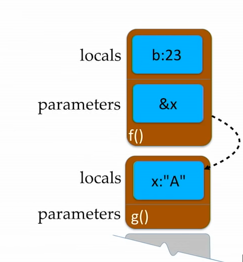

# Random C++ - keep clean and sort

###### Can I check an STL iterator against null?

https://stackoverflow.com/questions/41352941/can-i-check-a-c-iterator-against-null

###### Structured bindings C++17

https://stackoverflow.com/questions/62871344/using-structured-binding-declaration-in-range-based-for-loop

https://en.cppreference.com/w/cpp/language/structured_binding

```C++

/* Easy access to dictionary key value pairs using a stuctured binding*/
for (const auto& [key, value] : m2) {
	std::cout << "key : " << key << " | value: " << value << "\n";
}
```

###### Float value between a and b 

```c++
std::random_device rd;
std::default_random_engine gen(rd());
/* replace with a and b and make a function, also set option for a custom generator */
std::uniform_real_distribution<> distr(0, 1);

for (int n = 0; n < 5; ++n) {
	std::cout << std::setprecision(10) << distr(gen)<< "\n";
}
```

###### String to Integer

https://en.cppreference.com/w/cpp/string/basic_string/stol

```c++
#include <iostream>#include <string> int main(){    std::string str1 = "45";    std::string str2 = "3.14159";    std::string str3 = "31337 with words";    std::string str4 = "words and 2";     int myint1 = std::stoi(str1);    int myint2 = std::stoi(str2);    int myint3 = std::stoi(str3);    // error: 'std::invalid_argument'    // int myint4 = std::stoi(str4);     std::cout << "std::stoi(\"" << str1 << "\") is " << myint1 << '\n';    std::cout << "std::stoi(\"" << str2 << "\") is " << myint2 << '\n';    std::cout << "std::stoi(\"" << str3 << "\") is " << myint3 << '\n';    //std::cout << "std::stoi(\"" << str4 << "\") is " << myint4 << '\n';}
```

###### Simple Variadic template example

```c++
/*variadic template test*/

/* used for when the parameter pack is empty.*/
void print() {
}

/* takes in generic type and generic number of items*/
template<typename T, typename... Types>

/* takes in the first item, then the second item is the parameter pack (...) denoted args*/
void print(T firstarg, Types... args) {
	std::cout << firstarg << "\n";
	/* pass the parameter pack recurisvely to repeat this process to operate on each value*/
	print(args...);
}

int main(){
   /* generic printing is a common application of template metaprogramming*/
   print(1, "fuck", false) // 1, "fuck" ,0 
}
```

###### std::fixed

https://www.cplusplus.com/reference/ios/fixed/

- When floatfield is set to fixed, floating-point values are written using fixed-point notation: the value is represented with exactly as many digits in the decimal part as specified by the *precision field* ([precision](https://www.cplusplus.com/ios_base::precision)) and with no exponent part.

###### Purpose of virtual functions

https://stackoverflow.com/questions/2391679/why-do-we-need-virtual-functions-in-c
what the fuck are youidi

###### Protected vs Private 

https://stackoverflow.com/questions/224966/what-is-the-difference-between-private-and-protected-members-of-c-classes

> Private members are only accessible within the class defining them.
>
> Protected members are accessible in the class that defines them and in classes that inherit from that class.

###### Remove specific item

```c++
std::vector<int> items{ 1,2,3,4 };

/* remove the item at 4 by incrementing the start pointer */
items.erase(items.begin() + 3);
```

###### String comparison

- When comparing two strings $<$ in `std::string` , $a-z$ $\to$ $z$ is determined as **larger**, operator overloaded as default.

```c++
#include <iostream>
template<typename T>
T max_t(T a, T b)
{
    return b < a ? "first string" : "second string";
}
int main() {
    const std::string str1 { "b" };
    const std::string str2 { "a" };
    constexpr auto ret = max_t(str1, str2);
    std::cout << ret << "\n";
}
```

###### Template External

- Must scope using `::` to access templates from a different file, accessing it from the global namespace.
- some standard functions may share the same name and thus this is vital.

###### static_assert

https://en.cppreference.com/w/cpp/language/static_assert

- Stop the program running by asserting some condition is false thus leading to compile time

###### No discard

https://softwareengineering.stackexchange.com/questions/363169/whats-the-reason-for-not-using-c17s-nodiscard-almost-everywhere-in-new-c

- C++17 introduces the `[[nodiscard]]` attribute, which allows programmers to mark functions in a way that the compiler produces a warning if the returned object is discarded by a caller; the same attribute can be added to an entire class type

###### Virtual functions vs pure virtual functions

https://stackoverflow.com/questions/2652198/difference-between-a-virtual-function-and-a-pure-virtual-function

> A virtual function makes its class a *polymorphic base class*. Derived classes can override virtual functions. Virtual functions called through base class pointers/references will be resolved at run-time. That is, the *dynamic type* of the object is used instead of its *static type*

> A pure virtual function implicitly makes the class it is defined for *abstract* (unlike in Java where you have a keyword to explicitly declare the class abstract). Abstract classes **cannot be instantiated**. Derived classes **need to override/implement** all **inherited pure virtual functions**. If they **do not, they too will become abstract**. ends in $=0$.

###### Inline functions

https://stackoverflow.com/questions/1932311/when-to-use-inline-function-and-when-not-to-use-it

> When the compiler inline-expands a function call, the function’s code gets inserted into the caller’s code stream (conceptually similar to what happens with a [`#define` macro](https://isocpp.org/wiki/faq/inline-functions#inline-vs-macros)). This can, [depending on a zillion other things](https://isocpp.org/wiki/faq/inline-functions#inline-and-perf), improve performance, because the optimizer can [procedurally integrate](https://isocpp.org/wiki/faq/inline-functions#procedural-integration) the called code — optimize the called code into the caller.

###### Basic file reading

https://www.cplusplus.com/reference/fstream/ofstream/

```c++
#include <f>
#include <iostream>
#include <cstdlib>

int main(){
    std::ofstream output;
    
    if (!output){
        std::cerr << "error when attempting to open a stream" << "\n";
        exit(1); /* exit from cstdlib */
    }
    
    int num[5] { 1,2,3,4,5 };
    
    for (int i = 0; i < 5; i++){
        output << num[i] << "\n";
    }
    
    output.close();
    
}
```

###### FileStreams

https://www.cplusplus.com/reference/fstream/ofstream/

> Output stream class to operate on files.
>
> Objects of this class maintain a [filebuf](https://www.cplusplus.com/filebuf) object as their *internal stream buffer*, which performs input/output operations on the file they are associated with (if any).
>
> File streams are associated with files either on [construction](https://www.cplusplus.com/ofstream::ofstream), or by calling member [open](https://www.cplusplus.com/ofstream::open).

https://www.cplusplus.com/reference/istream/istream/

> Input stream objects can read and interpret input from sequences of characters. Specific members are provided to perform these input operations (see [functions](https://www.cplusplus.com/istream#functions) below).

###### std::flush

https://en.cppreference.com/w/cpp/io/manip/flush

###### static_cast

>  This is the simplest type of cast which can be used. It is a **compile time cast**. It does things like implicit conversions between types (such as int to float, or pointer to void*), and it can also call explicit conversion functions (or implicit ones).

> https://stackoverflow.com/questions/103512/why-use-static-castintx-instead-of-intx - static_cast<int>(x) vs int(x)

###### Const after end of function

https://stackoverflow.com/questions/3141087/what-is-meant-with-const-at-end-of-function-declaration

###### Shared pointer vs raw pointer.

https://stackoverflow.com/questions/7657718/when-to-use-shared-ptr-and-when-to-use-raw-pointers

###### Make_shared

https://en.cppreference.com/w/cpp/memory/shared_ptr/make_shared

>  Constructs an object of type `T` and wraps it in a [std::shared_ptr](https://en.cppreference.com/w/cpp/memory/shared_ptr) using `args` as the parameter list for the constructor of `T`. The object is constructed as if by the expression ::new (pv) T([std::forward](http://en.cppreference.com/w/cpp/utility/forward)<Args>(args)...), where `pv` is an internal `void*` pointer to storage suitable to hold an object of type `T`. The storage is typically larger than `sizeof(T)` in order to use one allocation for both the control block of the shared pointer and the `T` object. The `std::shared_ptr` constructor called by this function enables `shared_from_this` with a pointer to the newly constructed object of type `T`.

https://stackoverflow.com/questions/20895648/difference-in-make-shared-and-normal-shared-ptr-in-c - read for more interview in

###### cv qualified

https://stackoverflow.com/questions/27527642/what-does-cv-qualified-mean

###### Initialisation

https://en.cppreference.com/w/cpp/language/initialization - cancer reference.

###### std::array vs raw array

https://stackoverflow.com/questions/30263303/stdarray-vs-array-performance

###### references vs pointer use case

https://stackoverflow.com/questions/7058339/when-to-use-references-vs-pointersv

###### Type traits in c++

https://www.internalpointers.com/post/quick-primer-type-traits-modern-cpp

###### Unnamed namespaces uses

https://stackoverflow.com/questions/357404/why-are-unnamed-namespaces-used-and-what-are-their-benefits

###### Volatile keyword

https://stackoverflow.com/questions/4437527/why-do-we-use-volatile-keyword

> declaring a variable volatile means to not optimise the value away as it cannot see the functions that may change this value
>
> ```c++
> int test {100};
> volatile int test {100}; /* does not optimise.*/
> 
> while (test == 100){ /* optimize to while(true) may be undesirable*/
>     ...
> }
> ```
>
> 

###### Copy elision and return value optimisation

- https://www.youtube.com/watch?v=IZbL-RGr_mk

 compiler may generate some code.

 compiler has the ability to elide copies that are not actually required.

 returning a value defined in the calling function stack frame is not defined but rather moved directly into the address



 ```c++
 std::string f(){
     std::string a{"A"}; /* not created on the stack frame as shown above*/
     
     int b{23};
     
     return a; /* "A" is returned here, placed directly into the memory location of x*/
 }
 
 void g(){
     std::string x{f()};/* f() takes &x as argument from where a is directly placed into by compiler optimsaition.*/
 }
 ```


###### Implicit conversions user defined

```c++
class balls {
    operator int(){
        return ...
    }
}

int x = balls() /* runs our implicitly user defined function*/
```

###### std::ref(T) vs T&

https://stackoverflow.com/questions/33240993/c-difference-between-stdreft-and-t

###### Mutable keyword

- Declare an object mutable meaning the object that is const can act on member functions using these values
  - Basically some variables are mutable and can change even if the object they are instantiated within is declare

###### Namespace scope

https://stackoverflow.com/questions/16776293/understanding-namespace-scope-in-c

###### File scope

- Anything defined out of class / functions etc.

###### Extern keyword

> This comes in useful when you have global variables. You declare the *existence* of global variables in a header, so that each source file that includes the header knows about it, but you only need to “define” it once in one of your source files.
>
> To clarify, using `extern int x;` tells the compiler that an object of type `int` called `x` exists *somewhere*. It's not the compilers job to know where it exists, it just needs to know the type and name so it knows how to use it. Once all of the source files have been compiled, the linker will resolve all of the references of `x` to the one definition that it finds in one of the compiled source files. For it to work, the definition of the `x` variable needs to have what's called “external linkage”, which basically means that it needs to be declared outside of a function (at what's usually called “the file scope”) and without the `static` keyword.

- Searches in other files that are only found at linking stage.

```c++
/* header.h */
#ifndef HEADER_H
#define HEADER_H

// any source file that includes this will be able to use "global_x"
extern int global_x;

void print_global_x();

#endif
```

```c++
/* main.cpp */

#include "header.h"

// since global_x still needs to be defined somewhere,
// we define it (for example) in this source file
int global_x;

int main()
{
    //set global_x here:
    global_x = 5;

    print_global_x();
}
```

```c++
/* header.cpp (definition for our header)*/
#include <iostream>
#include "header.h"

void print_global_x()
{
    //print global_x here:
    std::cout << global_x << std::endl;
}
```

- So we define the `extern` variable definition in one of the locations where the header is included and this compiles fine where each file including `header.h` can use the `global_x` without having to define it multiple times.

###### explicit template initialisation. 

https://stackoverflow.com/questions/2351148/explicit-template-instantiation-when-is-it-used

###### Virtual destructors

- Use to call destructor of a derived classed pointed to by the base class type.

###### Virtual tables in  c++

https://www.learncpp.com/cpp-tutorial/the-virtual-table/

> To implement virtual functions, C++ uses a special form of late binding known as the virtual table. The **virtual table** is a lookup table of functions used to resolve function calls in a dynamic/late binding manner. The virtual table sometimes goes by other names, such as “vtable”, “virtual function table”, “virtual method table”, or “dispatch table”.

###### Character traits c++

https://stackoverflow.com/questions/5319770/what-is-the-point-of-stl-character-traits

###### std::bind

https://thispointer.com/stdbind-tutorial-and-usage-details/#:~:text=std%3A%3Abind%20is%20a,passed%20function%20bound%20or%20rearranged.

```c++
void add(int first, int second, const char* string ) {
	
	std::cout << "first: " << first << "| second : " << second << std::endl;
	std::cout << "word :" << string << std::endl;

}
auto func = std::bind(&add, std::placeholders::_1, std::placeholders::_2, "test");

/* can call func, using our default "test" string on each value*/

```

###### istreambuf_iterator vs istream_iterator

https://stackoverflow.com/questions/26824281/the-difference-betwen-istreambuf-iterator-and-istream-iterator

###### Iterator default initial value

```c++
#include <iostream>
#include <iterator>
#include <algorithm>
#include <sstream>
int main()
{
    std::istringstream stream("1 2 3 4 5");
    std::copy(
        std::istream_iterator<int>(stream),
        std::istream_iterator<int>(), /* default constructor just sets to end of the file.*/
        std::ostream_iterator<int>(std::cout, " ")
    );
}
```


###### reference vs pointer use case

https://stackoverflow.com/questions/57483/what-are-the-differences-between-a-pointer-variable-and-a-reference-variable-in

###### inline vs preprocessor

https://stackoverflow.com/questions/1137575/inline-functions-vs-preprocessor-macros

###### std::ranges::generate

```c++
for (auto& arr : datasets) {
		std::ranges::generate(arr, f);

	}

/* fills each value of the container with the f being called at each o*/
```

###### std::variant

- Alternative to runtime polymorphism

```c++
std::variant<int,bool> x; // store two types at once

/* printing options*/

```


###### using vs typedef (function pointers.)

- for function pointers

```c++

typedef  void(*fp)(int); /* fp now alias to this function pointer*/
using fp = void(*)(int) /* fp now alias*/
    
void func(int x){}
fp {&func};
```

###### passing this context to a lambda in a class

- Passing this pointer to session enables the lambda to capture the &(*this) to access class member functions and attributes.

```c++
[this,session](const boost::system::error_code& ec) {
			if (ec.value() != 0) {
				session->m_ec = ec;
				onRequestComplete(session);
				return;
			}
    
 
```

###### std::atomic

https://stackoverflow.com/questions/31978324/what-exactly-is-stdatomic

- Well defined on data races with multiple threads.

###### statics explained

https://stackoverflow.com/questions/25866893/when-to-use-static-variable-c

> This kind of variable can only be seen in a file (will not have name collision with other same variable name in other files)
>
> 1a) class static: (already has an example in the instance count above) A class may have static members, which are visible to that class (accessed only by Class::Var form) only (instead of 'file only' as said above). It will not have name collision with same variable name in other class. It only has one copy per class (not per instance).
>
> 1b) Both global static and class static are global. (since they can be globally accessed, either with class qualifier "Class::" or not.
>
> So, 1a. and 1b. explains static, global, and global static, er, partially, see 2. below
>
> 1. Another form of global variable, is just define a variable without 'static', like it below:
>
>    int numberOfPersons;
>
> Without 'static', this variable can be seen by other file, using 'extern' keyword. And it will have name collision with the same variable in other file. So, globally, you can only define it ONCE across all your source files.
>
> 1. extern: declare a variable/function which is defined in somewhere else. It is normally seen in a header file. As said in 3., you can have some variables defined in other file, and declare this variable as extern, like below, in another source file which uses it. extern int numberOfPersons;
>
>    int addPersonCount() { numberOfPersons++; }

###### standard layout for plain old data c++

https://stackoverflow.com/questions/7160901/why-is-c11s-pod-standard-layout-definition-the-way-it-is

https://www.cplusplus.com/reference/type_traits/is_standard_layout

###### c style array used in templates.

```c++
template<typename T, size_t size>
size_t GetSize(T(&arr)[size])
{
    return size;
}

double arr[] = { 5.0, 6.0, 7.0, 8.0 };
std::cout << GetSize<double>(arr) << std::endl;
```

- templated version using normal c++

```C++
#include <iostream>
#include <array>

template<typename T>
size_t GetSize(T& arr)
}
    return std::size(arr);
}

int main() {
    double arr[] = { 5.0, 6.0, 7.0, 8.0 };
    /* arr > decays to pointer > reference taken in by template */
    std::cout << GetSize(arr) << std::endl;
 
}

```

https://www.nextptr.com/question/a6212599/passing-cplusplus-arrays-to-function-by-reference

```c++
//'array' is a reference to char [5]
char (&array) [5]; 
```

```c++
//Alias of a char[5]
using FiveCharCode = char[5];

//'code' is a char(&)[5]

/* reference to a char[5] identfied as code*/
void Bar(const FiveCharCode& code) {
 for(char c : code) { //range-based-for loop works
  std::cout << c << "\n";
 }
}


int main() {
 char code[5] = {'A','B','C','D','E'};
  //Call Bar
 Bar(code); //No explicit length passed
 return 0;
}
```

- Using generic return type and collection type 

```c++

/* specify collection type and then pass the collection*/
template<typename _Ret,   //Return type
         typename _Coll>   //Collection type
_Ret Sum(const _Coll& c) {

 _Ret sum = 0;
 for(auto& v : c)
    sum += v;
 return sum;
}

int main() {
 //With regular array. Passed as reference
 int arr[] = {1,2,3,4,5};
 std::cout << Sum<int64_t>(arr) << "\n"; //15

 //With vector
 std::vector<int> vec = {1,2,3,4,5};
 std::cout << Sum<int64_t>(vec) << "\n"; //15
 return 0;
}
```

###### init static data members in classes using inline keyword for variables

https://www.tutorialspoint.com/how-do-inline-variables-work-in-cplusplus-cplusplus17

```c++
#include<iostream>
using namespace std;
class MyClass {
   public:
      MyClass() {
         ++num;
      }
      ~MyClass() {
         --num;
      }
      static int num;
};
int MyClass::num = 10;
int main() {
   cout<<"The static value is: " << MyClass::num;
}
```

###### placement new c++

https://stackoverflow.com/questions/222557/what-uses-are-there-for-placement-new

https://www.youtube.com/watch?v=2bsGFQgBMXs - placement new explained as a memory pool calling explicit destructors.

```c++
class Arena {
      public:
             void* allocate(size_t);
              void deallocate(void*);
              // ...
 };

void* operator new(size_t sz, Arena& a){
    return a.allocate(sz);
}

        Arena a1(some arguments);
        Arena a2(some arguments);
```

###### parameters to placement new

https://stackoverflow.com/questions/34800940/parameters-to-operator-new

```c++
void* operator new(std::size_t, /* extra parameters*/){
    /* do something then return a pointer to at least size bytes */
}
```

###### std::vector placement new 


- for some `std::vector<T>` 

###### Passing types to templates


###### Linkage 

- `external` $\to$ share definitions between multiple translation units
  - `extern` keyword. ensure the function is known to be declaration
- `translation unit` $\to$ single compiled object files comprised of `.cpp` and`.h` or any `#includes` 
- `internal` $\to$ local for a single translation unit
- `extern "c"` $\to$ use c header libraries and link them properly without name mangling
  - Where `func()` in c++ actually becomes a symbol `_Z3func` which would cause a  
- `inline` $\to$ compiler expects a definition in this case.
  - https://bit.ly/3qnGlNk - CPP header file rules.
- `inline variables` - https://stackoverflow.com/questions/38043442/how-do-inline-variables-work
  - inline variables define a variable in a header as inline to be used amongst any translation unit

https://www.youtube.com/watch?v=m5Y3Ghv2PUE - extern c 

```c++
/* header.h */

extern int y; /* any file including "header.h" , only one can define the value of y used in other ones*/
inline int x {3}; /* inline header definition ensures anyone including always gets this same value */
extern void func(); /* same as variable just check for a definition.*/
```


###### comma operator return type

```c++
auto func = [&](int x , int y) {return x + 1, y;} /* evalautes x+1 but returns y */
```

https://stackoverflow.com/questions/18198314/what-is-the-override-keyword-in-c-used-for

###### override keyword

https://stackoverflow.com/questions/18198314/what-is-the-override-keyword-in-c-used-for

###### Explicit keyword for member function

> Explicit Keyword in C++ is **used to mark constructors to not implicitly convert types in C++**. It is optional for constructors that take exactly one argument and works on constructors(with single argument) since those are the only constructors that can be used in type casting.

- Use explicit constructors to ensure the type being converted is not implicitly changing into the class type.

###### constinit

- Ensure a variable is initialised at compile time before linking ensuring global variables being used as **external linkage** specifiers specified by `inline` `extern` or `global` are not used before the **corresponding definition** is generated.

```C++
#ifndef Fuck
#define Fuck
class FileSystem {
public:
	[[nodiscard]] static std::size_t numDisks();
};
#endif

inline constinit FileSystem tfs;
```

```c++
class Directory {
public:
	explicit Directory(int);
};

Directory::Directory(int) {
	std::size_t disks = tfs.numDisks(); // guaranteed to b
}
```

###### Types of casting


###### enabled_shared_from_this

https://en.cppreference.com/w/cpp/memory/enable_shared_from_this

###### erase remove idiom

https://en.wikipedia.org/wiki/Erase%E2%80%93remove_idiom

###### inline keyword on templates

https://stackoverflow.com/questions/10535667/does-it-make-any-sense-to-use-inline-keyword-with-templates

###### pimpl idiom

- One file contains the declarations with a **pointer** to the **implementat**

###### std::forward

- perfectly forwards the r value reference, l value reference inside a template.

###### std::unique_ptr vs std::shared_ptr

- when using the pimpl idiom
- unique pointers generate a custom delete when there is no default destructor specified within the class its placed in.

###### Default destructors in header interface

- You cant have this with `unique_ptr` as the context requires a complete type as described in the example below.

https://stackoverflow.com/questions/38242200/where-should-a-default-destructor-c11-style-go-header-or-cpp

```c++
#pragma once
#include <memory>
class B;

class A 
{
private:
  std::unique_ptr<B> my_b;
public:
// ~A() = default; 
// defining the default destructor would fail as 
// class B is still a partial class here
  ~A();
};
```

```c++
#include "A.hpp"

// the previously forward declared class B is now included here
#include "B.hpp"

// we can use the default destructor here as B is
// no longer a partial class
A::~A() = default;  /* the forward declaration is overwritten at this point and thus this is a valid destructor implementation*/
```

###### How bitwise OR represents flags

```c++
BINARY DECIMAL COLOR
------ ------- -----
   001       1  Red
   010       2  Green
   011       3  Red+Green
   100       4  Blue
   101       5  Blue+Red
   110       6  Blue+Green
   111       7  Blue+Green+Red
```

- So `Red` is an integer and so is `Blue` 
- Bitwise OR `|` combines the two 
- Therefore when we bitwise AND `&` check it evaluates true for both `Red` and `Blue` , alternatively as shown above `101` is the value stored from the bitwise OR which is represented in the program.

###### operator->

- overloading this essentially means we return some internal object from which we access its underlying values
- If a pointer is returned we call the underlying operator, if this further calls another -> then we repeat until we reach the end.

```c++
struct A {
    std::string* operator->(){
        return new std::string{"A string"};
    }
}

struct B {
    A operator->(){
        return A();
    }
}

int main(){
    B b;
    b->size();
}
```

###### auto decay

```c++
constexpr int i = 42;
const int& ir = i;
uto a = ir; /* takes away the const and & of ir making it just a normal int*/
```

###### global namespace prepended :: operator

https://stackoverflow.com/questions/4269034/what-is-the-meaning-of-prepended-double-colon

###### alignment

https://stackoverflow.com/questions/17091382/memory-alignment-how-to-use-alignof-alignas

- Alignment is a *restriction* on which *memory positions* some values *first byte* can be stored. 
- Alignment of `16` means the memory addresses that are **multiples** of `16` are the only valid addresses.
- The `alignas` keyword forces alignment to the desired type of powers of `2` only
  - 1,2,4,8,16,32,64,128,....

```c++
#include <cstdlib>
#include <iostream>

int main() {
    alignas(16) int a[4];
    alignas(1024) int b[4]; /* rather than taking up 16 bytes, each one now pads up to 1024 bytes.*/
    printf("%p\n", a);
    printf("%p", b);
}
```

```c++
#include <iostream>

/* the alignment is equal to the largest alignment data member
	every member must now follow this alignment rule and thus short would be padded 2 bytes to fit the 
	4 byte alignment set by int
*/
struct Foo2 /* alignment = 4 bytes, sizeof = 12 bytes for 3 members aligned to 4*/
{
    short a{};/* 2 bytes*/
    		  /*2 padding bytes*/
    int b{}; /* 4 bytes*/
    short qq{}; /*2 bytes*/
    			/**/
};

int main(){
    std::cout << sizeof(short) << std::endl;
    std::cout << sizeof(short) << std::endl;
    std::cout << sizeof(int) << std::endl; 
    // total size of data members individually is 10 but as there must be padding to ensure proper alignment this changes.
    std::cout << sizeof(Foo2) << std::endl; // size is 12
}
```


###### std::begin vs vector::begin

https://stackoverflow.com/questions/26290316/difference-between-vectorbegin-and-stdbegin

###### Returning by reference

- Do not return a reference to non const local static as it is defined in one place and accessed by multiple locations
- assigning /init a normal variable with a returned reference performs a copy

- object returned by reference must exist after the function returns.
- Return by *address* is returning a **pointer** and thus shares similar caveats.
  - Useful for if we wish to **return** a `nullptr`. 

###### Auto rules

- drops const/volatile and reference qualifiers at the top level.
- does not drop pointers
- auto* must refer to a pointer
- const and auto* vs auto argument order matters

```c++
#include <string>

std::string* getPtr(); // some function that returns a pointer

int main()
{
    const auto ptr1{ getPtr() };  // std::string* const
    auto const ptr2 { getPtr() }; // std::string* const

    const auto* ptr3{ getPtr() }; // const std::string*
    auto* const ptr4{ getPtr() }; // std::string* const

    return 0;
}
```

- Can only apply const twice for auto*

```c++
 const auto const ptr7{ getConstPtr() };  // error: const qualifer can not be applied twice
 const auto* const ptr8{ getConstPtr() }; // const std::string* const
```

###### Virtual inheritance

https://www.sandordargo.com/blog/2020/12/23/virtual-inheritance

https://www.scaler.com/topics/virtual-base-class-in-cpp/ 

https://stackoverflow.com/questions/14163924/virtual-keyword-in-inheritance

###### Ignoring virtualization

```c++
#include <iostream>
int main()
{
    Derived derived;
    const Base& base { derived };
    // Calls Base::GetName() instead of the virtualized Derived::GetName()
    std::cout << base.Base::getName() << '\n';

    return 0;
}
```

###### Prevent deletion of derived from base

https://isocpp.github.io/CppCoreGuidelines/CppCoreGuidelines#c127-a-class-with-a-virtual-function-should-have-a-virtual-or-protected-destructor

if deletion through a pointer to base is not intended to be supported, the destructor should be protected and non-virtual; see [C.35](https://isocpp.github.io/CppCoreGuidelines/CppCoreGuidelines#Rc-dtor-virtual).

###### constexpr functions are implicitly inline

> Because constexpr functions may be evaluated at compile-time, the  compiler must be able to see the full definition of the constexpr  function at all points where the function is called.
>
> This means  that a constexpr function called in multiple files needs to have its  definition included into each such file -- which would normally be a  violation of the one-definition rule. To avoid such problems, constexpr  functions are implicitly inline, which makes them exempt from the  one-definition rule.
>
> As a result, constexpr functions are often  defined in header files, so they can be #included into any .cpp file  that requires the full definition.

###### when is a function ran at compile time

> According to the C++ standard, a constexpr function that is eligible for compile-time evaluation *must* be evaluated at compile-time if the return value is used where a  constant expression is required. Otherwise, the compiler is free to  evaluate the function at either compile-time or runtime.

```c++
#include <iostream>

constexpr int greater(int x, int y)
{
    return (x > y ? x : y);
}

int main()
{
    constexpr int g { greater(5, 6) };            // case 1: evaluated at compile-time
    std::cout << g << "is greater!";

    int x{ 5 }; // not constexpr
    std::cout << greater(x, 6) << " is greater!"; // case 2: evaluated at runtime

    std::cout << greater(5, 6) << " is greater!"; // case 3: may be evaluated at either runtime or compile-time

    return 0;
}
```

###### consteval

- Function must be evaluated at compile time, otherwise results in an error.

```c++
#include <iostream>

consteval int greater(int x, int y) // function is now consteval
{
    return (x > y ? x : y);
}

int main()
{
    constexpr int g { greater(5, 6) };            // ok: will evaluate at compile-time
    std::cout << greater(5, 6) << " is greater!"; // ok: will evaluate at compile-time

    int x{ 5 }; // not constexpr
    std::cout << greater(x, 6) << " is greater!"; // error: consteval functions must evaluate at compile-time

    return 0;
}
```

```c++
#include <iostream>

// Uses abbreviated function template (C++20) and `auto` return type to make this function work with any type of value
// See 'related content' box below for more info (you don't need to know how these work to use this function)
consteval auto compileTime(auto value)
{
    return value;
}

constexpr int greater(int x, int y) // function is constexpr
{
    return (x > y ? x : y);
}

int main()
{
    std::cout << greater(5, 6);              // may or may not execute at compile-time
    std::cout << compileTime(greater(5, 6)); // will execute at compile-time

    int x { 5 };
    std::cout << greater(x, 6);              // we can still call the constexpr version at runtime if we wish

    return 0;
}
```

###### abbreviated function templates

```c++
auto max(auto x, auto y)
{
    return (x > y) ? x : y;
}

/* equivalent too*/

template <typename T, typename U>
auto max(T x, U y)
{
    return (x > y) ? x : y;
}
```

###### runtime vs compiler time

https://stackoverflow.com/questions/846103/runtime-vs-compile-time

###### Implicit deletion

- Data members present that do not have a copy constructor defined on then , implicitly delete the copy constructors on the class they are a part of.

###### Function member discussion

- Compiler generates the code for functions at compilation
- If inline is defined, or if the compiler sees it as suitable then it will execute the function as inline code
- Otherwise it calls the function at runtime
- Alternatively use `constexpr` for a runtime compilation

```c++
#include <iostream>
struct A {
    int x;

    A() : x{f()}{}

    static void f(){
        return 1;
    }
};

int main(){
    /* A constructed and its code for the functions are generated , where
    	static member function is not bound to the objects but rather the class scope
    */
    
    /* It is then constructed at runtime calling the generated functions */
    A a;
}
```

###### pass by reference vs pass by address (pointer vs ref in function parameters)

- Pointers may be null
- Pointers do not allow R values as they are non addressable.

http://www.cplusplus.com/articles/z6vU7k9E/

###### returning a const ref to an auto ref  does not drop the const at low level

```c++
#include <string>

const std::string& getRef(); // some function that returns a const reference

int main()
{
    auto& ref3{ getRef() };       // const std::string& (reference reapplied, low-level const not dropped)
    
    return 0;
}
```

###### auto*

```c++
#include <string>

const std::string* const getConstPtr(); // some function that returns a const pointer to a const value

int main()
{
    auto ptr1{ getConstPtr() };  // const std::string* (drops top level const then deduces a const std::string*)
    auto* ptr2{ getConstPtr() }; // const std::string*
    
    /* reapply the const after its dropped as being the top level*/
    auto const ptr3{ getConstPtr() };  // const std::string* const
    const auto ptr4{ getConstPtr() };  // const std::string* const

    
    auto* const ptr5{ getConstPtr() }; // const std::string* const
    
    /* actually useless as this is deduced to const*/
    const auto* ptr6{ getConstPtr() }; // const std::string*

    /* const already deduced */
    const auto const ptr7{ getConstPtr() };  // error: const qualifer can not be applied twice
    
    /* top level dropped but added back , low level const added as documentation*/
    const auto* const ptr8{ getConstPtr() }; // const std::string* const

    return 0;
}
```

###### classes and other types are free from the One definition rule.

- Types declared in a header file can have multiple definitions amongst the files its included in
- They should be the same definitions otherwise its undefined.

###### user defined deduction guides

```c++
template <typename T, typename U>
struct pair
{
    T first{};
    U second{};
};

/* this tells us that when we initialise a pair with some values T,U the type deduced should be pair<T,U>*/
template <typename T, typename U>
pair(T, U) -> pair<T, U>;

int main()
{
    pair<int, int> p1{ 1, 2 }; 
    pair p2{ 1, 2 };     

    return 0;
}
```

###### types of values (pr values, gl values)

https://stackoverflow.com/questions/3601602/what-are-rvalues-lvalues-xvalues-glvalues-and-prvalues


- `glvalue` $\to$ must evaluate to determine its identity
- `prvalue` $\to$ pure r value , initialise an expression to an object whose resources cannot be reused
- `xvalue` $\to$ is a value that has been deduced to. example is a 


###### void_t explanation for SFINAE

https://riptutorial.com/cplusplus/example/3778/void-t#:~:text=C%2B%2B11,facilitate%20writing%20of%20type%20traits.

```C++
template <class T, class=void>
struct has_foo : std::false_type {};

template <class T>
struct has_foo<T, void_t<decltype(std::declval<T&>().foo())>> : std::true_type {};
```

- So basically if we pass some type `T` without a `foo` function defined this will cause a substitution error and fall back on the false type.
- If it does however we do not need to fall back and thus we instantiate the template with true type to indicate this condition is met where void t just takes this type and converts to void.

###### pass by reference to a constructor

https://stackoverflow.com/questions/4321305/best-form-for-constructors-pass-by-value-or-reference

###### aggregate classes

- class / struct with no
  1. user provided / explicit / inherited constructors
  2. no private / protected non static data members
  3. no virtual functions
  4. no virtual,private protected base classes
- Can also be templates

###### forward declarations

https://stackoverflow.com/questions/4757565/what-are-forward-declarations-in-c

https://stackoverflow.com/questions/3110096/what-is-the-purpose-of-forward-declaration

https://stackoverflow.com/questions/553682/when-can-i-use-a-forward-declaration

###### tag dispatching (C++17)

https://www.fluentcpp.com/2018/04/27/tag-dispatching/

###### typename keyword


###### non member vs member functions in operator overloading

https://stackoverflow.com/questions/4421706/what-are-the-basic-rules-and-idioms-for-operator-overloading/4421729#4421729

###### static inline functions

https://stackoverflow.com/questions/10876930/should-one-never-use-static-inline-function

###### uses of static keyword

https://stackoverflow.com/questions/15235526/the-static-keyword-and-its-various-uses-in-c

###### static members of class rules.

```c++
class X {
    
    constexpr int x_e {1};
    const int x_c {3};
    static int x; /* not inline, only a declaration , each file that includes must define*/
    int y; /* constructed by X constructor, static variable is not*/
}

class Y {
    inline static int y {1} /* inline definition enforces ODR rule*/
    static void test(){} /* functions are implicitly inline so definitions are allowed*/
}
```

###### unqualfied namesapce calls

- it will be found because unqualified calls will add the namespace of any class argument to the lookup - thus the name argument-dependent lookup.

```c++
namespace mynamespace {
    class MyClass {};
    void swap(MyClass&, MyClass&);
}
mynamespace::MyClass a, b;
swap(a, b);
```

###### RTTI

https://learn.microsoft.com/en-us/cpp/cpp/run-time-type-information?view=msvc-170

###### data oriented design summary.

https://www.reddit.com/r/C_Programming/comments/j90okg/what_is_data_oriented_programming/

###### mutable lambdas

```c++
#include <iostream>
#include <functional>

void myInvoke(const std::function<void()>& fn)
{
    fn();
}

int main()
{
    int i{ 0 };

    // Increments and prints its local copy of @i.
    auto count{ [i]() mutable {
      std::cout << ++i << '\n';
    } };

    myInvoke(count);
    myInvoke(count);
    myInvoke(count);

    return 0;
}
```

- These enables the actual lambda to be changed

###### virtual functions in constructors

- dont call them as the base class is created then derived so could be unexpected results.

###### Init summary c/c++

```c++
int main() {
    int i; // garbage stored
    printf("%d", i);
}

```

```c++
int i; // static duration therefore defaults to 0

int main() {
    printf("%d", i);
}

```

```c++
struct A {
    int i; // garbage init
};

int main() {
    struct A a;
    printf("%d", a.i);
}

```

```c++
struct A {
    int i;
} const default_A = {0}; // default struct to C.

void init_A(struct A *ptr) {
    ptr->i = 0;
}

int main() {
    /* helper function */
    struct A a1;
    init_A(&a1);

    /* during definition;
     * Initialize each member, in order. 
     * Any other uninitialized members are implicitly
     * initialized as if they had static storage duration. */
    struct A a2 = {0};

    /* Error! (Well, technically) Initializer lists are 'non-empty' */
    /* struct A a3 = {}; */

    /* ...or use designated initializers if C99 or later */
    struct A a4 = {.i = 0};

    /* default value */
    struct A a5 = default_A;
}

```

- C++

```c++
struct A {
    int i; // default init which is garbage.
};

int main() {
    A a; // trivial thus implicit default constructor which does no work
    std::cout << a.i << std::endl;
}
```

```c++
struct A {
    int i;
};

int main() {
    A a = {.i = 0}; // works as of c++20
    A a = {}; // also works as it default init.
    std::cout << a.i << std::endl;
}

```

- Aggregate types is essentially either a simple C style array or struct that looks like a simple C struct in pre c++11
- No access specifiers, no base classes, no user declared constructors, no virtual functions, aggregate type gets aggregate initialized.


- member class type with constructor > called
- class type with no user provided constructor > recursively value init (value init = empty init)
- built in type > zero init.

---


###### implicit constructor vs default constructor

https://stackoverflow.com/questions/12340257/default-vs-implicit-constructor-in-c

###### function pointer syntax

https://cdecl.org/?q=int+%28*B%28A%2Cint%29%29%28int%29


start from inner test, this is the entry function, marked with no params

params version

```c++
int(*(*(*test(bool))())())() // takes bool
```

- this is a pointer to a function called test taking (bool) which returns a function pointer that points to another function pointer that returns int


- spirals outwards
- first define intiail name `test` and select return type then make a pointer

```c++
*test(bool) // function pointer taking a bool as input
void (*(*test(bool)))() // add parentheses around it then add a poonter and another pair of brackets
 //this is now a function pointer retunr a function pointer that takes no inputs and returns void
    
// to extend remove void with another pointer and add another pointer layer placing bracket after return type of the other
    
 int(*(*(*test(bool)))())() 
```

###### string view

- does not own the object its looking at
- does not allocate memory when assigned to a string literal so less memory intensive
- prefer over `const std::string& `

###### vector standard implementation


###### copy / move elision in place construction


- both are the same elided result which skips the copy or move step into the returned value address passed in under the hood 

###### what is a unions purpose

https://stackoverflow.com/questions/2310483/purpose-of-unions-in-c-and-c

###### using declaration vs using directive

https://stackoverflow.com/questions/16152750/using-directive-vs-using-declaration-swap-in-c

###### argument dependent lookup

https://en.cppreference.com/w/cpp/language/adl

https://stackoverflow.com/questions/8111677/what-is-argument-dependent-lookup-aka-adl-or-koenig-lookup

###### default class member init

https://stackoverflow.com/questions/11594846/default-member-values-best-practice

###### prefer default constructor with no member init list

```c++
struct T{
    T() = default;
    int i {};
    bool toggle {false};
};

struct T {
    T() : i{}, toggle{false}{}
    int i;
    bool toggle;
};
```

###### explicit for default constructors with two or more params

https://stackoverflow.com/questions/4467142/why-is-explicit-allowed-for-default-constructors-and-constructors-with-2-or-more

```c++
struct String {
    // this is a non-converting constructor
    explicit String(int initialLength, int capacity);
};

struct Address {
    // converting constructor
    Address(string name, string street, string city);
};

String s = { 10, 15 }; // error!
String s1{10, 15}; // fine

Address a = { "litb", "nerdsway", "frankfurt" }; // fine
```

###### copy list init vs direct list init

https://stackoverflow.com/questions/50422129/differences-between-direct-list-initialization-and-copy-list-initialization

- explicit keyword compile time error as shown above

###### user declared vs user defined vs user provided


https://www.foonathan.net/images/special-member-functions.png

###### implicit compiler declaration charts


###### r value references to arrays in c++

https://stackoverflow.com/questions/22562187/what-is-the-purpose-of-rvalue-reference-to-an-array-in-c11 

###### naming conventions for classes


###### types of scope

https://learn.microsoft.com/en-us/cpp/cpp/scope-visual-cpp?view=msvc-170
