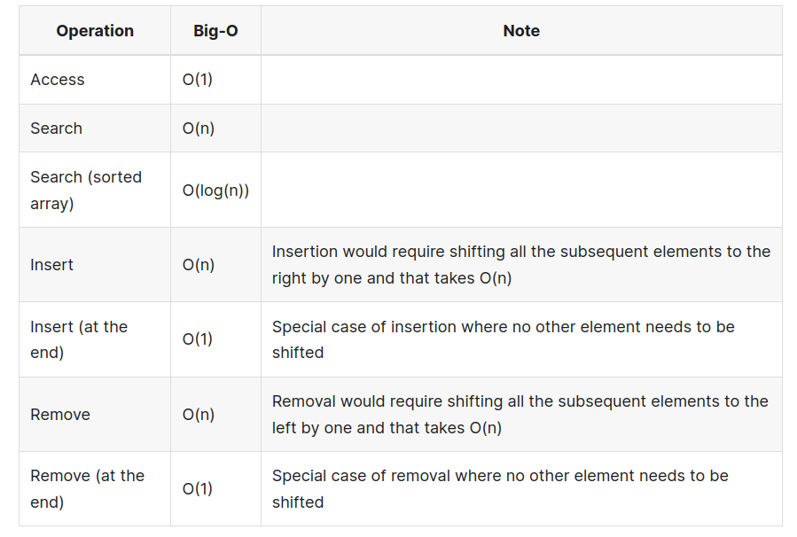
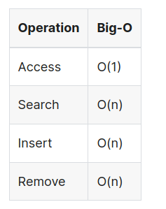
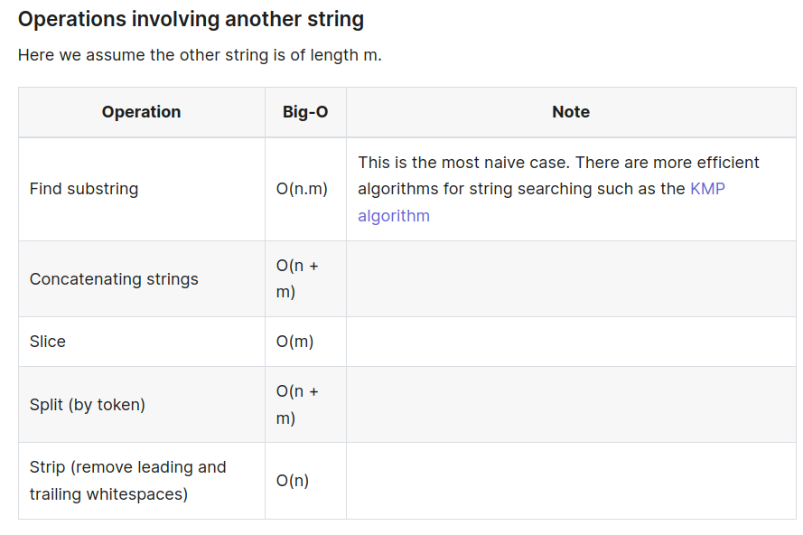
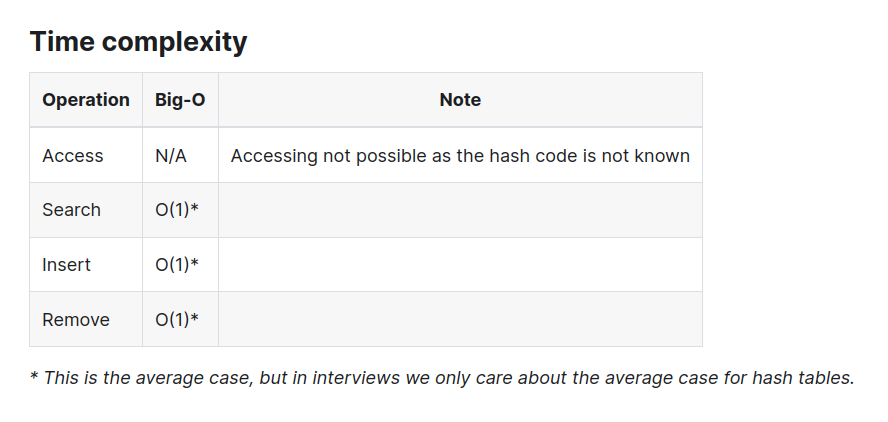

# DSA summary + Coding problem patterns

> Resources
>
> - https://www.techinterviewhandbook.org/algorithms/study-cheatsheet/

### Arrays

> https://www.techinterviewhandbook.org/algorithms/array/
>
> Essential Questions
>
> - [Two Sum](https://leetcode.com/problems/two-sum/)
> - [Best Time to Buy and Sell Stock](https://leetcode.com/problems/best-time-to-buy-and-sell-stock/)
> - [Product of Array Except Self](https://leetcode.com/problems/product-of-array-except-self/)
> - [Maximum Subarray](https://leetcode.com/problems/maximum-subarray/)

- Corner cases 
  - Empty sequence
  - Sequence with 1 or 2 elements
  - Sequence with repeated elements
  - Duplicated values in the sequence
- Subsequence vs Subarray

```cpp
[1,2,4,5,6] , [1,4,6] = subsequence (deleting some / no elements) 
   			  [1,2,4] = subarray (contiguous)
```

- Ask the interviewer
  - Are there duplicates?
  - When using an index to iterate through array elements, do not go out of bounds
  - Consider the time complexity involved in concatenating and slicing arrays in the code.

##### Time complexity



##### Sliding Window

> - [10 line template to solve most substring problems](https://leetcode.com/problems/minimum-window-substring/solutions/26808/here-is-a-10-line-template-that-can-solve-most-substring-problems/)
> - Examples
>   - [Longest substring without repeating characters](https://leetcode.com/problems/longest-substring-without-repeating-characters/description/)
>   - [Minimum size subarray](https://leetcode.com/problems/minimum-size-subarray-sum/)
>   - [Minimum window substring](https://leetcode.com/problems/minimum-window-substring/)

- In a sliding window there are **two pointers** that usually move in the same direction and will **never overtake** each other. 
- This ensures that each value is only visited at most twice and the time complexity is $O(n)$. 

##### Two Pointers

> - Examples
>   - [Sort Colors](https://leetcode.com/problems/sort-colors/description/)
>   - [Palindromic Substrings](https://leetcode.com/problems/palindromic-substrings/)
>   - [Merge Sorted Array](https://leetcode.com/problems/merge-sorted-array/)

- Two points is a *generalised* version of the sliding window where the pointers can cross each other can could be on **different arrays**.
- When you are given two arrays to process, it is common to have one index per array to traverse / compare the both of them.
- We only increment one of the pointers when its relevant. This is applied in the Merge Sorted Array problem.

##### Traversing from the right

> - Examples
>   - [Daily Temperatures](https://leetcode.com/problems/daily-temperatures/)
>   - [Number of Visible People in a Queue](https://leetcode.com/problems/number-of-visible-people-in-a-queue/)

- Sometimes you can traverse an array starting from the right instead of the conventional approach from the left

##### Sorting the array

> - Examples
>
>   - [Merge Intervals](https://leetcode.com/problems/merge-intervals/),
>
>   - [Non-overlapping Intervals](https://leetcode.com/problems/non-overlapping-intervals/)

- Is the array sorted or partially sorted. Use a **binary search** if its sorted, therefore the solution would be faster than $O(n)$.
- Consider sorting the array first to simplify a problem, only if the order of array elements must be preserved.

##### Precomputation

> - Examples
>   - [Product of Array Except Self](https://leetcode.com/problems/product-of-array-except-self/), [Minimum Size Subarray Sum](https://leetcode.com/problems/minimum-size-subarray-sum/)
>   - [LeetCode questions tagged "prefix-sum"](https://leetcode.com/tag/prefix-sum/)

- For questions where summation or multiplication of a subarray is involved. Using pre-computation via **hashing** or a **prefix /suffix (postfix)** **sum/product** may be useful.

##### Index as a hash key

> - Examples
>   - [First Missing Positive](https://leetcode.com/problems/first-missing-positive/)
>   - [Daily Temperatures](https://leetcode.com/problems/daily-temperatures/)

- If you are given a sequence and the interviewer asks for $O(1)$ space complexity we could use the array as a **hash table**.
- If the array only has values from $1$ to $N$, where $N$ is the length of the array
- We would negate the value at that index (minus one) to indicate the presence of that number

##### Traversing the array more than once

- Traversing the array twice / thrice (as long as fewer than $n$ times) is still $O(n)$

- Sometimes this could be necessary. 

### Strings

> https://www.techinterviewhandbook.org/algorithms/string/
>
> Essential questions:
>
> - [Valid Anagram](https://leetcode.com/problems/valid-anagram)
> - [Valid Palindrome](https://leetcode.com/problems/valid-palindrome/)
> - [Longest Substring Without Repeating Characters](https://leetcode.com/problems/longest-substring-without-repeating-characters/)

##### Time complexity 






##### **Counting Characters in Strings:**

- Utilise a **hash table** or **map** to count character frequencies.
- If available, consider using a **built-in Counter class.**
- Remember, the space complexity for a counter is O(1), not O(n), due to the fixed number of Latin characters (26).

##### **String of Unique Characters:**

- Use a 26-bit bitmask to track lowercase Latin characters.
- For common characters in two strings, compare **bitmasks** using the `&` operator. A non-zero result indicates shared characters.

```cpp
mask = 0
for c in word:
  mask |= (1 << (ord(c) - ord('a')))
```

##### **Identifying Anagrams:**

> Examples
>
> - [Group Anagram](https://leetcode.com/problems/group-anagrams/)

- Anagrams are words or phrases formed by rearranging letters without repetition.
- Approaches:
  - Sorting both strings should produce the same resulting string. This takes $O(n \ log(n))$ time and $O(log(n))$ space.
  - If we map each character to a prime number and we multiply each mapped  number together, anagrams should have the same multiple (prime factor  decomposition). This takes $O(n)$ time and $O(1)$ space. Examples: 
  - Frequency counting of characters will help to determine if two strings are anagrams. This also takes O(n) time and $O(1)$ space.

##### **Recognising Palindromes:**

- Palindromes read the same forwards and backwards.
- Methods:
  - Compare the string with its reverse.
  - Use pointers from both ends of the string, moving towards the center, ensuring characters match.
- For palindrome counting:
  - Use two outward-moving pointers from the middle.
  - Consider both even and odd length palindromes.
  - For substrings, stop when characters don’t match.
  - For subsequences, use dynamic programming due to overlapping subproblems.

### Hash table

> Essential Questions
>
> - [Two Sum](https://leetcode.com/problems/two-sum)
> - [Ransom Note](https://leetcode.com/problems/ransom-note)

- **Hash Table Overview**: A hash table, also known as a hash map, is a type of data structure that represents an associative array, allowing mapping of keys to values.
- **Hash Function and Indexing**: It uses a hash function to compute a hash code (index) from an element. This index corresponds to a position in an array of buckets or slots where the desired value can be retrieved.
- **Efficiency in Lookup**: The process involves hashing the key during lookup, with the hash directing to the location of the value. This method is efficient compared to linear searching in an array.
- **Space-Time Tradeoff**: Hashing exemplifies a space-time tradeoff. While linear search takes O(n) time, using a hash table reduces the time complexity to O(1) on average by hashing elements once and checking their existence in the hash table.
- Handling Hash Collisions Collisions occur when different elements hash to the same index.
  -  Several collision resolution techniques exist:
    - **Separate Chaining**: Uses a linked list for each bucket to store all items that hash to the same slot.
    - **Open Addressing**: Stores all entries directly in the bucket array. If a collision occurs, it searches for the next unoccupied slot using a specific probe sequence.
- **Relevance in Interviews**: Detailed knowledge of collision resolution techniques may not typically be required in interviews.

##### Time Complexity



### Recursion

> - [Tail call optmisation](https://stackoverflow.com/questions/310974/what-is-tail-call-optimization)

- **Recursion Defined**: Recursion is a computational technique where a problem is solved by breaking it down into smaller instances of the same problem.

  **Key Components of Recursive Functions**:

  - **Base Case**: Acts as a stopping condition to prevent infinite recursion. It defines the simplest instance of the problem that can be solved directly.
  - **Recursive Call**: The function breaks the problem into smaller subproblems and calls itself with these subproblems.

  **Fibonacci Sequence as an Example**:

  - **Base Cases**: `fib(0) = 0` and `fib(1) = 1` are the simplest forms of the problem.
  - **Recurrence Relation**: `fib(i) = fib(i-1) + fib(i-2)` describes how the function calls itself to break down the problem.

  ```cpp
  def fib(n):
    if n <= 1:
      return n
    return fib(n - 1) + fib(n - 2)
  ```

  **Recursion in Coding Interviews**:

  - **Common Algorithms**: Recursion is a fundamental concept in various algorithms often discussed in coding interviews, such as binary search, merge sort, tree traversal, and depth-first search.
  - **Beyond Known Algorithms**: The article emphasises recursion in problems that are not part of other well-known algorithms, highlighting its broad applicability.

- **Importance of Base Case in Recursion**: Defining a base case is crucial to ensure recursion ends, avoiding infinite loops.
- Recursion for Specific Problems, Particularly useful for:
  - **Permutations**: Recursion efficiently generates all possible combinations, including handling sequences with duplicates.
  - **Tree-based Questions**: Well-suited for problems involving tree structures.
- Implicit Stack Usage, Recursion inherently uses a stack, which means:
  - **Iterative Rewrite Possibility**: Recursive methods can be converted into iterative ones using a stack.
  - **Stack Overflow Risk**: Deep recursion levels can lead to stack overflow (Python's default recursion limit is 1000).
  - **Interview Tip**: Mentioning stack overflow risks can be insightful during interviews.
- Space Complexity Consideration:
  - **Inherent Stack Space**: Recursion is never O(1) space complexity due to stack usage, except when tail-call optimization (TCO) is applicable.
  - **TCO Awareness**: Knowing if the programming language supports TCO is beneficial.
- Determining Number of Base Cases:
  - **Based on Recursive Calls**: The number of base cases should match the deepest level of recursive calls.
  - **Fibonacci Example**: Two base cases (`fib(0)` and `fib(1)`) are needed as the function calls `fib(n-2)`.
  - **Single Recursive Call**: If the function only calls itself as `fn(n-1)`, one base case is sufficient.
