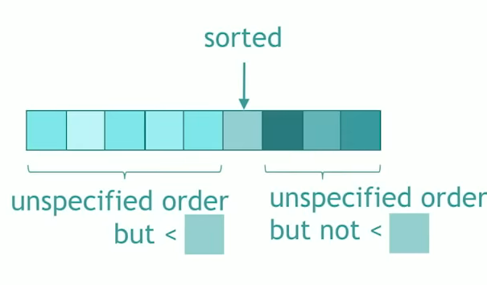
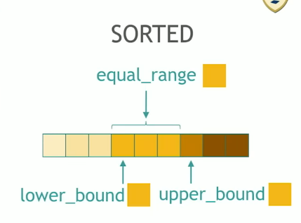
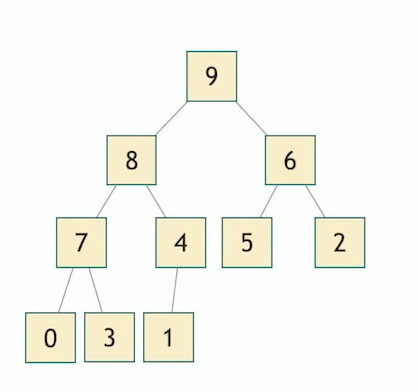

# C++ Algorithms Cheet Sheet

> https://en.cppreference.com/w/cpp/algorithm
>
> Look more into the scanning stuff in C++17
>
> Look into C++23 fold operations
>
> view range operations - https://en.cppreference.com/w/cpp/header/ranges

### Batch Operations

##### `std::for_each + ranges` 

- Applies a function to a range of elements

##### `std::for_each_n + ranges`

- Applies a function object to the first N elements of a sequence

### Search Operations

##### `std::any_of / all_of / none_of + ranges`

- Checks if a predicate is true for all *any* element in the range.
- Checks if a predicate is true for *all* of the elements in the range.
- Checks if a predicate is true for *no* elements in the range.

##### `ranges::contains`

- Check if the range contains the given element.

##### `ranges::contains_subrange`

- Check if the range contains the given subrange.

##### `std::find / find_if / find_if_not + ranges`

- Finds the first element satisfying specific criteria
  - Search for a specific element.
  - Search for a specific element that returns true for a predicate.
  - Search for a specific element that returns false for a predicate.

##### `std::ranges::find_last / find_last_if / find_last_if_not` ==COME BACK==

- Finds the last element in a certain range
  - Search for a specific element
  - Search for a specific element returning true for a predicate
  - Search for a specific element returning false for a predicate

##### `find_end + ranges`

- Finds the last sequence of elements in a certain range.

```cpp
int main(){
   vec<int> v1 {0,1,2,6,7,8,3,4,5,6,7,8,9,10};
   vec<int> v2 {6,7,8};
   auto element = std::ranges::find_end(v1, v2);
   fmt::print("item find end: {}\n", std::distance(std::begin(v1), element)); // 9
}
```

##### `std::find_first_of + ranges`

- searches for any one of a set of elements same as `find_end` but for the first 

```cpp
int main(){
   vec<int> v1 {0,1,2,6,7,8,3,4,5,6,7,8,9,10};
   vec<int> v2 {6,7,8};
   auto element = std::ranges::find_first_of(v1, v2);
   fmt::print("item find end: {}\n", std::distance(std::begin(v1), element)); // 3
}
```

##### `std::adjacent_find + ranges`

- Finds the first two adjacent items that are equal (or satisfy a predicate)

```cpp
int main(){
    vec<int> v1 {1,2,3,3,5};
    auto val = std::ranges::adjacent_find(v1);
    fmt::print("{}", *val); // 3
}
```

##### `std::count / count_if + ranges`

- Return the number of elements satisfying a specific criteria.
  - An element itself.
  - An element itself if it does satisfy a predicate.

##### `std::mismatch + ranges`

- Finds the first position where the two ranges differ. Basically returns two iterators which correspond to the first element of each range that differed.

```cpp
std::string text1 = "Welcome to the underworld!";
std::string text2 = "Welcome to the overworld!";

// *it.first = 'u' and *it.second = 'o'
auto [first, second] = std::ranges::mismatch(text1, text2);
fmt::print("{} | {}", *first, *second); // u | o
```

##### `std::equal + ranges`

- Determines if two sets of elements are the same

```cpp
int main(){
    vec<int> v1 {1,2,3};
    vec<int> v2 {1,2,3};
    if (std::ranges::equal(v1,v2)){
        fmt::print("all elements are the same\n");
    }
}
```

##### `std::search + ranges`

- Searches for a range of elements

```cpp
int main(){
    vec<int> v1 {1,2,3,4,5,6};
    vec<int> v2 {2,3};
    auto subrange = std::ranges::search(v1,v2);
    print_range(subrange); // [2,3]
}
```

##### `std::search_n + ranges`

- Searches for a number of of consecutive copies of an element in an range

```cpp
int main(){
    vec<int> v1 {0,1,1,0,0,0,1,1,1};
    
    // (range, sequence length, element to look for)
    auto subrange = std::ranges::search_n(v1,3, 0);
    print_range(subrange); // [0,0,0]
}
```

##### `std::ranges::starts_with` (C++23)

- Checks whether a range starts with another range

##### `std::ranges::ends_with` (C++23)

### Copy operations

##### `std::copy / copy_if + ranges`

- Copies a range of elements to a new location

```cpp
int main(){
    vec<int> v1 {1,2,3,3,5};
    
    // console: 1 2 3 4 5 
    std::ranges::copy(v1, std::ostream_iterator<int>(std::cout, " ")); // copy all elements of v1 to cout. delimiter of " "
}
```

##### `std::copy_n + ranges`

- Copies a number of elements to a new location

##### `std::copy_backward + ranges`

- Copies a range of elements in backwards order, they are maintained in the order its just the order they are copied in.

```cpp
int main(){
    vec<int> v1 {1,2,3,3,5};
    std::vector<int> v2(v1.size());
    
    // Pass a view to a reverse of v1
    std::ranges::copy_backward(v1, v2.end());
    print_range(v2); // 5,3,3,2,1
}
```

##### `std::move + ranges`

- Same as copy but with move semantics

```cpp
// Example uses threads because you should not copy threads
void f(std::chrono::milliseconds n)
{
    std::this_thread::sleep_for(n);
    std::cout << "thread with n=" << n.count() << "ms ended" << std::endl;
}

int main()
{
    std::vector<std::jthread> v;
    v.emplace_back(f, 400ms);
    v.emplace_back(f, 600ms);
    v.emplace_back(f, 800ms);

    std::list<std::jthread> l;

    // std::ranges::copy() would not compile, because std::jthread is non-copyable
    std::ranges::move(v, std::back_inserter(l));
}
```

##### `std::move_backward + ranges`

- Moves a range of elements to a new location in backwards order

### Swap operations

##### `std::swap` 

- Swaps the values of two objects

```cpp
int main(){
    vec<int> v1 {1,2,3,3,5};
    vec<int> v2 {2,3,4,5,6};
    std::swap(v1,v2);
    print_range(v1); // [2,3,4,5,6]
    print_range(v2); // [1,2,3,3,5]
}
```

##### `std::swap_ranges + ranges` 

- Swaps two ranges of elements
- Note that if the range s

```cpp
int main(){
    vec<int> v1 {1,1,1,1,1};
    vec<int> v2 {0,0,0,0,0};
    std::ranges::swap_ranges(v2,v1);
    print_range(v1); // [0,0,0,0,0]
    print_range(v2); // [1,1,1,1,1]
}

int main(){
    vec<int> v1 {1,1,1,1,1};
    vec<int> v2 {0,0,0,0,0};
    
    // swap the first elements of v1 with v2
    std::swap_ranges(v1.begin() , v1.begin()+3, v2.begin());
    print_range(v1); // [1,1,1,0,0]
    print_range(v2); // [0,0,0,1,1]
}

int main(){
    vec<int> v1 {1,1,1,1,1,1};
    vec<int> v2 {0,0,0,0,0,0};

    // v1[0,2) v2[1,3) , swaps two elements even though our span specifeid 0,4 for v1 takes the min 
    std::ranges::swap_ranges(
            std::views::counted(v1.begin(), 4),
            std::views::counted(v2.begin()+1, 3));


    print_range(v1); // [0,0,1,1,1,1]
    print_range(v2); // [0,1,1,0,0,0]
}
```

##### `std::iter_swap`

- Swaps the elements pointed to by two iterators

### Transformation operations

##### `std::transform + ranges`

> https://en.cppreference.com/w/cpp/algorithm/transform

- Applies a function to a range of elements, storing results in destination range.

##### `std::replace / replace_if + ranges`

- Replaces all values satisfying specific criteria with another value.

```cpp
int main(){
    vec<int> v1 {1,1,1,1,1,1};

    std::ranges::replace(v1, 1, 0);

    print_range(v1); // [0,0,0,0,0,0]
}

int main(){
    vec<int> v1 {1,1,1,1,1,1};

    std::random_device rd;  // Obtain a random number from hardware
    std::mt19937 gen(rd()); // Seed the generator
    std::bernoulli_distribution distrib(0.5); // 0.5 for true and false being equally likely
    std::ranges::replace(v1, 1,0, [&](const auto& x){
        return distrib(gen);
    });
    
    print_range(v1); // random 1 are put to 0.
}
```

##### `std::replace_copy / replace_copy_if + ranges`

- Copies a range, replacing elements satisfying specific criteria with another value

```cpp

int main(){
    vec<int> v1 {1,1,3,1,1,1};
    vec<int> v2 (v1.size());
    
    // first range, start of second range, choice to copy, if copy true what value to replace as
    std::ranges::replace_copy_if(v1, v2.begin(), [](int x){return x == 3;}, 5);
    print_range(v2); // [1,1,5,1,1,1]
}
```

### Generation operations

##### `std::fill + ranges`

- Copy-assigns the given value to every element in a range

```cpp
int main(){
    constexpr auto vec_size = 5;
    vec<int> v2 (vec_size);
    std::ranges::fill(v2, 0);
    print_range(v2); // [0,0,0,0,0]
}
```

##### `std::fill_n + ranges`

- Copy-assigns the given value to N elements in a range

##### `std::generate + ranges`

- Assigns the results of a successive function calls to every element in a range

```cpp
int main(){
    constexpr auto vec_size = 5;
    vec<int> v2 (vec_size);
    std::ranges::generate(v2, [](){return 2+2;} );
    print_range(v2); // [4,4,4,4,4]
}
```

##### `std::generate_n + ranges`

- Assigns the results of a successive function call to every element in the range

### Removing operations

> `std::remove` and related all return a `new_last` iterator which points to the new end. The old end is still accessible but is in an invalid state that.

##### `std::remove \ remove_if + ranges`

> use `std::erase_if` for getting over erase remove idiom

- Removes elements satisfying a specific criteria

##### `std::remove_copy \ remove_copy_if + ranges`

- Copies a range of elements omitting those that specify specific criteria.

##### `std::unique + ranges`

- Removes consecutive duplicates elements in a range.

##### `std::unique_copy + ranges`

- Creates a copy of some range of elements that contains no consecutive duplicates.

### Order-changing operations

##### `std::reverse + ranges`

- Reverse the order of elements in a range

##### `std::reverse_copy + ranges`

- Creates a copy of range that is reversed.

##### `std::rotate + ranges`

- Rotates the order of elements in a range

```cpp
int main(){
    vec<int> v1 {1,2,3,4,5};
    // shift everything 2 places to the left, wrapping around
    std::ranges::rotate(v1, v1.begin() + 2);
    print_range(v1); // [3,4,5,1,2]
}
```

##### `std::rotate_copy + ranges`

- Rotates and copies to a new range.

##### `std::shift_left \ shift_right + ranges`

- Shifts element in a range

```cpp
int main(){
    vec<int> v1 {1,2,3,4,5};
    
    // shifts left by 2 discarding 1,2 
    // it moves the elements down and any elements at the last 2 in this example are now invalidated
    // returns a new_last iterator.
    auto new_last = std::shift_left(v1.begin(), v1.end(), 2);
    fmt::print("{}\n", std::span(v1.begin(), new_last)); // [3,4,5]
    print_range(v1);
}
```

##### `std::shuffle + ranges`

- Reorders the elements in the given range such that each possible permutation of those elements has equal probability of appearance.

```cpp
int main(){
    vec<int> v{1, 2, 3, 4, 5, 6, 7, 8, 9, 10};
    std::random_device rd;
    std::mt19937 g(rd());
    std::ranges::shuffle(v, g);
    print_range(v); // randomly shuffle
}
```

### Sampling operations

##### `std::sample + ranges`

- Selects N random elements from a sequence

### Partitioning operations

##### `std::is_partitioned + ranges` 

> If its partitioned by a predicate, that just means that all elements returning `true` *precede* elements returning false

- Determines if the range is partitioned by the given predicate

##### `std::partition + ranges`

- Divides a range of elements into two groups, does not keep elements in order

```cpp
int main() {
    vec<int> v1{1, 2, 3, 6, 5, 4, 7, 8, 9, 10};

    std::ranges::stable_partition(v1, [](const auto& item){
        return (item % 2 == 0); // even elements
    });

    // all true elements in this case go first.
    fmt::print("partitioned range: {}\n", v1); // even first and odd last but no guaranteed order

    print_range(v1); // [3 random elements from v]
}
```

##### `std::partition_copy + ranges`

- Copies a range dividing the elements into two groups

```cpp
int main(){
    vec<int> v1{1, 2, 3, 4, 5, 6, 7, 8, 9, 10};
    vec<int> true_vec (v1.size());
    vec<int> false_vec (v1.size());

    std::ranges::partition_copy(v1, true_vec.begin(), false_vec.begin(), [](const auto& item){
        return (item == 1);
    });

    fmt::print("true: {} | false: {}", true_vec, false_vec); // true just contains 1 , all else in false
}
```

##### `std::stable_partition + ranges`

- This will perform a partition where all elements in the range `[first , last)` are reordered in a way that some predicate returns true means they precede the elements for which it returns false i.e sort the range into a true and false chunk.
- Difference between partition is relative orders are preserved so... if for below we swap 4 and 6 this will alter order in the first part of the array.

```cpp
int main() {
    vec<int> v1{1, 2, 3, 4, 5, 6, 7, 8, 9, 10};

    std::ranges::stable_partition(v1, [](const auto& item){
        return (item % 2 == 0); // even elements
    });

    // all true elements in this case go first.
    fmt::print("partitioned range: {}\n", v1); // [2,4,6,8,10,1,3,5,7,9]

    print_range(v1); // [3 random elements from v]
}
```

##### `std::partition_point + ranges`

> Examines the partitioned (as if by [std::partition](https://en.cppreference.com/w/cpp/algorithm/partition)) range `[`first`, `last`)` and locates the end of the first partition, that is, the first element that does not satisfy p or last if all elements satisfy p.

- Locates the partition of a partitioned range
- This would just examine a predicate and return an iterator to the first element of the *false* chunk.

```cpp
int main() {
    vec<int> v1{1, 2, 3, 4, 5, 6, 7, 8, 9, 10};
    std::ranges::stable_partition(v1, [](const auto& item){return (item % 2 == 0);});
    auto end_first_part = std::ranges::partition_point(v1,[](const auto& item){return (item % 2 == 0);});
    fmt::print("{}\n", std::span(v1.begin(), end_first_part)); // [2,4,6,8,10]
}
```

### Sorting operations

##### `std::sort + ranges`

- Sort a range into ascending order
- Compare using `operator<` 

##### `std::stable_sort + ranges`

- Sorts a range of elements while preserving order between equal elements

##### `std::partial_sort + ranges`

- Sorts the first N elements of a range

```cpp
int main() {
    vec<int> v1 {5,1,3,2,4};
    
    // sort only the first 3 elements, other elements on the right are unspecified
    std::ranges::partial_sort(v1, v1.begin()+2);
    print_range(v1); // [1,2,4,3,4]
}
```

##### `std::partial_sort_copy + ranges`

- copies and partially sorts a range of elements

##### `std::is_sorted + ranges`

- Checks whether a range is sorted in ascending order

##### `std::is_sorted_until + ranges`

- Finds the largest sorted subrange (bit misleading as it just goes over the specified range and stops when it fails the predicate)

```cpp
int main() {
  
    vec<int> v1 {1,2,3,4,3,2,1};
    
    // order breaks after 4 
    auto it = std::ranges::is_sorted_until(v1);
    fmt::print("{}\n", std::span(v1.begin(), it)); // [1,2,3,4]
}
```

##### `std::nth_element + ranges`



- Partially sorts the given range making sure its partioned by a given element

```cpp
int main() {
    vec<int> v1 {5,1,3,2,4};

    // sort around 3, everything less than 3 on the left vice versa greater on the right 
    // both left and right are 3 are unspecified but guaranteed to be sorted.
    std::ranges::nth_element(v1, v1.begin()+2);
    print_range(v1); // [1,2,3,5,4]
}
```

### Binary Search operations (must be partioned)



##### `std::lower_bound / upper_bound + ranges`

- Returns an iterator to the first element *not less than the given value* (`>=`) a given value.
- Essentially its looking for some value and then we can query the given range of values found (if any) about its lower and upper bounds

```cpp
int main() {
    vec<int> v1 {1,2,3,4,4,4,5};

    // returns the iterator to the first 4 in the sorted subrange of 4's
    auto it = std::ranges::lower_bound(v1, 4);

    // returns a past the end iterator of the sub range of sorted 4's 
    auto it2 = std::ranges::upper_bound(v1, 4);
    fmt::print("item: {}\n", *it2); //5
    
}
```

##### `std::equal_range + ranges`

- Returns a subrange of elements that denote a consecutive sequence of elements that are the same

##### `std::binary_search + ranges`

- Determines if an element exists in a partially-ordered range, returns true or false if so.

### Set operations (must be sorted)

##### `std::includes + ranges`

-  Returns *true* if one sequence is a subsequence of  another.
- A subset in other terms

##### `std::set_union + ranges`

- Computes the union of two sets

##### `std::set_intersection + ranges`

- Computes the intersection of two sets

##### `std::set_difference + ranges`

- Computes the difference between two sets

##### `std::set_symmetric_difference`

- Computes the symmetric difference between two sets (range A + Range B - the intersection of the two.)

### Merge operations

##### `std::merge + ranges`

- Merges two sorted ranges
- Maintains the relative order of elements in each range, if the items are equivalent

```cpp
int main()
{
    vec<int> v1 {10,20,30};
    vec<int> v2 {15,19,20,23};
    vec<int> v3 (v1.size() + v2.size());
    std::ranges::merge(v2, v1, v3.begin());
    print_range(v3); // [10, 15, 19, 20, 20, 23, 30]
}
```

##### `std::inplace_merge + ranges`

- Basically we define subsections of one range as being sorted 
- Then we devise these together into one final sort
- Its basically a component of a merge sort, combining two sorted halves.

```cpp
int main()
{
    std::vector v1 {1,5,3,2,6,4};
    // first sort the 2 subranges so we obtain v1 = [1,3,5,2,4,6]
    std::ranges::sort(std::span(v1.begin(),3));
    std::ranges::sort(std::span(v1.begin()+3, v1.end()));

    /* now we can define our inplace_merge as:
        - Iterator to the start out of vector
        - The middle iterator which is the start of the second range + past the end of the first range
        - End of the second range
    */
    std::ranges::inplace_merge(v1.begin(), v1.begin() + 3, v1.end()); // [1,2,3,4,5,6]
    print_range(v1);
}
```

### Heap Operations

> A heap is a tree data structure where every node must be smaller than its children.
>
> max heap = largest on top, min heap = smallest on top
>
> A heap can be squashed down into a range.
>
> 
>
> - Take the first row = 9
> - Take second row = 8,6
> - Take third row = 7,4,5,2
> - Take fourth row = 0,3,1
> - add those together to one range [9,8,6,7,4,5,2,0,3,1] and thats our heap.
> - **Binary Tree as an Array**: In a heap represented as an array, the binary tree's parent-child relationships are mapped to array indices. For any element at index `i`:
>   - The left child is at index `2*i + 1`.
>   - The right child is at index `2*i + 2`.
>   - The parent is at index `(i-1)/2`.

##### `std::make_heap + ranges`

- Create a **max heap** from a range of elements as described above to satisfy this property.

##### `std::push_heap + ranges`

- When we push to our new heap from **make_heap** we must apply this function on our range to bubble it up to ensure its in the right position as dictated by the heap property.

##### `std::pop_heap + ranges`

- To remove something from a heap.
- The first element is the one we pop always, by swapping it with the last element.
- The last element now must bubble its way down to the bottom again.
- We then remove the follow by calling **pop_back**.
- If we dont pop it we can sort a collection using this method.

##### `std::sort_heap + ranges`

- As mentioned in `std::pop_heap`, repeatedly calls pop_heap until we sort 

##### `std::is_heap_until + ranges`

- Finds the largest subrange that is a max heap

##### `std::is_heap + ranges`

- Checks if a given range is a max heap.

### Lexicographical comparison operations

##### `std::lexicographical_compare + ranges` 

- Returns true if one range is lexicographically less than another

##### `std::lexicographical_compare_three_way`

- Compares two ranges using three way comparison

### Minimum / Maximum operations

##### `std::max + ranges`

- returns the larger of the two values.

##### `std::max_element + ranges`

- returns the largest element of the range

##### `std::min + ranges`

- Returns the smaller of the given values

##### `std::min_element +  ranges`

- Returns the smallest element in the range

##### `std::minmax + ranges`

- returns the smaller and largest of two elements as a pair.

##### `std::minmax_element + ranges`

- returns the smaller and largest elements of a range

##### `std::clamp + ranges`

- Clamps some value between a pair of boundary values

### Numeric operations

##### `std::iota +ranges`

- fills a range with successive increments of the starting value

```cpp 
int main()
{
    vec<int> v1 (8);
    std::ranges::iota(v1,0); // [0,1,2,3,4,5,6,7]
    std::iota(v1.begin(), v1.end(),0);  // [0,1,2,3,4,5,6,7]
    print_range(v1);
}
```

##### `std::accumulate`

- Sums up or folds a range of elements
- I wrote this to accept a range to use instead.

```cpp
template<std::ranges::range Range, typename Init, typename Comp>
auto accumulate_r(Range&& range, Init initial_value, Comp comp){
    return std::accumulate(range.begin(), range.end(),initial_value, comp);
}
```

##### `std::inner_product`

- Dot product basically
- Takes two functors , one acts as the summation and the other the product.

```cpp
int main()
{
    std::vector<int> a {0, 1, 2, 3, 4};
    std::vector<int> b {5, 4, 2, 3, 1};
 
    int r1 = std::inner_product(a.begin(), a.end(), b.begin(), 0);
    std::cout << "Inner product of a and b: " << r1 << '\n';
 
    
    // We define a plus as normal, but the thing we are plussing is the result of equal to of two elements 
    // for example take (0,5) and (1,4) from a and b
    // 0 * 5 + 1 * 4 -> std::equal_to<>(0,5) + std::equal_to<1,4> 
    // std::equal_to simply returns true or false i.e 1 or 0 so summing those up gives us the pairwise matches
    int r2 = std::inner_product(a.begin(), a.end(), b.begin(), 0,
                                std::plus<>(), std::equal_to<>());
    std::cout << "Number of pairwise matches between a and b: " <<  r2 << '\n';
}

Inner product of a and b: 21
Number of pairwise matches between a and b: 2
```

##### `std::adjacent_difference`

- Computes the differences between adjacent elements in a range

```cpp
int main() {
    // basically looks at each item and the item to the left and takes difference
    // so 10 stays as is = 10
    // 20 = 20 -10 = 10
    // 15 = 15 -20 = -5
    // .....
   
    std::vector<int> data = {10, 20, 15, 30, 25};
    std::vector<int> differences(data.size());

    std::adjacent_difference(data.begin(), data.end(), differences.begin());

    for (int diff : differences) {
        std::cout << diff << " ";
    }
    // Output will be: 10 10 -5 15 -5
}
```

##### `std::partial_sum` 

- Computes the partial sum of a range of elements
- Sums up at each result the total result at that point

```cpp
int main()
{
    vec<int> v1 {1,2,3,4};
    vec<int> v2 (v1.size());

    std::partial_sum(v1.begin(), v1.end(), v2.begin());
    print_range(v2); // [1,3,6,10]
}
```

##### `std::reduce`

> https://blog.tartanllama.xyz/accumulate-vs-reduce/

- Performs some reduction operation to a range
- Basically accumulate but out of order.
- Used for parallel programming

```cpp
int main() {
    std::vector<int> numbers = {1, 2, 3, 4, 5};

    int sum = std::reduce(numbers.begin(), numbers.end(), 0, std::plus<>());

    std::cout << "Sum: " << sum << std::endl; // Output: Sum: 15
}
```

##### `std::exclusive_scan`

- Performs a parallel prefix operation
- Excludes the `ith` input element from the `ith` sum.

```cpp
int main() {
    std::vector<int> input = {1, 2, 3, 4};  // Input vector
    std::vector<int> result(input.size());  // Vector to store the result

    // Perform exclusive scan with std::plus (for addition)
    std::exclusive_scan(input.begin(), input.end(), result.begin(), 0);

    // Result of exclusive scan: 0 1 3 6 
    std::cout << "Result of exclusive scan: ";
    for (int n : result) {
        std::cout << n << ' ';
    }

    return 0;
}
```

##### `std::inclusive_scan`

> https://stackoverflow.com/questions/38006107/whats-the-difference-between-stdpartial-sum-and-stdinclusive-scan

- Includes the ith input element from ith sum.
- Basically the same as partial sum.

##### `std::transform_reduce`

- Combines the functionality of `std::transform` and `std::reduce`

```cpp

int main() {
    std::vector<int> input = {1, 2, 3, 4};  // Input vector

    // transform_reduce with a transformation and a reduction operation
    // So we transform each element via square in this case then apply a plus of all results
    // (1 x 1) + (2 x 2) + (3 x 3) + (4 x 4) 
    int result = std::transform_reduce(
        input.begin(), 
        input.end(), 
        0,            // Initial value for the reduction
        std::plus<>(), // Binary operation for reduction (sum)
        [](int x) { return x * x; } // Unary operation for transformation (square)
    );

    // Print the result
    //
    std::cout << "Result of transform_reduce: " << result << std::endl;

    return 0;
}
```

##### `std::transform_exclusive_scan + inclusive`

- Basically same as transform reduce but applies the semantics of exclusive and inclusive scan
