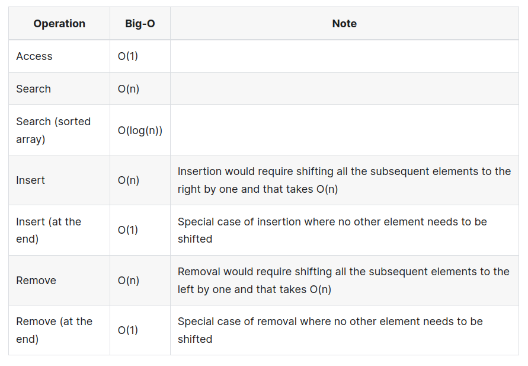

# Coding interview cheatsheet

> To Research
>
> - Array
>
>   - Two Pointers (also in linked lists)  ==IMPORTANT==
>   - Sliding Window  ==IMPORTANT==
>   - Prefix / Post scan
>
> - Strings (related to Array techniques)
>
>   - Trie / Prefix Tree 
>
>   - Suffix Tree 
>
>   - KMP algorithm 
>
>   - Rabin Karp 
>
> - Recursion
>   - Tail call optimisation
>   - Iterative Stack Techniques
>   - Memoization 
>   - Complexity analysis 
> - Matrices
>   - Transpose
>   - Creating an N x M matrix.
> - Linked List
>   - Two pointers
>   - Counting the number of nodes in the linked list
>   - Reversing a linked list in-place ==IMPORTANT==
>   - Finding the middle node of the linked list using **two pointers (fast / slow)**
>   - Merging two linked list together
> - Intervals
>   - General questions on them
>   - [Interval Tree](https://en.wikipedia.org/wiki/Interval_tree)
> - Trees ==IMPORTANT== 
>   - Trie (Suffix tree)
>   - Binary trees 
>   - Binary search trees ==IMPORTANT==
>   - B-trees
>   - Red-Black Trees
>   - AVL tree
>   - in-order, post-order, pre-order traversal ==IMPORTANT==
>   - serialisation of binary trees. ==IMPORTANT==
> - Graphs ==IMPORTANT==
>   - Representations
>   - DFS
>   - BFS
>   - Topological sort
>   - Dijkstras algorithm
>   - Advanced: Bellman ford, floyd warshall, prims algorithm, kruskalls algorithm
> - Complexity Analysis ==IMPORTANT== 
> - Math and Binary
>   - Consider Binary bitwise operations
>   - Consider binary in effectively speeding up math operations
> - Dynamic programming
> - Backtracki
> - Sorting and Searching
>   - Binary Search
>   - Selection Sort
>   - Merge Sort
>   - Bubble Sort
>   - Counting Sort
>   - Radix Sort
>   - Quicksort
>   - Heapsort 
>   - Bucket Sort
>   - https://en.wikipedia.org/wiki/Timsort - python default implementation
>   - https://www.geeksforgeeks.org/dual-pivot-quicksort/ - java default implementation

> Resources
>
> - [Leetcode important patterns](https://hackernoon.com/14-patterns-to-ace-any-coding-interview-question-c5bb3357f6ed)
> - [Leetcode questions by pattern](https://leetcode.com/discuss/career/448285/List-of-questions-sorted-by-common-patterns)
> - [Good DSA summary](https://www.youtube.com/@MichaelSambol/playlists)

### Array

> [Array Summary](https://www.techinterviewhandbook.org/algorithms/array/)
>
> - Essential Questions:
>
>   - [Two Sum](https://leetcode.com/problems/two-sum/)
>
>   - [Best Time to Buy and Sell Stock](https://leetcode.com/problems/best-time-to-buy-and-sell-stock/)
>
>   - [Product of Array Except Self](https://leetcode.com/problems/product-of-array-except-self/)
>
>   - [Maximum Subarray](https://leetcode.com/problems/maximum-subarray/)

- Store multiple elements of **one type** with **one variable name**.
- Accessing elements is fast with its **index** (Contrary to **linked lists** that require traversal).

- **Addition / Removal** in the **middle** is **slow** as we must shift elements. An edge case is **insertion / removal at the end.**
- If an Array is dynamic, adding an element could require reallocation which takes $O(n)$.
- Concatenating / slicing takes $O(n)$.
- Use start and end indices to demarcate a subarray / range where possible.

#### Techniques

##### Sliding Window

- In a sliding window there are **two pointers** that usually move in the same direction and will **never overtake** each other. 
- This ensures that each value is only visited at most twice and the time complexity is $O(n)$. 

##### Two Pointers

- Two points is a *generalised* version of the sliding window where the pointers can cross each other can could be on **different arrays**.
- When you are given two arrays to process, it is common to have one index per array to traverse / compare the both of them.
- We only increment one of the pointers when its relevant. This is applied in the Merge Sorted Array problem.

##### Traversing from the right

- Sometimes you can traverse an array starting from the right instead of the conventional approach from the left

##### Sorting the array

- Is the array sorted or partially sorted. Use a **binary search** if its sorted, therefore the solution would be faster than $O(n)$.
- Consider sorting the array first to simplify a problem, only if the order of array elements must be preserved.

##### Precomputation

- For questions where summation or multiplication of a subarray is involved. Using pre-computation via **hashing** or a **prefix /suffix (postfix)** **sum/product** may be useful.

##### Index as a hash key

- Sequence requiring $O(1)$ space complexity, use the array as a **hash table**.
- If the array only has values from $1$ to $N$, where $N$ is the length of the array. We would negate the value at that index (minus one) to indicate the presence of that number

##### Traversing the array more than once

- Traversing the array twice / thrice (as long as fewer than $n$ times) is still $O(n)$

- Sometimes this could be necessary. 

#### Time Complexity



### Strings

> [String summary](https://www.techinterviewhandbook.org/algorithms/string/)
>
> Essential Questions
>
> - [Valid Anagram](https://leetcode.com/problems/valid-anagram)
> - [Valid Palindrome](https://leetcode.com/problems/valid-palindrome/)
> - [Longest Substring Without Repeating Characters](https://leetcode.com/problems/longest-substring-without-repeating-characters/)

- **Common data structures** for string lookup:
  - [Trie/Prefix Tree](https://en.wikipedia.org/wiki/Trie)
  - [Suffix Tree](https://en.wikipedia.org/wiki/Suffix_tree)

- **Common string algorithms**
  - [Rabin Karp](https://en.wikipedia.org/wiki/Rabin–Karp_algorithm) for efficient searching of substring using a rolling hash
  - [KMP](https://en.wikipedia.org/wiki/Knuth–Morris–Pratt_algorithm) for efficient searching of substring
- Corner cases to consider
  - Empty strings
  - String with 1 or 2 characters
  - Strings with repeated characters.
  - Strings with only distinct characters.


#### Techniques

##### Counting characters

- Count the frequency of characters in a string. We can use a **hash table / map** for this.
- The time complexity of counting is $O(1)$ as there is a *fixed bound* of 26 characters for lowercase latin characters.

##### String of unique characters

- A trick to **count the characters in a string** of unique characters is to use a 26-bit bitmask to indicate which lowercase case latin characters are inside the string.

```python
mask = 0
for c in word:
  mask |= (1 << (ord(c) - ord('a'))) # given a character we minus its position from a and shift this result.

# so if word = abc, it would be 00000...111 (26 - 3 zeros) = 7
```

- To determine if two strings have common characters, perform `&` on the two bitmasks. If this result is **non-zero** then there must be common characters in the two strings.

##### Anagram

- Anagram is where the letters are rearranged to produce a new word / phrase, using **all the letters only once**.
- Generally we only care about words *without spaces* in an interview.
- To **determine if two strings are anagrams**:
  - **Sort both strings** and it should be the same string. This takes $O(n \ \log n)$ time and $O (\log n)$ space.
  - Mapping each character to a **prime number**, then we multiply each mapped number together, anagrams should have the same multiple (prime factor decomposition). This takes $O(n)$ time and $O(1)$ space.
  - **Frequency counting** of characters will help to determine if two strings are anagrams. Takes $O(n)$ time and $O(1)$ space.

##### Palindrome ==Come back to this== 

- A palindrome is a word / phrase that is read the same backwards as forwards such as `racecar` or `madam`.
- **To determine if a string is palindrome**
  - Reverse the string and it should be equal to itself.
  - Have **two pointers** at the start and end of the string. Move the pointers inwards till they meet. At each point in time, the characters at both points should match.
- The *order matters* so we can **not use hash tables**
- When a question is about **counting the number of palindromes**, we can have **two pointers** that *move outward*, away from the middle. 
  - Palindromes may be even / odd length.
  - For each *middle pivot position*, we need to check it twice. Once that includes the character and once without the character.
  - For **substrings**, we can **terminate early** once there is no match (`hel` in `hello`)
  - For **subsequences**, we can use **dynamic programming** as there are **overlapping subproblems**. (`hlo` in `hello`)

#### Time complexity


### Hash table

> - Essential questions
>
>   - [Two Sum](https://leetcode.com/problems/two-sum)
>
>   - [Ransom Note](https://leetcode.com/problems/ransom-note)

- An **associative array** abstract data type, maps keys to values.
- Uses a **hash function** on some element to **compute its index**, also called a **hash code** into an array of buckets or slots, from which the desired value can be found. The key is **hashed**, and the resulting hash indicates where the corresponding value is stored.
- Its a **space-time tradeoff**, rather than linearly searching an array every time to determine if an element is present, which takes $O(n)$ time, we **traverse once**. Determining if an element exists is an $O(1)$ time operation as its just a hash function computation.
- For **hash collisions**
  - **Separate chaining** - A **linked list** is used for each value so that it stores the collided items.
  - **Open addressing** - All entry records are stored in the bucket array itself, when a new entry must be inserted, the buckets are examined, starting with the hashed-to slot and proceeding in some probe sequences, until an unoccupied slot is found.
- **Sample questions**
  - Describe an implementation of a **least used cache**, and the big-O notation of it.
  - A question involving an API's integration with a hash map, where the buckets of a hash map are made of linked lists.

#### Time Complexity


### Recursion

> - Essential questions
>   - [Generate Parentheses](https://leetcode.com/problems/generate-parentheses/)
>   - [Combinations](https://leetcode.com/problems/combinations/)
>   - [Subsets](https://leetcode.com/problems/subsets/)

- Recursion is a method of solving computational problems, where the solution depends on solutions to smaller instances of the same problem.
- Recursive functions contain two parts:
  - **Base case/s** to define when recursion should be stopped
  - Breaking the problem into **smaller subproblems** and invoking the recursive call.
- The most common example is **fibonacci sequence**

```python
def fib(n):
  if n <= 1:
    return n
  return fib(n - 1) + fib(n - 2)
```

- Many algorithms relevant in coding interviews incorporate heavy use of recursion
  - Binary Search
  - Merge Sort
  - Tree Traversal
  - DFS
  - ...
- **Points for interviews**
  - Always define a **base case**.
  - Recursion is effective for creating **permutations**, as it can produce every possible combination. It's also applicable to problems involving **trees**. It's important to learn how to **generate all permutations** of a given sequence, including how to **manage repeated elements**.
  - Recursion implicitly uses a **stack**. Therefore we can iteratively write the recursive technique using a stack.
    - Beware of cases where the recursion level goes too deep and causes a **stack overflow**. ==good to point out==
    - Recursion is never $O(1)$ space complexity as this stack is involved unless we have **tail-call optimisation (TCO)**.
  - The number of base cases in our fibonacci example above. One of recursive calls invoke `fib(n-2)`. This indicates that you should have **2 base cases** defined so that your code covers all possible invocations of the function within the input range. If your recursive function only invokes `fn(n-1)`, then only the base case is needed.
- **Corner cases**
  - `n = 0`
  - `n = 1`
  - Make sure you have enough base cases to cover all possible invocations of the recursive function.

#### Techniques

##### Memoization

- In some cases, you may be computing the result for **previously computed inputs.**
- `fib(5)` calls `fib(4)` and `fib(3)`, and `fib(4)` calls `fib(3)` and `fib(2)` therefore `fib(3)` is being called twice. Therefore we **memoize** the result of `fib(3)` to be used again
- This can greatly improve our efficiency of the algorithm and the time complexity becomes $O(n)$.

### Sorting and Searching

> https://www.techinterviewhandbook.org/algorithms/sorting-searching/
>
> - Essential Questions
>   - [Binary Search](https://leetcode.com/problems/binary-search/)
>   - [Search in Rotated Sorted Array](https://leetcode.com/problems/search-in-rotated-sorted-array/)

- Sorting is where we rearrange elements in a sequence of order. The order is context dependent such as lexicographical / numerical.
- A number of **basic algorithms** run in $O(n^2)$ and **should not be used** in interviews. 
- Its not likely we are implementing the algorithms from scratch, we can use the language implementation of it.
- On a sorted array of elements, we can abuse this fact to gain a search faster than $O(n)$ using **binary search**.
  - Compares the target value with the middle element of the array, informing the algorithm whether the target value lies in the left half or right half
  - This comparison proceeds on the remaining half until the target is found or the remaining half is empty.
- **Things to consider in interviews**
  - Ensure you know the time and space complexity of the languages default sorting algorithm ==IMPORTANT==, likely to be $O(n \log n)$.
    - Good to know the type of sort being used 
- **Corner cases**
  - Empty Sequence
  - Sequence with one element
  - Sequence with two elements
  - Sequence containing duplicate elements.

#### Techniques

##### Sorted inputs

- When some given sequence is in a sorted order (be it ascending or descending), using **binary search** should be one of the first things that come to your mind.

##### Sorting an input that has limited range

> [H-Index](https://leetcode.com/problems/h-index/)

- **Counting sort** is a *non comparison based* sort you can use on numbers where you **know the range of values beforehand**

#### Time complexity


### Matrix

> https://www.techinterviewhandbook.org/algorithms/matrix/
>
> - Essential questions:
>   - [Set Matrix Zeroes](https://leetcode.com/problems/set-matrix-zeroes/)
>   - [Spiral Matrix](https://leetcode.com/problems/spiral-matrix/)

- A matrix is a 2D array.
- A question involving matrices is often related to **dynamic programming** or **graph traversal**.
- Matrices can be used to **represent graphs** where each **node** is a cell on the matrix which has **4 neighbours (except the edge and corners)**.
- We focus here on matrices for graphs.
- **Corner cases**
  - Empty Matrix, Check that none of the arrays are 0 length.
  - $1 \times 1$ matrix.
  - Matrix with a single row or column

#### Techniques

##### Creating an empty $N \times M$ matrix

- For questions involving **traversal** or **dynamic programming**. 
- We often wish to make a **copy** of the **matrix** with the **same size / dimensions** that is *initialised* to empty values to store the visited state or **dynamic programming table**.

```python
# Assumes that the matrix is non-empty
zero_matrix = [[0 for _ in range(len(matrix[0]))] for _ in range(len(matrix))]
```

- Copying a matrix

```cpp
copied_matrix = [row[:] for row in matrix]
```

##### Transposing a matrix

- The transpose of a matrix is found by interchanging its rows into columns or columns into rows.
- Many grid-based games can be modelled as a matrix such as *Tic Tac Toe, Sudoku, crossword*.
- It is common to be asked about **verification** of winning condition of the game.
  - In tic-tac-toe , connect 4 and crosswords the verification is handled vertically / horizontally we can **transpose** the matrix then *reuse* our logic for horizontal verification to verify originally vertical cells (now are horizontals).

```python
transposed_matrix = zip(*matrix)
```

### Linked List

> https://www.techinterviewhandbook.org/algorithms/linked-list/
>
> - Essential questions
>   - [Reverse a Linked List](https://leetcode.com/problems/reverse-linked-list/)
>   - [Detect Cycle in a Linked List](https://leetcode.com/problems/linked-list-cycle/)

- Linked list is used to represent a sequential data.
- It is a linear collection of data elements, whose order is not given by the physical placement in memory, as opposed to arrays, where data is stored in sequential blocks of memory.
- Each element contains an address of the **next element**, it is a data structure consisting of a collection of **nodes** that together represent a sequence. Its most simply represented as a node , each with some **data** and a **reference / pointer / link** to the next element to the next node in the sequence.
- **Insertion** and **deletion** of a node in the list (given its location) is $O(1)$ whereas in arrays the following elements will have to be **shifted**.
- **Access time** is *linear* $O(n)$ because **directly accessing** elements by its position in the **list is not possible** (in arrays you can), we must traverse from the start.

- **Types**
  - **Singly Linked List** - A linked list where each node points to the next node and the last node points to `null`.
  - **Doubly Linked List** - A linked list where each node has two pointers, `next` which points to the next node and `prev` which points to the previous node. The `prev` pointer of the first node and the `next` pointer of the last node points to `null`.
  - **Circular Linked List** - A singly linked list where the **last node** points to the **first node**. There is a **circular doubly linked list variant** where the `prev` pointer of the  pointer of the first node points to the last node and the `next` pointer of the last node points to the first node.
- **Common routines**
  1. Counting the number of nodes in the linked list
  2. Reversing a linked list in-place
  3. Finding the middle node of the linked list using **two pointers (fast / slow)**
  4. Merging two linked list together
- **Corner cases**
  - Empty linked list (head is `null`)
  - Single node
  - Two nodes
  - Linked list has cycles (clarify with the interview if the linked list can have cycles).

#### Techniques

##### Sentinel / dummy nodes

- Adding a sentinel / dummy node at the head and / or tail might help to handle many edge cases where operations have to be performed at the head or the tail.
- The presence of **dummy nodes** ensures that operations are never done on the *head* or *tail*, thus removing any need for **null pointer checks**.

##### Two pointers

- The two pointers approach is used in linked lists for a variety of problems:
  - Getting the $k^{th}$ from the last node
    - We have two pointers, where one is $k$ nodes ahead of the other.
    - When the nodes ahead reaches the end, the other node is $k$ nodes behind.
  - Detecting cycles
    - Have two pointers, where one pointer increments twice as much as the other, if the two pointer meets, means there is a cycle.
  - Getting the middle node
    - Have two pointers
    - One pointer increments twice as much as the other, when the faster node reaches the end of the list, the slower node will be at the middle.

##### Using space (Create another linked list)

- Linked lists problems can be solved often by creating a new linked list and adding nodes to the new linked list with the final result.
- This adds space of course and makes it far less challenging. The interviewer is likely to request you solve it *in-place* without additional storage. Consider ideas from the reverse linked list problem.

##### Elegant modification options

- A linked list is *non sequential* regarding the memory layout, therefore its *efficient* to modify the contents.
- Arrays only allow you to modify the value at a position, but LL allow us to modify the `next` pointer in addition to the `value`.
- Common operations
  - **Truncate a list** - Set `next` to `null` at the last element.
  - **Swapping values of nodes** - Just like arrays, we can just swap the value of the two nodes, we dont need to swap the `next` pointer.
  - **Combining two lists** - Attach the head of the second list to the tail of the first list. 

#### Time Complexity


### Queue

> - Essential questions
>   - [Implement Stack using Queues](https://leetcode.com/problems/implement-stack-using-queues)

- A linear collection of elements that are maintained in a sequence and can be modified by the addition of elements at the end via **enqueue** and removal of elements from the other end **dequeue**.
- The end is often called the **back / tail / rear** of the queue, where elements are added. The front are where elements are remove is the **front / head**.
- Can implement using an array or singly linked lists.
- The behaviour is commonly **FIFO (first in, first out)**. 
- We typically use queues for a **BFS (breadth first search)**.
- **Look out at the interview**
  - Most languages do not have a queue in the standard library.
  - Can use a list / array, but this makes dequeue $O(n)$ as it requires shifting all the elements left by one.
  - We can tell the interviewer that we can *presume* its efficient.
- **Corner cases**
  - Empty queue.
  - Queue with one items.
  - Queue with two items.

#### Time complexity


### Stack

> - Essential questions
>
>   - [Valid Parentheses](https://leetcode.com/problems/valid-parentheses)
>
>   - [Implement Queue using Stacks](https://leetcode.com/problems/implement-queue-using-stacks)

- A stack is an abstract data type that supports **push** (insert element on the top) and **pop** (remove and return the most recently added element, the element at the top of the stack).
- Stacks are abstract, so can be implemented using **arrays , singly linked lists**.
-  Uses **LIFO (last in, first out)**.
- Vital for supporting **nested** or **recursive function calls**. **DFS** achieved via a manual stack or using **recursion**.
- **Corner cases**
  - Empty stack, popping from an empty stack
  - Stack with one item
  - Stack with two items

#### Time complexity

> - Essential questions
>   - [Merge Intervals](https://leetcode.com/problems/merge-intervals/)
>   - [Insert Interval](https://leetcode.com/problems/insert-interval/)


### Interval

> - Essential questions
>   - [Merge Intervals](https://leetcode.com/problems/merge-intervals/)
>   - [Insert Interval](https://leetcode.com/problems/insert-interval/)

- Intervals are a **subset of array questions** where we are given an array of **two element arrays (an *interval*)**. The two values represent a *start* and *end* value.
- Interval questions are part of the array family but they involve some common techniques.

```python
[[1,2], [4,7]] # example interval
```

- Interval questions have a vast number of cases to consider when they overlap.
- **Look out for in interviews**.
  - Clarify with the interviewer whether `[1,2]` and `[2,3]` are considered **overlapping intervals** as this affects how we write the equality checks.
  - Clarify whether an interval of `[a,b]` will strictly follow `a` < `b` (`a` is smaller than `b`).
- **Corner cases**.
  - No intervals
  - Single interval
  - Two intervals
  - Non-overlapping intervals
  - An interval totally consumed with another interval
  - Duplicate intervals (exactly same start and end)
  - Intervals which start right where another interval ends `[[1,2], [2,3]]` 

#### Techniques

##### Sort the array of intervals by its starting point

- A common routine for interval questions is to sort the array of intervals by each intervals starting value.
- This is crucial to solving the *Merge Intervals* question.

##### Checking if two intervals overlap

- Be familiar with writing code to check if two intervals overlap.

```cpp
def is_overlap(a, b):
  return a[0] < b[1] and b[0] < a[1]
```

##### Merging two intervals

```python
def merge_overlapping_intervals(a,b):
    return [min(a[0] , b[0] ) , max( a[1] , b[1] )]
```

### Tree

- A tree is an ADT to represent a **hierarchial structure** with a set of connected **nodes**.
- Each **node** can be connected to **many children**, but must be connected to **one parent** excluding the **root node** which has **no parents**.
- A tree is an **undirected** and **connected acyclic graph** i.e there are **no cycles or loops**.
- Each node is essentially the **root node** of its own subtree, thus reasoning why **recursion** is a technique for **tree traversal**.
- In interviews  you typically are queried on **binary trees** as opposed to **ternary** or **N-ary** trees.
- Tree use cases
  - File systems
  - JSON
  - HTML

- View **Trie** section also.

- **Important terms**
  - **Neighbor** - Parent or child of a node
  - **Ancestor** - A node reachable by traversing its parent chain
  - **Descendant** - A node in the node's subtree
  - **Degree** - Number of children of a node
  - **Degree** of a tree - Maximum degree of nodes in the tree
  - **Distance** - Number of edges along the shortest path between two nodes
  - **Level/Depth/Height** - Number of edges along the unique path between a node and the root node
  - **Width** - Number of nodes in a level
- **Look out for this in interview**
  - Familiar with the pre, post and in order traversals in a **recursive manner**.
  - Extend the recursive traveral to an iterative traversal (using a stack).
- **Corner cases**
  - Empty tree
  - Single node
  - Two nodes
  - Very skewed tree (like a linked list)
- **Common routines**
  - Insert value
  - Delete value
  - Count number of nodes in tree
  - Whether a value is in the tree
  - Calculate height of the tree
  - Binary search tree
    - Determine if it is a binary search tree
    - Get maximum value
    - Get minimum value

#### Types

> - Essential questions
>   - Binary Tree
>     - [Maximum Depth of Binary Tree](https://leetcode.com/problems/maximum-depth-of-binary-tree/)
>     - [Invert/Flip Binary Tree](https://leetcode.com/problems/invert-binary-tree/)
>   - Binary Search Tree
>     - [Lowest Common Ancestor of a Binary Search Tree](https://leetcode.com/problems/lowest-common-ancestor-of-a-binary-search-tree/)

##### Binary Trees

- Nodes in a binary tree always have a maximum of two children
- **Complete binary tree** is a binary tree in which every level except the last, is **completely filled**, and all nodes in the last level are as far left as possible
- **Balanced binary tree** is a binary tree structure where the left and right subtrees of every node differ in height by no more than 1.

- **Traversals:**

  

  

- The **in-order traversal** of a binary tree is insufficient to **uniquely serialise a tree**. You must use **pre-order** or **post-order** traversal.

#####  Binary Search Tree (BST)

- The **in-order traversal** of a BST gives you the elements in the correct order.
- Be familiar with the properties of a BST and validating that a binary tree is a BST.

#### Time complexity (Balanced trees)


- Space complexity of traversing balanced trees is $O(h)$ hwere $h$ is the height of the tree, while traversing very skewed trees (essentially a linked list) is $O(n)$ 

#### Techniques

##### Recursion

- Recursion is the most common approach for traversing trees.
- When you notice that the subtree problem can be used to solve the entire problem, use recursion.
- Always check for the base cases, usually where the node is `null`.
- Sometimes its possible that your recursive function needs to return two values.

##### Traversing by level

- When you are asked to traverse a tree by level, use **BFS (breadth first search)**.

##### Summation of nodes

- If the question involves summation of nodes along the way, be sure to check whether node can be **negative**

### Graph

> Resources
>
> - https://leetcode.com/problems/pacific-atlantic-water-flow/solutions/90774/Python-solution-with-detailed-explanation/
>
> - Essential questions
>   - [Number of Islands](https://leetcode.com/problems/number-of-islands/)
>   - [Flood Fill](https://leetcode.com/problems/flood-fill)
>   - [01 Matrix](https://leetcode.com/problems/01-matrix/)

- A graph is a structure containg a **set of objects (nodes or vertices)** where there can be **edges** between these **nodes / vertices**.
- Edges can be **directed** or **undirected** and *optionally* have **values** in a **weighted graph**.
- Trees are are **undirected graphs** in which any two vertices are connected exactly by **one edge** , there can be **no cycles** in the graph.
- Graphs are used to model **relationship** between unordered entities
  - Friendships.
  - Distances between locations.
- Be familiar with the the **graph representations** and **graph search algorithms** along with the **time and space complexity**.
- **Things to look out for in interviews**
  - A tree-like diagram could be a graph that allows cycles and a naive recursive solution would not work. We must handle cycles and keep a set of **visited nodes** when traversing.
  - Ensure you are **correctly keeping track of visited nodes** and to not visit each node more than once, otherwise your code can do an **infinite loop**.
- **Corner cases**
  - Empty graph
  - Graph with one or two nodes
  - Disconnected graphs
  - Graph with cycles

#### Graph representations

- You can be given a **list of edges** and you have to **build your own graph** from the edges so that you can perform a traversal on them, represent as such:
  - **Adjacency matrix**
  - **Adjacent list**
  - **Hash table of hash tables**
- A **Hash table of hash tables** is a common interview approach that is quite easy, its rare that you would need to use an **adjacency matrix** or **list** for interviews.
- Graphs are commonly given in the input as **2D matrices** where cells are the **nodes** and each cell can traverse to the adjacent cells, so be familiar with **traversing a 2D matrix**. Ensure you are staying in the boundaries.

#### Graph Search Algorithms

- **Common** - BFS, DFS
- **Uncommon** - Topological Sort, Dijkstra's algorithm
- **Almost Never** - Bellman-Ford algorithm, Floyd-Warshall algorithm, Prim's algorithm, Kruskal's algorithm.

##### Depth First Search

- Depth first search is a graph traversal algorithm to explore **as far as possible** along each branch before **backtracking**
- A **stack** is often used to keep track of nodes that are on the current search path, either **impliclity** using **recursion** or an actual stack.

> In this example, DFS could be implemented iteratively as opposed to recursion similar to BFS. The distinction between the algorithms is the data structure, BFS = queue and DFS = stack. Dequeue in python can function as a both a stack and queue.

```python
def dfs(matrix):
  # Check for an empty matrix/graph.
  if not matrix:
    return []

  rows, cols = len(matrix), len(matrix[0])
  visited = set()
  directions = ((0, 1), (0, -1), (1, 0), (-1, 0))

  def traverse(i, j):
    if (i, j) in visited:
      return

    visited.add((i, j))
    # Traverse neighbors.
    for direction in directions:
      next_i, next_j = i + direction[0], j + direction[1]
      if 0 <= next_i < rows and 0 <= next_j < cols:
        # Add in question-specific checks, where relevant.
        traverse(next_i, next_j)

  for i in range(rows):
    for j in range(cols):
      traverse(i, j)
```

##### Breadth First Search

- BFS is a graph traversal algorithm which starts at a node and explores all nodes at that depth before going down a level.
- A **queue** is typically used to keep track of the nodes that were encountered but not yet explored.
- A similar template for doing BFS on the matrix shown below. We use **double ended queues** as dequeing is $O(1)$ but its $O(n)$ for arrays

```python
from collections import deque

def bfs(matrix):
  # Check for an empty matrix/graph.
  if not matrix:
    return []

  rows, cols = len(matrix), len(matrix[0])
  visited = set()
  directions = ((0, 1), (0, -1), (1, 0), (-1, 0))

  def traverse(i, j):
    queue = deque([(i, j)])
    while queue:
      curr_i, curr_j = queue.popleft()
      if (curr_i, curr_j) not in visited:
        visited.add((curr_i, curr_j))
        # Traverse neighbors.
        for direction in directions:
          next_i, next_j = curr_i + direction[0], curr_j + direction[1]
          if 0 <= next_i < rows and 0 <= next_j < cols:
            # Add in question-specific checks, where relevant.
            queue.append((next_i, next_j))

  for i in range(rows):
    for j in range(cols):
      traverse(i, j)
```

##### Topological Sorting

- A topological sort or topological ordering of a **directed graph** is a **linear ordering** of its vertices such that for every directed edge $uv$ from vertex $u$ to vertex $v$, $u$ comes before $v$ in the ordering.
- A Topological sort is essentialy a **graph traversal** in which each node $v$ is visited only after all its dependencies are visited.
- Used for **scheduling a sequence of jobs** which has dependencies on other jobs / tasks. 
  - The jobs are represented by **vertices** and there is an **edge** from $x$ to $y$ if $x$ must be completed before job $y$ can be started.

```python
def graph_topo_sort(num_nodes, edges):
    from collections import deque
    nodes, order, queue = {}, [], deque()
    for node_id in range(num_nodes):
        nodes[node_id] = { 'in': 0, 'out': set() }
    for node_id, pre_id in edges:
        nodes[node_id]['in'] += 1
        nodes[pre_id]['out'].add(node_id)
    for node_id in nodes.keys():
        if nodes[node_id]['in'] == 0:
            queue.append(node_id)
    while len(queue):
        node_id = queue.pop()
        for outgoing_id in nodes[node_id]['out']:
            nodes[outgoing_id]['in'] -= 1
            if nodes[outgoing_id]['in'] == 0:
                queue.append(outgoing_id)
        order.append(node_id)
    return order if len(order) == num_nodes else None

print(graph_topo_sort(4, [[0, 1], [0, 2], [2, 1], [3, 0]]))
# [1, 2, 0, 3]
```

#### Time complexity


### Heap

> - Essential Questions
>
>   - [Merge K Sorted Lists](https://leetcode.com/problems/merge-k-sorted-lists/)
>
>   - [K Closest Points to Origin](https://leetcode.com/problems/k-closest-points-to-origin/)

- A **heap** is a specialised tree-based data structure that is a **complete tree** that satisfies the **heap property**
  - **Max heap** - In a max heap, the value of a node must be  **greatest** among the n**ode values in its entire subtree**. The same property  must be recursively true for all nodes in the tree.
  - **Min heap** -  In a min heap, the value of a node must be **smallest** among the **node  values in its entire subtree.** The same property must be recursively true for all nodes in the tree.
- In the context of algorithm interviews, heaps and priority queues are **treated as the same data structure**.
- A heap is useful when its neccessary to repeatedly **remove the object** with the **highest / lowest priority**, or when insertions need to interspersed with removals of the root node.

#### Techniques

- If you see a **top** or lowest $k$ being mentioned in the question, its often a signal that a heap can be used to solve the problem such as in [Top K Frequent Elements](https://leetcode.com/problems/top-k-frequent-elements/).
- If you require the top $k$ elements then use a **min heap** of size $k$. Iterate over each element, push into the heap. When the heap size **exceeds $k$**, **remove the minimum element** thus guaranteeing we have the $k$ **largest elements**.

#### Time Complexity


### Trie

> - Essential questions
>   - [Implement Trie (Prefix Tree)](https://leetcode.com/problems/implement-trie-prefix-tree)

- A Trie is a **special tree (prefix tree)** that makes searching and storing string more efficient. 
- Practical applications include: Conducting searches and providing autocomplete.
- Be familiar with implementing from scratch, a `Trie` class and its `add`, `remove` and `search` methods.
- **Corner cases**
  - Searching for a string in an empty trie
  - Inserting empty strings into a trie

#### Techniques

- Sometimes preprocessing a dictionary of words (given in a list) into a trie, will improve the efficiency of searching for a word of length k, among n words. Searching becomes $O(k)$ instead of $O(n)$.

#### Time Complexity


### Dynamic Programming

> - Essential Questions
>   - [Climbing Stairs](https://leetcode.com/problems/climbing-stairs/)
>   - [Coin Change](https://leetcode.com/problems/coin-change/)
>   - [House Robber](https://leetcode.com/problems/house-robber/)
>   - [Longest Increasing Subsequence](https://leetcode.com/problems/longest-increasing-subsequence/)
> - Resources
>   - https://dev.to/nikolaotasevic/dynamic-programming--7-steps-to-solve-any-dp-interview-problem-3870

- **Dynamic programming (DP)** is used to solve **optimisation problems**. 

#### Techniques

- Sometimes you do not need to store the whole DP table in memory

### Binary

> - Essential Questions
>   - [Sum of Two Integers](https://leetcode.com/problems/sum-of-two-integers/)
>   - [Number of 1 Bits](https://leetcode.com/problems/number-of-1-bits/)

- Uncommon usage.
- Should understand conversions and bitwise operations
- **Corner cases**
  - Be aware and check for *overflow / underflow*.
  - Negative number

#### Techniques


### Math

- Not much heavy Math involved typically.
- Basic Math is useful to know about.
- **Look out for in interviews**
  - If code involves *division / modulo*, remember to check for division or modulo by 0 case.
  - Check for and handle **overflow / underflow** if you are using a typed language like C++ / Java. Mention that underflow / overflow is possible and ask whether you should handle it.
  - Consider **negative numbers** and **floating point numbers**. This could seem obvious but many cases go unnoticed.
- **Corner cases**
  - Division by 0
  - Multiplication by 1
  - Negative numbers
  - floating point numbers.

#### Common formulas


#### Techniques

##### Multiples of a number

- When a question involves "whether a number is a multiple of X", the **modulo** **operator** would be useful.

##### Comparing floats

- When dealing with floating point numbers, take note of **rounding mistakes**.  Consider using **epsilon comparisons** instead of equality checks. E.g. `abs(x - y) <= 1e-6` instead of `x == y`.

##### Fast operators

- If the question asks you to implement an operator such as **power**, **square  root** or **division** and want it to be **faster than O(n)**, some sort of  doubling (fast exponentiation) or halving (binary search) is usually the approach to go. Examples: [Pow(x, n)](https://leetcode.com/problems/powx-n/), [Sqrt(x)](https://leetcode.com/problems/sqrtx/)
