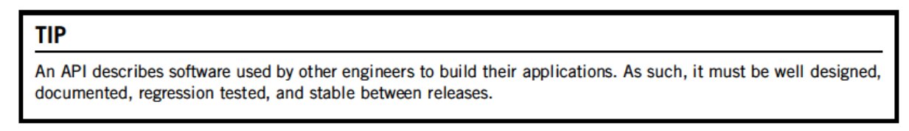

# API Design for C++

### Chapter 1 - Introduction - Skim , dont make notes

- A C++ API is comprised of headers, libraries and documentation at its core.
- API is about providing a logical interface to complete a task whilst hiding the internal details of how it does so.
- API is a UI for programmers, whereas a GUI is a UI for users.
- An error in API propagates massively its it widely depended upon.
- Strive for backwards compatibility when changing an API.
- Making an API is an investment in the long term.

- Reasons to write an API:
  - **Implementation hiding**. Makes it easier to update without affecting users of your API.
  - **Increases longevity.** System that exposes implementation details can tend to devolve to *spaghetti code* where every part of the system depends on the internal details of other parts of the system.
  - **Promotes modularization**. API's typically group functionally in a modular way that maintain some coherent focus. An application built using an API will ideally promote loosely coupled and modular architecture where the modules implementation internals do not depend on another.
  - **Reduces code duplication**. API's typically form as a result of duplicated logic having to be tied under one interface.
  - **Removes hardcoded  assumptions**. An example would be the API providing access to some constant filename that was hard coded into the user base and provide it via a function such as `GetLogFilename()`.
  - **Easier to change the implementation**. We can change the internal implementation and clients code works okay (given the interface headers itself dont change). 
  - **Easier to optimize**. Can optimise without clients knowledge such as adding some caching solution. Caching notably allows us to invalidate easier if its controlled entirely by our API.
- You can write the interface of API before its implementation, this means people can write a program around your placeholder code that will promptly be written. This is hard as you may change the interface. This encourages test driven development / test first development. We can write unit tests for our interface then frequently test as we go along.
- API with different interfaces can be segmented amongst groups to speed up overall development.

- The concept of file formats and networking protocols are conceptually similar to an API. They describe a common language for everyone to use as to ensure ideal interoperability.
  - These formats and protocols implementations are typically hidden as they are standardised. Such as a transport API changing from TCP to UDP.

### Chapter 2 - Qualities ==IMPORTANT CHAPTER==

> Make concise notes
>
> 

### Chapter 3 - Patterns ==IMPORTANT CHAPTER==

> https://biendltb.github.io/book/api-design-for-cpp-martin-reddy-part-2

- Refer to C++ software design also as there is overlap

> 

### Chapter 4 - Design

> 

#### 4.6 Class Design

#### 4.7 Function Design

### Chapter 5 - Styles - Useful brief reading + summarising

> 

### Chapter 6 - C++ Usage ==IMPORTANT CHAPTER==

> 
>
> - ETA to read -> 1-3 days.

#### Namespaces

- Never use the `using` keyword in the global scope of your public API headers. This causes all symbols in the referenced namespace to be visible at the *global namespace scope*.

#### Controlling compiler-generated functions
