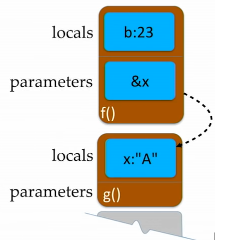
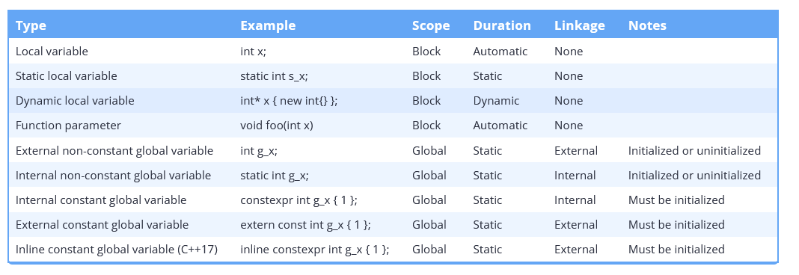
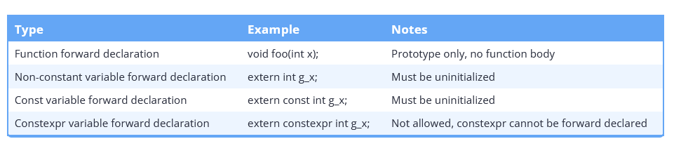
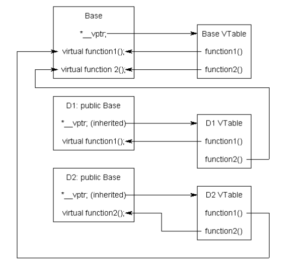

# C++

> Things to Look into more
>
> - Review POD types, class layouts as defined in the [Class section.](#Classes, OOP, ...)
> - Review how type traits are implemented for a variety of examples. Notably review the Cppcon video.

### Basic Concepts

### Move Semantics

### Initialisation

> Initialisation reference - https://en.cppreference.com/w/cpp/language/initialization

##### Summary

##### Copy & Move Elision

> cpp con talk - https://www.youtube.com/watch?v=IZbL-RGr_mk

- Compiler may generate some code. The compiler has the ability to elide copies that are not actually required. 
- Returning a value defined in the calling function stack frame is not defined but rather moved directly into the address.



```cpp
std::string f(){
    std::string a{"A"}; // not created on the stack frame as shown above
    
    int b{23};
    
    return a; // "A" is returned here, placed directly into the memory location of x
}

void g(){
    std::string x{f()}; // f() takes &x as argument from where a is directly placed into by compiler optimsaition.
}
```

##### Misc reminders:

- [Statics initialisation order](https://stackoverflow.com/questions/211237/static-variables-initialisation-order)

### Idioms

> [C++ Idioms](https://en.wikibooks.org/wiki/More_C%2B%2B_Idioms)

##### SFINAE

> [SFINAE](https://en.wikibooks.org/wiki/More_C%2B%2B_Idioms/SFINAE) - wikibooks
>
> [SFINAE Reference](https://en.cppreference.com/w/cpp/language/sfinae) - cppreference

- Substitution failure is not an error.
- This rule applies during overload resolution of function templates: When substituting the explicitly specified or deduced type for the template parameter fails, the specialization is discarded from the overload set instead of causing a compile error. 

##### Pimpl

> [Pimpl Idiom](https://en.wikibooks.org/wiki/C%2B%2B_Programming/Idioms#Pointer_To_Implementation_(pImpl))

- Also called the **opaque pointer** idiom is a method of providing data and thus further implementation abstraction for Classes.

### Operators

- Operator precedence - https://www.learncpp.com/cpp-tutorial/operator-precedence-and-associativity/

##### Operator overloading

##### Misc Reminders

- `->` operator:

  - overloading this essentially means we return some internal object from which we access its underlying values

  - If a pointer is returned we call the underlying operator, if this further calls another `->` then we repeat until we reach the end.

   ```cpp
   struct A {
       std::string* operator->(){
           return new std::string{"A string"};
       }
   }
   
   struct B {
       A operator->(){
           return A();
       }
   }
   
   int main(){
       B b;
       b->size();
   }
   ```

### Bit manipulation (review learncpp)

### Scope, Duration and Linkage

##### Linkage

- **No Linkage**: Identifier refers only to itself.
  - Local variables.
  - Type definitions (e.g., enums, classes) inside a block.
- **Internal Linkage**: Accessible within the file where declared.
  - Static global variables (both initialized and uninitialized).
  - Static functions.
  - Const global variables.
  - Functions in unnamed namespaces.
  - Type definitions (e.g., enums, classes) in unnamed namespaces.
- **External Linkage**: - Accessible in the file where declared and in other files.
  - Functions.
  - Non-const global variables (both initialized and uninitialized).
  - Extern const global variables.
  - Inline const global variables.

##### Duration

- Variables with **automatic duration** are created at the point of definition, and destroyed when the block they are part of is exited. This includes:
  - Local variables
  - Function parameters
- Variables with **static duration** are created when the program begins and destroyed when the program ends. This includes:
  - Global variables
  - Static local variables
- Variables with **dynamic duration** are created and destroyed by programmer request. This includes:
  - Dynamically allocated variables

##### Variable scope, duration, and linkage summary



##### Forward declaration summary



##### Misc reminders

- Global scope = file scope = global namespace scope

- **Extern** 

  - This comes in useful when you have global variables. You declare the *existence* of global variables in a header, so that each source file that includes the header knows about it, but you only need to “define” it once in one of your source files.
  - To clarify, using `extern int x;` tells the compiler that an object of type `int` called `x` exists *somewhere*. It's not the compilers job to know where it exists, it just needs to know the type and name so it knows how to use it. Once all of the source files have been compiled, the linker will resolve all of the references of `x` to the one definition that it finds in one of the compiled source files. For it to work, the definition of the `x` variable needs to have what's called “external linkage”, which basically means that it needs to be declared outside of a function (at what's usually called “the file scope”) and without the `static` keyword.
  - So we define the `extern` variable definition in one of the locations where the header is included and this compiles fine where each file including `header.h` can use the `global_x` without having to define it multiple times.

  ```cpp
  /* header.h */
  #ifndef HEADER_H
  #define HEADER_H
  
  // any source file that includes this will be able to use "global_x"
  extern int global_x;
  
  void print_global_x();
  
  #endif
  ```

  ```cpp
  /* main.cpp */
  
  #include "header.h"
  
  // since global_x still needs to be defined somewhere,
  // we define it (for example) in this source file
  int global_x;
  
  int main()
  {
      //set global_x here:
      global_x = 5;
  
      print_global_x();
  }
  ```

  ```cpp
  /* header.cpp (definition for our header)*/
  #include <iostream>
  #include "header.h"
  
  void print_global_x()
  {
      //print global_x here:
      std::cout << global_x << std::endl;
  }
  ```

- [When to use static variable in C++](https://stackoverflow.com/questions/25866893/when-to-use-static-variable-c)
  - **Global scope statics** -  for internal linkage, to avoid name conflicts between separate translation units
  - **Class scope statics** - internal class usage only, no conflicts between other classes.
  - Both Global and Class scope statics are *global*, given that for the class one you use `Class::`.
  - Another form of global variable , is just define a variable without `static` syntax. This becomes available to other files via the `extern` keyword.
- [Extern C Video](https://www.youtube.com/watch?v=m5Y3Ghv2PUE )
- [How do inline variables work](https://stackoverflow.com/questions/38043442/how-do-inline-variables-work)
  - Define a variable in a header as inline to be used amongst any translation unit, notably it solves the ODR (one definition rule) by its semantics.

### References, Pointers & Memory

##### Misc reminders

- [Differences between references and pointers](https://stackoverflow.com/questions/57483/what-are-the-differences-between-a-pointer-variable-and-a-reference-variable)

- [Shared Pointer vs Raw pointers](https://stackoverflow.com/questions/7657718/when-to-use-shared-ptr-and-when-to-use-raw-pointers)
- [Make Shared](https://en.cppreference.com/w/cpp/memory/shared_ptr/make_shared)
  - [Make Shared vs Normal shared](https://stackoverflow.com/questions/20895648/difference-in-make-shared-and-normal-shared-ptr-in-c)

- [References vs Pointers](https://stackoverflow.com/questions/7058339/when-to-use-references-vs-pointersv)

- [std:ref(T) vs T&](https://stackoverflow.com/questions/33240993/c-difference-between-stdreft-and-t)

### Classes, OOP, ...

##### Core

```cpp
class T {                   // A new type
private:                    // Section accessible only to T's member functions
protected:                  // Also accessible to classes derived from T
public:                     // Accessible to all
    int x;                  // Member data
    void f();               // Member function
    void g() {return;}      // Inline member function
    void h() const;         // Does not modify any data members
    int operator+(int y);   // t+y means t.operator+(y)
    int operator-();        // -t means t.operator-()
    T(): x(1) {}            // Constructor with initialization list
    T(const T& t): x(t.x) {}// Copy constructor
    T(T&& t): x(t.x){ t.x = nullptr; } // Move constructor
    T& operator=(T&& t) {
        
        if (&t == this){
            return *th
        }
        
        x = t.x;
        t.x = nullptr;
    }
    T& operator=(const T& t)
    {x=t.x; return *this; } // Assignment operator
    ~T();                   // Destructor (automatic cleanup routine)
    explicit T(int a);      // Allow t=T(3) but not t=3
    T(float x): T((int)x) {}// Delegate constructor to T(int)
    operator int() const
    {return x;}             // Allows int(t)
    friend void i();        // Global function i() has private access
    friend class U;         // Members of class U have private access
    static int y;           // Data shared by all T objects
    static void l();        // Shared code.  May access y but not x
    class Z {};             // Nested class T::Z
    typedef int V;          // T::V means int
};
void T::f() {               // Code for member function f of class T
    this->x = x;}           // this is address of self (means x=x;)
int T::y = 2;               // Initialization of static member (required)
T::l();                     // Call to static member
T t;                        // Create object t implicit call constructor
t.f();                      // Call method f on object t

struct T {                  // Equivalent to: class T { public:
  virtual void i();         // May be overridden at run time by derived class
  virtual void g()=0; };    // Must be overridden (pure virtual)
class U: public T {         // Derived class U inherits all members of base T
  public:
  void g(int) override; };  // Override method g
class V: private T {};      // Inherited members of T become private
class W: public T, public U {};
                            // Multiple inheritance
class X: public virtual T {};
                            // Classes derived from X have base T directly
```

##### Misc reminders

- **Virtual destructors** - Use to call destructor of a derived classed pointed to by the base class type.

- [**Virtual tables**](https://www.learncpp.com/cpp-tutorial/the-virtual-table/) - To implement virtual functions, C++ uses a special form of late binding known as the virtual table. The **virtual table** is a lookup table of functions used to resolve function calls in a  dynamic/late binding manner. The virtual table sometimes goes by other  names, such as *vtable*, *virtual function table*, *virtual method* table, or *dispatch table*.

  

- [**Purpose of virtual functions**](https://stackoverflow.com/questions/2391679/why-do-we-need-virtual-functions-in-c)

- [Virtual functions vs pure virtual functions](https://stackoverflow.com/questions/2652198/difference-between-a-virtual-function-and-a-pure-virtual-function)

  > A virtual function makes its class a *polymorphic base class*. Derived classes can override virtual functions. Virtual functions  called through base class pointers/references will be resolved at  run-time. That is, the *dynamic type* of the object is used instead of its *static type*

  > A pure virtual function implicitly makes the class it is defined for *abstract* (unlike in Java where you have a keyword to explicitly declare the class abstract). Abstract classes **cannot be instantiated**. Derived classes **need to override/implement** all **inherited pure virtual functions**. If they **do not, they too will become abstract**. ends in `=0`
  
- [Protected vs Private](https://stackoverflow.com/questions/224966/what-is-the-difference-between-private-and-protected-members-of-c-classes)

- **Implicit conversions**

  ```cpp
  class balls {
      operator int(){
          return ...
      }
  }
  
  int x = balls() /* runs our implicitly user defined function*/
  ```

- **Mutable keyword** - permits modificationof the class member declared mutable even if the containing object is declared const (i.e., the class member is mutable)

  - Declare an object mutable meaning the object that is const can act on member functions using these values
    - Basically some variables are mutable and can change even if the object they are instantiated within is declare

  ```cpp
  class X
  {
      mutable const int* p; // OK
      mutable int* const q; // ill-formed
      mutable int&       r; // ill-formed
  };
  ```

- Passing this context to a lambda within  a class:
  - This gives the lambda access to the values of the class directly without having t

```cpp
[this,session](const boost::system::error_code& ec) {
			if (ec.value() != 0) {
				session->m_ec = ec;
				onRequestComplete(session);
				return;
			}
```

- [C++11 POD Standard layout definition](https://stackoverflow.com/questions/7160901/why-is-c11s-pod-standard-layout-definition-the-way-it-is)

  - A standard-layout class is a class that - https://en.cppreference.com/w/cpp/language/classes#Standard-layout_class:

  > 1. has no non-static data members of type non-standard-layout class (or array of such types) or reference,
  >
  > 2. has no virtual functions (10.3) and no virtual base classes (10.1),
  >
  > 3. has the **same access control** (Clause 11) for all non-static data members,
  >
  > 4. has no non-standard-layout base classes,
  >
  > 5. either has no non-static data members in the most derived class and **at most one base class with non-static data members**, or has no base classes with non-static data members, and
  >
  > 6. has no base classes of the **same type as the first non-static data member**.

- [C++ non-standard-layout class layouts](https://quuxplusone.github.io/blog/2022/03/04/non-standard-layout-guarantees/)

  - You can cast a *standard layout class object*  address to a pointer of its first member:

    ```cpp
    struct A {int x;};
    
    A a;
    
    int *px = (int*) &a;
    
    A *pa = (A*)px;
    
    ```

- Do not call virtual functions within destructors, as the base class is created then derived therefore unexpected results could arise.

### Unions

##### Misc reminders

- [What is a union for in C and C++](https://stackoverflow.com/questions/2310483/purpose-of-unions-in-c-and-c)

### Namespaces

```cpp
namespace N {class T {};}   // Hide name T
N::T t;                     // Use name T in namespace N
using namespace N;          // Make T visible without N::
```

##### Misc reminders:

- [Unnamed namespaces](https://stackoverflow.com/questions/357404/why-are-unnamed-namespaces-used-and-what-are-their-benefits)
- [Namespace scope](https://stackoverflow.com/questions/16776293/understanding-namespace-scope-in-c)
- **Global namespace** - The top level namespace, accessed via just using the prepended :: operator - https://stackoverflow.com/questions/4269034/what-is-the-meaning-of-prepended-double-colon.

### Types & Declarations

```cpp
int x;                      // Declare x to be an integer (value undefined)
int x=255;                  // Declare and initialize x to 255
short s; long l;            // Usually 16 or 32 bit integer (int may be either)
char c='a';                 // Usually 8 bit character
unsigned char u=255;
signed char s=-1;           // char might be either
unsigned long x =
  0xffffffffL;              // short, int, long are signed
float f; double d;          // Single or double precision real (never unsigned)
bool b = true;                // true or false, may also use int (1 or 0)
int a, b, c;                // Multiple declarations
int a[10];                  // Array of 10 ints (a[0] through a[9])
int a[]={0,1,2};            // Initialized array (or a[3]={0,1,2}; )
int a[2][2]={{1,2},{4,5}};  // Array of array of ints
char s[]="hello";           // String (6 elements including '\0')
std::string s = "Hello"     // Creates string object with value "Hello"
std::string s = R"(Hello World)"; // Creates string object with value "Hello\nWorld"
int* p;                     // p is a pointer to (address of) int
char* s="hello";            // s points to unnamed array containing "hello"
void* p=nullptr;            // Address of untyped memory (nullptr is 0)
int& r=x;                   // r is a reference to (alias of) int x
enum weekend {SAT,SUN};     // weekend is a type with values SAT and SUN
enum weekend day;           // day is a variable of type weekend
enum weekend{SAT=0,SUN=1};  // Explicit representation as int
enum {SAT,SUN} day;         // Anonymous enum
enum class Color {Red,Blue};// Color is a strict type with values Red and Blue
Color x = Color::Red;       // Assign Color x to red
typedef String char*;       // String s; means char* s;
const int c=3;              // Constants must be initialized, cannot assign to
const int* p=a;             // Contents of p (elements of a) are constant
int* const p=a;             // p (but not contents) are constant
const int* const p=a;       // Both p and its contents are constant
const int& cr=x;            // cr cannot be assigned to change x
int8_t,uint8_t,int16_t,
uint16_t,int32_t,uint32_t,
int64_t,uint64_t            // Fixed length standard types
auto it = m.begin();        // Declares it to the result of m.begin()
auto const param = config["param"];
                            // Declares it to the const result
auto& s = singleton::instance();
                            // Declares it to a reference of the result
volatile int x = 5; // x may be changed somewhere else, prevent compiler optimizations.
```

##### Misc reminders

- [What are cv qualifiers in C++](https://stackoverflow.com/questions/27527642/what-does-cv-qualified-mean)
- [Volatile keyword](https://stackoverflow.com/questions/4437527/why-do-we-use-volatile-keyword)

```cpp
int test {100};
volatile int test {100}; /* does not optimise.*/

while (test == 100){ /* optimize to while(true) may be undesirable*/
 ...
}
```

- `Using` vs `Typedef` in the context of function pointers.

```cpp
typedef  void(*fp)(int); /* fp now alias to this function pointer*/
using fp = void(*)(int) /* fp now alias*/
    
void func(int x){}
fp {&func};
```

- [RTTI](https://en.cppreference.com/w/cpp/types) + [Microsoft MSVC RTTI](https://learn.microsoft.com/en-us/cpp/cpp/run-time-type-information?view=msvc-170)

### Expressions

```cpp
T::X                        // Name X defined in class T
N::X                        // Name X defined in namespace N
::X                         // Global name X

t.x                         // Member x of struct or class t
p-> x                       // Member x of struct or class pointed to by p
a[i]                        // i'th element of array a
f(x,y)                      // Call to function f with arguments x and y
T(x,y)                      // Object of class T initialized with x and y
x++                         // Add 1 to x, evaluates to original x (postfix)
x--                         // Subtract 1 from x, evaluates to original x
typeid(x)                   // Type of x
typeid(T)                   // Equals typeid(x) if x is a T
dynamic_cast<T>(x)         // Converts x to a T, checked at run time.
static_cast<T>(x)          // Converts x to a T, not checked
reinterpret_cast<T>(x)     // Interpret bits of x as a T
const_cast<T>(x)           // Converts x to same type T but not const

sizeof x                    // Number of bytes used to represent object x
sizeof(T)                   // Number of bytes to represent type T
++x                         // Add 1 to x, evaluates to new value (prefix)
--x                         // Subtract 1 from x, evaluates to new value
~x                          // Bitwise complement of x
!x                          // true if x is 0, else false (1 or 0 in C)
-x                          // Unary minus
+x                          // Unary plus (default)
&x                          // Address of x
*p                          // Contents of address p (*&x equals x)
new T                       // Address of newly allocated T object
new T(x, y)                 // Address of a T initialized with x, y
new T[x]                    // Address of allocated n-element array of T
delete p                    // Destroy and free object at address p
delete[] p                  // Destroy and free array of objects at p
(T) x                       // Convert x to T (obsolete, use .._cast<T>(x))

x * y                       // Multiply
x / y                       // Divide (integers round toward 0)
x % y                       // Modulo (result has sign of x)

x + y                       // Add, or \&x[y]
x - y                       // Subtract, or number of elements from *x to *y
x << y                      // x shifted y bits to left (x * pow(2, y))
x >> y                      // x shifted y bits to right (x / pow(2, y))

x < y                       // Less than
x <= y                      // Less than or equal to
x > y                       // Greater than
x >= y                      // Greater than or equal to

x & y                       // Bitwise and (3 & 6 is 2)
x ^ y                       // Bitwise exclusive or (3 ^ 6 is 5)
x | y                       // Bitwise or (3 | 6 is 7)
x && y                      // x and then y (evaluates y only if x (not 0))
x || y                      // x or else y (evaluates y only if x is false (0))
x = y                       // Assign y to x, returns new value of x
x += y                      // x = x + y, also -= *= /= <<= >>= &= |= ^=
x ? y : z                   // y if x is true (nonzero), else z
throw x                     // Throw exception, aborts if not caught
x , y                       // evaluates x and y, returns y (seldom used)
```

##### Value Categories

##### Misc reminders

- **Static cast** - This is the simplest type of cast which can be used. It is a **compile time cast**. It does things like implicit conversions between types (such as int to float, or pointer to void*), and it can also call explicit conversion functions (or implicit ones).
  - `static_cast<int>(x) vs int(x)`-  (https://stackoverflow.com/questions/103512/why-use-static-castintx-instead-of-intx)

### Functions

```cpp
int f(int x, int y);        // f is a function taking 2 ints and returning int
void f();                   // f is a procedure taking no arguments
void f(int a=0);            // f() is equivalent to f(0)
f();                        // Default return type is int
inline f();                 // Optimize for speed
f() { statements; }         // Function definition (must be global)
T operator+(T x, T y);      // a+b (if type T) calls operator+(a, b)
T operator-(T x);           // -a calls function operator-(a)
T operator++(int);          // postfix ++ or -- (parameter ignored)
extern "C" {void f();}      // f() was compiled in C
```

##### Misc reminders

- [When to use inline functions](https://stackoverflow.com/questions/1932311/when-to-use-inline-function-and-when-not-to-use-it)
  - When the compiler inline-expands a function call, the function’s code gets inserted into the caller’s code stream (conceptually similar to what happens with a [`#define` macro](https://isocpp.org/wiki/faq/inline-functions#inline-vs-macros)). This can, [depending on a zillion other things](https://isocpp.org/wiki/faq/inline-functions#inline-and-perf), improve performance, because the optimizer can [procedurally integrate](https://isocpp.org/wiki/faq/inline-functions#procedural-integration) the called code — optimize the called code into the caller.
- Overload Resolution - https://en.cppreference.com/w/cpp/language/overload_resolution
  - [Argument dependent lookup (ADL)](https://en.cppreference.com/w/cpp/language/adl)
  - [What exactly is ADL](https://stackoverflow.com/questions/8111677/what-is-argument-dependent-lookup-aka-adl-or-koenig-lookup)
- [`inline` functions vs preprocessor macros](https://stackoverflow.com/questions/1137575/inline-functions-vs-preprocessor-macros)
- `std::bind` - [What is std::bind in C++](https://thispointer.com/stdbind-tutorial-and-usage-details/#:~:text=std%3A%3Abind%20is%20a,passed%20function%20bound%20or%20rearranged)

```cpp
void add(int first, int second, const char* string ) {
	
	std::cout << "first: " << first << "| second : " << second << std::endl;
	std::cout << "word :" << string << std::endl;

}
auto func = std::bind(&add, std::placeholders::_1, std::placeholders::_2, "test");

/* can call func, using our default "test" string on each value*/
```

### Arrays (std::array & C style arrays)

##### Misc reminders

- [Raw C arrays vs std::array performance](https://stackoverflow.com/questions/30263303/stdarray-vs-array-performance)

- C style array used in templates:

  - ```cpp
    template<typename T, size_t size>
    size_t GetSize(T(&arr)[size])
    {
        return size;
    }
    
    double arr[] = { 5.0, 6.0, 7.0, 8.0 };
    std::cout << GetSize<double>(arr) << std::endl;
    ```

  - Templated version using normal C++

  - ```cpp
    #include <iostream>
    #include <array>
    
    template<typename T>
    size_t GetSize(T& arr)
    }
        return std::size(arr);
    }
    
    int main() {
        double arr[] = { 5.0, 6.0, 7.0, 8.0 };
        /* arr > decays to pointer > reference taken in by template */
        std::cout << GetSize(arr) << std::endl;
     
    }
    ```

- [Passing  C++ Arrays to function by reference](https://www.nextptr.com/question/a6212599/passing-cplusplus-arrays-to-function-by-reference)

- Note on arrays memory address being reference to a `char [5]`

  - ```cpp
    //'array' is a reference to char [5]
    char (&array) [5]; 
    ```

  - ```cpp
    //Alias of a char[5]
    using FiveCharCode = char[5];
    
    //'code' is a char(&)[5]
    
    /* reference to a char[5] identfied as code*/
    void Bar(const FiveCharCode& code) {
     for(char c : code) { //range-based-for loop works
      std::cout << c << "\n";
     }
    }
    
    
    int main() {
     char code[5] = {'A','B','C','D','E'};
      //Call Bar
     Bar(code); //No explicit length passed
     return 0;
    }
    ```

  - Using generic return type and collection type. This notably uses the idea that they all can use ranged based for loops to operate.

  ```cpp
  /* specify collection type and then pass the collection*/
  template<typename _Ret, typename _Coll> typ_Ret Sum(const _Coll& c) {
  
   _Ret sum = 0;
   for(auto& v : c)
      sum += v;
   return sum;
  }
  
  int main() {
   //With regular array. Passed as reference
   int arr[] = {1,2,3,4,5};
   std::cout << Sum<int64_t>(arr) << "\n"; //15
  
   //With vector
   std::vector<int> vec = {1,2,3,4,5};
   std::cout << Sum<int64_t>(vec) << "\n"; //15
   return 0;
  }
  ```

- When you use `sizeof(arr)` the `arr` does not get converted to a pointer therefore this operation correctly obtains the size of bytes the array occupies in total.

### Standard Library

#### I/O

- Basic file reading

```cpp
#include <fstream>
#include <iostream>
#include <cstdlib>

int main(){
    std::ofstream output;
    
    if (!output){
        std::cerr << "error when attempting to open a stream" << "\n";
        exit(1); /* exit from cstdlib */
    }
    
    int num[5] { 1,2,3,4,5 };
    
    for (int i = 0; i < 5; i++){
        output << num[i] << "\n";
    }
    
    output.close();
    
}
```

- String comparison

```cpp
#include <iostream>
template<typename T>
T max_t(T a, T b)
{
    return b < a ? "first string" : "second string"; // Note that z > a for string comparison
}
int main() {
    const std::string str1 { "b" };
    const std::string str2 { "a" };
    constexpr auto ret = max_t(str1, str2);
    std::cout << ret << "\n";
}
```

- Converting strings to integers - https://en.cppreference.com/w/cpp/string/basic_string/stol
- [Filestreams](https://en.cppreference.com/w/cpp/io/basic_fstream)
- [std::flush](https://en.cppreference.com/w/cpp/io/manip/flush)
- [istreambuf_iterator vs istream_iterator](https://stackoverflow.com/questions/1137575/inline-functions-vs-preprocessor-macros)
- Iterator default initial value

```cpp
#include <iostream>
#include <iterator>
#include <algorithm>
#include <sstream>
int main()
{
    std::istringstream stream("1 2 3 4 5");
    std::copy(
        std::istream_iterator<int>(stream),
        std::istream_iterator<int>(), /* default constructor just sets to end of the file.*/
        std::ostream_iterator<int>(std::cout, " ")
    );
}
```


##### Misc reminders

- [Checking an iterator against null](https://stackoverflow.com/questions/41352941/can-i-check-a-c-iterator-against-null)
- [std::fixed](https://www.cplusplus.com/reference/ios/fixed/)
- When floatfield is set to fixed, floating-point values are written using fixed-point notation: the value is represented with exactly as many digits in the decimal part as specified by the *precision field* ([precision](https://www.cplusplus.com/ios_base::precision)) and with no exponent part.

- **std::variant**

  - Alternative to runtime polymorphism

  ```cpp
  #include <iostream>
  
  struct make_string_functor {
      std::string operator()(const std::string& x) const {return x;}
      std::string operator()(int x){return std::to_string(x);}
  }
  
  int main(){
      const std::variant<int, std::string> v = "hello";
      
      std::cout << std::visit(make_string_functor(), v) << '\n';
      
      std::visit([](const auto&x){std::cout << x;}, v);
      std::cout << '\n';
  }
  ```

- **std::ranges::generate**

```cpp
for (auto& arr : datasets) {
		std::ranges::generate(arr, f);
	}

/* fills each value of the container with the f being called at each o*/
```

- **Remove specific item** from `std::vector`

```cpp
std::vector<int> items{ 1,2,3,4 };

/* remove the item at 4 by incrementing the start pointer */
items.erase(items.begin() + 3);
```

- **Float value between a and b**

```cpp
std::random_device rd;
std::default_random_engine gen(rd());
/* replace with a and b and make a function, also set option for a custom generator */
std::uniform_real_distribution<> distr(0, 1);

for (int n = 0; n < 5; ++n) {
	std::cout << std::setprecision(10) << distr(gen)<< "\n";
}
```

### C++11

### **C++14**

### C++17

- **Structured bindings**

  - https://stackoverflow.com/questions/62871344/using-structured-binding-declaration-in-range-based-for-loop


  - https://en.cppreference.com/w/cpp/language/structured_binding

- **[[nodiscard]]**

  - [Why not use no discard everywhere](https://softwareengineering.stackexchange.com/questions/363169/whats-the-reason-for-not-using-c17s-nodiscard-almost-everywhere-in-new-c)

### C++20

### C++23

### Performant C++

### Templates 

##### Misc reminders

- Type traits primer in C++ - https://www.internalpointers.com/post/quick-primer-type-traits-modern-cpp

- Type traits - `is_standard_layout` - https://en.cppreference.com/w/cpp/types/is_standard_layout

- [Explicit template initialisation use cases](https://stackoverflow.com/questions/2351148/explicit-template-instantiation-when-is-it-used)

- [Character traits (char_traits)](https://stackoverflow.com/questions/2351148/explicit-template-instantiation-when-is-it-used)

- **Abbreviated function templates**

```cpp
auto max(auto x, auto y)
{
    return (x > y) ? x : y;
}

/* equivalent too*/

template <typename T, typename U>
auto max(T x, U y)
{
    return (x > y) ? x : y;
}
```

- **Simple Variadic Template example**

```cpp

/* used for when the parameter pack is empty.*/
void print() {
}

/* takes in generic type and generic number of items*/
template<typename T, typename... Types>

/* takes in the first item, then the second item is the parameter pack (...) denoted args*/
void print(T firstarg, Types... args) {
	std::cout << firstarg << "\n";
	/* pass the parameter pack recurisvely to repeat this process to operate on each value*/
	print(args...);
}

int main(){
   /* generic printing is a common application of template metaprogramming*/
   print(1, "fuck", false) // 1, "fuck" ,0 
}
```

- **Template external**

### Concurrency

##### Misc reminders

- [**std::atomic**](https://stackoverflow.com/questions/31978324/what-exactly-is-stdatomic)

### Networking

### Graphics

### Architecture

##### Misc reminders

- [Data oriented design summary](https://www.reddit.com/r/C_Programming/comments/j90okg/what_is_data_oriented_programming/)
