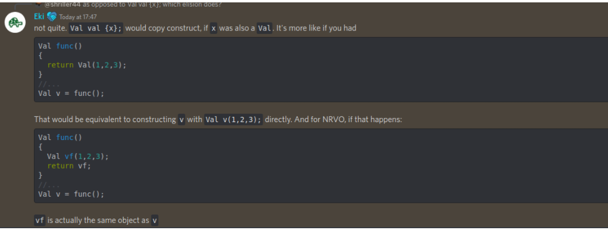
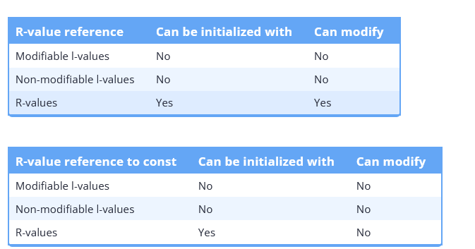
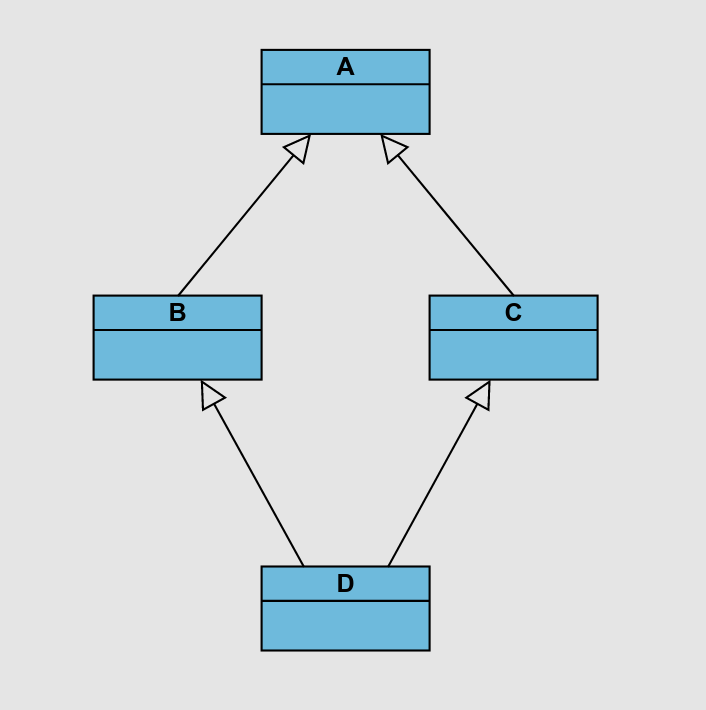
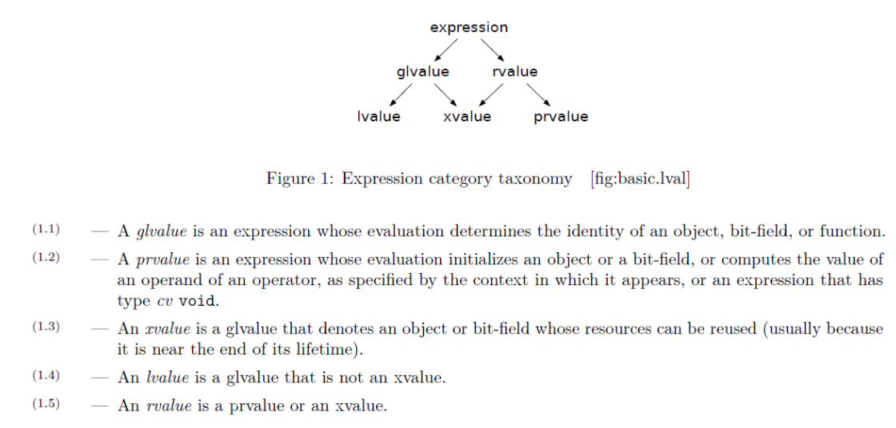

# C++

> Things to Look into more
>
> - Review POD types, class layouts as defined in the [Class section.](#Classes, OOP, ...)
> - Review how type traits are implemented for a variety of examples. Notably review the Cppcon video.
> - Review The containers in the standard library, from a performance and use case perspective
>   - Notably review the erase remove idiom.
> - Understand vector and string class under the h
> - Understand Placement new
> - Start collating a better understanding of template metaprogramming.
>   - https://www.vishalchovatiya.com/variadic-template-cpp-implementing-unsophisticated-tuple/
> - Review auto rules.
> - Summarise auto deduction rules
> - Templates ... operator.
> - Cppcon
>   - [Memory Allocators](https://www.youtube.com/watch?v=nZNd5FjSquk&t=538s)
>   - [Type Erasure](https://www.youtube.com/watch?v=tbUCHifyT24)
>   - [What is the C++ ABI](https://www.youtube.com/watch?v=DZ93lP1I7wU)
>   - [Important C++ Optimisations](https://www.youtube.com/watch?v=qCjEN5XRzHc)
>   - [Back 2 Basics Templates watch both parts](https://www.youtube.com/watch?v=XN319NYEOcE)

### Misc

- [Runtime vs Compile time](https://stackoverflow.com/questions/846103/runtime-vs-compile-time)

### Basic Concepts

- The main function implicitly returns `0`.
- C++ Escape characters:
  - 

### Move Semantics

```cpp
std::string func1(const std::string& str){ /* implicit &memory_location if being assigned passed in as a param*/
    std::string tmp{str};
    return tmp; /* if func1() is being stored then RVO */
}

void wrap1(const std::string&){
    func1(arg);
}

template<typename T>
std::string func2(T&& arg){
    std::string tmp{std::forward<T>(arg)};
    return tmp;
}

template<typename T>
void wrap2(T&& arg){
    func2(std::forward<T>(arg)); // forward move semantics to another R value reference function so library makers speed up by distinguishing what can be copied and moved they can avoid spurios copies.
}

int main(){
    /* temp implictly is copied into a std::string temporary to bind to the const std::string&
    	copied again when constructed in func1
    */
    std::string data = "value";
    wrap1("temp");
    
    /* temp forwarded to the construction in func1 keeping it a temp so it only gets copied when
    	the std::string is being made
    */
    wrap2("temp");
}

```

### Initialisation

> Initialisation reference - https://en.cppreference.com/w/cpp/language/initialization

##### cpp-core-guidelines

- [Prefer initialization to assignment in constructors](https://accu.org/journals/overload/25/139/brand_2379/)

  - ```cpp
    class A {   // Good
        string s1;
    public:
        A(czstring p) : s1{p} { }    // GOOD: directly construct (and the C-string is explicitly named)
        // ...
    };
    ```

- [Prefer the `{}` syntax for initialisation](https://isocpp.github.io/CppCoreGuidelines/CppCoreGuidelines#es23-prefer-the--initializer-syntax)

  - use `=` for 

    - Built in types

    - Certain there are no narrowing conversions

    - With `auto ` only use `=`.

      - ```CPP
        auto x1 {1, 2, 3}; // error: not a single element
        auto x2 = {1, 2, 3}; // x2 is std::initializer_list<int>
        auto x3 {3}; // x3 is int
        auto x4 {3.0}; // x4 is double
        ```

##### Summary

- [Init in C++ is bonkers](http://mikelui.io/2019/01/03/seriously-bonkers.html)
- [Another init reference](https://accu.org/journals/overload/25/139/brand_2379/)


- [cpp-init](https://www.caichinger.com/cpp/initialization.html)

  - ```cpp
    // Default Initialization
    // Applies when no initializer is specified or a class member is omitted from the member initialization list.
    // Primitive types remain uninitialized!
    T t;
    new T;
    
    // Value Initialization
    // Initialization to a default value. For class-types, similar to default initialization, but primitive types are zero-initialized.
    T t{};
    T();
    new T();
    new T{};
    // In class member initializer lists: member(), member{}
    
    // Direct Initialization
    // Applies when initializing objects without explicit assignment. Includes function-style casts, static_cast, and Lambda closure arguments captured by value.
    // Both explicit and non-explicit constructors are considered.
    T object(arg, ...);
    T(arg1, arg2, ...);
    new T(args, ...)
    // In class member initializer lists: member(args, ...)
    T(other)                 // Function-style cast
    static_cast<T>(other)    // Explicit static_cast
    [arg](){...}             // Lambda closure arguments captured by value
    
    // Copy Initialization
    // Used during initialization-by-assignment and when objects are implicitly copied (e.g., pass-by-value, return-by-value).
    // Only non-explicit constructors are considered.
    T object = other;        // Initialization via assignment
    T array[N] = {other};    // In array-initialization, values are copy-initialized
    f(other)                 // Pass-by-value
    return other;            // Return-by-value
    catch (T object)         // Catch-by-value
    throw object;            // When throwing exceptions
    
    // List Initialization
    // Applies for braced initializer lists. Mirrors value-, direct-, or copy-initialization with no narrowing conversions allowed.
    // Value list initialization
    T object{};
    T();
    new T{};
    Class { T member{}; };
    // In class member initializer lists: member{}
    
    // Direct list initialization
    T object{arg, ...};
    T{arg, ...};
    new T{arg, ...}
    Class { T member{arg, ...}; };
    // In class member initializer lists: member{arg, ...}
    
    // Copy list initialization
    T object = {arg, ...};
    object = {arg, ...};
    Class { T member = {arg, ...}; };
    function({arg, ...});    // Initializes temporary for function arg
    return {arg, ...};       // Initializes temporary for return value
    
    // Aggregate Initialization
    // Special case of list initialization for arrays or simple structs (all-members-public, no user-provided constructors).
    T object = {arg1, arg2, ...};   // For arrays or simple structs
    T object{arg1, arg2, ...};      // For arrays or simple structs
    
    // Reference Initialization
    // Used to initialize references. References can be bound to temporaries with extended lifetime except in specific cases (e.g., returning references to local variables).
    // Example of function-local references initialized with temporaries:
    T& ref = T();
    
    // Note: The specifics of each initialization type can vary depending on the context and the C++ standard used.
    
    ```

##### Learncpp-misc

- [struct aggregate initialization](https://www.learncpp.com/cpp-tutorial/struct-aggregate-initialization/)
- [default member initialization](https://www.learncpp.com/cpp-tutorial/default-member-initialization/)

##### Copy & Move Elision

> cpp con talk - https://www.youtube.com/watch?v=IZbL-RGr_mk

- Compiler may generate some code. The compiler has the ability to elide copies that are not actually required. 
- Returning a value defined in the calling function stack frame is not defined but rather moved directly into the address.


```cpp
std::string f(){
    std::string a{"A"}; // not created on the stack frame as shown above
    
    int b{23};
    
    return a; // "A" is returned here, placed directly into the memory location of x
}

void g(){
    std::string x{f()}; // f() takes &x as argument from where a is directly placed into by compiler optimsaition.
}
```

- Another image from the discord, notably stating **NRVO (named return value optimisation)**:

  - 

  - both are the same elided result which skips the copy or move step into the returned value address passed in under the hood 

##### Misc reminders:

- [Statics initialisation order](https://stackoverflow.com/questions/211237/static-variables-initialisation-order)

- `Constinit` - `Constinit` - Ensure a variable is initialised at compile time before linking ensuring global variables being used as **external linkage** specifiers specified by `inline` `extern` or `global` are not used before the **corresponding definition** is generated.

  - ```cpp
    #ifndef Fuck
    #define Fuck
    class FileSystem {
    public:
    	[[nodiscard]] static std::size_t numDisks();
    };
    #endif
    
    inline constinit FileSystem tfs;
    ```

  - ```cpp
    class Directory {
    public:
    	explicit Directory(int);
    };
    
    Directory::Directory(int) {
    	std::size_t disks = tfs.numDisks(); // guaranteed to b
    }
    ```

- [Copy list init vs direct list init](https://stackoverflow.com/questions/50422129/differences-between-direct-list-initialization-and-copy-list-initialization)

### Idioms

> [C++ Idioms](https://en.wikibooks.org/wiki/More_C%2B%2B_Idioms)

##### SFINAE

> [SFINAE](https://en.wikibooks.org/wiki/More_C%2B%2B_Idioms/SFINAE) - wikibooks
>
> [SFINAE Reference](https://en.cppreference.com/w/cpp/language/sfinae) - cppreference

- Substitution failure is not an error.
- This rule applies during overload resolution of function templates: When substituting the explicitly specified or deduced type for the template parameter fails, the specialization is discarded from the overload set instead of causing a compile error. 

##### Pimpl

> [Pimpl Idiom](https://en.wikibooks.org/wiki/C%2B%2B_Programming/Idioms#Pointer_To_Implementation_(pImpl))

- Also called the **opaque pointer** idiom is a method of providing data and thus further implementation abstraction for Classes.

##### Erase-remove

- [Erase remove idiom](https://en.wikipedia.org/wiki/Erase%E2%80%93remove_idiom)

```cpp
// Use g++ -std=c++11 or clang++ -std=c++11 to compile.

#include <algorithm>  // remove and remove_if
#include <iostream>
#include <vector>

void Print(const std::vector<int>& vec) {
  for (auto val : vec) {
    std::cout << val << ' ';
  }
  std::cout << '\n';
}

int main() {
  std::vector<int> v = {0, 1, 2, 3, 4, 5, 6, 7, 8, 9};
  Print(v);

  // Removes all elements with the value 5.
  v.erase(std::remove(v.begin(), v.end(), 5), v.end());
  Print(v);

  // Removes all odd numbers.
  v.erase(std::remove_if(v.begin(), v.end(), [](int val) { return val & 1; }),
          v.end());
  Print(v);
}

1 2 3 4 5
  2   4 >    13424  
/*				^
Output:
0 1 2 3 4 5 6 7 8 9
0 1 2 3 4 6 7 8 9
0 2 4 6 8
*/
```

- In C++20 We have the free function `std::free` which implements the erase remove idiom for us.

### Operators

- Operator precedence - https://www.learncpp.com/cpp-tutorial/operator-precedence-and-associativity/

##### Operator overloading

- Overloading assignment (=), subscript ([]), function call (()), or member selection (->) as Member Functions

  - ```cpp
    lass MyClass {
    public:
        // Overloading assignment operator
        MyClass& operator=(const MyClass& other) {
            // Copy assignment logic here
            return *this;
        }
    
        // Overloading subscript operator
        int& operator[](int index) {
            // Subscript logic here
            return someInternalArray[index];
        }
    
        // Overloading function call operator
        void operator()() {
            // Function call logic here
        }
    
        // Assume MyClass is a smart pointer type for overloading member selection
        SomeType* operator->() {
            // Member selection logic here
            return ptr;
        }
    
    private:
        int someInternalArray[10];
        SomeType* ptr;
    };
    ```

- Overloading a unary operator as a  member function

  - ```cpp
    class Number {
    public:
        // Overloading unary minus operator
        Number operator-() const {
            Number result;
            result.value = -value;
            return result;
        }
        int value;
    };
    
    ```

- Overloading a binary operator that modifies its left operand as member function

  - ```cpp
    class Counter {
    public:
        // Overloading operator+=
        Counter& operator+=(const Counter& other) {
            count += other.count;
            return *this;
        }
    
        int count = 0;
    };
    ```

- Overloading a binary operator that does not modify its left operand as a normal function or friend function:

  - ```cpp
    class Vector2D {
    public:
        Vector2D(double x, double y) : x(x), y(y) {}
    
        friend Vector2D operator+(const Vector2D& a, const Vector2D& b);
    
        double x, y;
    };
    
    Vector2D operator+(const Vector2D& a, const Vector2D& b) {
        return Vector2D(a.x + b.x, a.y + b.y);
    }
    ```

- [Basic rules and idioms for operator overloading](https://stackoverflow.com/questions/4421706/what-are-the-basic-rules-and-idioms-for-operator-overloading/4421729#4421729)
  - 

##### Learncpp-misc

- Conditional operator:

  - ```cpp
    // The Conditional Operator in C++ (?:)
    
    // Basic Syntax: c ? x : y
    // Evaluates x if c is true, otherwise evaluates y
    
    // Example: Replacing if-else statement
    int x = 10, y = 5;
    int greater = (x > y) ? x : y; // If x is greater than y, assign x to greater, else assign y
    
    // Using in Variable Initialization
    constexpr bool inBigClassroom { false };
    constexpr int classSize { inBigClassroom ? 30 : 20 }; // Ternary operator in initialization
    
    // Parenthesizing Conditional Operator
    int z { 10 - (x > y ? x : y) }; // Parenthesized for clarity and correct evaluation
    
    // When to Parenthesize
    // 1. Parenthesize the entire conditional operator in a compound expression
    // 2. Parenthesize the condition if it contains operators (except function calls)
    
    // Examples of Parenthesizing
    int a { (x > y) ? x : y };                  // Parenthesized condition
    std::cout << (isAfternoon() ? "PM" : "AM"); // Condition is a function call, not parenthesized
    
    // Type Matching in Conditional Operator
    constexpr int value{ 5 };
    // std::cout << (value != 5 ? value : "value is 5"); // Error: Types do not match
    
    // Use Cases for Conditional Operator
    // 1. Initializing an object with one of two values
    // 2. Assigning one of two values to an object
    // 3. Passing one of two values to a function
    // 4. Returning one of two values from a function
    // 5. Printing one of two values
    
    // Best Practice: Avoid in Complicated Expressions
    // Complicated expressions with the conditional operator are error-prone and hard to
    ```

- Operating incrementing and decrementing:

  - 

  - Side effects can cause order of evaluation issues:

    - ```cpp
      #include <iostream>
      
      int add(int x, int y)
      {
          return x + y;
      }
      
      int main()
      {
          int x { 5 };
          int value{ add(x, ++x) }; // undefined behavior: is this 5 + 6, or 6 + 6?
          // It depends on what order your compiler evaluates the function arguments in
      
          std::cout << value << '\n'; // value could be 11 or 12, depending on how the above line evaluates!
      
          return 0;
      }
      ```

- Floating point comparison at compile time

  - ```cpp
    // Prior to C++23 version
    #include <algorithm> // for std::max
    #include <iostream>
    
    // Our own constexpr implementation of std::abs (for use prior to C++23)
    // In C++23, use std::abs
    // constAbs() can be called like a normal function, but can handle different types of values (e.g. int, double, etc...)
    template <typename T>
    constexpr T constAbs(T x)
    {
        return (x < 0 ? -x : x);
    }
    
    // Return true if the difference between a and b is within epsilon percent of the larger of a and b
    constexpr bool approximatelyEqualRel(double a, double b, double relEpsilon)
    {
        return (constAbs(a - b) <= (std::max(constAbs(a), constAbs(b)) * relEpsilon));
    }
    
    // Return true if the difference between a and b is less than or equal to absEpsilon, or within relEpsilon percent of the larger of a and b
    constexpr bool approximatelyEqualAbsRel(double a, double b, double absEpsilon, double relEpsilon)
    {
        // Check if the numbers are really close -- needed when comparing numbers near zero.
        if (constAbs(a - b) <= absEpsilon)
            return true;
    
        // Otherwise fall back to Knuth's algorithm
        return approximatelyEqualRel(a, b, relEpsilon);
    }
    
    int main()
    {
        // a is really close to 1.0, but has rounding errors
        constexpr double a{ 0.1 + 0.1 + 0.1 + 0.1 + 0.1 + 0.1 + 0.1 + 0.1 + 0.1 + 0.1 };
    
        constexpr double relEps { 1e-8 };
        constexpr double absEps { 1e-12 };
    
        constexpr bool same { approximatelyEqualAbsRel(a, 1.0, absEps, relEps) };
        std::cout << same << '\n';
    
        return 0;
    }
    ```

##### Misc Reminders

- `->` operator:

  - overloading this essentially means we return some internal object from which we access its underlying values

  - If a pointer is returned we call the underlying operator, if this further calls another `->` then we repeat until we reach the end.

   ```cpp
   struct A {
       std::string* operator->(){
           return new std::string{"A string"};
       }
   }
   
   struct B {
       A operator->(){
           return A();
       }
   }
   
   int main(){
       B b;
       b->size();
   }
   ```

- Comma  `, `operator return type:

  - ```cpp
    auto func = [&](int x , int y) {return x + 1, y;} /* evalautes x+1 but returns y */
    ```

### Bit manipulation (review learncpp)

##### Misc reminders

- How bitwise OR represents flags

  - ```cpp
    BINARY DECIMAL COLOR
    ------ ------- -----
       001       1  Red
       010       2  Green
       011       3  Red+Green
       100       4  Blue
       101       5  Blue+Red
       110       6  Blue+Green
       111       7  Blue+Green+Red
    ```

  - So `Red` is an integer and so is `Blue` 

  - Bitwise OR `|` combines the two 

  - Therefore when we bitwise AND `&` check it evaluates true for both `Red` and `Blue` , alternatively as shown above `101` is the value stored from the bitwise OR which is represented in the program.

### Scope, Duration and Linkage

##### learncpp-misc

###### Linkage

- **No Linkage**: Identifier refers only to itself.
  - Local variables.
  - Type definitions (e.g., enums, classes) inside a block.
- **Internal Linkage**: Accessible within the file where declared.
  - Static global variables (both initialized and uninitialized).
  - Static functions.
  - Const global variables.
  - Functions in unnamed namespaces.
  - Type definitions (e.g., enums, classes) in unnamed namespaces.
- **External Linkage**: - Accessible in the file where declared and in other files.
  - Functions.
  - Non-const global variables (both initialized and uninitialized).
  - Extern const global variables.
  - Inline const global variables.

###### Duration

- Variables with **automatic duration** are created at the point of definition, and destroyed when the block they are part of is exited. This includes:
  - Local variables
  - Function parameters
- Variables with **static duration** are created when the program begins and destroyed when the program ends. This includes:
  - Global variables
  - Static local variables
- Variables with **dynamic duration** are created and destroyed by programmer request. This includes:
  - Dynamically allocated variables

###### scope

- An identifier’s *scope* determines where the identifier can be accessed within the source code.

  - Variables with **block (local) scope**  can only be accessed from the point of declaration until the end of the block in which they are declared (including nested blocks). This  includes:
    - Local variables
    - Function parameters
    - Program-defined type definitions (such as enums and classes) declared inside a block

  - Variables and functions with **global scope** can be accessed from the point of declaration until the end of the file. This includes:
    - Global variables
    - Functions
    - Program-defined type definitions (such as enums and classes) declared inside a namespace or in the global scope

##### Variable scope, duration, and linkage summary


##### Forward declaration summary


##### Misc reminders

- Global scope = file scope = global namespace scope

- Classes / Types exempt from ODR

  - Types declared in a header file can have multiple definitions amongst the files its included in

  - They should be the same definitions otherwise its undefined.

- **Extern** 

  - This comes in useful when you have global variables. You declare the *existence* of global variables in a header, so that each source file that includes the header knows about it, but you only need to “define” it once in one of your source files.
  - To clarify, using `extern int x;` tells the compiler that an object of type `int` called `x` exists *somewhere*. It's not the compilers job to know where it exists, it just needs to know the type and name so it knows how to use it. Once all of the source files have been compiled, the linker will resolve all of the references of `x` to the one definition that it finds in one of the compiled source files. For it to work, the definition of the `x` variable needs to have what's called “external linkage”, which basically means that it needs to be declared outside of a function (at what's usually called “the file scope”) and without the `static` keyword.
  - So we define the `extern` variable definition in one of the locations where the header is included and this compiles fine where each file including `header.h` can use the `global_x` without having to define it multiple times.

  ```cpp
  /* header.h */
  #ifndef HEADER_H
  #define HEADER_H
  
  // any source file that includes this will be able to use "global_x"
  extern int global_x;
  
  void print_global_x();
  
  #endif
  ```

  ```cpp
  /* main.cpp */
  
  #include "header.h"
  
  // since global_x still needs to be defined somewhere,
  // we define it (for example) in this source file
  int global_x;
  
  int main()
  {
      //set global_x here:
      global_x = 5;
  
      print_global_x();
  }
  ```

  ```cpp
  /* header.cpp (definition for our header)*/
  #include <iostream>
  #include "header.h"
  
  void print_global_x()
  {
      //print global_x here:
      std::cout << global_x << std::endl;
  }
  ```

- [When to use static variable in C++](https://stackoverflow.com/questions/25866893/when-to-use-static-variable-c)
  
  - **Global scope statics** -  for internal linkage, to avoid name conflicts between separate translation units
  - **Class scope statics** - internal class usage only, no conflicts between other classes.
  - Both Global and Class scope statics are *global*, given that for the class one you use `Class::`.
  - Another form of global variable , is just define a variable without `static` syntax. This becomes available to other files via the `extern` keyword.
  
- [The static keyword and its various uses in C++](https://stackoverflow.com/questions/15235526/the-static-keyword-and-its-various-uses-in-c)

  - Static free functions define internal linkage between TU. A note is that inline functions in a header already make these mostly redundant.

  - Each function having internal linkage allows the same name function to perform different operations in each TU.

- [Extern C Video](https://www.youtube.com/watch?v=m5Y3Ghv2PUE )

  - `extern "c"` $\to$ use c header libraries and link them properly without name mangling
    - Where `func()` in c++ actually becomes a symbol `_Z3func` which would cause a  

- [How do inline variables work](https://stackoverflow.com/questions/38043442/how-do-inline-variables-work)

  - Define a variable in a header as inline to be used amongst any translation unit, notably it solves the ODR (one definition rule) by its semantics.

- [static inline functions?](https://stackoverflow.com/questions/10876930/should-one-never-use-static-inline-function)

  - The `static` modifier at namespace scope was formerly deprecated in favour of unnamed namespaces

- **Translation unit** - A single file that is comprised of headers and .cpp file that will be compiled to a .obj

- Classes and other types are free from **ODR**
  - Types declared in a header file can have multiple definitions amongst the files its included in
  - They should be the same definitions otherwise its undefined.

- [MSCV types of scope](https://learn.microsoft.com/en-us/cpp/cpp/scope-visual-cpp?view=msvc-170)

### References, Pointers & Memory

##### learn-cpp misc

- [**Member functions returning references to data members**](https://www.learncpp.com/cpp-tutorial/member-functions-returning-references-to-data-members/):

  - One notable thing is the idea that R-value references i.e the copy by value return of `createEmployee` returns a temporary (r value) that is destroyed after the expression it resides in has completed.

  - ```cpp
    #include <iostream>
    #include <string>
    #include <string_view>
    
    class Employee
    {
    	std::string m_name{};
    
    public:
    	void setName(std::string_view name) { m_name = name; }
    	const auto& getName() const { return m_name; } //  getter returns by const reference
    };
    
    // createEmployee() returns an Employee by value (which means the returned value is an rvalue)
    Employee createEmployee(std::string_view name)
    {
    	Employee e;
    	e.setName(name);
    	return e;
    }
    
    int main()
    {
    	// Case 1: okay: use returned reference to member of rvalue class object in same expression
    	std::cout << createEmployee("Frank").getName();
    
    	// Case 2: bad: save returned reference to member of rvalue class object for use later
    	const std::string& ref { createEmployee("Garbo").getName() }; // reference becomes dangling when return value of createEmployee() is destroyed
    	std::cout << ref; // undefined behavior
    
    	// Case 3: okay: copy referenced value to local variable for use later
    	std::string val { createEmployee("Hans").getName() }; // makes copy of referenced member
    	std::cout << val; // okay: val is independent of referenced member
    
    	return 0;
    }
    ```

- [R value references](https://www.learncpp.com/cpp-tutorial/rvalue-references/)
  - 

- [L value References](https://www.learncpp.com/cpp-tutorial/lvalue-references/)

  - The following code snippet `ref1` actually refers to `var` itself when used to init `ref2`, it does not create a reference to a reference which is not valid C++ logic

  - ```cpp
    int var{};
    int& ref1{ var };  // an lvalue reference bound to var
    int& ref2{ ref1 }; // an lvalue reference bound to var
    ```

- **Always favour references to pointers whenever possible.** (https://www.learncpp.com/cpp-tutorial/null-pointers/)

##### Misc reminders

- Function pointer syntax:

  - https://cdecl.org

  - ```cpp
    *test(bool) // function pointer taking a bool as input
    void (*(*test(bool)))() // add parentheses around it then add a poonter and another pair of brackets
     //this is now a function pointer retunr a function pointer that takes no inputs and returns void
        
    // to extend remove void with another pointer and add another pointer layer placing bracket after return type of the other
        
     int(*(*(*test(bool)))())() 
    ```

  - this is a pointer to a function called test taking (bool) which returns a function pointer that points to another function pointer that returns int

- [When to pass by pointer vs reference](https://cplusplus.com/articles/z6vU7k9E/)

- [Differences between references and pointers](https://stackoverflow.com/questions/57483/what-are-the-differences-between-a-pointer-variable-and-a-reference-variable)

- [Shared Pointer vs Raw pointers](https://stackoverflow.com/questions/7657718/when-to-use-shared-ptr-and-when-to-use-raw-pointers)

- [R value references to arrays in C++](https://stackoverflow.com/questions/22562187/what-is-the-purpose-of-rvalue-reference-to-an-array-in-c11 )

- [Make Shared](https://en.cppreference.com/w/cpp/memory/shared_ptr/make_shared)
  
  - [Make Shared vs Normal shared](https://stackoverflow.com/questions/20895648/difference-in-make-shared-and-normal-shared-ptr-in-c)
  
- [References vs Pointers](https://stackoverflow.com/questions/7058339/when-to-use-references-vs-pointersv)

- [std:ref(T) vs T&](https://stackoverflow.com/questions/33240993/c-difference-between-stdreft-and-t)

- [Passing reference to a class constructor](https://stackoverflow.com/questions/4321305/best-form-for-constructors-pass-by-value-or-reference)

- `std::forward` - perfectly forwards the r value reference, l value reference. i.e it maintains the semantics of moving and referencing.

  - ```cpp
    
    template <typename T> func2(T&& arg){
        std::cout << "received arg as an r value reference\n";
    }
    
    template <typename T> func(T&& arg){
        func(std::forward<T>(arg));
    }
    
    int main(){
    
        int x {2};
        func(std::move(x));
    
    }
    ```

  - 

- `std::unique_ptr` vs `std::shared_ptr`  for pimpl idiom - https://stackoverflow.com/questions/5576922/should-i-use-shared-ptr-or-unique-ptr

- `std::unique_ptr` - generates a custom delete when there is no default destructor specified within the class its placed in.

- Placement New

  - [Placement New use cases](https://stackoverflow.com/questions/222557/what-uses-are-there-for-placement-new)

  - [Placement new explained as a memory pool calling explicit destructors](https://www.youtube.com/watch?v=2bsGFQgBMXs )

  - ```cpp
    class Arena {
          public:
                 void* allocate(size_t);
                  void deallocate(void*);
                  // ...
     };
    
    void* operator new(size_t sz, Arena& a){
        return a.allocate(sz);
    }
    
            Arena a1(some arguments);
            Arena a2(some arguments);
    ```

  - [Parameters to placement new](https://stackoverflow.com/questions/34800940/parameters-to-operator-new)

    - ```cpp
      void* operator new(std::size_t, /* extra parameters*/){
          /* do something then return a pointer to at least size bytes */
      }
      ```


  - Placement new in the context of `std::vector`
    - 

- **Alignment**

  - [How to use alignof, alignas](https://stackoverflow.com/questions/17091382/memory-alignment-how-to-use-alignof-alignas)

    - Alignment is a *restriction* on which *memory positions* some values *first byte* can be stored. 

    - Alignment of `16` means the memory addresses that are **multiples** of `16` are the only valid addresses.

    - The `alignas` keyword forces alignment to the desired type of powers of `2` only

    - ```cpp
      #include <cstdlib>
      #include <iostream>
      
      int main() {
          alignas(16) int a[4];
          alignas(1024) int b[4]; /* rather than taking up 16 bytes, each one now pads up to 1024 bytes.*/
          printf("%p\n", a);
          printf("%p", b);
      }
      ```

    - ```cpp
      #include <iostream>
      
      /* the alignment is equal to the largest alignment data member
          every member must now follow this alignment rule and thus short would be padded 2 bytes to fit the
          4 byte alignment set by int
      */
      struct Foo2 /* alignment = 4 bytes, sizeof = 12 bytes for 3 members aligned to 4*/
      {
          short a{};/* 2 bytes*/
          /*2 padding bytes*/
          int b{}; /* 4 bytes*/
          short qq{}; /*2 bytes*/
         /*2 bytes*/
      };
      
      int main() {
          std::cout << sizeof(short) << std::endl;
          std::cout << sizeof(short) << std::endl;
          std::cout << sizeof(int) << std::endl;
          // total size of data members individually is 10 but as there must be padding to ensure proper alignment this changes.
          std::cout << sizeof(Foo2) << std::endl; // size is 12
      }
      ```

- **Returning by reference**

  - Do not return a reference to *non const local static* as it is defined in one place and accessed by multiple locations
  - assigning /init a normal variable with a returned reference performs a copy

  - object returned by reference must exist after the function returns.
  - Return by *address* is returning a **pointer** and thus shares similar caveats.
    - Useful for if we wish to **return** a `nullptr`. 

### Classes, OOP, ...

##### Core

```cpp
class T {                   // A new type
private:                    // Section accessible only to T's member functions
protected:                  // Also accessible to classes derived from T
public:                     // Accessible to all
    int x;                  // Member data
    void f();               // Member function
    void g() {return;}      // Inline member function
    void h() const;         // Does not modify any data members
    int operator+(int y);   // t+y means t.operator+(y)
    int operator-();        // -t means t.operator-()
    T(): x(1) {}            // Constructor with initialization list
    T(const T& t): x(t.x) {}// Copy constructor
    T(T&& t): x(t.x){ t.x = nullptr; } // Move constructor
    T& operator=(T&& t) {
        
        if (&t == this){
            return *th
        }
        
        x = t.x;
        t.x = nullptr;
    }
    T& operator=(const T& t)
    {x=t.x; return *this; } // Assignment operator
    ~T();                   // Destructor (automatic cleanup routine)
    explicit T(int a);      // Allow t=T(3) but not t=3
    T(float x): T((int)x) {}// Delegate constructor to T(int)
    operator int() const
    {return x;}             // Allows int(t)
    friend void i();        // Global function i() has private access
    friend class U;         // Members of class U have private access
    static int y;           // Data shared by all T objects
    static void l();        // Shared code.  May access y but not x
    class Z {};             // Nested class T::Z
    typedef int V;          // T::V means int
};
void T::f() {               // Code for member function f of class T
    this->x = x;}           // this is address of self (means x=x;)
int T::y = 2;               // Initialization of static member (required)
T::l();                     // Call to static member
T t;                        // Create object t implicit call constructor
t.f();                      // Call method f on object t

struct T {                  // Equivalent to: class T { public:
  virtual void i();         // May be overridden at run time by derived class
  virtual void g()=0; };    // Must be overridden (pure virtual)
class U: public T {         // Derived class U inherits all members of base T
  public:
  void g(int) override; };  // Override method g
class V: private T {};      // Inherited members of T become private
class W: public T, public U {};
                            // Multiple inheritance
class X: public virtual T {};
                            // Classes derived from X have base T directly
```

##### misc-cpp-core-guidelines

- [C.51: Use delegating constructors to represent common actions for all constructors of a class](https://isocpp.github.io/CppCoreGuidelines/CppCoreGuidelines#c51-use-delegating-constructors-to-represent-common-actions-for-all-constructors-of-a-class)
- [C.35: A base class destructor should be either public and virtual, or protected and non-virtual](https://isocpp.github.io/CppCoreGuidelines/CppCoreGuidelines#Rc-dtor-virtual)
- [C:127: A class with a virtual function should have a virtual or protected destructor](https://isocpp.github.io/CppCoreGuidelines/CppCoreGuidelines#c127-a-class-with-a-virtual-function-should-have-a-virtual-or-protected-destructor)

##### Learn-cpp misc

- [ref-qualifiers](https://www.learncpp.com/cpp-tutorial/ref-qualifiers/)

  - ```cpp
    #include <iostream>
    #include <string>
    #include <string_view>
    
    class Employee {
        std::string m_name;
    
    public:
        // Set the employee's name
        void setName(std::string_view name) { m_name = name; }
    
        // Getter with ref qualifier for lvalue objects - returns a const reference
        const auto& getName() const & { return m_name; } 
    
        // Getter with ref qualifier for rvalue objects - returns by value
        auto getName() const && { return m_name; } 
    };
    
    Employee createEmployee(std::string_view name) {
        Employee e;
        e.setName(name);
        return e;
    }
    
    int main() {
        Employee joe;
        joe.setName("Joe");
        std::cout << joe.getName() << '\n'; // Calls lvalue version
    
        std::cout << createEmployee("Frank").getName() << '\n'; // Calls rvalue version
        return 0;
    }
    ```

- [Members functions returning references to data members](https://www.learncpp.com/cpp-tutorial/member-functions-returning-references-to-data-members/)
- **Class invariant** - A **class invariant** is a condition that must be true  throughout the lifetime of an object in order for the object to remain  in a valid state. An object that has a violated class invariant is said  to be in an **invalid state**, and unexpected or undefined behaviour may result from further use of that object.

- [Delegating Constructors](https://www.learncpp.com/cpp-tutorial/delegating-constructors/)

  - ```cpp
    #include <iostream>
    #include <string>
    #include <string_view>
    
    class Employee
    {
    private:
        std::string m_name{};
        int m_id{ 0 };
    
    public:
        Employee(std::string_view name)
            : Employee{ name, 0 } // delegate initialization to Employee(std::string_view, int) constructor
        {
        }
    
        Employee(std::string_view name, int id)
            : m_name{ name }, m_id{ id } // actually initializes the members
        {
            std::cout << "Employee " << m_name << " created\n";
        }
    
    };
    
    int main()
    {
        Employee e1{ "James" };
        Employee e2{ "Dave", 42 };
    }
    ```

  - ```cpp
    #include <iostream>
    #include <string>
    #include <string_view>
    
    class Employee
    {
    private:
        static constexpr int default_id { 0 }; // define a named constant with our desired initialization value
    
        std::string m_name{};
        int m_id{ default_id }; // we can use it here
    
    public:
    
        Employee(std::string_view name, int id = default_id) // and we can use it here
            : m_name{ name }, m_id{ id }
        {
            std::cout << "Employee " << m_name << " created\n";
        }
    };
    
    int main()
    {
        Employee e1{ "James" };
        Employee e2{ "Dave", 42 };
    }
    ```

##### Misc reminders

- [Memory layout of cpp object](https://www.vishalchovatiya.com/memory-layout-of-cpp-object/)

- Default destructors in a header interface:

  - ```cpp
    #pragma once
    #include <memory>
    class B;
    
    class A 
    {
    private:
      std::unique_ptr<B> my_b;
    public:
    // ~A() = default; 
    // defining the default destructor would fail as 
    // class B is still a partial class here
      ~A();
    };
    ```

  - ```cpp
    #include "A.hpp"
    
    // the previously forward declared class B is now included here
    #include "B.hpp"
    
    // we can use the default destructor here as B is
    // no longer a partial class
    A::~A() = default;  /* the forward declaration is overwritten at this point and thus this is a valid destructor implementation*/
    ```

- User declared, user defined, user provided:
  - 

- [Implicit constructor vs default constructor](https://stackoverflow.com/questions/12340257/what-is-the-difference-between-implicit-constructors-and-default-constructors)

- Aggregate class has no (can also be templates)
  - user provided / explicit / inherited constructors
  - no private / protected non static data members
  - no virtual functions
  - no virtual,private protected base classes
- Implicit copy constructors deletion
  - Data members present that do not have a copy constructor defined on then , implicitly delete the copy constructors on the class they are a part of.

- **Virtual destructors** - Use to call destructor of a derived classed pointed to by the base class type.

- [**Virtual tables**](https://www.learncpp.com/cpp-tutorial/the-virtual-table/) - To implement virtual functions, C++ uses a special form of late binding known as the virtual table. The **virtual table** is a lookup table of functions used to resolve function calls in a  dynamic/late binding manner. The virtual table sometimes goes by other  names, such as *vtable*, *virtual function table*, *virtual method* table, or *dispatch table*.

  

- [**Purpose of virtual functions**](https://stackoverflow.com/questions/2391679/why-do-we-need-virtual-functions-in-c)

- [Virtual functions vs pure virtual functions](https://stackoverflow.com/questions/2652198/difference-between-a-virtual-function-and-a-pure-virtual-function)

  > A virtual function makes its class a *polymorphic base class*. Derived classes can override virtual functions. Virtual functions  called through base class pointers/references will be resolved at  run-time. That is, the *dynamic type* of the object is used instead of its *static type*

  > A pure virtual function implicitly makes the class it is defined for *abstract* (unlike in Java where you have a keyword to explicitly declare the class abstract). Abstract classes **cannot be instantiated**. Derived classes **need to override/implement** all **inherited pure virtual functions**. If they **do not, they too will become abstract**. ends in `=0`
  
- [Protected vs Private](https://stackoverflow.com/questions/224966/what-is-the-difference-between-private-and-protected-members-of-c-classes)

- [What is the override keyword](https://stackoverflow.com/questions/18198314/what-is-the-override-keyword-in-c-used-for)

- [Default member values best practices](https://stackoverflow.com/questions/11594846/default-member-values-best-practice)

- [Using declarative vs using directive](https://stackoverflow.com/questions/16152750/using-directive-vs-using-declaration-swap-in-c)

- [Explicit for default constructors with two or more params](https://stackoverflow.com/questions/4467142/why-is-explicit-allowed-for-default-constructors-and-constructors-with-2-or-more)

  - ```cpp
    struct String {
        // this is a non-converting constructor
        explicit String(int initialLength, int capacity);
    };
    
    struct Address {
        // converting constructor
        Address(string name, string street, string city);
    };
    
    String s = { 10, 15 }; // error!
    String s1{10, 15}; // fine
    
    Address a = { "litb", "nerdsway", "frankfurt" }; // fine
    ```

- `Explicit` Keyword

  - Explicit Keyword in C++ is **used to mark constructors to not implicitly convert types in C++**. It is optional for constructors that take exactly one argument and works on constructors(with single argument) since those are the only constructors that can be used in type casting.

  - Use explicit constructors to ensure the type being converted is not implicitly changing into the class type.

- **Implicit conversions**

  ```cpp
  class balls {
      operator int(){
          return ...
      }
  }
  
  int x = balls() /* runs our implicitly user defined function*/
  ```

- **Mutable keyword** - permits modificationof the class member declared mutable even if the containing object is declared const (i.e., the class member is mutable)

  - Declare an object mutable meaning the object that is const can act on member functions using these values
    - Basically some variables are mutable and can change even if the object they are instantiated within is declare

  ```cpp
  class X
  {
      mutable const int* p; // OK
      mutable int* const q; // ill-formed
      mutable int&       r; // ill-formed
  };
  ```

- Passing this context to a lambda within  a class:
  - This gives the lambda access to the values of the class directly without having t

```cpp
[this,session](const boost::system::error_code& ec) {
			if (ec.value() != 0) {
				session->m_ec = ec;
				onRequestComplete(session);
				return;
			}
```

- [C++11 POD Standard layout definition](https://stackoverflow.com/questions/7160901/why-is-c11s-pod-standard-layout-definition-the-way-it-is)

  - A standard-layout class is a class that - https://en.cppreference.com/w/cpp/language/classes#Standard-layout_class:

  > 1. has no non-static data members of type non-standard-layout class (or array of such types) or reference,
  >
  > 2. has no virtual functions (10.3) and no virtual base classes (10.1),
  >
  > 3. has the **same access control** (Clause 11) for all non-static data members,
  >
  > 4. has no non-standard-layout base classes,
  >
  > 5. either has no non-static data members in the most derived class and **at most one base class with non-static data members**, or has no base classes with non-static data members, and
  >
  > 6. has no base classes of the **same type as the first non-static data member**.

- [Enabled shared from this](https://en.cppreference.com/w/cpp/memory/enable_shared_from_this)

- `std::unique_ptr` generates its own custom deleter when the class its a member function of does not define a default destructor.

- [C++ non-standard-layout class layouts](https://quuxplusone.github.io/blog/2022/03/04/non-standard-layout-guarantees/)

  - You can cast a *standard layout class object*  address to a pointer of its first member:

    ```cpp
    struct A {int x;};
    
    A a;
    
    int *px = (int*) &a;
    
    A *pa = (A*)px;
    
    ```

- **[Effective C++ Item 9]** not call virtual functions within destructors, as the base class is created then derived therefore unexpected results could arise.

- We can use the concept of inline variables in a class to define a static variable in the class definition itself as opposed to on the outside.

  - ```cpp
    // Pre C++17
    #include<iostream>
    using namespace std;
    class MyClass {
       public:
          MyClass() {
             ++num;
          }
          ~MyClass() {
             --num;
          }
          static int num;
    };
    int MyClass::num = 10;
    int main() {
       cout<<"The static value is: " << MyClass::num;
    }
    ```

  - ```cpp
    // C++17 inline variables
    #include<iostream>
    using namespace std;
    class MyClass {
       public:
          MyClass() {
             ++num;
          }
          ~MyClass() {
             --num;
          }
          inline static int num = 10;
    };
    int main() {
       cout<<"The static value is: " << MyClass::num;
    }
    ```


- Special Members that are declared based on user declarations in C++ for a class:
  - 

- Prefer a default constructor that has no member init list, but rather initialises the data members directly:


  - ```cpp
    struct T{
        T() = default;
        int i {};
        bool toggle {false};
    };
    
    struct T {
        T() : i{}, toggle{false}{}
        int i;
        bool toggle;
    };
    ```

- **Virtual inheritance** - A solution to the *diamond problem*
  
  
  - [What is virtual inheritance and when to use in C++](https://www.sandordargo.com/blog/2020/12/23/virtual-inheritance)
  - [C++ Virtual base class](https://www.scaler.com/topics/virtual-base-class-in-cpp/)
  - [Virtual keyword for use in inheritance](https://stackoverflow.com/questions/14163924/virtual-keyword-in-inheritance )
  - 
  - `B` and `C` inherit virtually therefore `D` does not contain duplicated members of `A`.
  
- **Ignoring virtualisation**

  - ```cpp
    #include <iostream>
    int main()
    {
        Derived derived;
        const Base& base { derived };
        // Calls Base::GetName() instead of the virtualized Derived::GetName()
        std::cout << base.Base::getName() << '\n';
    
        return 0;
    }
    ```

### Unions

##### Misc reminders

- [What is a union for in C and C++](https://stackoverflow.com/questions/2310483/purpose-of-unions-in-c-and-c)

### Namespaces

```cpp
namespace N {class T {};}   // Hide name T
N::T t;                     // Use name T in namespace N
using namespace N;          // Make T visible without N::
```

##### Misc reminders:

- [Unnamed namespaces](https://stackoverflow.com/questions/357404/why-are-unnamed-namespaces-used-and-what-are-their-benefits) - internal linkage.

- [Namespace scope](https://stackoverflow.com/questions/16776293/understanding-namespace-scope-in-c)

- Using directive is referred to as bringing the namespace `N` from `using namespace N` into the scope for name resolution to occur.

- **Global namespace** - The top level namespace, accessed via just using the prepended :: operator - https://stackoverflow.com/questions/4269034/what-is-the-meaning-of-prepended-double-colon.

- Unqualified namespace calls - ADL - https://en.cppreference.com/w/cpp/language/adl

  - it will be found because unqualified calls will add the namespace of any class argument to the lookup - thus the name argument-dependent lookup.

  - ```cpp
    namespace mynamespace {
        class MyClass {};
        void swap(MyClass&, MyClass&);
    }
    mynamespace::MyClass a, b;
    swap(a, b);
    ```


### Declarations, Types

```cpp
int x;                      // Declare x to be an integer (value undefined)
int x=255;                  // Declare and initialize x to 255
short s; long l;            // Usually 16 or 32 bit integer (int may be either)
char c='a';                 // Usually 8 bit character
unsigned char u=255;
signed char s=-1;           // char might be either
unsigned long x =
  0xffffffffL;              // short, int, long are signed
float f; double d;          // Single or double precision real (never unsigned)
bool b = true;                // true or false, may also use int (1 or 0)
int a, b, c;                // Multiple declarations
int a[10];                  // Array of 10 ints (a[0] through a[9])
int a[]={0,1,2};            // Initialized array (or a[3]={0,1,2}; )
int a[2][2]={{1,2},{4,5}};  // Array of array of ints
char s[]="hello";           // String (6 elements including '\0')
std::string s = "Hello"     // Creates string object with value "Hello"
std::string s = R"(Hello World)"; // Creates string object with value "Hello\nWorld"
int* p;                     // p is a pointer to (address of) int
char* s="hello";            // s points to unnamed array containing "hello"
void* p=nullptr;            // Address of untyped memory (nullptr is 0)
int& r=x;                   // r is a reference to (alias of) int x
enum weekend {SAT,SUN};     // weekend is a type with values SAT and SUN
enum weekend day;           // day is a variable of type weekend
enum weekend{SAT=0,SUN=1};  // Explicit representation as int
enum {SAT,SUN} day;         // unscoped enumeration
enum class Color {Red,Blue};// Color is a strict type with values Red and Blue
Color x = Color::Red;       // Assign Color x to red
typedef String char*;       // String s; means char* s;
const int c=3;              // Constants must be initialized, cannot assign to
const int* p=a;             // Contents of p (elements of a) are constant
int* const p=a;             // p (but not contents) are constant
const int* const p=a;       // Both p and its contents are constant
const int& cr=x;            // cr cannot be assigned to change x
int8_t,uint8_t,int16_t,
uint16_t,int32_t,uint32_t,
int64_t,uint64_t            // Fixed length standard types
auto it = m.begin();        // Declares it to the result of m.begin()
auto const param = config["param"];
                            // Declares it to the const result
auto& s = singleton::instance();
                            // Declares it to a reference of the result
volatile int x = 5; // x may be changed somewhere else, prevent compiler optimizations.
```

##### Auto rules

- [Auto type deduction rules summary](https://blog.feabhas.com/2016/11/getting-head-around-autos-type-deduction-rules/)

  - ```cpp
    // Basic auto usage
    auto x = initialValue;  // x's type deduced from initialValue
    
    // Example: auto deducing int
    auto a = 17;            // a is int
    
    // Example: auto with brace initialization
    auto b {17};            // b is int
    
    // Auto and complex expressions
    auto it = v.begin();    // it's type deduced from v.begin()
    
    // Auto with const
    int const var = 178;
    auto c = var;           // c is int, const dropped
    
    // Auto with C-style arrays
    int my_array[10];
    auto d = my_array;      // d is int*, array decays to pointer
    
    // Auto with l-value references
    template<typename T>
    void fn(T& param) {}
    // param's type includes cv-qualifiers of the argument
    
    // Auto with r-value references
    template<typename T>
    void fn(T&& param) {}
    // param's type deduces to l-value or r-value reference based on argument
    
    // Reference collapsing rules
    T& & -> T&,
    T& && -> T&,
    T&& & -> T&,
    T&& && -> T&&
    
    // Guidelines
    // - Avoid auto for scalar types
    // - Use auto for complex types, especially from functions like std::make_shared
    // - Be cautious with auto and reference qualifiers
    // - Remember that cv-qualifiers on auto-deduced types apply to the
    
    ```

- `auto*`

  - ```cpp
    #include <string>
    
    const std::string* const getConstPtr(); // some function that returns a const pointer to a const value
    
    int main()
    {
        auto ptr1{ getConstPtr() };  // const std::string* (drops top level const then deduces a const std::string*)
        auto* ptr2{ getConstPtr() }; // const std::string*
        
        /* reapply the const after its dropped as being the top level*/
        auto const ptr3{ getConstPtr() };  // const std::string* const
        const auto ptr4{ getConstPtr() };  // const std::string* const
    
        
        auto* const ptr5{ getConstPtr() }; // const std::string* const
        
        /* actually useless as this is deduced to const*/
        const auto* ptr6{ getConstPtr() }; // const std::string*
    
        /* const already deduced */
        const auto const ptr7{ getConstPtr() };  // error: const qualifer can not be applied twice
        
        /* top level dropped but added back , low level const added as documentation*/
        const auto* const ptr8{ getConstPtr() }; // const std::string* const
    
        return 0;
    }
    ```

##### learncpp-misc

- *Integer* refers to the `int` datatype, whereas *Integral* (https://en.cppreference.com/w/cpp/types/is_integral) is more broad and can include `bool` 

- [object-sizes-and-the-sizeof-operator](https://www.learncpp.com/cpp-tutorial/object-sizes-and-the-sizeof-operator/)
  
  - 
  
- Fixed width integers:

  - 

  - Fast and least integers:

    - ```cpp
      #include <cstdint> // For fast and least integer types
      #include <iostream>
      
      int main() {
          // Demonstrating sizes of least integer types
          std::cout << "least 8:  " << sizeof(std::int_least8_t) * 8 << " bits\n";
          std::cout << "least 16: " << sizeof(std::int_least16_t) * 8 << " bits\n";
          std::cout << "least 32: " << sizeof(std::int_least32_t) * 8 << " bits\n";
          std::cout << '\n';
      
          // Demonstrating sizes of fast integer types
          std::cout << "fast 8:  " << sizeof(std::int_fast8_t) * 8 << " bits\n";
          std::cout << "fast 16: " << sizeof(std::int_fast16_t) * 8 << " bits\n";
          std::cout << "fast 32: " << sizeof(std::int_fast32_t) * 8 << " bits\n";
      
          // Example of behavior variation based on size of fast integer type
          std::uint_fast16_t sometype { 0 };
          --sometype; // Overflow to invoke wraparound behavior
          std::cout << "Behavior example: " << sometype << '\n';
      
          return 0;
      }
      
      // Comments:
      // - `std::int_least#_t` and `std::uint_least#_t` represent the smallest types with at least # bits.
      // - `std::int_fast#_t` and `std::uint_fast#_t` represent the fastest types with at least # bits.
      // - The actual size of fast types may vary, potentially causing different behaviors on different architectures.
      // - Demonstrated by showing sizeof() output and a behavior example with wraparound in fast integers.
      ```

- `std::uint8_t` and `std::int8_t` may behave like `char` on some systems which can be a cause of errors.
- `std::size_t` is an unsigned integral type and typically represents the size or length of objects.
  - Some compilers limit the largest creatable object to half the maximum value `std::size_t` 
- Signed integers limits:
  - 

- A **cv unqualified** type has no const or volatile applied to it i.e its raw type.

- **Literals**:
  - 
  - 

- C++ Numeral systems:

  - ```cpp
    // Numeral Systems in C++ (Decimal, Binary, Hexadecimal, Octal)
    
    // Decimal (Base 10)
    int x { 12 }; // Decimal number
    
    // Binary (Base 2)
    // Counting in binary: 0, 1, 10, 11, 100, 101, 110, 111, ...
    
    // Octal (Base 8)
    // Counting in octal: 0, 1, 2, 3, 4, 5, 6, 7, 10, 11, 12, ...
    // Octal literal example
    int octal_num { 012 }; // Equals 10 in decimal
    
    // Hexadecimal (Base 16)
    // Counting in hexadecimal: 0, 1, 2, 3, 4, 5, 6, 7, 8, 9, A, B, C, D, E, F, 10, ...
    // Hexadecimal literal example
    int hex_num { 0xF }; // Equals 15 in decimal
    
    // Binary literals in C++14
    int bin {};
    bin = 0b1;        // Binary 1
    bin = 0b11;       // Binary 3
    bin = 0b1010;     // Binary 10
    
    // Digit Separators (C++14)
    long value { 2'132'673'462 }; // Easier to read
    
    // Outputting values in different formats
    std::cout << std::hex << x << '\n'; // Output in hexadecimal
    std::cout << std::oct << x << '\n'; // Output in octal
    std::cout << std::dec << x << '\n'; // Output in decimal
    
    // Outputting binary values using std::bitset
    #include <bitset>
    std::bitset<8> bin1{ 0b1100'0101 };
    std::cout << bin1 << '\n';
    
    // Using std::format in C++20 and C++23
    #include <format>
    std::cout << std::format("{:b}\n", 0b1010); // Output in binary
    
    // Compiler requirements for std::format and std::print
    // MSVC: Visual Studio 2019 or later
    // g++ (GCC): GCC 13 or later
    ```

- Promotions / Conversions 

  - [Floating point and integral promotions](https://www.learncpp.com/cpp-tutorial/floating-point-and-integral-promotion/)

  - Use `{}` to avoid narrowing conversions (loss of precision conversion)
  - [Arithmetic Conversions](https://www.learncpp.com/cpp-tutorial/arithmetic-conversions/)
  - [Narrowing Conversions, List init and constexpr init](https://www.learncpp.com/cpp-tutorial/narrowing-conversions-list-initialization-and-constexpr-initializers/)

##### Misc reminders

- [What are forward declarations in C++](https://stackoverflow.com/questions/4757565/what-are-forward-declarations-in-c)
- [What is the purpose of forward declarations in C++](https://stackoverflow.com/questions/3110096/what-is-the-purpose-of-forward-declaration)
- [When to use forward declarations in C++ ](https://stackoverflow.com/questions/553682/when-can-i-use-a-forward-declaration)

- [What are cv qualifiers in C++](https://stackoverflow.com/questions/27527642/what-does-cv-qualified-mean)
- [Volatile keyword](https://stackoverflow.com/questions/4437527/why-do-we-use-volatile-keyword)

```cpp
int test {100};
volatile int test {100}; /* does not optimise.*/

while (test == 100){ /* optimize to while(true) may be undesirable*/
 ...
}
```

- `Using` vs `Typedef` in the context of function pointers.

```cpp
typedef  void(*fp)(int); /* fp now alias to this function pointer*/
using fp = void(*)(int); /* fp now alias*/

// You can have calling conventions added too

using fp = void(__stdcall *)(int); // use msvc __stdcall calling convention
    
    
void func(int x){}
fp {&func};
```

- [RTTI](https://en.cppreference.com/w/cpp/types) + [Microsoft MSVC RTTI](https://learn.microsoft.com/en-us/cpp/cpp/run-time-type-information?view=msvc-170)

- `constexpr` functions are *implicitly inline*

  - Because constexpr functions may be evaluated at compile-time, the  compiler must be able to see the full definition of the constexpr  function at all points where the function is called.
  - This means that a constexpr function called in multiple files needs to have its  definition included into each such file -- which would normally be a  violation of the one-definition rule. To avoid such problems, constexpr  functions are implicitly inline, which makes them exempt from the  **one-definition rule**.

- When is a function ran at compile time

  - According to the C++ standard, a `constexpr` function that is eligible for compile-time evaluation *must* be evaluated at compile-time if the return value is used where a constant expression is required. Otherwise, the compiler is free to  evaluate the function at either compile-time or runtime.

  - ```cpp
    #include <iostream>
    
    constexpr int greater(int x, int y)
    {
        return (x > y ? x : y);
    }
    
    int main()
    {
        constexpr int g { greater(5, 6) };            // case 1: evaluated at compile-time
        std::cout << g << "is greater!";
    
        int x{ 5 }; // not constexpr
        std::cout << greater(x, 6) << " is greater!"; // case 2: evaluated at runtime
    
        std::cout << greater(5, 6) << " is greater!"; // case 3: may be evaluated at either runtime or compile-time
    
        return 0;
    }
    ```

- `consteval` 

  - Notes that the function must be evaluated at compile time, otherwise it results in an error.

  - ```cpp
    #include <iostream>
    
    consteval int greater(int x, int y) // function is now consteval
    {
        return (x > y ? x : y);
    }
    
    int main()
    {
        constexpr int g { greater(5, 6) };            // ok: will evaluate at compile-time
        std::cout << greater(5, 6) << " is greater!"; // ok: will evaluate at compile-time
    
        int x{ 5 }; // not constexpr
        std::cout << greater(x, 6) << " is greater!"; // error: consteval functions must evaluate at compile-time
    
        return 0;
    }
    ```

  - ```cpp
    #include <iostream>
    
    // Uses abbreviated function template (C++20) and `auto` return type to make this function work with any type of value
    // See 'related content' box below for more info (you don't need to know how these work to use this function)
    consteval auto compileTime(auto value)
    {
        return value;
    }
    
    constexpr int greater(int x, int y) // function is constexpr
    {
        return (x > y ? x : y);
    }
    
    int main()
    {
        std::cout << greater(5, 6);              // may or may not execute at compile-time
        std::cout << compileTime(greater(5, 6)); // will execute at compile-time
    
        int x { 5 };
        std::cout << greater(x, 6);              // we can still call the constexpr version at runtime if we wish
    
        return 0;
    ```

- **Auto type decay**

  - ```cpp
    constexpr int i = 42;
    const int& ir = i;
    auto a = ir; /* takes away the const and & of ir making it just a normal int*/
    ```

### Expressions

```cpp
T::X                        // Name X defined in class T
N::X                        // Name X defined in namespace N
::X                         // Global name X

t.x                         // Member x of struct or class t
p-> x                       // Member x of struct or class pointed to by p
a[i]                        // i'th element of array a
f(x,y)                      // Call to function f with arguments x and y
T(x,y)                      // Object of class T initialized with x and y
x++                         // Add 1 to x, evaluates to original x (postfix)
x--                         // Subtract 1 from x, evaluates to original x
typeid(x)                   // Type of x
typeid(T)                   // Equals typeid(x) if x is a T
dynamic_cast<T>(x)         // Converts x to a T, checked at run time.
static_cast<T>(x)          // Converts x to a T, not checked
reinterpret_cast<T>(x)     // Interpret bits of x as a T
const_cast<T>(x)           // Converts x to same type T but not const

sizeof x                    // Number of bytes used to represent object x
sizeof(T)                   // Number of bytes to represent type T
++x                         // Add 1 to x, evaluates to new value (prefix)
--x                         // Subtract 1 from x, evaluates to new value
~x                          // Bitwise complement of x
!x                          // true if x is 0, else false (1 or 0 in C)
-x                          // Unary minus
+x                          // Unary plus (default)
&x                          // Address of x
*p                          // Contents of address p (*&x equals x)
new T                       // Address of newly allocated T object
new T(x, y)                 // Address of a T initialized with x, y
new T[x]                    // Address of allocated n-element array of T
delete p                    // Destroy and free object at address p
delete[] p                  // Destroy and free array of objects at p
(T) x                       // Convert x to T (obsolete, use .._cast<T>(x))

x * y                       // Multiply
x / y                       // Divide (integers round toward 0)
x % y                       // Modulo (result has sign of x)

x + y                       // Add, or \&x[y]
x - y                       // Subtract, or number of elements from *x to *y
x << y                      // x shifted y bits to left (x * pow(2, y))
x >> y                      // x shifted y bits to right (x / pow(2, y))

x < y                       // Less than
x <= y                      // Less than or equal to
x > y                       // Greater than
x >= y                      // Greater than or equal to

x & y                       // Bitwise and (3 & 6 is 2)
x ^ y                       // Bitwise exclusive or (3 ^ 6 is 5)
x | y                       // Bitwise or (3 | 6 is 7)
x && y                      // x and then y (evaluates y only if x (not 0))
x || y                      // x or else y (evaluates y only if x is false (0))
x = y                       // Assign y to x, returns new value of x
x += y                      // x = x + y, also -= *= /= <<= >>= &= |= ^=
x ? y : z                   // y if x is true (nonzero), else z
throw x                     // Throw exception, aborts if not caught
x , y                       // evaluates x and y, returns y (seldom used)
```

##### Value Categories

- https://stackoverflow.com/questions/3601602/what-are-rvalues-lvalues-xvalues-glvalues-and-prvalues

- [Excellent timestamp from templates](https://youtu.be/2Y9XbltAfXs?si=NuwedA6F4KgACLxn&t=1258)

  - `xvalue` - An expiring value, i.e a value that has been moved from an and is an invalid state. This is *cast* to an *rvalue reference*	
    - Example `std::move(x)` where `x` is an `lvalue`. 
  
  - `rvalue` - anything that is a `prvalue` or `xvalue`.
  
  - `prvalue` - Literals that are not user-defined literals or string literals
  
    - Applications of built-in arithmetic operators
    - A call to a function with non-reference return type
  - `lvalue` - `glvalues` that are **not xvalues**.
  
  

##### Misc reminders

- **Static cast** - This is the simplest type of cast which can be used. It is a **compile time cast**. It does things like implicit conversions between types (such as int to float, or pointer to void*), and it can also call explicit conversion functions (or implicit ones).
  
  - `static_cast<int>(x) vs int(x)`-  (https://stackoverflow.com/questions/103512/why-use-static-castintx-instead-of-intx)
  
- **Types of casting**

  

### Functions

```cpp
int f(int x, int y);        // f is a function taking 2 ints and returning int
void f();                   // f is a procedure taking no arguments
void f(int a=0);            // f() is equivalent to f(0)
f();                        // Default return type is int
inline f();                 // Optimize for speed
f() { statements; }         // Function definition (must be global)
T operator+(T x, T y);      // a+b (if type T) calls operator+(a, b)
T operator-(T x);           // -a calls function operator-(a)
T operator++(int);          // postfix ++ or -- (parameter ignored)
extern "C" {void f();}      // f() was compiled in C
```

##### Learncpp-misc

- **How overloaded functions are differentiated:**

  - 

  - 

- [Function overload resolution](https://www.learncpp.com/cpp-tutorial/function-overload-resolution-and-ambiguous-matches/)

  - ```cpp
    #include <iostream>
    #include <string>
    
    // Function overload resolution is crucial when multiple functions have the same name but different parameters.
    // The compiler uses a series of steps to determine the best match for a function call.
    
    // Example of simple overload resolution
    void print(int x) { std::cout << x << '\n'; }
    void print(double d) { std::cout << d << '\n'; }
    
    // The compiler follows these steps for resolving overloaded functions:
    // 1. Exact match: Checks if function call matches any overloaded function's parameters exactly.
    // 2. Trivial conversions: Converts non-const to const, non-reference to reference, etc.
    // 3. Numeric promotion: Promotes narrow types (char, short) to wider types (int, double).
    // 4. Numeric conversions: Converts between different numeric types (int to double, etc.).
    // 5. User-defined conversions: Invokes conversions defined in classes.
    // 6. Ellipsis matching: Matches functions with ellipsis (...) if no other match is found.
    
    // Ambiguous matches occur when multiple overloads match equally well in the same step.
    // This results in a compile error and needs to be resolved by the programmer.
    
    // Resolving Ambiguous Matches:
    // - Define an overload that exactly matches the function call.
    // - Explicitly cast arguments to match the desired overload.
    // - Use literal suffixes to specify the type of literal arguments.
    
    // Example of resolving ambiguous matches
    void resolveAmbiguousMatches() {
        print(5L); // Ambiguous: long can convert to int or double.
        print(static_cast<unsigned int>(0)); // Explicit cast resolves ambiguity.
        print(0u); // Literal suffix 'u' indicates unsigned int.
    }
    
    // Handling Functions with Multiple Arguments:
    // - The best match is chosen based on a combination of conversions applied to each argument.
    // - A function is selected if it provides a better match for at least one parameter and no worse for others.
    // - If no such function exists, the call is considered ambiguous.
    
    void print(char, int) { std::cout << 'a' << '\n'; }
    void print(char, double) { std::cout << 'b' << '\n'; }
    void print(char, float) { std::cout << 'c' << '\n'; }
    
    void multiArgumentExample() {
        print('x', 'a'); // Resolves to print(char, int) due to promotion of 'a' to int.
    }
    
    int main() {
        print(5);    // Calls print(int)
        print(6.7);  // Calls print(double)
    
        resolveAmbiguousMatches();
        multiArgumentExample();
    
        return 0;
    }
    ```


##### Misc reminders

- [When to use inline functions](https://stackoverflow.com/questions/1932311/when-to-use-inline-function-and-when-not-to-use-it)
  
  - When the compiler inline-expands a function call, the function’s code gets inserted into the caller’s code stream (conceptually similar to what happens with a [`#define` macro](https://isocpp.org/wiki/faq/inline-functions#inline-vs-macros)). This can, [depending on a zillion other things](https://isocpp.org/wiki/faq/inline-functions#inline-and-perf), improve performance, because the optimizer can [procedurally integrate](https://isocpp.org/wiki/faq/inline-functions#procedural-integration) the called code — optimize the called code into the caller.
  
- Overload Resolution - https://en.cppreference.com/w/cpp/language/overload_resolution
  - [Argument dependent lookup (ADL)](https://en.cppreference.com/w/cpp/language/adl)
  - [What exactly is ADL](https://stackoverflow.com/questions/8111677/what-is-argument-dependent-lookup-aka-adl-or-koenig-lookup)
  
- [`inline` functions vs preprocessor macros](https://stackoverflow.com/questions/1137575/inline-functions-vs-preprocessor-macros)

- **Mutable lambdas**

  - ```cpp
    include <iostream>
    #include <functional>
    
    void myInvoke(const std::function<void()>& fn)
    {
        fn();
    }
    
    int main()
    {
        int i{ 0 };
    
        // Increments and prints its local copy of @i.
        auto count{ [i]() mutable {
          std::cout << ++i << '\n';
        } };
    
        myInvoke(count); // 1
        myInvoke(count); // 2
        myInvoke(count); // 3
    
        return 0;
    }
    ```

- Comma operator return type:

  - ```cpp
    auto func = [&](int x , int y) {return x + 1, y;} /* evalautes x+1 but returns y */
    ```

- `std::bind` - [What is std::bind in C++](https://thispointer.com/stdbind-tutorial-and-usage-details/#:~:text=std%3A%3Abind%20is%20a,passed%20function%20bound%20or%20rearranged)

```cpp
void add(int first, int second, const char* string ) {
	
	std::cout << "first: " << first << "| second : " << second << std::endl;
	std::cout << "word :" << string << std::endl;

}
auto func = std::bind(&add, std::placeholders::_1, std::placeholders::_2, "test");

/* can call func, using our default "test" string on each value*/
```

### Arrays (std::array & C style arrays)

##### Misc reminders

- [Raw C arrays vs std::array performance](https://stackoverflow.com/questions/30263303/stdarray-vs-array-performance)

- C style array used in templates:

  - ```cpp
    template<typename T, size_t size>
    size_t GetSize(T(&arr)[size])
    {
        return size;
    }
    
    double arr[] = { 5.0, 6.0, 7.0, 8.0 };
    std::cout << GetSize<double>(arr) << std::endl;
    ```

  - Templated version using normal C++

  - ```cpp
    #include <iostream>
    #include <array>
    
    template<typename T>
    size_t GetSize(T& arr)
    }
        return std::size(arr);
    }
    
    int main() {
        double arr[] = { 5.0, 6.0, 7.0, 8.0 };
        /* arr > decays to pointer > reference taken in by template */
        std::cout << GetSize(arr) << std::endl;
     
    }
    ```

- [Passing  C++ Arrays to function by reference](https://www.nextptr.com/question/a6212599/passing-cplusplus-arrays-to-function-by-reference)

- Note on arrays memory address being reference to a `char [5]`

  - ```cpp
    //'array' is a reference to char [5]
    char (&array) [5]; 
    ```

  - ```cpp
    //Alias of a char[5]
    using FiveCharCode = char[5];
    
    //'code' is a char(&)[5]
    
    /* reference to a char[5] identfied as code*/
    void Bar(const FiveCharCode& code) {
     for(char c : code) { //range-based-for loop works
      std::cout << c << "\n";
     }
    }
    
    
    int main() {
     char code[5] = {'A','B','C','D','E'};
      //Call Bar
     Bar(code); //No explicit length passed
     return 0;
    }
    ```

  - Using generic return type and collection type. This notably uses the idea that they all can use ranged based for loops to operate.

  ```cpp
  /* specify collection type and then pass the collection*/
  template<typename _Ret, typename _Coll> typ_Ret Sum(const _Coll& c) {
  
   _Ret sum = 0;
   for(auto& v : c)
      sum += v;
   return sum;
  }
  
  int main() {
   //With regular array. Passed as reference
   int arr[] = {1,2,3,4,5};
   std::cout << Sum<int64_t>(arr) << "\n"; //15
  
   //With vector
   std::vector<int> vec = {1,2,3,4,5};
   std::cout << Sum<int64_t>(vec) << "\n"; //15
   return 0;
  }
  ```

- When you use `sizeof(arr)` the `arr` does not get converted to a pointer therefore this operation correctly obtains the size of bytes the array occupies in total.

### Standard Library

##### Learncpp-misc

- Randomization
  - 

#### I/O

- Basic file reading
- [std::string_view](https://www.learncpp.com/cpp-tutorial/introduction-to-stdstring/)
  - does not own the object its looking at
  - does not allocate memory when assigned to a string literal so less memory intensive
  - prefer over `const std::string& `


```cpp
#include <fstream>
#include <iostream>
#include <cstdlib>

int main(){
    std::ofstream output;
    
    if (!output){
        std::cerr << "error when attempting to open a stream" << "\n";
        exit(1); /* exit from cstdlib */
    }
    
    int num[5] { 1,2,3,4,5 };
    
    for (int i = 0; i < 5; i++){
        output << num[i] << "\n";
    }
    
    output.close();
    
}
```

- String comparison

```cpp
#include <iostream>
template<typename T>
T max_t(T a, T b)
{
    return b < a ? "first string" : "second string"; // Note that z > a for string comparison
}
int main() {
    const std::string str1 { "b" };
    const std::string str2 { "a" };
    constexpr auto ret = max_t(str1, str2);
    std::cout << ret << "\n";
}
```

- Converting strings to integers - https://en.cppreference.com/w/cpp/string/basic_string/stol
- [Filestreams](https://en.cppreference.com/w/cpp/io/basic_fstream)
- [std::flush](https://en.cppreference.com/w/cpp/io/manip/flush)
- [istreambuf_iterator vs istream_iterator](https://stackoverflow.com/questions/1137575/inline-functions-vs-preprocessor-macros)
- Iterator default initial value

```cpp
#include <iostream>
#include <iterator>
#include <algorithm>
#include <sstream>
int main()
{
    std::istringstream stream("1 2 3 4 5");
    std::copy(
        std::istream_iterator<int>(stream),
        std::istream_iterator<int>(), /* default constructor just sets to end of the file.*/
        std::ostream_iterator<int>(std::cout, " ")
    );
}
```

##### Misc reminders

- [Checking an iterator against null](https://stackoverflow.com/questions/41352941/can-i-check-a-c-iterator-against-null)
- [std::fixed](https://www.cplusplus.com/reference/ios/fixed/)
- Vector standard implementation:

  - 

- When floatfield is set to fixed, floating-point values are written using fixed-point notation: the value is represented with exactly as many digits in the decimal part as specified by the *precision field* ([precision](https://www.cplusplus.com/ios_base::precision)) and with no exponent part.

- **std::variant**

  - Alternative to runtime polymorphism

  ```cpp
  #include <iostream>
  
  struct make_string_functor {
      std::string operator()(const std::string& x) const {return x;}
      std::string operator()(int x){return std::to_string(x);}
  }
  
  int main(){
      const std::variant<int, std::string> v = "hello";
      
      std::cout << std::visit(make_string_functor(), v) << '\n';
      
      std::visit([](const auto&x){std::cout << x;}, v);
      std::cout << '\n';
  }
  ```

- **std::ranges::generate**

```cpp
for (auto& arr : datasets) {
		std::ranges::generate(arr, f);
	}

/* fills each value of the container with the f being called at each o*/
```

- **Remove specific item** from `std::vector`

```cpp
std::vector<int> items{ 1,2,3,4 };

/* remove the item at 4 by incrementing the start pointer */
items.erase(items.begin() + 3);
```

- **Float value between a and b**

```cpp
std::random_device rd;
std::default_random_engine gen(rd());
/* replace with a and b and make a function, also set option for a custom generator */
std::uniform_real_distribution<> distr(0, 1);

for (int n = 0; n < 5; ++n) {
	std::cout << std::setprecision(10) << distr(gen)<< "\n";
}
```

- `std::begin` vs `std::vector::begin` - https://stackoverflow.com/questions/26290316/difference-between-vectorbegin-and-stdbegin
  - begin is basically the generic form, it would call begin on the vector if called on it, however it would deal with edge cases.

### C++11

### **C++14**

### C++17

- **Structured bindings**

  - https://stackoverflow.com/questions/62871344/using-structured-binding-declaration-in-range-based-for-loop


  - https://en.cppreference.com/w/cpp/language/structured_binding

- **[[nodiscard]]**

  - [Why not use no discard everywhere](https://softwareengineering.stackexchange.com/questions/363169/whats-the-reason-for-not-using-c17s-nodiscard-almost-everywhere-in-new-c)

### C++20

### C++23

### Performant C++

### Templates 

##### cppcon

- [Back 2 Basics Templates watch both parts](https://www.youtube.com/watch?v=XN319NYEOcE)

##### Misc reminders

- Type traits primer in C++ - https://www.internalpointers.com/post/quick-primer-type-traits-modern-cpp

- Type traits - `is_standard_layout` - https://en.cppreference.com/w/cpp/types/is_standard_layout

- [Explicit template initialisation use cases](https://stackoverflow.com/questions/2351148/explicit-template-instantiation-when-is-it-used)

- [Character traits (char_traits)](https://stackoverflow.com/questions/2351148/explicit-template-instantiation-when-is-it-used)

- [Inline keyword for templates](https://stackoverflow.com/questions/10535667/does-it-make-any-sense-to-use-inline-keyword-with-templates)

- [Tag dispatching](https://www.fluentcpp.com/2018/04/27/tag-dispatching/)

- **Passing types to templates**

  - 

  - ```cpp
    template<template<typename> class F,class T>
    struct Crapdaptor
    {
        bool operator()( const std::unique_ptr<T>& pl,const std::unique_ptr<T>& pr ) const
        {
            return F<T>{}( *pl,*pr );
        }
    };
    ```


- `typename` keyword.
  - [cppref typename](https://en.cppreference.com/w/cpp/keyword/typename)
  - 

**Abbreviated function templates**

```cpp
auto max(auto x, auto y)
{
    return (x > y) ? x : y;
}

/* equivalent too*/

template <typename T, typename U>
auto max(T x, U y)
{
    return (x > y) ? x : y;
}
```

**Simple Variadic Template example**

```cpp

/* used for when the parameter pack is empty.*/
void print() {
}

/* takes in generic type and generic number of items*/
template<typename T, typename... Types>

/* takes in the first item, then the second item is the parameter pack (...) denoted args*/
void print(T firstarg, Types... args) {
	std::cout << firstarg << "\n";
	/* pass the parameter pack recurisvely to repeat this process to operate on each value*/
	print(args...);
}

int main(){
   /* generic printing is a common application of template metaprogramming*/
   print(1, "fuck", false) // 1, "fuck" ,0 
}
```

**User defined deduction guides**

- ```cpp
  template <typename T, typename U>
  struct pair
  {
      T first{};
      U second{};
  };
  
  /* this tells us that when we initialise a pair with some values T,U the type deduced should be pair<T,U>*/
  template <typename T, typename U>
  pair(T, U) -> pair<T, U>;
  
  int main()
  {
      pair<int, int> p1{ 1, 2 }; 
      pair p2{ 1, 2 };     
  
      return 0;
  }
  ```

**void_t explanation for SFINAE**

- https://riptutorial.com/cplusplus/example/3778/void-t#:~:text=C%2B%2B11,facilitate%20writing%20of%20type%20traits

```CPP
template <class T, class=void>
struct has_foo : std::false_type {};

// Passing a type T without a foo function defined causes a substitution error and therefore falls back on the false type.
template <class T>
struct has_foo<T, void_t<decltype(std::declval<T&>().foo())>> : std::true_type {};
```

### Concurrency

##### Misc reminders

- [**std::atomic**](https://stackoverflow.com/questions/31978324/what-exactly-is-stdatomic)

### Networking

### Graphics

### Architecture

##### Misc reminders

- [Data oriented design summary](https://www.reddit.com/r/C_Programming/comments/j90okg/what_is_data_oriented_programming/)
