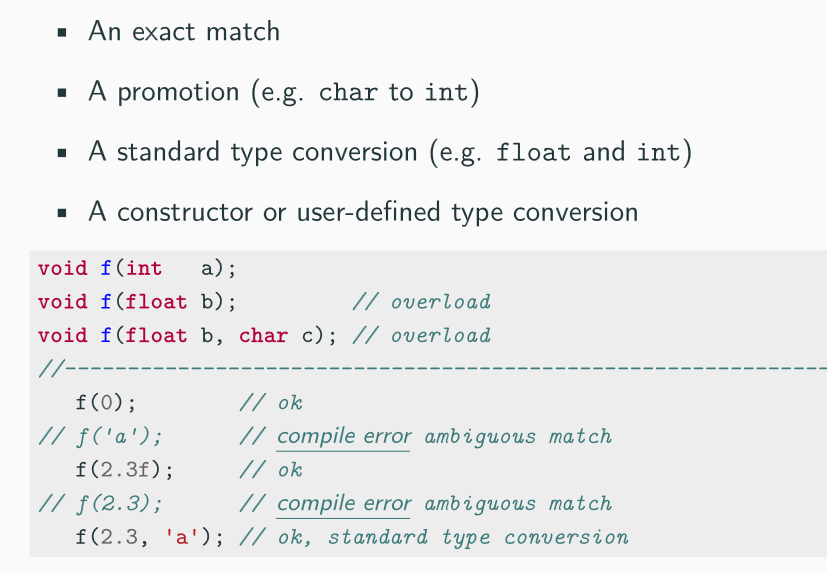
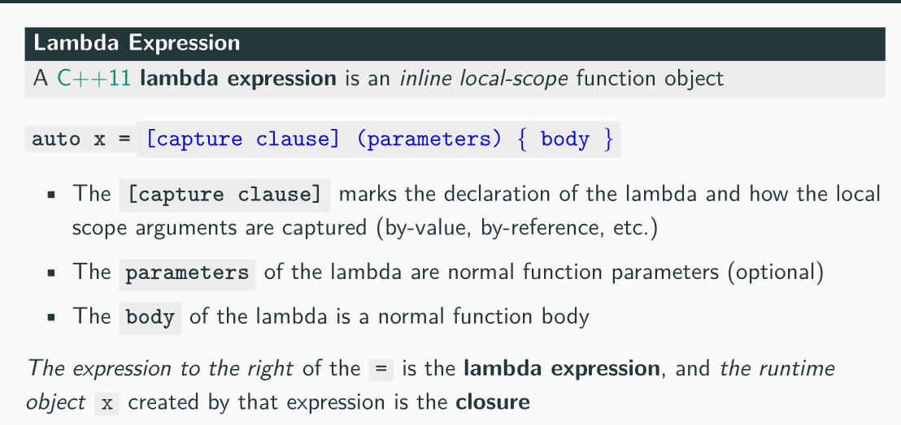
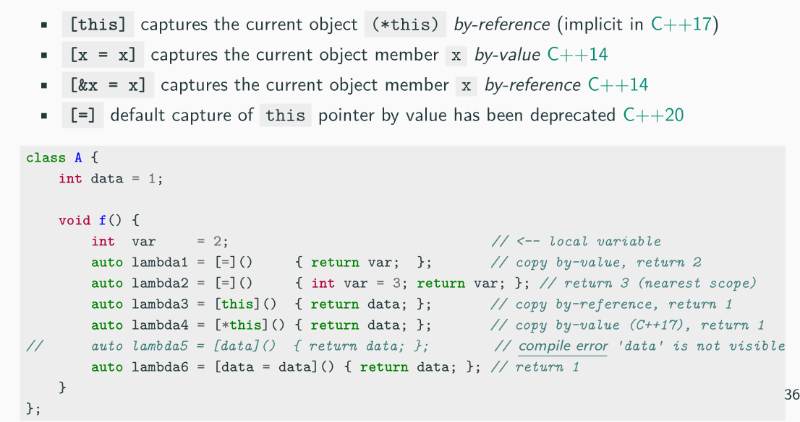
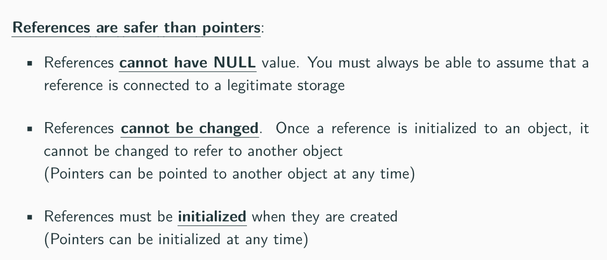
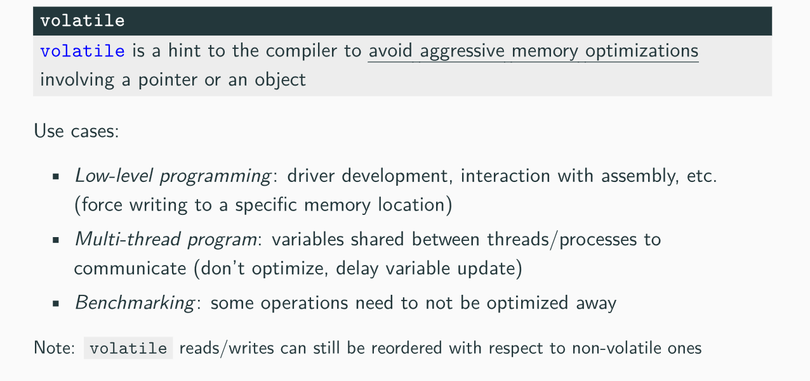
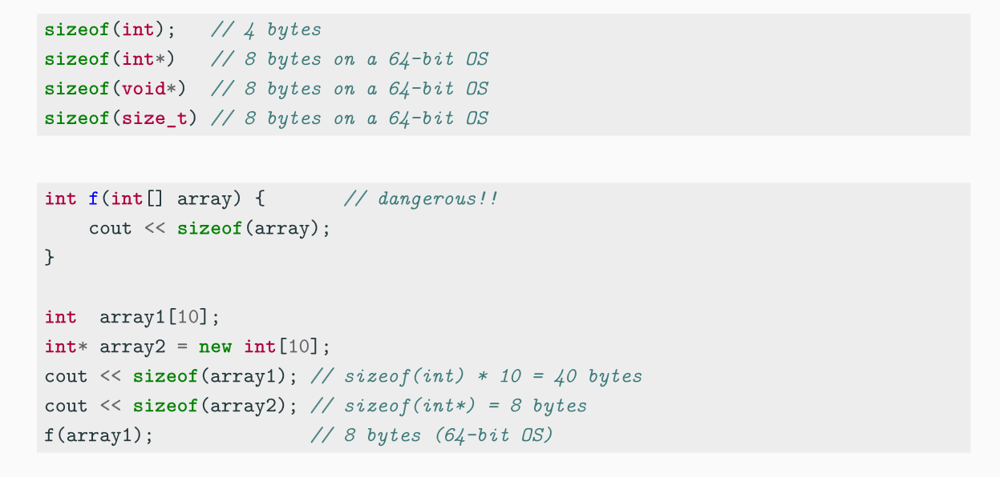
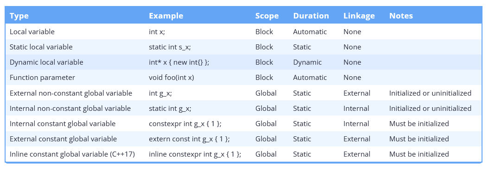
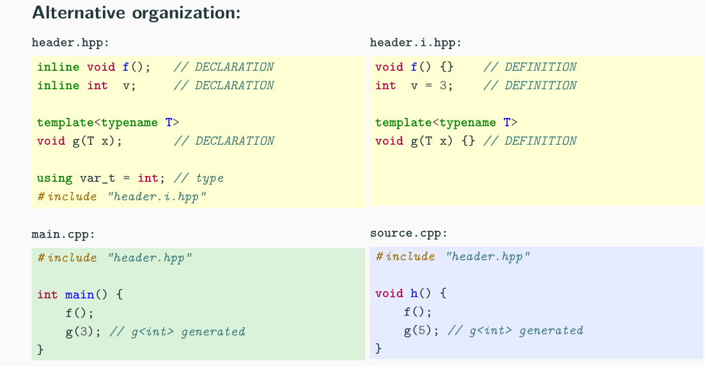

# Everything in C++ (clean)

> https://github.com/federico-busato/Modern-CPP-Programming
>
> -  Read chapter 18/19
>
> - Read chapter 9/10
>
> Things to Look into more
>
> - Review POD types, class layouts as defined in the [Class section.](#Classes, OOP, ...)
> - Review how type traits are implemented for a variety of examples. Notably review the Cppcon video.
> - Review The containers in the standard library, from a performance and use case perspective ==IMPORTANT==
>   - Ranges, iterators, algorithms, containers ...
> - Understand C++20 modules ==IMPORTANT==
> - Review The standard library as a whole looking at useful features ==IMPORTANT== 
> - Understand vector and string class under the hood - create your own maybe.
> - Understand Placement new
> - Understand bit manipulation from learncpp or elsewhere and why its useful ==IMPORTANT==.
> - Start collating a better understanding of template metaprogramming. ==IMPORTANT==
>   - Concepts, CRTP
>   - https://www.vishalchovatiya.com/variadic-template-cpp-implementing-unsophisticated-tuple/
> - Review & summarise auto rules. ==IMPORTANT==
> - Templates ... operator.
> - Clean up typing section ==IMPORTANT== 
> - Merge learncpp stuff on log slide into here - **not important but good**, notable topics to review
>   - Bit manipulation
> - Cppcon
>   - [Memory Allocators](https://www.youtube.com/watch?v=nZNd5FjSquk&t=538s)
>   - [Type Erasure](https://www.youtube.com/watch?v=tbUCHifyT24)
>   - [What is the C++ ABI](https://www.youtube.com/watch?v=DZ93lP1I7wU)
>   - [Important C++ Optimisations](https://www.youtube.com/watch?v=qCjEN5XRzHc)
>   - [Back 2 Basics Templates watch both parts](https://www.youtube.com/watch?v=XN319NYEOcE)
>   - [More init bullshit (useful maybe)](https://www.youtube.com/watch?v=7DTlWPgX6zs)
>   - [Rust vs C++ explained via static analysis](https://www.youtube.com/watch?v=_pQGRr4P16w)
>   - [back to basics templates]([Back 2 Basics Templates watch both parts](https://www.youtube.com/watch?v=XN319NYEOcE))
>   - [Delivering safe C++](https://www.youtube.com/watch?v=I8UvQKvOSSw)
>   - [Know your hardware](https://www.youtube.com/watch?v=BP6NxVxDQIs)
>   - [When a microsecond is  an eternity, High performance trading](https://www.youtube.com/watch?v=NH1Tta7purM)
>   - [Lambda idioms](https://youtu.be/xBAduq0RGes?si=r9zzRrX5TCzBhxTD)
> - Other
>   - [Good channel](https://www.youtube.com/@CodeForYourself)
>     - [Statics in modern C++](https://www.youtube.com/watch?v=7cpPQunjv4s)

### General C++

##### **Move semantics** ==TODO summarise from 19==

> Misc Reminders
>
> - [C++ acronoym glossary](https://quuxplusone.github.io/blog/2019/08/02/the-tough-guide-to-cpp-acronyms/)
>
> - Summary
>
>   ```cpp
>   std::string func1(const std::string& str){ /* implicit &memory_location if being assigned passed in as a param*/
>       std::string tmp{str};
>       return tmp; /* if func1() is being stored then RVO */
>   }
>                   
>   void wrap1(const std::string&){
>       func1(arg);
>   }
>                   
>   template<typename T>
>   std::string func2(T&& arg){
>       std::string tmp{std::forward<T>(arg)};
>       return tmp;
>   }
>                   
>   template<typename T>
>   void wrap2(T&& arg){
>       func2(std::forward<T>(arg)); // forward move semantics to another R value reference function so library makers speed up by distinguishing what can be copied and moved they can avoid spurios copies.
>   }
>                   
>   int main(){
>       /* temp implictly is copied into a std::string temporary to bind to the const std::string&
>       	copied again when constructed in func1
>       */
>       std::string data = "value";
>       wrap1("temp");
>                   
>       /* temp forwarded to the construction in func1 keeping it a temp so it only gets copied when
>       	the std::string is being made
>       */
>       wrap2("temp");
>   }
>   ```

##### **Value categories**

- https://stackoverflow.com/questions/3601602/what-are-rvalues-lvalues-xvalues-glvalues-and-prvalues

- [Excellent timestamp from templates](https://youtu.be/2Y9XbltAfXs?si=NuwedA6F4KgACLxn&t=1258)

  - `xvalue` - An expiring value, i.e a value that has been moved from an and is an invalid state. This is *cast* to an *rvalue reference*	
    - Example `std::move(x)` where `x` is an `lvalue`. 

  - `rvalue` - anything that is a `prvalue` or `xvalue`.

  - `prvalue` - Literals that are not user-defined literals or string literals

    - Applications of built-in arithmetic operators
    - A call to a function with non-reference return type
  - `lvalue` - `glvalues` that are **not xvalues**.

  

##### **Copy Elision, RVO, NRVO** ==CLEAN UP==

  - [Guaranteed copy elision](https://stackoverflow.com/questions/38043319/how-does-guaranteed-copy-elision-work) - modern.

    - [more details](https://www.open-std.org/jtc1/sc22/wg21/docs/papers/2015/p0135r0.html)
    - C++17 makes a pr value materialized only when required, then its constructed directly into the storage of its final destination. This means it may look like the syntax is copying and moving but no copy or move is actually performed. This is not really copy elision per se, its built into the language construct itself now, we dont need to define move or copy constructors like before.

  - RVO

    - NRVO (named return value optimisation) - This is where a value named in the function that has automatic duration is returned and the copy / move is elided.

      > in a [return statement](https://en.cppreference.com/w/cpp/language/return), when the operand is the name of a non-volatile object with automatic  storage duration, which isn't a function parameter or a catch clause  parameter, and which is of the same class type (ignoring [cv-qualification](https://en.cppreference.com/w/cpp/language/cv)) as the function return type. This variant of copy elision is known as NRVO, "named return value optimization."

    - URVO (unnamed return value optimisation) - This is the same as NRVO apart from the fact there was no name i.e there was no original 

      ```cpp
      struct Type {
      	Type() : x{ 0 } { std::print("default constructor"); }
      	Type(int val) : x{ val } { std::print("int constructor\n");}
      	Type(const Type& obj) : x{ obj.x } { std::print("copy construct\n"); }
      	Type(Type&& obj) noexcept : x{obj.x} { std::print("move construct\n"); }
      	int x;
      };
      
      Type NVRO() {
      	Type inner_var{ 2 };
      	return inner_var;
      }
      
      Type UVRO() {
      	return Type{ 2 };
      	//return { 2 }; same as the above unnamed
      }
      
      int main() {
      	Type t{ UVRO() };
      	std::print("value: {}", t.x);
      }
      ```

  - This links to the bit on https://en.cppreference.com/w/cpp/language/copy_elision that discusses this fact with the following basic example:

    ```cpp
    T x = T(T(f())); // x is initialized by the result of f() directly; no move
    // If f were a direct call to T() that would also be elided 
    ```

    - Noting that in some cases **elision cannot apply**

    ```cpp
    struct C { /* ... */ };
    C f();
     
    struct D;
    D g();
     
    struct D : C
    {
        D() : C(f()) {}    // no elision when initializing a base-class subobject
        D(int) : D(g()) {} // no elision because the D object being initialized might
                           // be a base-class subobject of some other class
    };
    ```

    ```cpp
    struct Type {
    
    	Type() : x{ 0 } { std::print("default constructor"); }
    	explicit Type(int val) : x{ val } { std::print("int constructor\n");}
    	Type(const Type& obj) : x{ obj.x } { std::print("copy construct\n"); }
    	Type(Type&& obj) noexcept : x{obj.x} { std::print("move construct\n"); }
    
    	int x;
    };
    
    int main() {
    	Type t{ Type{2}}; // The construction of Type {2} and the move of its temporary are both elided resulting in a construction of Type directly from an integer.
    	std::print("value: {}", t.x);
    }
    ```

    - This extends to be anything is elided to directly replace the arguments initializing the r-value type, this is what C++17 idea of *deferred*

##### **Universal References & Perfect Forwarding**

> Scott meyers effective modern C++

##### **Type Deduction**

> Scott meyers effective modern C++

##### **`const` correctness** ==TODO read 18== 

##### Control Flow ==TODO: summarise this from 4== 

##### Lifetime

- [lifetime](https://en.cppreference.com/w/cpp/language/lifetime)

##### Misc

- [What are cv qualifiers in C++](https://stackoverflow.com/questions/27527642/what-does-cv-qualified-mean)

- [Runtime vs Compile time](https://stackoverflow.com/questions/846103/runtime-vs-compile-time)

- The main function returns `0` 

- C++ Escape characters

  

### Idioms ==READ 19==

> [C++ Idioms](https://en.wikibooks.org/wiki/More_C%2B%2B_Idioms)

##### RAII

##### Rule of zero / three / five

##### Singleton

##### PIMPL

> [Pimpl Idiom](https://en.wikibooks.org/wiki/C%2B%2B_Programming/Idioms#Pointer_To_Implementation_(pImpl))

- Also called the **opaque pointer** idiom is a method of providing data and thus further implementation abstraction for Classes.
- See more in architecture section

##### CRTP

```cpp
#include <cstdio>
 
#ifndef __cpp_explicit_this_parameter // Traditional syntax
 
template <class Derived>
struct Base { void name() { (static_cast<Derived*>(this))->impl(); } };
struct D1 : public Base<D1> { void impl() { std::puts("D1::impl()"); } };
struct D2 : public Base<D2> { void impl() { std::puts("D2::impl()"); } };
 
void test()
{
    // Base<D1> b1; b1.name(); //undefined behavior
    // Base<D2> b2; b2.name(); //undefined behavior
    D1 d1; d1.name();
    D2 d2; d2.name();
}
 
#else // C++23 alternative syntax; https://godbolt.org/z/s1o6qTMnP
 
struct Base { void name(this auto&& self) { self.impl(); } };
struct D1 : public Base { void impl() { std::puts("D1::impl()"); } };
struct D2 : public Base { void impl() { std::puts("D2::impl()"); } };
 
void test()
{
    D1 d1; d1.name();
    D2 d2; d2.name();
}
 
#endif
 
int main()
{
    test();
}
```

##### Template Virtual functions

##### SFINAE

> [SFINAE](https://en.wikibooks.org/wiki/More_C%2B%2B_Idioms/SFINAE) - wikibooks
>
> [SFINAE Reference](https://en.cppreference.com/w/cpp/language/sfinae) - cppreference

- Substitution failure is not an error.
- This rule applies during overload resolution of function templates: When substituting the explicitly specified or deduced type for the template parameter fails, the specialisation is discarded from the overload set instead of causing a compile error. 

##### NVI

[Non virtual interface](https://en.wikibooks.org/wiki/More_C%2B%2B_Idioms/Non-Virtual_Interface)

- We basically have a *private method* in our *interface* which is a virtual method.

- This ensures our base class can control pre and post conditions regarding a derived classes implementation of said virtual function.

##### Erase-Remove Idiom

- [Erase remove idiom](https://en.wikipedia.org/wiki/Erase%E2%80%93remove_idiom)

```cpp
// Use g++ -std=c++11 or clang++ -std=c++11 to compile.

#include <algorithm>  // remove and remove_if
#include <iostream>
#include <vector>

void Print(const std::vector<int>& vec) {
  for (auto val : vec) {
    std::cout << val << ' ';
  }
  std::cout << '\n';
}

int main() {
  std::vector<int> v = {0, 1, 2, 3, 4, 5, 6, 7, 8, 9};
  Print(v);

  // Removes all elements with the value 5.
  v.erase(std::remove(v.begin(), v.end(), 5), v.end());
  Print(v);

  // Removes all odd numbers.
  v.erase(std::remove_if(v.begin(), v.end(), [](int val) { return val & 1; }),
          v.end());
  Print(v);
}

1 2 3 4 5
  2   4 >    13424  
/*				^
Output:
0 1 2 3 4 5 6 7 8 9
0 1 2 3 4 6 7 8 9
0 2 4 6 8
*/
```

- In C++20 We have the free function `std::erase \ erase_if` which implements the erase remove idiom for us.

### Operators

> Misc Reminders
>
> - Order of Evaluation - https://en.cppreference.com/w/cpp/language/eval_order
>
> - Comma  `, `operator return type:
>
>   ```cpp
>     auto func = [&](int x , int y) {return x + 1, y;} /* evalautes x+1 but returns y *
>   ```
>   

- **Classifications**
  
  - Unary e.g `a++`
  - Binary e.g `a+b`
  - Comparison e.g. `<`
  - Bitwise e.g `&, ^` 
  - Compound Assignment e.g. `+=` 
  - Math `+, -`
  
- **Operator precedence**

  

  - The comma `,` operator has the lowest precedence of all.

- **Prefix / Postfix Increment Semantic**

  

- **UB** with operator ordering

  ```cpp
  int i = 0;
  i = ++i + 2;  // until C++11: undefined behavior
                // since C++11: i = 3
  
  i = 0;
  i = i++ + 2;  // until C++17: undefined behavior
                // since C++17: i = 3
  
  f(i = 2, i = 1);  // until C++17: undefined behavior
                    // since C++17: i = 2
  
  i = 0;
  int a[1];
  a[i] = i++;  // until C++17: undefined behavior
               // since C++17: a[0] = 1
  
  f(++i, ++i);  // undefined behavior
  i = ++i + i++;  // undefined behavior
  
  ```

- **Associativity**

  - Assignment and compound have *right to left* -> return assigned value.
  - Comma has *left to right*. Evaluates the left -> discards the result -> returns right

- **Spaceship `<=>`**

  - Provides a **three way comparison operator** which allows comparing two objects in a similar way of `strcmp`

  - The operator returns an object that can be directly compared with a positive, `0` or negative integer value

    ```cpp
    (3 <=> 5) == 0; // false
    ('a' <=> 'a') == 0; // true
    (3 <=> 5) < 0; // true
    (7 <=> 5) < 0; // false
    ```

- **Safe comparison operators**

  - C++ 20 introduces a set of functions `<utility>` to safely compare integers of different types (`signed`, `unsigned`)

    ```cpp
    // C++20 introduces a set of functions <utility> to safely compare integers of different types (signed, unsigned)
    bool cmp_equal(T1 a, T2 b);
    bool cmp_not_equal(T1 a, T2 b);
    bool cmp_less(T1 a, T2 b);
    bool cmp_greater(T1 a, T2 b);
    bool cmp_less_equal(T1 a, T2 b);
    bool cmp_greater_equal(T1 a, T2 b);
    
    // example:
    #include <utility>
    
    unsigned a = 4;
    int b = -3;
    bool v1 = (a > b); // false!!!
    bool v2 = std::cmp_greater(a, b); // true
    
    // How to compare signed and unsigned integers in C++20?
    ```

### Bit Manipulation

How bitwise OR represents flags

- ```cpp
  BINARY DECIMAL COLOR
  ------ ------- -----
     001       1  Red
     010       2  Green
     011       3  Red+Green
     100       4  Blue
     101       5  Blue+Red
     110       6  Blue+Green
     111       7  Blue+Green+Red
  ```

- So `Red` is an integer and so is `Blue` 

- Bitwise OR `|` combines the two 

- Therefore when we bitwise AND `&` check it evaluates true for both `Red` and `Blue` , alternatively as shown above `101` is the value stored from the bitwise OR which is represented in the program.

### Types (Integral , Floating-point, Other) ==TODO: Chapter 3==

> Misc Reminders
>
> - Prefer `int` for simple numbers
> - C++ types - https://en.cppreference.com/w/cpp/language/types
> - Prefer fixed width integers for most cases
>
>   - `std::uint8_t` for chars
>   - `std::size_t` for sizes i.e unsigned integer type dependent on the architecture
>   - Prefer larger unsigned integers for varying contexts
>
> - Prefer fixed width integers in general
>
> - [object-sizes-and-the-sizeof-operator](https://www.learncpp.com/cpp-tutorial/object-sizes-and-the-sizeof-operator/)
>
>   
>
> - Be careful when using integer division, as you will lose any fractional  parts of the quotient. However, if it’s what you want, integer division  is safe to use, as the results are predictable.
>
> - Overflow is **undefined behaviour** in C++ for signed integers
>
>   ```cpp
>   #include <iostream>
>   
>   int main()
>   {
>       // assume 4 byte integers
>       int x { 2'147'483'647 }; // the maximum value of a 4-byte signed integer
>       std::cout << x << '\n';
>   
>       ++x; // integer overflow, undefined behavior
>       std::cout << x << '\n';
>   
>       return 0;
>   }
>   ```
>
> - *Integer* refers to the `int` datatype, whereas *Integral* (https://en.cppreference.com/w/cpp/types/is_integral) is more broad and can include `bool` 

##### Arithmetic Types

- **Integral Types**


- **Floating Point**


- **Short Name**


- **Suffix  (Literals)**

  

  

- **Prefix (Literals)**

  

  - C++14 adds digit separators for improving the readability `1'000'000` 

- **Other**

  - C++ has `long double` (not IEEE 754) of size 8/12/16 bytes depending on the implementation
  - Reduced precision floating point support before C++23
    - Some compilers provide support for `half` (16 bit floating point)
    - Some modern CPUs and GPUs provide `half` instructions.
  - C++ does not have 128 bit integers

##### **Other**

- **Void** 
  - `void` is an incomplete type without a value
  - `void` can indicate a function that has not return type or no parameters
  - `sizeof(void)` fails to compile in C++ but not C.
- **nullptr**
  - Replaces `NULL` and `0` to act as a nullptr with a type `nullptr_t` 

##### Conversion Rules

- **Implicit conversion rules** - Applied in order, before any operation

  

  

  ```cpp
  float f = 1.0f;
  unsigned u = 2;
  int i = 3;
  short s = 4;
  uint8_t c = 5; // unsigned char
  
  f * u; // float x unsigned → float: 2.0f
  s * c; // short x unsigned char → int: 20
  u * i; // unsigned x int → unsigned: 6u
  +c; // unsigned char → int: 5
  
  // Integers are not floating points!
  int b = 7;
  float a = b / 2; // a = 3 not 3.5!
  int c = b / 2.0; // again c = 3 not 3.5!
  ```

- **Implicit Promotion**

  - Integral data types smaller than 32 bit are implicitly promoted to `int`, independently if they are *signed* or *unsigned*

  - Unary `+, - , ~` and Binary `+, -, & etc` promotion:

    ```cpp
    char a = 48;      // '0'
    cout << a;        // print '0'
    cout << +a;       // print '48'
    cout << (a + 0);  // print '48'
    
    uint8_t a1 = 255;
    uint8_t b1 = 255;
    cout << (a1 + b1);  // print '510' (no overflow)
    
    ```

##### Auto

> See modern effective C++ first few items for more detail.

- `auto` keyword specifies that the type of the variable is automatically deduced by the compiler from its initialiser.
- `decltype` keyword can be used to declare the type of the expression inside it
- `declytype(auto)` applies type deduction rules automatically using the rules based off `decltype`.

### Functions & Preprocessing (6)

> Misc reminders
>
> - [Function overload resolution](https://www.learncpp.com/cpp-tutorial/function-overload-resolution-and-ambiguous-matches/)
>
> - Mental model of functions
>
>   ```cpp
>   int func (){
>       return 1;
>   }
>   int& func2(){
>       int x {1};
>       return x;
>   }
>   int* func3(){
>       int x {1};
>       return &x;
>   }
>   // extremely rare and pretty much never used, this is used in std::forward and std::forward as a `cast` 
>   // to interpret the passed in lvalue as an expiring xvalue (std::move) but std::forward maintains the value category via reference collapsing based on the deduce return type (see c++11 modern cheatsheet for more information)
>   int&& func4(){
>   }
>   int main(){
>       func(); // func returns temporary, this is an r-value 1
>       func2(); // this returns an alias for the internal variable x (note in our example x would be destroyed after this line)
>       func3(); // this returns a temporary of int pointer type
>   }
>   ```
>
> - `return` 
>
>   - Key idea with functions is the `return` statement defines some entity, of which must be able to represented (underlying bits) in the return type without causing any issues
>     - dropping const / volatile qualifiers
>     - Losing precision 
>     - Just any general bad conversions
>   - When the function returns there are a few cases:
>     - Pointer > pointer temporary is returned
>     - Reference > ref alias is returned (maybe copied impl defined)
>     - Value > temporary value is returned (Copy elision [**see in initialisation section for more details**] can be detected in cases to avoid the temporary value being materialized, and used only at the point of where that temporary was destined to be stored)
>   - When you use the result of a function you are binding it to some other place such as constructor, assignment or function call, but the result of a function by itself is its own type, typically a temporary as explained above, but references being the nuance case.
>
> - [When to use inline functions](https://stackoverflow.com/questions/1932311/when-to-use-inline-function-and-when-not-to-use-it)
>
> - [`inline` functions vs preprocessor macros](https://stackoverflow.com/questions/1137575/inline-functions-vs-preprocessor-macros)
>
> - When the compiler inline-expands a function call, the function’s code gets inserted into the caller’s code stream (conceptually similar to what happens with a [`#define` macro](https://isocpp.org/wiki/faq/inline-functions#inline-vs-macros)). This can, [depending on a zillion other things](https://isocpp.org/wiki/faq/inline-functions#inline-and-perf), improve performance, because the optimiser can [procedurally integrate](https://isocpp.org/wiki/faq/inline-functions#procedural-integration) the called code — optimize the called code into the caller.
>
> - `std::bind` - [What is std::bind in C++](https://thispointer.com/stdbind-tutorial-and-usage-details/#:~:text=std%3A%3Abind%20is%20a,passed%20function%20bound%20or%20rearranged)
>
>   ```cpp
>   void add(int first, int second, const char* string ) {
>   	                                              
>   	std::cout << "first: " << first << "| second : " << second << std::endl;
>   	std::cout << "word :" << string << std::endl;
>                                                 
>   }
>   auto func = std::bind(&add, std::placeholders::_1, std::placeholders::_2, "test");
>                                                 
>   /* can call func, using our default "test" string on each value*/
>   ```

##### **Declarations / Definition**


- A declaration without a concrete implementation is an **incomplete type**

  


##### Functions


- **Pass by value**

  

- **Pass by pointer**

  

- **Pass by reference** 

  

- **Function signature and overloading**

  

  

- **Overloading Resolution Rules**

  ​	

  

  

  - use `=` delete to avoid overloading wrong

    

- **Function default parameters**

  

- **Function Attributes `[[attribute]]`** 

  

  

##### **Function Pointers & Function Objects**

- **Function pointer - Function as Argument**

  

- **Function Pointer - Function as Argument**

  

- **Function Object (or Functor)**

  

  - Inlining is the standard behaviour in this context.
  - Can use templates

##### Lambda Expressions




- **Capture List**

  

  

- Capture list examples

  

  - Other

    

- **Lambda expressions - Parameters**

  

- **Lambda expressions - Composability**

  

- `const` and `consteval` lambda expressions

  

- `template` lambda expressions

  

- `mutable` lambda expression

  

- `[[nodiscard]] Attribute ` 


- Capture and Classes

  

##### Preprocessing ==VIEW CONTENT ON 6== 

### Memory Management (5) ==READ 19 smart pointers==

> Misc Reminders
>
> - **Alignment**
>
>   - [How to use alignof, alignas](https://stackoverflow.com/questions/17091382/memory-alignment-how-to-use-alignof-alignas)
>
>   - Alignment is a *restriction* on which *memory positions* some values *first byte* can be stored. 
>
>   - Alignment of `16` means the memory addresses that are **multiples** of `16` are the only valid addresses.
>
>   - The `alignas` keyword forces alignment to the desired type of powers of `2` only
>
>   ```cpp
>     #include <cstdlib>
>     #include <iostream>
>
>     int main() {
>         alignas(16) int a[4];
>         alignas(1024) int b[4]; /* rather than taking up 16 bytes, each one now pads up to 1024 bytes.*/
>         printf("%p\n", a);
>         printf("%p", b);
>     }
>   ```
>
>   ```cpp
>     #include <iostream>
>
>     /* the alignment is equal to the largest alignment data member
>         every member must now follow this alignment rule and thus short would be padded 2 bytes to fit the
>         4 byte alignment set by int
>     */
>     struct Foo2 /* alignment = 4 bytes, sizeof = 12 bytes for 3 members aligned to 4*/
>     {
>         short a{};/* 2 bytes*/
>         /*2 padding bytes*/
>         int b{}; /* 4 bytes*/
>         short qq{}; /*2 bytes*/
>        /*2 bytes*/
>     };
>
>     int main() {
>         std::cout << sizeof(short) << std::endl;
>         std::cout << sizeof(short) << std::endl;
>         std::cout << sizeof(int) << std::endl;
>         // total size of data members individually is 10 but as there must be padding to ensure proper alignment this changes.
>         std::cout << sizeof(Foo2) << std::endl; // size is 12
>     }
>   ```
>
> - **Placement New**
>
>   - `std::vector`
>
>     
>
>   - [Placement New use cases](https://stackoverflow.com/questions/222557/what-uses-are-there-for-placement-new)
>
>   - [Placement new explained as a memory pool calling explicit destructors](https://www.youtube.com/watch?v=2bsGFQgBMXs )
>
>   ```cpp
>   class Arena {
>       public:
>              void* allocate(size_t);
>               void deallocate(void*);
>               // ...
>   };
>                 
>   void* operator new(size_t sz, Arena& a){
>     return a.allocate(sz);
>   }
>                 
>   Arena a1(some arguments);
>   Arena a2(some arguments);
>                 
>   // parameters to placement new
>   void* operator new(std::size_t, /* extra parameters*/){
>     /* do something then return a pointer to at least size bytes */
>   }
>   ```
>
> 
>
> - R value references
>
>   
>
> - L value references
>
>   - Temporary / Conversion with reference binding
>
>     ```cpp
>     int main() {
>         const int& val0 = 2; // temporary + no conversion
>         int& val1 = 3; // [error]
>         int three = 3;
>         const int& val2 = three; // no temporary + no conversion
>         int& val3 = three; // no temporary + no conversion
>         // both of these cases float has an conversion to int, three is materialized into a temporary
>       // and under the hood binded to the converison oreator
>         const float& val4 = three; // temporary + conversion
>         const float val4b = threel // temporary + conversion
>         float& val5 = three; // [error] 
>         int int_val = 4;
>         float&& val = int_val; // temporary + conversion
>       const float&& val = int_cal // temporary +conversion
>         return 0;
>     }
>     ```
>
> - [Always favour references to pointers whenever possible](https://www.learncpp.com/cpp-tutorial/null-pointers/)
>
> - Temporary materialisation as a concept:
>
>   ```cpp
>   // this is some bullshit showingn referecene materialisation
>   float f = ...;
>   const int& i = f;
>   //is the same as
>   float f = ...;
>   int __i = f;
>   const int& i = __i;
>   ```
>
> - Returning `const` from a function is redundant if its a reference as that will be dropped for a new variable
>
>   ```cpp
>   const int& func1() {
>   	int x{ 1 }; 
>   	return x;
>   }
>   const int func2() {
>   	int x{ 1 }; 
>   	return x;
>   }
>   int main() {
>   	int& val = func1(); // [error] cannot bind const int to int 
>       int val = func2(); // [ok] drops the const okay
>   }
>   ```
>
> - Function pointer syntax
>
>   ```cpp
>     *test(bool) // function pointer taking a bool as input
>     void (*(*test(bool)))() // add parentheses around it then add a poonter and another pair of brackets
>      //this is now a function pointer retunr a function pointer that takes no inputs and returns void
>
>     // to extend remove void with another pointer and add another pointer layer placing bracket after return type of the other
>
>      int(*(*(*test(bool)))())() 
>   ```
>
>   - This is a pointer to a function called test taking (bool) which returns a function pointer that points to another function pointer that returns int
>
> - References are **not objects** so when a class returns a reference its not returning an object.
>
> - When you bind a const T& to a T, there is no conversion going on.
>
> - A compiler knows all function local variables can be moved from.
>
> - calculate difference between pointer in bytes by casting to `char*` inst
>
> - [When to pass by pointer vs reference](https://cplusplus.com/articles/z6vU7k9E/)
>
> - [Differences between references and pointers](https://stackoverflow.com/questions/57483/what-are-the-differences-between-a-pointer-variable-and-a-reference-variable)
>
> - [Shared Pointer vs Raw pointers](https://stackoverflow.com/questions/7657718/when-to-use-shared-ptr-and-when-to-use-raw-pointers)
>
> - [R value references to arrays in C++](https://stackoverflow.com/questions/22562187/what-is-the-purpose-of-rvalue-reference-to-an-array-in-c11 )
>
> - [Make Shared](https://en.cppreference.com/w/cpp/memory/shared_ptr/make_shared)
>
>   - [Make Shared vs Normal shared](https://stackoverflow.com/questions/20895648/difference-in-make-shared-and-normal-shared-ptr-in-c)
>
> - [References vs Pointers](https://stackoverflow.com/questions/7058339/when-to-use-references-vs-pointersv)
>
> - [std:ref(T) vs T&](https://stackoverflow.com/questions/33240993/c-difference-between-stdreft-and-t)
>
> - [Passing reference to a class constructor](https://stackoverflow.com/questions/4321305/best-form-for-constructors-pass-by-value-or-reference)
>
> - `std::unique_ptr` vs `std::shared_ptr`  for pimpl idiom - https://stackoverflow.com/questions/5576922/should-i-use-shared-ptr-or-unique-ptr
>
> - `std::unique_ptr` - generates a custom delete when there is no default destructor specified within the class its placed in.
>
> - `static_cast<int>(x) vs int(x)`-  (https://stackoverflow.com/questions/103512/why-use-static-castintx-instead-of-intx)
>
> - [Five advanced init techniques in C++](https://www.cppstories.com/2023/five-adv-init-techniques-cpp/)
>
> - [Statics initialisation order](https://stackoverflow.com/questions/211237/static-variables-initialisation-order)
>
> - Difference in bytes of pointers when subtracting
>
>   ```cpp
>   #include <iostream>
>
>   int main() {
>       int array[5];
>       int* ptr1 = &array[0]; // Pointer to the first element
>       int* ptr2 = &array[3]; // Pointer to the fourth element
>
>       // Casting to char* for byte-wise subtraction
>       std::ptrdiff_t byteDiff = reinterpret_cast<char*>(ptr2) - reinterpret_cast<char*>(ptr1);
>
>       std::cout << "The difference in bytes is: " << byteDiff << std::endl;
>
>       return 0;
>   }
>   ```
>
> - Avoid literals and static casts when dealing with type conversions:
>
>   ```cpp
>    // We can avoid literals with suffixes
>    unsigned int u{ 5 }; // okay (we don't need to use `5u`)
>    float f{ 1.5 };      // okay (we don't need to use `1.5f`)
>                 
>    // We can avoid static_casts
>    constexpr int n{ 5 };
>    double d{ n };       // okay (we don't need a static_cast here)
>    short s{ 5 };        // okay (there is no suffix for short, we don't need a static_cast here)
>                 
>    return 0;
>   ```
>

##### Heap and Stack

- **Process Address Space**

  

- **Data and BSS segment**

> https://en.wikipedia.org/wiki/.bss

- Data / BSS (Block Started by Symbol) segments are larger than stack memory (max size is about 1GB generally) but slower.

```cpp
int data[] = {1,2}; // Data segment memory
int big_data[10000000] = {}; //BSS segment memory, zero initialized.
```

- **Stack and Heap Memory Overview**


- **Stack Memory**

  -  A local variable is in the stack memory or CPU registers

    

    ```cpp
    int x = 3; // not on the stack (data segment)
    struct A {
        int k; // depends on where the instance of A is
    };
    
    int main() {
        int y = 3; // on stack
        char z[] = "abc"; // on stack
        A a; // on stack (also k)
        void* ptr = malloc(4); // variable "ptr" is on the stack
    }
    ```

  -  **Stack Memory Data**

    

  -  Each object which resides in the stack is not valid outside his scope

    

  -  **`new` and `delete` keywords**

    

    

  -  **Dynamic Memory Allocation**

    

    

  -  **Allocation Deallocation Properties**

  

  

  - 2D Memory Allocation

    

    

  - **Non allocating placement (ptr) type**  allows to explicitly specify the memory location (previously allocated) of individual objects

    

  - **Non allocating Placement and Objects** 

    

  - **Non-Throwing Allocation**
  
    
  
  - **Memory Leak**
  
    
  
  - **Dynamic Memory Allocation and OS**
  
    
  
##### Initialisation

> Resources
>
> - https://en.cppreference.com/w/cpp/language/initialization
>
> - [Init in C++ is bonkers](http://mikelui.io/2019/01/03/seriously-bonkers.html)
>
> - [Another init reference](https://accu.org/journals/overload/25/139/brand_2379/)


  - **Variable initialisation**
  
    ```cpp
    int a1;              // default initialization (undefined value)
    
    int a2(2);           // direct (or value) initialization
    int a3{};            // direct (or value) initialization (zero-initialization)
    
    // int a4();        // a4 is a function
    
    int a5 = 2;          // copy initialization
    int a6 = 2u;         // copy initialization (+ implicit conversion)
    int a7 = int(2);     // copy initialization
    int a8 = int();      // copy initialization (zero-initialization)
    
    int a9 = {2};        // copy list initialization
    
    ```
  
  - **Uniform Initialisation**
  
    ```cpp
    int b1{2};   // direct list (or value) initialization
    
    int b2{};    // direct list (or value) initialization (zero-initialization)
    
    int b3 = int{};  // copy initialization (zero-initialization)
    
    int b4 = int{4}; // copy initialization
    
    int b5 = {};     // copy list initialization (zero-initialization)
    
    ```

  

  - **Fixed-size Array initialisation**

    ```cpp
    // One dimension
    int a[3] = {1, 2, 3}; // explicit size
    int b[] = {1, 2, 3}; // implicit size
    char c[] = "abcd"; // implicit size
    int d[3] = {1, 2}; // d[2] = 0 -> zero/default value
    int e[4] = {0}; // all values are initialized to 0
    int f[3] = {}; // all values are initialized to 0 (C++11)
    int g[3] {}; // all values are initialized to 0 (C++11)
    
    // Two dimensions
    int a[][2] = { {1,2}, {3,4}, {5,6} }; // ok
    int b[][2] = { 1, 2, 3, 4 }; // ok
    // the type of "a" and "b" is an array of type int[]
    // int c[][] = ...; // compile error
    // int d[2][] = ...; // compile error
    ```

  - **Structure Initialisation**

    ```cpp
    struct S {
        unsigned x;
        unsigned y;
    };
    
    S s1; // default initialization, x,y undefined values
    S s2 = {}; // copy list initialization, x,y zero/default-initialization
    S s3 = {1, 2}; // copy list initialization, x=1, y=2
    S s4 = {1}; // copy list initialization, x=1, y zero/default-initialization
    //S s5(3, 5); // compiler error, constructor not found
    
    S f() {
        S s6 = {1, 2}; // verbose
    	return s6;
    }
    
    // ----------------- Version 2----------------------------//
    struct S {
    unsigned x;
    unsigned y;
    void* ptr;
    };
    S s1{}; // direct list (or value) initialization
    		// x,y,ptr zero/default-initialization
    
    S s2{1, 2}; // direct list (or value) initialization
    			// x=1, y=2, ptr zero/default-initialization
    			// S s3{1, -2}; // compile error, narrowing conversion
    
    S f() { return {3, 2}; } // non-verbose
    
    // Non static data member initialisation (NSDMI) also called brace or equal initialization
    struct S {
        unsigned x = 3; // equal initialization
        unsigned y = 2; // equal initialization
    };
    struct S1 {
    	unsigned x {3}; // brace initialization
    };
    
    S s1; // call default constructor (x=3, y=2)
    S s2{}; // call default constructor (x=3, y=2)
    S s3{1, 4}; // set x=1, y=4
    
    // Designated initialization - Designated Initializer list
    struct A {
    	int x, y, z;
    };
    
    
    A a1{1, 2, 3}; // is the same of
    A a2{.x = 1, .y = 2, .z = 3}; // designated initializer list
    
    // Improve code clarity
    void f1(bool a, bool b, bool c, bool d, bool e) {}
    
    // long list of the same data type -> error prone
    struct B {
    	bool a, b, c, d, e;
    }; // f2(B b)
    f2({.a = true, .c = true}); // b, d, e = false 
    
    // Structured binding C++17.
    struct A {
        int x = 1;
        int y = 2;
    } a;
    
    A f() { return A{4, 5}; }
    
    // Case (1): struct
    auto [x1, y1] = a; // x1=1, y1=2
    auto [x2, y2] = f(); // x2=4, y2=5
    
    // Case (2): raw arrays
    int b[2] = {1,2};
    auto [x3, y3] = b; // x3=1, y3=2
    
    // Case (3): tuples
    auto [x4, y4] = std::tuple<float, int>{3.0f, 2}; 
    ```

  - **Dynamic Memory Initialisation** 

    ```cpp
    // C++03
    int* a1 = new int; // undefined
    int* a2 = new int(); // zero-initialization, call "= int()"
    int* a3 = new int(4); // allocate a single value equal to 4
    int* a4 = new int[4]; // allocate 4 elements with undefined values
    int* a5 = new int[4](); // allocate 4 elements zero-initialized, call "= int()"
    // int* a6 = new int[4](3); // not valid
    ```

##### Pointers and References

- **Pointers**

  

  

- **Pointer Conversion**


- **Pointer and Pointer Operations**

  

- **Pointer Arithmetic**

  ​	

  

  

- **Address-of operator &**

  

- **Wild & Dangling Pointers**

  

- **`void` Pointer - Generic Pointer**

  

  

  - **Reference**

    

    

    

  - **Reference - Function Arguments**

    

    

  - `Reference Arrays*`

    

  - `struct` Member Access

    

##### Constants & Literals

- **const** - keyword that indicates objects never changing value after their initilisation (must be initialised when declared)

  - Evaluated at compile time if the right expression is also evaluated at compile time


- **constexpr** - specifier declares that the expressions can be evaluated at compile time

  - const guarantees the value of a variable to be fixed overall the execution of the program

  - constexpr implies const

  - constexpr helps performance and memory usage

  - constexpr can impact compilation time maybe

    ```cpp
    const int v1 = 3;               // compile-time evaluation
    const int v2 = v1 * 2;          // compile-time evaluation
    
    int a = 3;                      // "a" is dynamic
    const int v3 = a;               // run-time evaluation!!
    
    constexpr int c1 = v1;          // ok
    // constexpr int c2 = v3;       // compile error, "v3" is dynamic
    
    ```

- **constexpr function** - Guarantees compile-time evaluation of a function as long as all its arguments are evaluated at compile time

  

- **Limitations of constexpr**

  

  

- `constexpr` non-static member functions of run time objects cannot be used even if all constraints are respected

- `static constexpr` member functions dont present this issue as they dont depend on any instance

- **consteval** - or immediate functions, guarantees compile-time evaluation of a function. A non-constant value always produces a compilation error

  ```cpp
  consteval int square(int value){
      return value * value;
  }
  
  square(4); // compile-time evaluation
  int v = 4; // v is dynamic
  //square (v); // compile error.
  ```

- **constinit** - guarantees compile time initialisation of a variable. A non cosntant always produces a compilation error

  - Value of a variable can change during the execution

  - `const constinit` does not imply `constexpr`, while the opposite is true.

  - `constepxr` requires compile time evaluation during its entire lifeteime

    ```cpp
    constexpr int square (int value){
        return value * valule;
    }
    
    constinit int v1 = square(4); // compile time evaluation
    v1 = 3; // v1 can change 
    int a = 4; // v is dynamic
    // constinit int v2 square(a) // compile error as a is dynamic
    ```

- **if constexpr**

  

  

- **std::is_constant_evaluated** utility is to evaluate if the current function is evaluated at compile time

  ```cpp
  #include <type_traits> //std::is_constant_evaluated
  
  constexpr int f(int n) {
      if (std::is_constant_evaluated())
          return 0;
      return 4;
  }
  
  int x = f(3); // x = 0
  
  int v = 3;
  int y = f(v); // y = 4
  ```

- **if consteval**

  

  

##### **Volatile keyword**




##### Explicit Type Conversion (casts, type punning)

- Cast

  

  

  

  - Type punning

    

    ```cpp
    // slow without optimizations. The branch breaks the CPU instruction pipeline
    float abs(float x) {
    	return (x < 0.0f) ? -x : x;
    }
    // optimized by hand
    float abs(float x) {
        unsigned uvalue = reinterpret_cast<unsigned&>(x);
        unsigned tmp = uvalue & 0x7FFFFFFF; // clear the last bit
        return reinterpret_cast<float&>(tmp);
    }
    // this is undefined behavior!!
    ```

    

  - `memcpy` and `std::bitcast` 

    - [bit cast](https://www.youtube.com/watch?v=crErQJMwz1g) - Allowed to do at compile at its constexpr.

    

##### sizeof operator


- `sizeof` **pointer**

  

- `sizeof` struct

  

- `sizeof` Reference and Array

  

### **Translation** Units (11,12)

> Misc Notes
>
> - With -O2 optimisations enabled, compiling code that uses an inline function (external linkage) that references a variable internally, means the compiler uses the local variable instead of deferring resolution to the linker
>   - The linker sees two definitions for func as each one uses an internal x var, so it selects one
>   - with O2 however the compiler uses the local variable directly to inline and therefore has no linker intervention thus meaning each call has  a different output.
>
> ```cpp
> // header.hpp
> constexpr int x = 3; // o2 optimisaitons mean each file gets its own copy of x as it should.
> 
> inline void func() {
>     std::cout << &x << '\n'; // this x is unique per compilation unit, but the linker will select a func 
> }
> 
> void func2();
> 
> // test1.cpp
> #include "header.hpp"
> 
> int main() {
>     func();
>     func2();
> }
> 
> // test2.cpp
> #include "header.hpp"
> 
> void func2(){
>     func();
> }
> ```
>
> 
>
> - **Global namespace scope = file scope = Global scope**
> - [When to use static variable in C++](https://stackoverflow.com/questions/25866893/when-to-use-static-variable-c)
>   - **Global scope statics** -  for internal linkage, to avoid name conflicts between separate translation units
>   - **Class scope statics** - internal class usage only, no conflicts between other classes.
>   - Both Global and Class scope statics are *global*, given that for the class one you use `Class::`.
>   - Another form of global variable , is just define a variable without `static` syntax. This becomes available to other files via the `extern` keyword.
> - [The static keyword and its various uses in C++](https://stackoverflow.com/questions/15235526/the-static-keyword-and-its-various-uses-in-c)
>
>   - Static free functions define internal linkage between TU. A note is that inline functions in a header already make these mostly redundant.
>
>   - Each function having internal linkage allows the same name function to perform different operations in each TU.
> - [Extern C Video](https://www.youtube.com/watch?v=m5Y3Ghv2PUE )
>   - `extern "c"` $\to$ use c header libraries and link them properly without name mangling
>     - Where `func()` in c++ actually becomes a symbol `_Z3func` which would cause a  
> - [How do inline variables work](https://stackoverflow.com/questions/38043442/how-do-inline-variables-work)
> - [static inline functions?](https://stackoverflow.com/questions/10876930/should-one-never-use-static-inline-function)
>
>   - The `static` modifier at namespace scope was formerly deprecated in favour of unnamed namespaces
> - [MSCV types of scope](https://learn.microsoft.com/en-us/cpp/cpp/scope-visual-cpp?view=msvc-170)
> - [What are forward declarations in C++](https://stackoverflow.com/questions/4757565/what-are-forward-declarations-in-c)
> - [What is the purpose of forward declarations in C++](https://stackoverflow.com/questions/3110096/what-is-the-purpose-of-forward-declaration)
>
> - [When to use forward declarations in C++ ](https://stackoverflow.com/questions/553682/when-can-i-use-a-forward-declaration)
>
> - [Unnamed namespaces](https://stackoverflow.com/questions/357404/why-are-unnamed-namespaces-used-and-what-are-their-benefits) - internal linkage.
>
> - [Namespace scope](https://stackoverflow.com/questions/16776293/understanding-namespace-scope-in-c)
>
> - Using directive is referred to as bringing the namespace `N` from `using namespace N` into the scope for name resolution to occur.
>
> - **Global namespace** - The top level namespace, accessed via just using the prepended :: operator - https://stackoverflow.com/questions/4269034/what-is-the-meaning-of-prepended-double-colon.
>
> - Unqualified namespace calls - [ADL](https://en.cppreference.com/w/cpp/language/adl)
>
>   - Argument dependent lookup
>     - [Argument dependent lookup (ADL)](https://en.cppreference.com/w/cpp/language/adl)
>     - [What exactly is ADL](https://stackoverflow.com/questions/8111677/what-is-argument-dependent-lookup-aka-adl-or-koenig-lookup)
>
>   - ```cpp
>   namespace mynamespace {
>       class MyClass {};
>       void swap(MyClass&, MyClass&);
>   }
>   mynamespace::MyClass a, b;
>   swap(a, b);
>
> - [Using declarative vs using directive](https://stackoverflow.com/questions/16152750/using-directive-vs-using-declaration-swap-in-c)

##### Basic Terms

- **Header File / Source File / Translation Unit / Compile Process**


- **Local and Global Scope**

  

- **Linkage**

  

  

##### Storage Class and Duration

- **Storage Duration**


```cpp
int v1; // static duration
    void f() {
    int v2; // automatic duration
    auto v3 = 3; // automatic duration
    auto array = new int[10]; // dynamic duration (allocation)
} // array, v2, v3 variables deallocation (from stack)

// the memory associated to "array" is not deallocated
int main() {
    f();
}
// main end: v1 is deallocated
```


- **Storage Class**

  

  ```cpp
  int v1; // no storage class
  static int v2 = 2; // static storage class
  extern int v3; // external storage class
  thread_local int v4; // thread local storage class
  thread_local static int v5; // thread local and static storage classes
  
  int main() {
      int v6; // auto storage class
      auto v7 = 3; // auto storage class
      static int v8; // static storage class
      thread_local int v9; // thread local and auto storage classes
      auto array = new int[10]; // auto storage class ("array" variable)
  }
  ```

- **Local Static Variables**

  ```cpp
  // Static local variables are allocated when the programs, initialised when the function is called for the first time, and deallocated when the program ends
  int f() {
      static int val = 1;
      val++;
      return val;
  }
  int main() {
      cout << f(); // print 2 ("val" is initialized)
      cout << f(); // print 3
      cout << f(); // print 4
  }
  ```

- **`static` & `extern`**

  

  

##### Linkage of `const` and `constexpr` Variables


```cpp
const int var1 = 3; // internal linkage
constexpr int var2 = 2; // internal linkage
static const int var3 = 3; // internal linkage (redundant)
static constexpr int var4 = 2; // internal linkage (redundant)
int main() {}
```

- **Static initialisation Order Fiasco**

  

  - Solved in C++20

  

##### Linkage Summary




##### Multiple Translation Units


##### ODR (One Definition Rule)


- Example 1


- Example 2


- Elaboration on point (3)

  

- **`inline` functions and variables**

  

  

- **`constexpr` and `inline`**

  - **ERROR** - Inline constexpr variable is **EXTERNAL LINKAGE**
  - **ERROR** - x can cause ODR violations if used with an externally linked functions

  

- **ODR point (3)**

  > Types can be defined multiple times without linking errors

  

  

##### **ODR (Function templates)**

- Example 1

  

- Example 2 (templates declared in header and defined in one TU)

  

- **Function template and Specialization**

  

- **`extern` in Function template**


- **ODR Function Template Common Error**

  

##### ODR - Class Template

- Example 1

  

- Example 2

  

- Example 3

  

  

- **Class template `extern`** keyword


##### ODR - UB and Summary

- `inline` function UB

  - Use `static` or `anoymous namespace` to ensure internal linkage.

  

- Member function UB
  - `main.cpp` cannot see `A` as its inside the source, it can only see its `A` which defines `3` to be returned


- UB function template

  

- UB other

  

- Summary of declarations and definitions.


##### `#Include` Issues

- Include Guard


- Forward declaration

  

  

- Forward declare vs `#include`

  

- Circular Dependencies

  - A circular dependency is a relation between two or more modules which either directly or indirectly on each to function properly.

  - Solve using forward declarations or *rethinking the project*

    

    

    - FIX

    

- Common Linking errors

  

##### C++20 Modules ==COME BACK use slides==

##### Namespace


- **Namespace Functions vs Class + Static Methods**

  

- Examples

  

  

- Nested namespaces

  

- Anonymous namespaces

  

- Inline namespaces

  

- Attribute for namespaces


##### Compiling multiple TU ==COMEBACK TO PART 12==

### Classes and OOP (7,8)

> Misc reminders
>
> - Ref qualifiers
>
>   ```cpp
>   #include <iostream>
>   #include <string>
>   #include <string_view>
>   class Employee {
>       std::string m_name;
>   public:
>       // Set the employee's name
>       void setName(std::string_view name) { m_name = name; }
>       // Getter with ref qualifier for lvalue objects - returns a const reference
>       const auto& getName() const & { return m_name; } 
>       // Getter with ref qualifier for rvalue objects - returns by value
>       auto getName() const && { return m_name; } 
>   };
>   Employee createEmployee(std::string_view name) {
>       Employee e;
>       e.setName(name);
>       return e;
>   }
>   int main() {
>       Employee joe;
>       joe.setName("Joe");
>       std::cout << joe.getName() << '\n'; // Calls lvalue version
>       std::cout << createEmployee("Frank").getName() << '\n'; // Calls rvalue version
>       return 0;
>   }
>   ```
>
> - **Class invariant** - A **class invariant** is a condition that must be true  throughout the lifetime of an object in order for the object to remain  in a valid state. An object that has a violated class invariant is said  to be in an **invalid state**, and unexpected or undefined behaviour may result from further use of that object.
>
> - Explicit object parameters C++23:
>
>   ```cpp
>   // New spelling
>   struct New {
>       void method(this New&) { /* lvalue */ }
>       void method(this const New&) { /* immutable lvalue */ }
>       void method(this New&&) { /* rvalue */ }
>   };
>   ```
>
> - [Members functions returning references to data members](https://www.learncpp.com/cpp-tutorial/member-functions-returning-references-to-data-members/)
>
> - Make any constructor taking a single argument `explicit` 
>
> - Check for self assignment in move assignment operators.
>
> - [Member access operators](https://en.cppreference.com/w/cpp/language/operator_member_access)
>
> - [Enabled shared from this](https://en.cppreference.com/w/cpp/memory/enable_shared_from_this)
>
> - [C++ non-standard-layout class layouts](https://quuxplusone.github.io/blog/2022/03/04/non-standard-layout-guarantees/)
>
> - [RTTI](https://en.cppreference.com/w/cpp/types) + [Microsoft MSVC RTTI](https://learn.microsoft.com/en-us/cpp/cpp/run-time-type-information?view=msvc-170)
>
> - You can cast a *standard layout class object*  address to a pointer of its first member
>
>   ```cpp
>   struct A {int x;};
>
>   A a;
>
>   int *px = (int*) &a;
>
>   A *pa = (A*)px;
>   ```
>
> - [What is virtual inheritance and when to use in C++](https://www.sandordargo.com/blog/2020/12/23/virtual-inheritance)
>
> - [C++ Virtual base class](https://www.scaler.com/topics/virtual-base-class-in-cpp/)
>
> - **Virtual destructors** - Use to call destructor of a derived classed pointed to by the base class type.
>
> - [**Purpose of virtual functions**](https://stackoverflow.com/questions/2391679/why-do-we-need-virtual-functions-in-c)
>
> - [Virtual keyword for use in inheritance](https://stackoverflow.com/questions/14163924/virtual-keyword-in-inheritance )
>
>   - **Virtual inheritance** - A solution to the *diamond problem*
>   - `B` and `C` inherit virtually therefore `D` does not contain duplicated members of `A`.
>
>   
>
> - Ignoring virtualisation
>
>   ```cpp
>   #include <iostream>
>   int main()
>   {
>       Derived derived;
>       const Base& base { derived };
>       // Calls Base::GetName() instead of the virtualized Derived::GetName()
>       std::cout << base.Base::getName() << '\n';
>
>       return 0;
>   }
>   ```
>
> - Special Members that are declared based on user declarations in C++ for a class:
>
>   
>
> - `Explicit` Keyword
>
>   - Explicit Keyword in C++ is **used to mark constructors to not implicitly convert types in C++**. It is optional for constructors that take exactly one argument and works on constructors(with single argument) since those are the only constructors that can be used in type casting.
>
>   - Use explicit constructors to ensure the type being converted is not implicitly changing into the class type.
>
>   - [Protected vs Private](https://stackoverflow.com/questions/224966/what-is-the-difference-between-private-and-protected-members-of-c-classes)
>
> - [What is the override keyword](https://stackoverflow.com/questions/18198314/what-is-the-override-keyword-in-c-used-for)
>
> - [Default member values best practices](https://stackoverflow.com/questions/11594846/default-member-values-best-practice)
>
> - **[Effective C++ Item 9]** not call virtual functions within destructors, as the base class is created then derived therefore unexpected results could arise.
>
> - [Why doesn't polymorphism work without pointers references](https://stackoverflow.com/questions/15188894/why-doesnt-polymorphism-work-without-pointers-references)
>
> - [Virtual functions vs pure virtual functions](https://stackoverflow.com/questions/2652198/difference-between-a-virtual-function-and-a-pure-virtual-function)
>
>   - A virtual function makes its class a *polymorphic base class*. Derived classes can override virtual functions. Virtual functions  called through base class pointers/references will be resolved at  run-time. That is, the *dynamic type* of the object is used instead of its *static type*
>
>   - A pure virtual function implicitly makes the class it is defined for *abstract* (unlike in Java where you have a keyword to explicitly declare the class abstract). Abstract classes **cannot be instantiated**. Derived classes **need to override/implement** all **inherited pure virtual functions**. If they **do not, they too will become abstract**. ends in `=0`
>
> - Passing `this` to lambda expressions:
>
>   ```cpp
>   [this,session](const boost::system::error_code& ec) {
>   			if (ec.value() != 0) {
>   				session->m_ec = ec;
>   				onRequestComplete(session);
>   				return;
>   			}
>   ```
>
> - **Implicit conversions**
>
>   ```cpp
>   class balls {
>       operator int(){
>           return ...
>       }
>   }
>
>   int x = balls() /* runs our implicitly user defined function*/
>   ```
>
> - [Explicit for default constructors with two or more params](https://stackoverflow.com/questions/4467142/why-is-explicit-allowed-for-default-constructors-and-constructors-with-2-or-more)
>
>   - ```cpp
>     struct String {
>         // this is a non-converting constructor
>         explicit String(int initialLength, int capacity);
>     };
>                                 
>     struct Address {
>         // converting constructor
>         Address(string name, string street, string city);
>     };
>                                 
>     String s = { 10, 15 }; // error!
>     String s1{10, 15}; // fine
>                                 
>     Address a = { "litb", "nerdsway", "frankfurt" }; // fine
>     ```

##### Basic


##### **RAII**

- **Resource acquisition is initialisation**

  

##### Struct / class Basics

```cpp
struct A; // struct declaration

struct A { // struct definition
    int x; // data member
    void f(); // function member
};

class A; // class declaration
class A { // class definition
    int x; // data member
    void f(); // function member
};

struct A {
    void g(); // function member declaration
    void f() { // function member declaration
    	cout << "f"; // inline definition
	}
};

void A::g() { // function member definition
	cout << "g"; // out-of-line definition
}

struct B {
	void g() { cout << "g"; } // function member
};
struct A {
    int x; // data member
    B b; // data member
    void f() { cout << "f"; } // function member
};
A a;
a.x;
a.f();
a.b.g();
```

##### Class Hierarchy


- **Extend** a base class refers to creating a new class which retains the characteristics of the base class and on top it can add (and never remove) its own members

  ```cpp
  class DerivedClass : [<inheritance attribute>] BaseClass {
  ```

##### Access specifiers

- Base


- Inheritance

  

- **Why use public / private / protected ?**

  

##### Constructor


- **Default**

  - An *implicit* default constructor is `constexpr`.

  ```cpp
  struct A {
      A (){} // explicit default constructor
      A (int){} // user-defined (non-default) constructor   
  };
  
  struct A {
  	int x = 3; // implicit default constructor
  };
  
  A a{}; // ok
  
  struct A {
  	A() { cout << "A"; } // default constructor
  };
  
  A a1; // call the default constructor
  // A a2(); // interpreted as a function declaration!!
  A a3{}; // ok, call the default constructor
  // direct-list initialization (C++11)
  A array[3]; // print "AAA"
  A* ptr = new A[4]; // print "AAAA"
  ```

- **Deleted default Constructor**

  

  

- **Initialisation of members**

  - **Initializer list**

    - The Initializer list is used for initialising the data members of a class or explicitly call the base class constructor before entering the constructor body 

    ```cpp
    struct A {
    	int x, y;
        A(int x1) : x(x1) {} // ": x(x1)" is the Initializer list
        // direct initialization syntax
        A(int x1, int y1) : // ": x{x1}, y{y1}"
        x{x1}, // is the Initializer list
        y{y1} {} // direct-list initialization syntax
    }; // (C++11)
    ```

  - **In-Class Member Initializer**

    - C++11 In-class non-static data members initialisation (NSDMI) allows to initialise the data members where they are declared. A user-defined constructor can be used to override the their default values

    ```cpp
    struct A {
        int x = 0; // in-class member initializer
        const char* str = nullptr; // in-class member initializer
        A() {} // "x" and "str" are well-defined if
        // the default constructor is called
        A(const char* str1) : str{str1} {}
    };
    ```

  - **Data Member initialisation**

    - `const` and `reference` data members must be initialised by using the initializer list or by using in-class brace-or-equal-initializer syntax C++11.


  ```cpp
  struct A {
    int x;
    const char y; // must be initialized
    int& z; // must be initialized
    int& v = x; // equal-initializer (C++11)
    const int w{4}; // brace initializer (C++11)
    A() : x(3), y('a'), z(x) {}
  };
  ```

  - **Initialisation order**

    - Class members initialisation follows the *order of declarations* and not the order in the initialisation list

    ```cpp
    struct ArrayWrapper {
        int* array;
        int size;
        A(int user_size) :
        size{user_size},
        array{new int[size]} {}
        // wrong!!: "size" is still undefined
    };
    
    ArrayWrapper a(10);
    cout << a.array[4]; // segmentation fault
    ```

  - **Uniform object initialisation**

    

- **Constructors / Inheritance**


```cpp
struct A {
	A() { cout << "A" };
};

struct B1 : A { // call "A()" implicitly
i	nt y = 3; // then, "y = 3"
};
    struct B2 : A { // call "A()" explicitly
    B2() : A() { cout << "B"; }
};
B1 b1; // print "A"
B2 b2; // print "A", then print "B" 
```

- **Delegate constructor**

  - Most constructors perform identical initialisation steps before executing individual operations.
  - C++11 Delegate constructor calls another constructor of the same class to reduce the repetitive code by adding a function that does all of the initialisation steps.

  ```cpp
  struct A {
      int a;
      float b;
      bool c;
  
      // standard constructor:
      A(int a1, float b1, bool c1) : a(a1), b(b1), c(c1) {
      // do a lot of work
  	}
      
      A(int a1, float b1) : A(a1, b1, false) {} // delegate construtor
      A(float b1) : A(100, b1, false) {} // delegate construtor
  };
  ```

- `explicit` keyword

  - Cannot be applied to copy / move constructors
  - Should use explicit often.

  

  ```cpp
  struct MyString {
      MyString(int n); // (1) allocate n bytes for the string
      MyString(const char *p); // (21) initializes starting from a raw string
  };
  MyString string = 'a'; // call (1), implicit conversion!!
  
  struct B {
      explicit B() {}
      explicit B(int) {}
      explicit B(int, int) {}
  };
  void f(const B&) {}
  // B b1 = {}; // error implicit conversion
  B b2(2); // ok
  // B b3 = 1; // error implicit conversion
  B b4{4, 5}; // ok. Selected B(int, int)
  // B b5 = {4, 5}; // error implicit conversion
  B b6 = (B) 1; // OK: explicit cast
  // f({}); // error implicit conversion
  // f(1); // error implicit conversion
  // f({1}); // error implicit conversion
  f(B{1}); // ok 
  ```

- `[[nodiscard]]` and Classes

  - C++17 allows `[[nodiscard]]` for the entire class and struct

    ```cpp
    [[nodiscard]] struct A {};
    
    A f() { return A{}; }
    auto x = f(); // ok
    f(); // compiler warning
    ```

  - C++20 allows to set `[[nodiscard]]` for constructors

    ```cpp
    struct A {
    	[[nodiscard]] A() {} // C++20 also allows [[nodiscard]] with a reason
    };
    void f(A {})
    A a{}; // ok
    f(A{}); // ok
    A{}; // compiler warning
    ```

- **Copy Constructor**

  

  ```cpp
  struct A {
      A() {}
      A(const A& obj) { cout << "copy"; }
  };
  void f(A a) {} // pass by-value
  A g() { return A(); };
  A a;
  A b = a; // copy constructor (assignment) "copy"
  A c(b); // copy constructor (direct) "copy"
  f(b); // copy constructor (argument) "copy"
  g(); // copy constructor (return value) "copy"
  A d = g(); // * see RVO optimization (depends)
  ```

  - **Deleted Copy Constructor** 
  
    
  
  

##### Destructor


- Any object has exactly one destructor, which is always implicitly or explicitly declared
- C++20 The destructor can be `constexpr`
- Destructors are not inherited.
- Class destructors called in reverse order.

##### Default Constructors / Destructors / Operators

- `=default` implies `constexpr` but not `noexcept` or `explicit`

  

  

##### Keywords

- **Static**

  - Static keyword declares members (fields / methods) that are not bound to class instances
  - A static member is shared by all objects of the class

  ```cpp
  struct A {
      int x;
      int f() { return x; }
      static int g() { return 3; } // g() cannot access 'x' as it is associated with
  }; // class instances
  A a{4};
  a.f(); // call the class instance method
  A::g(); // call the static class method
  a.g(); // as an alternative, a class instance can access static class members
  // (less common) 
  ```

  ```cpp
  // Constant members
  struct A {
      static const int a = 4; // C++03
      static constexpr float b = 4.2f; // better, C++11
      // static const float c = 4.2f; // only GNU extension (GCC)
      static constexpr int f() { return 1; } // ok, C++11
      // static const int g() { return 1; } // 'const' refers to the return type
  };
  ```

  ```cpp
  // Mutable members
  // Non const static data members cannot be directly initialized inline before C++17 (use inline keyword now)
  struct A {
      // static int a = 4; // compiler error
      static int a; // ok, declaration only
      static inline int b = 4; // ok from C++17
      static int f() { return 2; }
      static int g(); // ok, declaration only
  };
  
  int A::a = 4; // ok, undefined reference without this definition
  int A::g() { return 3; } // ok, undefined reference without this definition
  ```

  ```cpp
  // Static can only access static class members
  // Non static member function can only access static class members
  struct A {
      int x = 3;
      static inline int y = 4;
      int f1() { return x; } // ok
      // static int f2() { return x; } // compiler error, 'x' is not visible
      int g1() { return y; } // ok
      static int g2() { return y; } // ok
      struct B {
      	int h() { return y + g2(); } // ok
      }; // 'x', 'f1()', 'g1()' are not visible within 'B'
  };
  ```

- **This**

  

- **Const**

  

  ```cpp
  // const overloading 
  class A {
      int x = 3;
      public:
      int& get1() { return x; } // read and write
      int get1() const { return x; } // read only
      int& get2() { return x; } // read and write
  };
  
  A a1;
  cout << a1.get1(); // ok
  cout << a1.get2(); // ok
  a1.get1() = 4; // ok
  const A a2;
  cout << a2.get1(); // ok
  // cout << a2.get2(); // compile error "a2" is const
  //a2.get1() = 5; // compile error only "get1() const" is available
  ```

- **Mutable**

  - Mutable data members of const class instances are modifiable. They should be part of the object *physical state* but not its *logical state*

    ```cpp
    struct A {
        int x = 3;
        mutable int y = 5;
    };
    
    const A a;
    // a.x = 3; // compiler error const
    a.y = 5; // ok
    ```

- **Using**

  ```cpp
  struct A {
  	using type = int;
  };
  typename A::type x = 3; // "typename" keyword is needed when we refer to types
  struct B : A {};
  typename B::type x = 4; // B can use "type" as it is public in A
  ```

  - The **using** keyword can be used to change the inheritance attribute of member data or functions

  ```cpp
  struct A {
  protected:
      int x = 3;
  };
  struct B : A {
  public:
      using A::x;
  };
  B b;
  b.x = 3; // ok, "b.x" is public
  ```

- **friend**

  

  - A non member function can access the private and protected member of a class if it is declared a `friend` of that class

  - Often used for implementing the stream operator `operator<<`

    ```cpp
    class A {
        int x = 3; // private
        friend int f(A a); // friendship declaration, no implementation
    };
    
    //'f' is not a member function of any class
    int f(A a) {
    return a.x; // A is friend of f(A)
    }
    ```

- **Delete**

  

  

##### Polymorphism


- Polymorphism vs Overloading

  - One is **static (compile)** and the other is **polymorphic (dynamic polymorphism [overriding])**

    

- **Function binding**

  - **Early binding** $\to$ or *static binding* / *compile time binding* is where the compiler identifies the objects type at *compile time*. The program can jump directly to the function address.

  - **Late binding** $\to$ or *dynamic binding / Run-time binding*. The run-time identifies the type of object at *execution time* and then matches the function call with the correct definition. The program has to read the address held in the pointer and then jump to that address (less efficient since it involves an extra level of indirection). use `virtual functions` 

    

- **Virtual Table**

  

  

  

  - `virtual` classes allocate an **extra pointer** that is hidden.

  

- `override` 

  

  

- `final` 

  

- Virtual method pitfall 1

  

- Virtual method pitfall 2

  

- Virtual method pitfall 3

  

- **Pure virtual method**

  - These classes **cannot be instantiated**

  

  

- **Abstract Class and Interface**

  - A class is an **interface** if it has *only pure virtual functions* and should have a *virtual destructor*. Interfaces do not have implementation or data.
  - A class is **abstract** if it has *at least one pure virtual function*

  

##### Inheritance Casting and RTTI

- Class casting allows implicit or explicit conversion of a class into another one across its hierarchy


- **Types of casting**

  

  - Upcasting and downcasting example

    

  - Sidecasting example

    

    

  - Dynamic casting

  

  

  

  

- **RTTI**

  

  - `type_info` and `typeid` 

  


##### Operator Overloading ==TODO read slides (8)==

##### C++ Object Layout


- **Aggregate** - An aggregate is a type which supports aggregate initialisation (form of list initliation) through curly braces syntax {}

  

  ```cpp
  struct Aggregate1 {
  	int x;
  	struct Aggregate2 {
          int a;
          int b[3];
      } y;
  };
  
  int main() {
      int array1[3] = { 1, 2, 3 };
      int array2[3] { 1, 2, 3 };
      Aggregate1 agg1 = { 1, { 2, { 3, 4, 5} } };
      Aggregate1 agg2 { 1, { 2, { 3, 4, 5} } };
      Aggregate1 agg3 = { 1, 2, 3, 4, 5 };
  }
  ```

- **Trivial Class** - A class that is trivially copyable (supports memcpy)

  

- **Standard Layout Class** is a class with the same memory layout of the equivalent struct or union (useful when communicating with other languages)

  

  ```cpp
  struct StandardLayout1 {
      StandardLayout1(); // user-provided constructor
      int x;
      void f(); // non-virtual function
  };
  
  class StandardLayout2 : StandardLayout1 {
      int x, y; // both are private
      StandardLayout1 y; // can have members of base type
                         // if they are not the first
  };
  
  struct StandardLayout3 { }; // empty
  
  struct StandardLayout4 : StandardLayout2, StandardLayout3 {
      // can use multiple inheritance as long only
      // one class in the hierarchy has non-static data members
  };
  ```

- **POD (Plain Old Data)** 

  

##### 

### Enumerators, Structs, Bitfields & Unions

> ##### Misc Reminders
>
> - [What is a union for in C and C++](https://stackoverflow.com/questions/2310483/purpose-of-unions-in-c-and-c)
> - [Why use unions](https://stackoverflow.com/questions/4788965/when-would-anyone-use-a-union-is-it-a-remnant-from-the-c-only-days)
> - https://en.cppreference.com/w/cpp/language/union
>
> - If members of a union are classes with user-defined constructors and  destructors, to switch the active member, explicit destructor and  placement new are generally needed:

##### Enumerator

- An enumerator `enum` is a data type that groups sets of named integral constants

  ```cpp
  enum color_t { BLACK, BLUE, GREEN };
  
  color_t color = BLUE;
  cout << (color == BLACK); // print false
  
  // The problem:
  enum color_t { BLACK, BLUE, GREEN };
  enum fruit_t { APPLE, CHERRY };
  
  color_t color = BLACK; // int: 0
  fruit_t fruit = APPLE; // int: 0
  
  bool b = (color == fruit); // print 'true'!!
  
  // and, most importantly, does the match between a color and 
  // a fruit make any sense?
  ```

- **Strongly typed enumerator** - an `enum class` or **scoped enum** is a *type safe* enumerator that is *not implicitly convertible to int* 

  ```cpp
  enum class Color { BLACK, BLUE, GREEN };
  enum class Fruit { APPLE, CHERRY };
  
  Color color = Color::BLUE;
  Fruit fruit = Fruit::APPLE;
  
  // bool b = (color == fruit) compile error we are trying to match colors with fruits
  // 
  // BUT, they are different things entirely
  // 
  // int a1 = Color::GREEN; compile error
  // int a2 = Color::RED + Color::GREEN; compile error
  int a3 = (int) Color::GREEN; // ok, explicit conversion
  
  // enum/enum class can be compared
  enum class Color { RED, GREEN, BLUE };
  cout << (Color::RED < Color::GREEN); // print true
  
  // enum/enum class are automatically enumerated in increasing order
  enum class Color { RED, GREEN = -1, BLUE, BLACK };
  //              (0)    (-1)     (0)   (1)
  Color::RED == Color::BLUE; // true
  
  // enum/enum class can contain alias
  enum class Device { PC = 0, COMPUTER = 0, PRINTER };
  
  // C++11 enum/enum class allows to set the underlying type
  enum class Color : int8_t { RED, GREEN, BLUE };
  
  // C++17 enum class supports direct-list-initilisation
  enum class Color {RED,GREEN, BLUE};
  Color a{2}; // ok equal to Color:BLUE
  
  //C++17 enum and enum class support attributes
  enum class Color {RED,GREEN [[deprecated]], BLUE};
  Color x = Color::BLUE; // compiler warning
  
  //C++20 Allows to introduce the enumerator identifgiers into the local scope to decrease verbosity
  enum class Color { RED, GREEN, BLUE };
  
  switch (x) {
      using enum Color; // C++20
      case RED:
      case GREEN:
      case BLUE:
  }
  
  // enum / enum class should always be initialised
  enum class Color { RED, GREEN, BLUE };
  Color my_color; // "my_color" may be outside RED, GREEN, BLUE!!
  
  // C++17 Cast from out-of-range values respect to the underlying type of enum / enum  class leads to UB
  enum Color : uint8_t {RED, GREEN, BLUE};
  Color value = 256; // undefined behaviour.
  
  // C++17 constexpr expressions dont allow out-of-range values for only enum without explicit underlying type
  enum Color { RED };
  enum Fruit : int { APPLE };
  enum class Device { PC };
  // constexpr Color a1 = (Color) -1; compile error
  const Color a2 = (Color) -1; // ok
  constexpr Fruit a3 = (Fruit) -1; // ok
  constexpr Device a4 = (Device) -1; // ok
  ```

##### Struct

```cpp
// A struct (structure) aggregates different variables into a single unit
struct A {
    int x;
    char y;
};

// It is possible to declare one or more variables after the definition of a struct
struct A {
    int x;
} a, b;

// Enumerators can be declared within a struct without a name
struct A {
    enum {X, Y};
};

A::X; // Accessing the enumerator X of struct A

// Possible to declare a struct in a local scope (with some restrictions) e.g. function scope
int f(){
    struct A {
        int x;
    } a;
    return a.x;
}

// Contrary to C, C++ does not allow anoymous struct with no name
struct {
    int x;
}
```

##### Bitfield

- A **bitfield** is a variable of structure with a predefined bit width. A bitfield can hold bits instead of bytes.

  ```cpp
  struct S1 {
      int b1 : 10; // range [0, 1023]
      int b2 : 10; // range [0, 1023]
      int b3 : 8; // range [0, 255]
  }; // sizeof(S1): 4 bytes
  struct S2 {
      int b1 : 10;
      int : 0; // reset: force the next field
      int b2 : 10; // to start at bit 32
  }; // sizeof(S1): 8 bytes
  ```

**Unions**

- A **union** a special data type that allows to store different data types in the same memory location

  

  ```cpp
  union A {
      int x;
      char y;
  }; // sizeof(A): 4
  A a;
  a.x = 1023; // bits: 00..000001111111111
  a.y = 0; // bits: 00..000001100000000
  cout << a.x; // print 512 + 256 = 768
  ```

  - Little endian encoding maps the bytes of a value in memory in the *reverse order* `y` maps to the last byte `x`.
  - Contrary to a `struct` , C++ allows **anonymous union** (without name)
  - C++17 has `std::variant` which is a type safe union.

### Arrays (std::array / C style arrays)

##### Misc reminders

- [Raw C arrays vs std::array performance](https://stackoverflow.com/questions/30263303/stdarray-vs-array-performance)

- C style array used in templates:

  - ```cpp
    template<typename T, size_t size>
    size_t GetSize(T(&arr)[size])
    {
        return size;
    }
    
    double arr[] = { 5.0, 6.0, 7.0, 8.0 };
    std::cout << GetSize<double>(arr) << std::endl;
    ```

  - Templated version using normal C++

  - ```cpp
    #include <iostream>
    #include <array>
    
    template<typename T>
    size_t GetSize(T& arr)
    }
        return std::size(arr);
    }
    
    int main() {
        double arr[] = { 5.0, 6.0, 7.0, 8.0 };
        /* arr > decays to pointer > reference taken in by template */
        std::cout << GetSize(arr) << std::endl;
     
    }
    ```

- [Passing  C++ Arrays to function by reference](https://www.nextptr.com/question/a6212599/passing-cplusplus-arrays-to-function-by-reference)

- Note on arrays memory address being reference to a `char [5]`

  - ```cpp
    //'array' is a reference to char [5]
    char (&array) [5]; 
    ```

  - ```cpp
    //Alias of a char[5]
    using FiveCharCode = char[5];
    
    //'code' is a char(&)[5]
    
    /* reference to a char[5] identfied as code*/
    void Bar(const FiveCharCode& code) {
     for(char c : code) { //range-based-for loop works
      std::cout << c << "\n";
     }
    }
    
    
    int main() {
     char code[5] = {'A','B','C','D','E'};
      //Call Bar
     Bar(code); //No explicit length passed
     return 0;
    }
    ```

  - Using generic return type and collection type. This notably uses the idea that they all can use ranged based for loops to operate.

  ```cpp
  /* specify collection type and then pass the collection*/
  template<typename _Ret, typename _Coll> typ_Ret Sum(const _Coll& c) {
  
   _Ret sum = 0;
   for(auto& v : c)
      sum += v;
   return sum;
  }
  
  int main() {
   //With regular array. Passed as reference
   int arr[] = {1,2,3,4,5};
   std::cout << Sum<int64_t>(arr) << "\n"; //15
  
   //With vector
   std::vector<int> vec = {1,2,3,4,5};
   std::cout << Sum<int64_t>(vec) << "\n"; //15
   return 0;
  }
  ```

- When you use `sizeof(arr)` the `arr` does not get converted to a pointer therefore this operation correctly obtains the size of bytes the array occupies in total.

### Standard Library (16,17)

- I/O
- Math Libraries
- Strings
  - https://en.cppreference.com/w/cpp/io
  - [useful string operations](https://www.cppstories.com/2023/six-handy-ops-for-string-processing/)
  


- Random Number


- Measuring Time
- Template Classes
- Filesystem library
- Containers
- Iterators
- Algorithms
- Ranges

### Iterators, Containers and Algorithms

> - Container Choice Flowchart:
>
>   
>
> - [DSA C++](https://github.com/gibsjose/cpp-cheat-sheet/blob/master/Data%20Structures%20and%20Algorithms.md)
>
> - Vectors store data in heap vs array on stack so array do have limited size in the regards.

##### Containers and Iterators

- A **container** is a class, data structure, or an abstract data type whose instances are collection of objects. Containers store objects following specific access rules

- An **Iterator** is an object allowing to traverse a container

  - Iterators *generalise* the idea of pointers.
  - A pointer is the simplest iterator and its supports all its operations.

- **Why use the Standard containers?**

  

- **Properties of Containers**

  

- **Iterator Concept**

  

- **Iterator Categories  / Tags**

  

- **Types of iterators** and the **semantics**

  

  

##### Sequence Containers

- **Sequence Containers** are data structures storing objects of the same data type in a linear mean manner.


- `std::array` 

  

  ```cpp
  # include <array> // <--
  # include <iostream> // std::array supports initialization
  int main() { // only throw initialization list
      std::array<int, 3> arr1 = { 5, 2, 3 };
      std::array<int, 4> arr2 = { 1, 2 }; // [3]: 0, [4]: 0
      // std::array<int, 3> arr3 = { 1, 2, 3, 4 }; // compiler error
      std::array<int, 3> arr4(arr1); // copy constructor
      std::array<int, 3> arr5 = arr1; // assign operator
      
      arr5.fill(3); // equal to { 3, 3, 3 }
      
      std::sort(arr1.begin(), arr1.end()); // arr1: 2, 3, 5
      std::cout << (arr1 > arr2); // true
      std::cout << sizeof(arr1); // 12
      std::cout << arr1.size(); // 3
      
      for (const auto& it : arr1)
      	std::cout << it << ", "; // 2, 3, 5
      
      std::cout << arr1[0]; // 2
      std::cout << arr1.at(0); // 2 (safe)
      std::cout << arr1.data()[0] // 2 (raw array)
  }
  ```

- `std::vector` 

  

  ```cpp
  # include <vector> // <--
  # include <iostream>
  int main() {
      std::vector<int> vec1 { 2, 3, 4 };
      std::vector<std::string> vec2 = { "abc", "efg" };
      std::vector<int> vec3(2); // [0, 0]
      std::vector<int> vec4{2}; // [2]
      std::vector<int> vec5(5, -1); // [-1, -1, -1, -1, -1]
      
      vec5.fill(3); // equal to { 3, 3, 3 }
      std::cout << sizeof(vec1); // 24
      std::cout << vec1.size(); // 3
      
      for (const auto& it : vec1)
     		std::cout << it << ", "; // 2, 3, 5
      
      std::cout << vec1[0]; // 2
      std::cout << vec1.at(0); // 2 (safe)
      std::cout << vec1.data()[0] // 2 (raw array)
      vec1.push_back(5); // [2, 3, 4, 5]
  }
  ```

- `std::deque`

  
  
  ```cpp
  # include <deque> // <--
  # include <iostream>
  int main() {
      std::deque<int> queue1 { 2, 3, 2 };
      std::deque<std::string> queue2 = { "abc", "efg" };
      std::deque<int> queue3(2); // [0, 0]
      std::deque<int> queue4{2}; // [2]
      std::deque<int> queue5(2, -1); // [-1, -1]
      queue5.fill(3); // [3, 3]
      
      queue1.push_front(5); // [5, 2, 3, 2]
      queue1[0]; // retuns 5
  }
  ```
  
- `std::list`

  

  ```cpp
  # include <list> // <--
  # include <iostream>
  int main() {
      std::list<int> list1 { 2, 3, 2 };
      std::list<std::string> list2 = { "abc", "efg" };
      std::list<int> list3(2); // [0, 0]
      std::list<int> list4{2}; // [2]
      std::list<int> list5(2, -1); // [-1, -1]
      
      list5.fill(3); // [3, 3]
      list1.push_back(5); // [2, 3, 2, 5]
      list1.merge(arr5); // [2, 3, 2, 5, 3, 3]
      list1.remove(2); // [3, 5, 3, 3]
      list1.unique(); // [3, 5, 3]
      list1.sort(); // [3, 3, 5]
      list1.reverse(); // [5, 3, 3]
  }
  ```

- `std::forward_list`

  

  ```cpp
  # include <forward_list> // <--
  # include <iostream>
  int main() {
      std::forward_list<int> flist1 { 2, 3, 2 };
      std::forward_list<std::string> flist2 = { "abc", "efg" };
      std::forward_list<int> flist3(2); // [0, 0]
      std::forward_list<int> flist4{2}; // [2]
      std::forward_list<int> flist5(2, -1); // [-1, -1]
      
      flist5.fill(4); // [4, 4]
      flist1.push_front(5); // [5, 2, 3, 2]
      flist1.insert_after(flist1.begin(), 0); // [5, 0, 2, 3, 2]
      flist1.erase_after(flist1.begin(), 0); // [5, 2, 3, 2]
      flist1.remove(2); // [3, 5, 3, 3]
      flist1.unique(); // [3, 5, 3]
      flist1.sort(); // [3, 3, 5]
      flist1.reverse(); // [5, 3, 3]
      flist1.merge(flist5); // [5, 3, 3, 4, 4]
  }
  ```

- **Supported Operations and Complexity**

  

##### Associative Containers

- An **Associative container** is a collection of elements not necessarily indexed with sequential integers and that supports efficient retrieval of the stored elements via **keys**

  

- **Internal Representation**

  

- **Supported Operations and Complexity**

  

- **Other Useful methods**

  

- `std::set`

  ```cpp
  # include <set> // <--
  # include <iostream>
  int main() {
      std::set<int> set1 { 5, 2, 3, 2, 7 };
      std::set<int> set2 = { 2, 3, 2 };
      std::set<std::string> set3 = { "abc", "efg" };
      std::set<int> set4; // empty set
      set2.erase(2); // [ 3 ]
      set3.insert("hij"); // [ "abc", "efg", "hij" ]
      
      for (const auto& it : set1)
      	std::cout << it << " "; // 2, 3, 5, 7 (sorted)
      
      auto search = set1.find(2); // iterator
      std::cout << search != set1.end(); // true
      auto it = set1.lower_bound(4);
      std::cout << *it; // 5
      set1.count(2); // 1, note: it can only be 0 or 1
      auto it_pair = set1.equal_range(2); // iterator between [2, 3)
  }
  ```

- `std::map` 

  ```cpp
   include <map> // <--
  # include <iostream>
  int main() {
      std::map<std::string, int> map1 { {"bb", 5}, {"aa", 3} };
      std::map<double, int> map2; // empty map
      std::cout << map1["aa"]; // prints 3
      map1["dd"] = 3; // insert <"dd", 3>
      map1["dd"] = 7; // change <"dd", 7>
      std::cout << map1["cc"]; // insert <"cc", 0>
       
      for (const auto& it : map1)
      	std::cout << it.second << " "; // 3, 5, 0, 7
      map1.insert( {"jj", 1} ); // insert pair
      auto search = set1.find("jj"); // iterator
      std::cout << search != set1.end(); // true
      auto it = set1.lower_bound("bb");
      std::cout << *it.second; // 5
  }
  ```

- `std::multiset` 

  ```cpp
  # include <multiset> // <--
  # include <iostream>
  int main() {
      std::multiset<int> mset1 {1, 2, 5, 2, 2};
      std::multiset<double> mset2; // empty map
      mset1.insert(5);
      
      for (const auto& it : mset1)
      	std::cout << it << " "; // 1, 2, 2, 2, 5, 5
      
      std::cout << mset1.count(2); // prints 3
      auto it = mset1.find(3); // iterator
      std::cout << *it << " " << *(it + 1); // prints 5, 5
      it = mset1.lower_bound(4);
      std::cout << *it; // 5
  }
  ```

##### Container Adaptors

- **Container adaptors** are interfaces for reducing the number of functionalities normally available in a container

- The underlying container of a container adaptors can be optionally specified in the declaration.

  

- **Container Adapter methods**

  

- **Examples of Container Adaptor**

  ```cpp
  # include <stack> // <--
  # include <queue> // <--
  # include <priority_queue> // <--
  # include <iostream>
  int main() {
      std::stack<int> stack1;
      stack1.push(1); stack1.push(4); // [1, 4]
      stack1.top(); // 4
      stack1.pop(); // [1]
      
      std::queue<int> queue1;
      queue1.push(1); queue1.push(4); // [1, 4]
      queue1.front(); // 1
      queue1.pop(); // [4]
      
      std::priority_queue<int> pqueue1;
      pqueue1.push(1); queue1.push(5); queue1.push(4); // [5, 4, 1]
      pqueue1.top(); // 5
      pqueue1.pop(); // [4, 1]
  }
  ```

##### View

> - Think of a view as simply a distinct object that *views* some underlying sequence
> - A view may alter the perception and semantics of that sequence, such as a sorted `std::views::reverse` view is actually 

- C++20 Introduces `std::span`. This is a *non-owning* view of some underlying sequence
- A `std::span` can either have **static extent** where the number of elements is known at compile-time, or **dynamic extent**


```cpp
# include <span>
int array1[] = {1, 2, 3};
std::span s1{array1}; // static extent

std::array2<int, 3> array2 = {1, 2, 3};
std::span s2{array2}; // static extent

auto array3 = new int[3];
std::span s3{array3}; // dynamic extent

std::vector<int> v{1, 2, 3};
std::span s4{v.data(), v.size()}; // dynamic extent
///////////////////////////////////////////////////////////////////////////////////////////////////////////////////
void f(std::span<int> span) {
for (auto x : span) // range-based loop (safe)
    cout << x;
    std::fill(span.begin(), span.end(), 3); // std algorithms
}

int array1[] = {1, 2, 3};
f(array1);

auto array2 = new int[3];
f({array2, 3});
```

##### Implement a custom iterator ==COME BACK==

##### Iterator Utility Methods ==COME BACK==

##### Algorithms Library ==COME BACK==


```cpp
# include <algorithm>
# include <vector>
struct Unary {
    bool operator()(int value) {
    	return value <= 6 && value >= 3;
    }
};

struct Descending {
    bool operator()(int a, int b) {
    	return a > b;
    }
};
int main() {
    std::vector<int> vector { 7, 2, 9, 4 };
    
    // returns an iterator pointing to the first element in the range[3, 6]
    std::find_if(vector.begin(), vector.end(), Unary());
    
    // sort in descending order : { 9, 7, 4, 2 };
    std::sort(vector.begin(), vector.end(), Descending());
}
///////////////////////////////////////////////////////////////////////////////

# include <algorithm> // it includes also std::multiplies
# include <vector>
# include <cstdlib> // std::rand
struct Unary {
    bool operator()(int value) {
    	return value > 100;
    }
};
int main() {
    std::vector<int> vector { 7, 2, 9, 4 };
    int product = std::accumulate(vector.begin(), vector.end(), // product = 504
    1, std::multiplies<int>());
    std::srand(0);
    std::generate(vector.begin(), vector.end(), std::rand);
    
    // now vector has 4 random values
    std::remove_if(vector.begin(), vector.end(), Unary());
} // remove all values > 100
```

- **Algorithms**

  ```cpp
  include <algorithm>
      
  int a = std::max(2, 5); // a = 5
  int array1[] = {7, 6, -1, 6, 3};
  int array2[] = {8, 2, 0, 3, 7};
  
  int b = *std::max_element(array1, array1 + 5); // b = 7
  auto c = std::minmax_element(array1, array1 + 5);
  
  //c.first = -1, c.second = 7
  bool d = std::equal(array1, array1 + 5, array2); // d = false
  std::sort(array1, array1 + 5); // [-1, 3, 6, 6, 7]
  std::unique(array1, array1 + 5); // [-1, 3, 6, 7]
  int e = accumulate(array1, array1 + 5, 0); // 15
  std::partial_sum(array1, array1 + 5); // [-1, 2, 8, 15]
  std::iota(array1, array1 + 5, 2); // [2, 3, 4, 5, 6]
  std::make_heap(array2, array2 + 5); // [8, 7, 0, 3, 2]
  ```

  

  

  

  

  

##### Ranges

> - A range is basically an abstraction over things that define a `begin()` and `end()`
> - https://hannes.hauswedell.net/post/2019/11/30/range_intro/

- **Ranges** are an abstraction that allows to operate on elements of data structures *uniformly*. They are an extension of the standard iterators.
- A **range** is an object that provides the `begin()` and `end()` methods (Iterator + **sentinel**)
- `begin()` returns an *iterator*, which can be incremented until it reaches `end()`


- **Key concepts**

  

- **Range View**

  

  

- 


### Architecture / API Design / Design Patterns ==ORGANISE==

##### Library design

- https://www.boost.org/doc/libs/1_31_0/more/lib_guide.htm

- Group related helpers (free functions / stateful classes) with the core class in a namespace
- Separate private and public implementation using `detail` inner namespace to direct towards your private implementation header files.
- use static functions if the function is tightly related to one class, otherwise prefer free functions that are non members but operate on various classes.
- private template headers -> com

- [library layout](https://api.csswg.org/bikeshed/?force=1&url=https://raw.githubusercontent.com/vector-of-bool/pitchfork/develop/data/spec.bs)

- [value vs reference semantics](https://hackingcpp.com/cs/value_vs_reference_semantics.html)

**Data oriented design**

- [Data oriented design summary](https://www.reddit.com/r/C_Programming/comments/j90okg/what_is_data_oriented_programming/)
  **General terms**

- Decoupling

**API design**

##### Dependency inversion

##### Dependency Injection

##### Inversion of Control

##### Design patterns

- Observer
  - https://www.vishalchovatiya.com/observer-design-pattern-in-modern-cpp/

- Proxy

- Factory

- Singleton

##### **SOLID**

- [C++ solid](https://www.vishalchovatiya.com/single-responsibility-principle-in-cpp-solid-as-a-rock/)

##### **C++ Specific**

- [[C++ detail namespace vs anonymous vs private method to class vs. pimpl vs. friend class](https://stackoverflow.com/questions/45091808/c-detail-namespace-vs-anonymous-vs-private-method-to-class-vs-pimpl-vs-friend)]([C++ detail namespace vs anonymous vs private method to class vs. pimpl vs. friend class](https://stackoverflow.com/questions/45091808/c-detail-namespace-vs-anonymous-vs-private-method-to-class-vs-pimpl-vs-frien)
- [detail namespace](https://www.reddit.com/r/cpp/comments/3cryhl/correct_way_to_use_namespace_detail/)
  - Basically a namespace in your api interface where your classes that are private are declared and not for internal use.


###### [Pimpl](https://en.wikibooks.org/wiki/C%2B%2B_Programming/Idioms#Pointer_To_Implementation_(pImpl))

- Pointer to implementation file  (pimpl) is an idiom that is used to seperate the implemenation from an interface.
- The Benefits of this are:
  - The code that depends on the interface no longer requires recompilation when the implementation file (or its dependencies) are modified.
- It works via using an opaque pointer to the implementation of the class, which must be forward declared in the class itself.
- The implementation itself is hidden in a shared library normally which includes all the dependencies required and provides definitions so the linker is happy.

```cpp
// --------------------
// interface (widget.h)
struct widget
{
    // public members
private:
    struct impl; // forward declaration of the implementation class
    std::unique_ptr<impl> pimpl_; // Declare the opaque pointer member variable.
};
 
// ---------------------------
// implementation (widget.cpp)

#include "dependency.h"

struct widget::impl
{
    // implementation details
    
    Dependency dep_; // Users do not need to know about this variable to use our interface correctly, its "behind the scenes" or "private" logical 
};
```

- CRTP - Consider replacing with concepts.
- Ranges
- Type erasure
- RAII

### Templates (9,10)

> [Detection Idiom](https://blog.tartanllama.xyz/detection-idiom/)
>
> [c++ template summary](https://www.vishalchovatiya.com/c-template-a-quick-uptodate-look/)


### CPP Core Guidelines

- [C.49 Prefer initialization to assignment in constructors](C.49: Prefer initialization to assignment in constructors)

  - ```cpp
    class A {   // Good
        string s1;
    public:
        A(czstring p) : s1{p} { }    // GOOD: directly construct (and the C-string is explicitly named)
        // ...
    };
    ```

- [ES.23 Prefer the `{}` syntax for initialisation](https://isocpp.github.io/CppCoreGuidelines/CppCoreGuidelines#es23-prefer-the--initializer-syntax)

  - use `=` for 

    - Built in types

    - Certain there are no narrowing conversions

    - With `auto ` only use `=`.

      - ```CPP
        auto x1 {1, 2, 3}; // error: not a single element
        auto x2 = {1, 2, 3}; // x2 is std::initializer_list<int>
        auto x3 {3}; // x3 is int
        auto x4 {3.0}; // x4 is double
        ```

- [F.42 Return A T* to indicate only a position](https://isocpp.github.io/CppCoreGuidelines/CppCoreGuidelines#f42-return-a-t-to-indicate-a-position-only)
  - Basically prefer a pointer if the position to return is not an ownership semantic and can be nullptr, otherwise prefer to use references always.

- [C.51: Use delegating constructors to represent common actions for all constructors of a class](https://isocpp.github.io/CppCoreGuidelines/CppCoreGuidelines#c51-use-delegating-constructors-to-represent-common-actions-for-all-constructors-of-a-class)
- [C.35: A base class destructor should be either public and virtual, or protected and non-virtual](https://isocpp.github.io/CppCoreGuidelines/CppCoreGuidelines#Rc-dtor-virtual)
- [C:127: A class with a virtual function should have a virtual or protected destructor](https://isocpp.github.io/CppCoreGuidelines/CppCoreGuidelines#c127-a-class-with-a-virtual-function-should-have-a-virtual-or-protected-destructor)
- [C.164: Avoid implicit conversion operators](https://isocpp.github.io/CppCoreGuidelines/CppCoreGuidelines#c164-avoid-implicit-conversion-operators)

### Best practices

### Tooling (14,15)

> Misc Reminders
>
> - [Using dependencies](https://cmake.org/cmake/help/latest/guide/using-dependencies/index.html#guide:Using%20Dependencies%20Guide)

### Graphics

### Networking

### Concurrency

##### Chilli

- bulk work
- async -> waiting on socket for data to receive or to send.
- needy knob -> sound card queue needs to be filled.
- organisational -> structure parts of program
- user experience -> thread running UI , thread running graphics / physics, service UI always.
- `sum +=x`,  CPU must load the sums value, add the x on the register to the sum  then store is back to the sum, there is 3 operations going on. **load , calculate, store**
- using a mutex to do a large calculation that does not happen insanely often on multiple threads rather than a constantly acquired and released mutex is a better solution in terms of overall ratio of overheads.
- `std::lock_guard` is a RAII mutex.
- 64 bytes ram transfer from ddr ram as an example. This is stored in cache , a **cacheline**. The hardware will lock a specific cacheline when being accessed to act as a form of synchronisation. The cacheline is conceptually the same place in memory in this sense as its the width of the bus used.
- **false sharing** is where multiple threads access the same cacheline, we can optimise this by spacing our data access far enough apart so each thread gets its own line of the cache.
- We may deal with piece by piece , therefore we process huge datasets but not all at once. To avoid having to recreate threads we can keep them alive and use synchronisation techniques to ensure proper functionality. 
- Polling is wasteful, lots of mutex grabbing and waking up. Master polling every 10 ms means a worker thread could be done way before but its limited to this specific time segment.
- Condition variables must be used with a mutex.
- To run a member function as a thread `thread{&Worker::Run, this}` where Run is a member function of Class.
- On x86 architecture, integer operations are atomic by default, such as equality and addition so the case in the chilli archive about condition variables is actually not a race condition in this sense.

  > https://www.youtube.com/watch?v=EVq7HvHN7kE&t=1011s
  >
  > 

### Under the hood

- [Assembly Talk](https://www.youtube.com/watch?v=7xwjjolDnwg)
  - Calling convention = the registers assigned to each argument / return value which depends on the operating system itself.

- [Clang ast](https://www.youtube.com/watch?v=VqCkCDFLSsc)

- [how c programs convert into assembly](https://www.vishalchovatiya.com/how-c-program-convert-into-assembly/)

- [how do objects work in x86 assembly level](https://stackoverflow.com/questions/33556511/how-do-objects-work-in-x86-at-the-assembly-level)

- [under vtable assembly](https://guihao-liang.github.io/2020/05/30/what-is-vtable-in-cpp)

### Optimisation

- [Optimising wiki](https://en.wikibooks.org/wiki/Optimizing_C%2B%2B)

