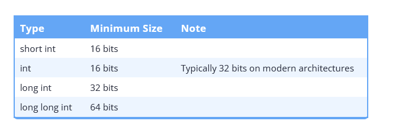
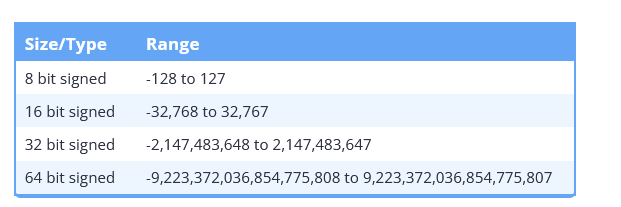
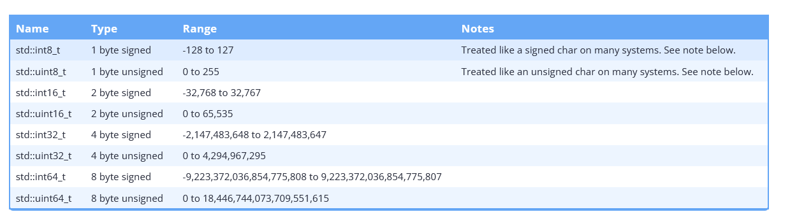
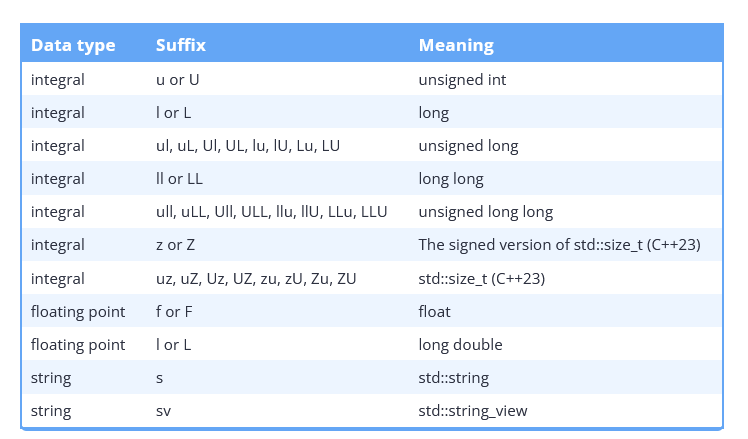
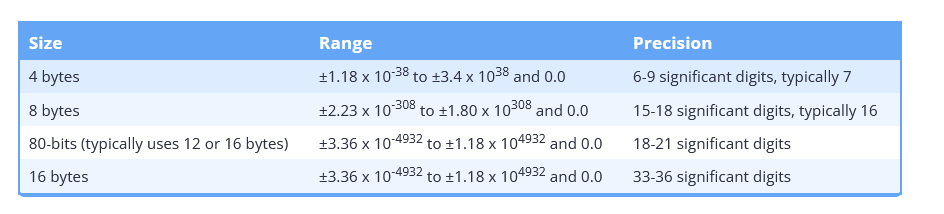
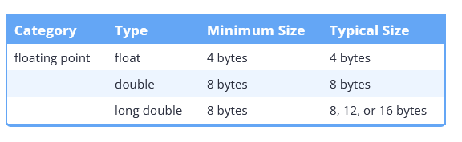
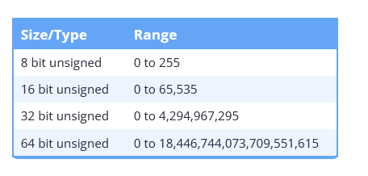

### Declarations, Types

##### Cheatsheet

```cpp
int x;                      // Declare x to be an integer (value undefined)
int x=255;                  // Declare and initialize x to 255
short s; long l;            // Usually 16 or 32 bit integer (int may be either)
char c='a';                 // Usually 8 bit character
unsigned char u=255;
signed char s=-1;           // char might be either
unsigned long x =
  0xffffffffL;              // short, int, long are signed
float f; double d;          // Single or double precision real (never unsigned)
bool b = true;                // true or false, may also use int (1 or 0)
int a, b, c;                // Multiple declarations
int a[10];                  // Array of 10 ints (a[0] through a[9])
int a[]={0,1,2};            // Initialized array (or a[3]={0,1,2}; )
int a[2][2]={{1,2},{4,5}};  // Array of array of ints
char s[]="hello";           // String (6 elements including '\0')
std::string s = "Hello"     // Creates string object with value "Hello"
std::string s = R"(Hello World)"; // Creates string object with value "Hello\nWorld"
int* p;                     // p is a pointer to (address of) int
char* s="hello";            // s points to unnamed array containing "hello"
void* p=nullptr;            // Address of untyped memory (nullptr is 0)
int& r=x;                   // r is a reference to (alias of) int x
enum weekend {SAT,SUN};     // weekend is a type with values SAT and SUN
enum weekend day;           // day is a variable of type weekend
enum weekend{SAT=0,SUN=1};  // Explicit representation as int
enum {SAT,SUN} day;         // unscoped enumeration
enum class Color {Red,Blue};// Color is a strict type with values Red and Blue
Color x = Color::Red;       // Assign Color x to red
typedef String char*;       // String s; means char* s;
const int c=3;              // Constants must be initialized, cannot assign to
const int* p=a;             // Contents of p (elements of a) are constant
int* const p=a;             // p (but not contents) are constant
const int* const p=a;       // Both p and its contents are constant
const int& cr=x;            // cr cannot be assigned to change x
int8_t,uint8_t,int16_t,
uint16_t,int32_t,uint32_t,
int64_t,uint64_t            // Fixed length standard types
auto it = m.begin();        // Declares it to the result of m.begin()
auto const param = config["param"];
                            // Declares it to the const result
auto& s = singleton::instance();
                            // Declares it to a reference of the result
volatile int x = 5; // x may be changed somewhere else, prevent compiler optimizations.
```

##### Auto rules

- [Auto type deduction rules summary](https://blog.feabhas.com/2016/11/getting-head-around-autos-type-deduction-rules/)

  - ```cpp
    // Basic auto usage
    auto x = initialValue;  // x's type deduced from initialValue
    
    // Example: auto deducing int
    auto a = 17;            // a is int
    
    // Example: auto with brace initialization
    auto b {17};            // b is int
    
    // Auto and complex expressions
    auto it = v.begin();    // it's type deduced from v.begin()
    
    // Auto with const
    int const var = 178;
    auto c = var;           // c is int, const dropped
    
    // Auto with C-style arrays
    int my_array[10];
    auto d = my_array;      // d is int*, array decays to pointer
    
    // Auto with l-value references
    template<typename T>
    void fn(T& param) {}
    // param's type includes cv-qualifiers of the argument
    
    // Auto with r-value references
    template<typename T>
    void fn(T&& param) {}
    // param's type deduces to l-value or r-value reference based on argument
    
    // Reference collapsing rules
    T& & -> T&,
    T& && -> T&,
    T&& & -> T&,
    T&& && -> T&&
    
    // Guidelines
    // - Avoid auto for scalar types
    // - Use auto for complex types, especially from functions like std::make_shared
    // - Be cautious with auto and reference qualifiers
    // - Remember that cv-qualifiers on auto-deduced types apply to the
    
    ```

- `auto*`

  - ```cpp
    #include <string>
    
    const std::string* const getConstPtr(); // some function that returns a const pointer to a const value
    
    int main()
    {
        auto ptr1{ getConstPtr() };  // const std::string* (drops top level const then deduces a const std::string*)
        auto* ptr2{ getConstPtr() }; // const std::string*
        
        /* reapply the const after its dropped as being the top level*/
        auto const ptr3{ getConstPtr() };  // const std::string* const
        const auto ptr4{ getConstPtr() };  // const std::string* const
    
        
        auto* const ptr5{ getConstPtr() }; // const std::string* const
        
        /* actually useless as this is deduced to const*/
        const auto* ptr6{ getConstPtr() }; // const std::string*
    
        /* const already deduced */
        const auto const ptr7{ getConstPtr() };  // error: const qualifer can not be applied twice
        
        /* top level dropped but added back , low level const added as documentation*/
        const auto* const ptr8{ getConstPtr() }; // const std::string* const
    
        return 0;
    }
    ```

##### Types

- A **cv unqualified** type has no const or volatile applied to it i.e its raw type.

- **Integral types** - refer to the *type trait* - [std::is_integral](https://en.cppreference.com/w/cpp/types/is_integral)

- **Integer** refers specifically to the `int` datatype.

- **Sizes of objects** - see more: https://www.learncpp.com/cpp-tutorial/object-sizes-and-the-sizeof-operator/

  

- **Signed integers**

  - Overflow is **UB** for C++ signed integers

    ```cpp
    #include <iostream>
    
    int main()
    {
        // assume 4 byte integers
        int x { 2'147'483'647 }; // the maximum value of a 4-byte signed integer
        std::cout << x << '\n';
    
        ++x; // integer overflow, undefined behavior
        std::cout << x << '\n';
    
        return 0;
    }
    ```

  - Fundamental integer types available

    

  - Ranges of signed integers

    

  - Be careful when using **integer division**, as you will lose any fractional  parts of the quotient. However, if it’s what you want, integer division  is safe to use, as the results are predictable.

    ```cpp
    #include <iostream>
    
    int main()
    {
        std::cout << 8 / 5 << '\n'; // produces 1
        return 0;
    }
    ```

- **Fixed width integers**

  - C++ has fixed width integers to deal with inconsistencies between architecutres:

    

  - `std::uint8_t` and `std::int8_t` may behave like `char` on some systems which can be a cause of errors.

  - `std::size_t` is an unsigned integral type and typically represents the size or length of objects.

    - Some compilers limit the largest creatable object to half the maximum value `std::size_t` 

  - **Fast and Least Integers**

    - `std::int_least#_t` and `std::uint_least#_t` represent the smallest types with at least # bits.
    - `std::int_fast#_t` and `std::uint_fast#_t` represent the fastest types with at least # bits.
    - The actual size of fast types may vary, potentially causing different behaviors on different architectures.
    - This can be demonstrated by showing `sizeof()` output and a behaviour example with wraparound in fast integers.

- Avoid literals and static casts when dealing with type conversions:

  ```cpp
   // We can avoid literals with suffixes
   unsigned int u{ 5 }; // okay (we don't need to use `5u`)
   float f{ 1.5 };      // okay (we don't need to use `1.5f`)
  
   // We can avoid static_casts
   constexpr int n{ 5 };
   double d{ n };       // okay (we don't need a static_cast here)
   short s{ 5 };        // okay (there is no suffix for short, we don't need a static_cast here)
  
   return 0;
  ```

  

- **Literals**:

  - 
  - 

- C++ Numeral systems:

  - ```cpp
    // Numeral Systems in C++ (Decimal, Binary, Hexadecimal, Octal)
    
    // Decimal (Base 10)
    int x { 12 }; // Decimal number
    
    // Binary (Base 2)
    // Counting in binary: 0, 1, 10, 11, 100, 101, 110, 111, ...
    
    // Octal (Base 8)
    // Counting in octal: 0, 1, 2, 3, 4, 5, 6, 7, 10, 11, 12, ...
    // Octal literal example
    int octal_num { 012 }; // Equals 10 in decimal
    
    // Hexadecimal (Base 16)
    // Counting in hexadecimal: 0, 1, 2, 3, 4, 5, 6, 7, 8, 9, A, B, C, D, E, F, 10, ...
    // Hexadecimal literal example
    int hex_num { 0xF }; // Equals 15 in decimal
    
    // Binary literals in C++14
    int bin {};
    bin = 0b1;        // Binary 1
    bin = 0b11;       // Binary 3
    bin = 0b1010;     // Binary 10
    
    // Digit Separators (C++14)
    long value { 2'132'673'462 }; // Easier to read
    
    // Outputting values in different formats
    std::cout << std::hex << x << '\n'; // Output in hexadecimal
    std::cout << std::oct << x << '\n'; // Output in octal
    std::cout << std::dec << x << '\n'; // Output in decimal
    
    // Outputting binary values using std::bitset
    #include <bitset>
    std::bitset<8> bin1{ 0b1100'0101 };
    std::cout << bin1 << '\n';
    
    // Using std::format in C++20 and C++23
    #include <format>
    std::cout << std::format("{:b}\n", 0b1010); // Output in binary
    
    // Compiler requirements for std::format and std::print
    // MSVC: Visual Studio 2019 or later
    // g++ (GCC): GCC 13 or later
    ```

- Promotions / Conversions 

  - [Narrowing Conversions, List init and constexpr init](https://www.learncpp.com/cpp-tutorial/narrowing-conversions-list-initialization-and-constexpr-initializers/)

- Narrowing conversions -> **compiler emits a warning normally**:

  - Avoid by using `{}`, enforcing the **precision is important.**
  - From a floating point type to an integral type.
  - From a floating point type to a narrower or lesser ranked floating point type,  unless the value being converted is constexpr and is in range of the  destination type (even if the destination type doesn’t have the  precision to store all the significant digits of the number).
  - From an integral to a floating point type, unless the value being converted  is constexpr and whose value can be stored exactly in the destination  type.
  - From an integral type to another integral type that cannot represent all values of the original type, unless the value being  converted is constexpr and whose value can be stored exactly in the  destination type. This covers both wider to narrower integral  conversions, as well as integral sign conversions (signed to unsigned,  or vice-versa).
  - **Because they can be unsafe and are a source of errors, avoid narrowing conversions whenever possible.**
  - **If you need to perform a narrowing conversion, use `static_cast` to convert it into an explicit conversion.**

- List initialization with constexpr initializers:

  - These constexpr exception clauses are incredibly useful when list  initializing non-int/non-double objects, as we can use an int or double  literal (or a constexpr object) initialization value.

    ```cpp
    int main()
    {
        // We can avoid literals with suffixes
        unsigned int u { 5 }; // okay (we don't need to use `5u`)
        float f { 1.5 };      // okay (we don't need to use `1.5f`)
    
        // We can avoid static_casts
        constexpr int n{ 5 };
        double d { n };       // okay (we don't need a static_cast here)
        short s { 5 };        // okay (there is no suffix for short, we don't need a static_cast here)
    
        return 0;
    }
    ```

- **Integral promotion** rules and floating point promotion:

  - floating point -> float goes to double.
  - Using the **integral promotion** rules, the following conversions can be made:
    - signed char or signed short can be converted to int.
    - unsigned char, char8_t, and unsigned short can be converted to int if int can  hold the entire range of the type, or unsigned int otherwise.
    - If char is signed by default, it follows the signed char conversion rules  above. If it is unsigned by default, it follows the unsigned char  conversion rules above.
    - bool can be converted to int, with false becoming 0 and true becoming 1.

- **Arithmetic conversion** rules:

  - The usual arithmetic conversion rules are pretty simple. The compiler has a prioritized list of types that looks something like this:

    - long double (highest)

    - double

    - float

    - unsigned long long

    - long long

    - unsigned long

    - long

    - unsigned int

    - int (lowest)

      - **There are only two rules:**

        - If the type of at least one of the operands is on the priority list, the  operand with lower priority is converted to the type of the operand with higher priority.

        - Otherwise (the type of neither operand is on the list), both operands are numerically promoted (see [10.2 -- Floating-point and integral promotion](https://www.learncpp.com/cpp-tutorial/floating-point-and-integral-promotion/)).


- Floating point - https://float.exposed/0x3dcccccd:

  - 

  - 

  - Always make sure the type of your literals match the type of the  variables they’re being assigned to or used to initialize. Otherwise an  unnecessary conversion will result, possibly with a loss of precision.
  - Floating point numbers are useful for **storing very large or very small numbers**, including those with fractional components.
  - Floating point numbers often have small rounding errors, even when the number  has fewer significant digits than the precision. Many times these go  unnoticed because they are so small, and because the numbers are  truncated for output. However, comparisons of floating point numbers may not give the expected results. Performing mathematical operations on  these values will cause the rounding errors to grow larger.
  - Favor double over float unless space is at a premium, as the lack of precision in a float will often lead to inaccuracies.

- Unsigned integers

  - More details - https://blog.libtorrent.org/2016/05/unsigned-integers/

  - C++ standard says unsigned integers are well defined in overflowing from arithmetic or storage operations.

  - Unsigned integers exhibit **wrap around behaviour** 

    ```cpp
    #include <iostream>
    
    int main()
    {
        unsigned short x{ 0 }; // smallest 2-byte unsigned value possible
        std::cout << "x was: " << x << '\n';
    
        x = -1; // -1 is out of our range, so we get modulo wrap-around
        std::cout << "x is now: " << x << '\n';
    
        x = -2; // -2 is out of our range, so we get modulo wrap-around
        std::cout << "x is now: " << x << '\n';
    
        return 0;
    }
    
    x was: 0
    x is now: 65535
    x is now: 65534
    ```

  - Favor signed numbers over unsigned numbers for holding quantities (even  quantities that should be non-negative) and mathematical operations.  

  - Avoid mixing signed and unsigned numbers.

    

##### Misc reminders

- C++ types - https://en.cppreference.com/w/cpp/language/types

- Prefer fixed width integers for most cases

  - `std::uint8_t` for chars
  - `std::size_t` for sizes i.e unsigned integer type dependent on the architecture
  - Prefer larger unsigned integers for varying contexts

- Do not mix signed and unsigned integers.

- Prefer `int` for simple numbers

- [LEARNCPP](https://www.learncpp.com/cpp-tutorial/constexpr-and-consteval-functions/) **Constexpr / Consteval**

  - Unless you have a specific reason not to, a function that can be made `constexpr` generally should be made `constexpr`.

  - Use `consteval` if you have a function that must run at compile-time for some reason (e.g. performance).

    - ```cpp
      #include <iostream>
      
      // Uses abbreviated function template (C++20) and `auto` return type to make this function work with any type of value
      // See 'related content' box below for more info (you don't need to know how these work to use this function)
      consteval auto compileTime(auto value)
      {
          return value;
      }
      
      constexpr int greater(int x, int y) // function is constexpr
      {
          return (x > y ? x : y);
      }
      
      int main()
      {
          std::cout << greater(5, 6) << '\n';              // may or may not execute at compile-time
          std::cout << compileTime(greater(5, 6)) << '\n'; // will execute at compile-time
      
          int x { 5 };
          std::cout << greater(x, 6) << '\n';              // we can still call the constexpr version at runtime if we wish
      
          return 0;
      }
      ```

  - The compiler must be able to see the full definition of a constexpr or consteval function, not just a forward declaration.

  - Constexpr/consteval functions used in a single source file (.cpp) can be defined in the source file above where they are used.

  - Constexpr/consteval functions used in multiple source files should be defined in a header  file so they can be included into each source file.


- [What are forward declarations in C++](https://stackoverflow.com/questions/4757565/what-are-forward-declarations-in-c)
- [What is the purpose of forward declarations in C++](https://stackoverflow.com/questions/3110096/what-is-the-purpose-of-forward-declaration)
- [When to use forward declarations in C++ ](https://stackoverflow.com/questions/553682/when-can-i-use-a-forward-declaration)

- [What are cv qualifiers in C++](https://stackoverflow.com/questions/27527642/what-does-cv-qualified-mean)
- [Volatile keyword](https://stackoverflow.com/questions/4437527/why-do-we-use-volatile-keyword)

```cpp
int test {100};
volatile int test {100}; /* does not optimise.*/

while (test == 100){ /* optimize to while(true) may be undesirable*/
 ...
}
```

- `Using` vs `Typedef` in the context of function pointers.

```cpp
typedef  void(*fp)(int); /* fp now alias to this function pointer*/
using fp = void(*)(int); /* fp now alias*/

// You can have calling conventions added too

using fp = void(__stdcall *)(int); // use msvc __stdcall calling convention
    
    
void func(int x){}
fp {&func};
```

- [RTTI](https://en.cppreference.com/w/cpp/types) + [Microsoft MSVC RTTI](https://learn.microsoft.com/en-us/cpp/cpp/run-time-type-information?view=msvc-170)

- `constexpr` functions are *implicitly inline*

  - Because constexpr functions may be evaluated at compile-time, the  compiler must be able to see the full definition of the constexpr  function at all points where the function is called.
  - This means that a constexpr function called in multiple files needs to have its  definition included into each such file -- which would normally be a  violation of the one-definition rule. To avoid such problems, constexpr  functions are implicitly inline, which makes them exempt from the  **one-definition rule**.

- When is a function ran at compile time

  - According to the C++ standard, a `constexpr` function that is eligible for compile-time evaluation *must* be evaluated at compile-time if the return value is used where a constant expression is required. Otherwise, the compiler is free to  evaluate the function at either compile-time or runtime.

  - ```cpp
    #include <iostream>
    
    constexpr int greater(int x, int y)
    {
        return (x > y ? x : y);
    }
    
    int main()
    {
        constexpr int g { greater(5, 6) };            // case 1: evaluated at compile-time
        std::cout << g << "is greater!";
    
        int x{ 5 }; // not constexpr
        std::cout << greater(x, 6) << " is greater!"; // case 2: evaluated at runtime
    
        std::cout << greater(5, 6) << " is greater!"; // case 3: may be evaluated at either runtime or compile-time
    
        return 0;
    }
    ```

- `consteval` 

  - Notes that the function must be evaluated at compile time, otherwise it results in an error.

  - ```cpp
    #include <iostream>
    
    consteval int greater(int x, int y) // function is now consteval
    {
        return (x > y ? x : y);
    }
    
    int main()
    {
        constexpr int g { greater(5, 6) };            // ok: will evaluate at compile-time
        std::cout << greater(5, 6) << " is greater!"; // ok: will evaluate at compile-time
    
        int x{ 5 }; // not constexpr
        std::cout << greater(x, 6) << " is greater!"; // error: consteval functions must evaluate at compile-time
    
        return 0;
    }
    ```

  - ```cpp
    #include <iostream>
    
    // Uses abbreviated function template (C++20) and `auto` return type to make this function work with any type of value
    // See 'related content' box below for more info (you don't need to know how these work to use this function)
    consteval auto compileTime(auto value)
    {
        return value;
    }
    
    constexpr int greater(int x, int y) // function is constexpr
    {
        return (x > y ? x : y);
    }
    
    int main()
    {
        std::cout << greater(5, 6);              // may or may not execute at compile-time
        std::cout << compileTime(greater(5, 6)); // will execute at compile-time
    
        int x { 5 };
        std::cout << greater(x, 6);              // we can still call the constexpr version at runtime if we wish
    
        return 0;
    ```

- **Auto type decay**

  - ```cpp
    constexpr int i = 42;
    const int& ir = i;
    auto a = ir; /* takes away the const and & of ir making it just a normal int*/
    ```

