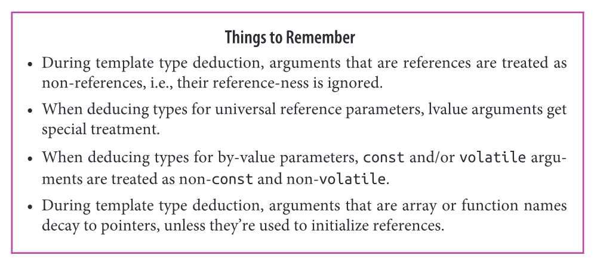
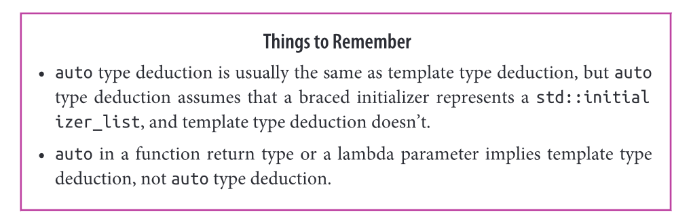
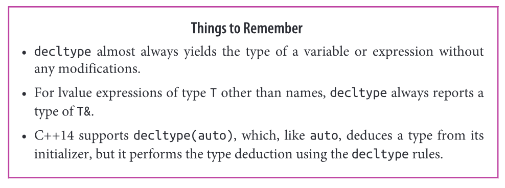
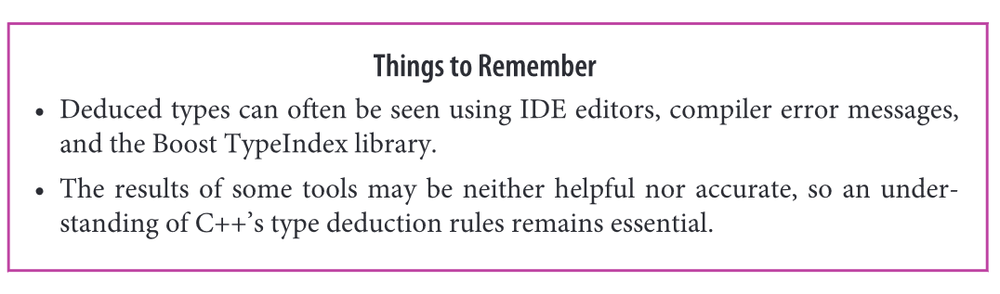
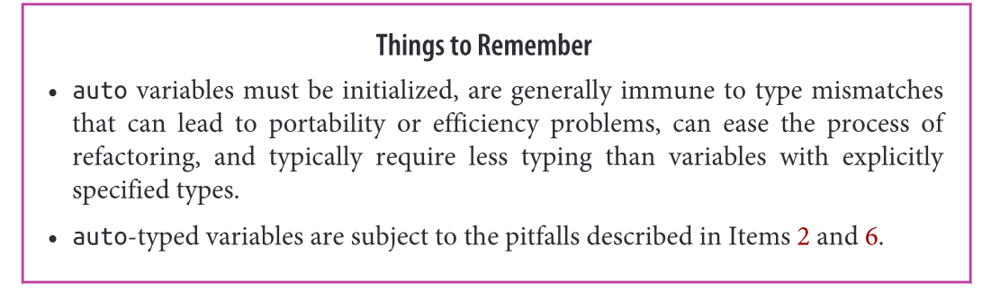
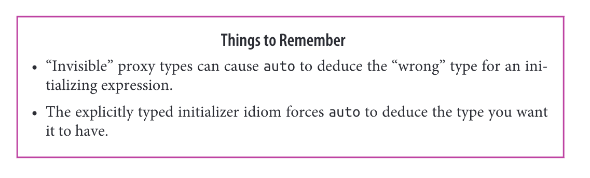
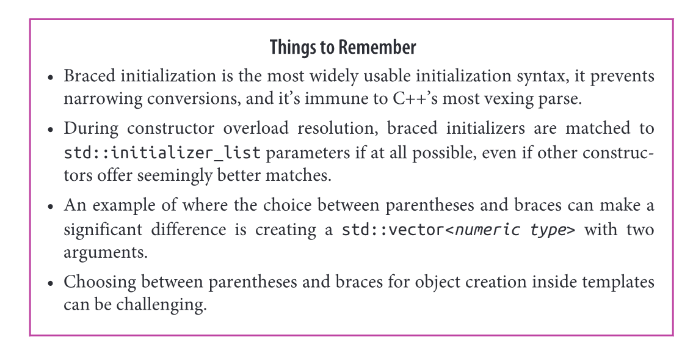
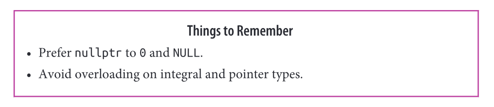
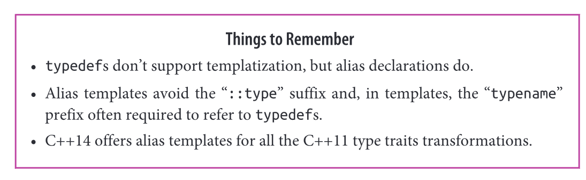
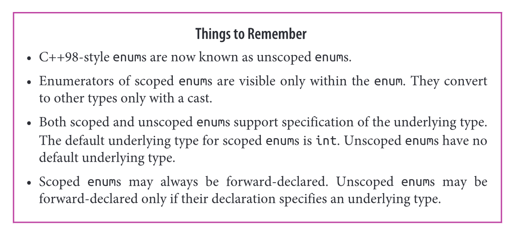

# Effective modern C++

### Item 1 - Understand template type deduction



- We use `expr` to deduce the types of `T` and `ParamType`.

```cpp
template <typename T> 
void f(ParamType param);

f(expr);
```

- These types are often different. In particular `ParamType` contains adornments such as `const` and `&` qualifiers.

```cpp
template <typename T> 
void f(const T& param); // ParamType is `const T&`

int x = 0 
f(0); // call f with an `int`
```

- The type deduced for `T` is dependent on both `expr` and `ParamType`.
- There are 3 cases:

```cpp
// 1. ParamType is a Reference or Pointer, but not a Universal Reference
/*
	- If expr type is a reference, ignore that
	- Pattern match expr type against ParamType to determine T.
	- const will be deduced as part of the type
*/

template<typename T>
void f(T& param); // param is a reference

int x = 27; // int
const int cx = x; // cx is a const int
const int& rx = x; // rx is a reference to x as a const int
f(x);  // T is int, param type is int&

// const maintained (as you would expect) and reference ignore for T deduction
f(cx); // T is const int, param type is const int&
f(rx); // T is const int, param type is const int&

// In the case of a const reference instead
template<typename T>
void f_cref(const T& param); // T = int for all above calls, and param type is const int&

// In the case of a pointer being used
template<typename T>
void f_ptr(T* param); // T = int for all above calls, and param type is const int&
int x = 27;
const int *px = &x;
f(&x); // T is int, param type is int *
f(px); // T is const int, param type is const int*

```

```cpp
// 2. ParamType is a Universal Reference
/*
	- A universal reference is a template that takes a rvalue reference param &&
	- The universal reference behaves differently when lvalues are passed in.
	- If expr is an lvalue, both T and ParamType are deduced as lvalue references
	- If expr is an rvalue, normal (1.) rules apply
*/

template<typename T>
void f(T&& param); // param is now a universal reference

int x = 27;        // as before
const int cx = x;  // as before
const int& rx = x; // as before

f(x);  // x is lvalue, so T is int&, param's type is also int&
f(cx); // cx is lvalue, so T is const int& ,param's type is also const int&
f(rx); // rx is lvalue, so T is const int& ,param's type is also const int&
f(27); // 27 is rvalue, so T is int , param's type is therefore int&&
```

- See item 24 for more information on this case

```cpp
// 3. ParamType is Neither Pointer nor a Reference
/*
	- Pass by value.
	- if expr is a reference, ignore the reference part
	- if expr is a const / volatile also ignore that.
*/

template<typename T>
void f(T param); // T passed by value

int x = 27; // as before
const int cx = x; // as before
const int& rx = x; // as before

f(x);  // T's and param's types are both int
f(cx); // T's and param's types are again both int
f(rx); // T's and param's types are still both int

// case wher expr is a const pointer to a const object, expr passed by value
// This is interesting as this is passing a pointer by value , but the constness of pointer itself is removed
// but obv not the type of the pointer which still points to a const char.
const char* const ptr = "Fun with pointers"; // ptr is const pointer to const object
f(ptr); // pass by arg of type const char * const, param is deduced as const char *
```

```cpp
// Array arguments

/*
	- Arrays in the function declaration like func(int param[]) is treated as func(int* param)
	- Basically the const char [] below is treated as a pointer therefore
*/

template <typename T>
void f(T param); // by value

const char name[] = "Simon Balfe";
f(name); // T = const char *, ParamType is const char *
    
template <typename T>
void f(T& param); // template with by-reference parameter
f(name); // T deduced as const char [12], ParamType is const char(&)[12]

// return size of array at compile time. T = array type N = size.
template<typename T, std::size_t N> 
constexpr std::size_t arraySize(T (&)[N]) noexcept {
    return N;
}

int keyVals[] = {1,3,7 ,9, 11, 22, 35}; // keyVals has 7 elements

std::array<int , arraySize(keyVals)> mappedVals; // mappedVals size is 7
int mappedVals[arraySize(keyVals)]; // so does mappedVals
```

```cpp
// Function Arguments
/*
	- Functions decay into pointers also
*/

void someFunc(int, double); // someFunc is a function, its type is void(int, double)

template<typename T>
void f1(T param);

template<typename T>
void f2(T& param);

f1(someFunc); // param is deduced at ptr-to-func; type is void(*)(int, double)
f2(someFunc); // param is deduced as ref-to-func; type is void(&)(int, double)
```

### Item 2 - Understand auto type deduction



- `auto` deduction rules essentially are all the same as **item 1**.
- There is an *algorithmic transformation* from `auto` type deduction to template type deduction.

```cpp
auto x = 27; // auto plays the role of T in this scenario.
const auto cx = x;
const auto& rx =x;

template<typename T>
void func(ParamType param);

const int x = 2;
func(c); // expr is const int, T deduced as const int, ParamType = const int

auto y = x;

// To deduced the types of these variables. The compilers act as if there were a template for each declaration as well as a call to that template with the corresponding initialising expression.

template<typename T>
void func_for_x(T param); // conceptual template for deducing x's type

func_for_x(27); // conceptual call: param's deduced type is x's type

template<typename T>
void func_for_cx(const T param); // conceptual template for deducing cx's type

func_for_cx(x); // conceptual call: param's deduced type is cx's type

template<typename T>
void func_for_rx(const T& param); // conceptual template for deducing rx's type

func_for_rx(x); // conceptual call: param's deduced type is rx's type

```

- The cases for `auto` deduction. Similar to item 1 as we have discussed.

```cpp
// auto = ParamType in this case.

// Already seen examples of 1 and 3
auto x = 27; // case 3 (x is neither ptr nor reference)
const auto cx = x; // case 3 (cx isnt either)
const auto& rx = x; // case 1 (rx is non universal ref)

// Case 2 works as you'd expect
auto&& uref1 = x; // x is int and lvalue, so uref1 type is int&
auto&& uref2 = cx; // cx is const int and lvalue, so uref2 type is const int&
auto&& uref3 = 27; // 27 is int and rvalue, so uref3's type is int&&

// And the array and functions discussion still holds
const char name[] = "Simon Balfe";
auto arr1 = name;
auto& arr2 = name;

void someFunc(int, double);
auto func1 = someFunc; // func1's type is void (*)(int, double)
auto& func2 = someFunc; // func2's type is void (&)(int, double)

// C++ 11 uniform initialization case

auto x1 = 27; // int
auto x2(27); // ditto
auto x3 = {27}; // type is std::initializer_list<int>, value is {27}
auto x4 {27}; // ditto

// Case of type mismatch

/*
	- There are two phases to this as there are two deductions going on
	- x5 is deduced first, and the result is `std::initializer_list`, this is just a template however.
	- Template type deduction occurs for this
	- auto will recongise {} as a std::initializer_list always so be cautious.
*/
auto x5 = {1, 2, 3.0}; // [error] cannot deduce T for std::initializer_list<T>, different types.

template <typename T>
void f(T param)
f({11, 23, 9}); // error in this case

template <typename T>
void f(std::initializer_list<T> initList);
f({11, 23, 9}); // T deduced as int, and initLists type is std::initializer_list<int>


// C++14 auto return type
/*
	This uses template type deduction rules instead
*/

auto createInitList(){
    return {1,2,3}; // [error] can't deduce type for {1, 2, 3}
}

std::vector<int> v;

auto resetV = [&v](const auto& newValue) {v = newValue;} // C++14
resetV({1,2,3}); // [error] cannot deduce type for {1, 2, 3}
```

### Item 3 - Understand decltype



- `decltype` tells you the name's or the expression's type. 

```cpp
const int i = 0;                // decltype(i) is const int

bool f(const Widget& w);         // decltype(w) is const Widget&
                                 // decltype(f) is bool(const Widget&)

struct Point {
    int x, y;                    // decltype(Point::x) is int
};                               // decltype(Point::y) is int

Widget w;                        // decltype(w) is Widget

if (f(w)) ...                    // decltype(f(w)) is bool

template<typename T>
class vector {                   // simplified version of std::vector
public:
    ...
    T& operator[](std::size_t index);
    ...
};

vector<int> v;                   // decltype(v) is vector<int>
...
if (v[0] == 0) ...               // decltype(v[0]) is int&
```

- Common use case of `decltype` is declaring function templates where the functions return type depends on the parameter types.

- Example is Passing some container that defines an `[]` operator to return a `&` to one if its elements (common to do)

```cpp
/*
	- Use C++11 Trailing return type to use our parameters to declare the the return type.
	- C++11 allows single statement return types to be deduced, C++14 Enables any lambda expressions and functions 
	return type to be deduced
*/

auto func = [](){ return 1;} // type deduced as int in C++11
auto func_bad = [](){ // [error] type not deduced in C++11
    int x = 2;
    return x;
}

// Attempt 1 - bad we want to use auto return type deduction
template<typename Container, typename Index>
auto authAndAccess(Container& c, Index i) -> decltype(c[i]) { // C++ 11 Trailing return type, to base our return type of the two function parameters
    authenticateUser();
    return c[i];
}


// Attempt 2 - bad will deduce auto such that referencess of c[i] is ignored
template<typename Container, typename Index>
auto authAndAccess(Container& c, Index i) { // with auto here the return expression is deduced, but the & is ignored which is an issue for us.
    authenticateUser();
    return c[i];
}

std::deque<int> d;
// authenticate user, return d[5], assign 10 to it , this wont compile
// effectively this is attempting to assign to an rvalue which is illegal.
authAndAccess(d,5) = 10; 

// Attempt 3 - better , the type is deduced on correctly maintaining the referenceness, using decltype(auto)
template<typename Container, typename Index>
decltype(auto) authAndAccess(Container& c, Index i) { // use decltype(auto) instead to use declytype rules when automatically deducing the expresssion , so return type  = T& where T is the containers underlying type.
    authenticateUser();
    return c[i];
}

// Aside - decltype can be used for variables too.
Widget w;
const Widget& cw = w;
auto myWidget1 = cw; // auto type deduction: myWidget1's type is Widget
decltype(auto) myWidget2 = cw; // decltype deduction: myWidget2's type is const Widget&


// Attempt 4
/*
	- Note our container is passed by lvalue-reference-to-non-const
	- returning a reference permits a user to modify said container
	- Its illegal to pass an rvalue to this function for the container as a result as rvalues do not bind to non 	   const lvalue references
*/

template<typename Container, typename Index>
decltype(auto) authAndAccess(Container& c, Index i)

/*
 - We should modify our function to accept both rvalues and lvalues, form a universal reference
 - One such case for accepting an rvalue
*/

std::deque<std::string> makeStringDeque(); // factory function
//copy the 5th element from this temporary, if we did not copy, then a reference would dangle.
auto s /*: std::string */  = authAndAccess(makeStringDeque(), 5); 

template<typename Container, typename Index>
decltype(auto) authAndAccess(Container&& c, Index i) {  // universal reference Container&&
    authenticateUser();
    return c[i];
}

// Final Attempt of a perfect function
// ignorant of the type of the container `Index`. Passing this by value may risk performance hits (object slicing and other issues see item 41), we stick to the standard library implementation
template<typename Container, typename Index>
decltype(auto) authAndAccess(Container&& c, Index i) { 
    authenticateUser();
    return std::forward<Container>(c)[i]; // see item 25 for applying std::forward to universal references
}
```

- Applying `decltype` to a name yields the declared type for that name. 
- Names are lvalue expressions, but this does not affect `decltype `behaviour. 
- If an expression is *more complicated* than just a name, `decltype` ensures that this type being reported is an lvalue reference.
  - If an lvalue expression other than just a name has type `T` then `decltype` reports that type as `T&`.

```cpp
int x = 0; // x is the name of a variable
decltype(x); // int
decltype((x)); // int& yielded simply after wrapping the name in parentheses.

decltype(auto) f1() 
{
    int x = 0;
    return x; // declytype(x) is int, so f1 returns int
}

decltype(auto) f2()
{
    int x = 0;
    
    return (x); // decltype((x)) is int&, so f2 returns int& [undefined behaviour - local variable]
}
```

### Item 4  - Know how to view deduced types ==COME BACK TO THIS==



### Item 5 - Prefer auto to explicit type declarations



- Auto allows us to
  - Easily hold exact type closures
  - Ensure variables are not uninitialised
  - Reduce code verbosity.

```cpp
int x; // possibly undefined

// Do what I mean for all elements in range b to e
template<typename It>
void dwim(It b, It e){
    while (b != e){
        typename std::iterator_traits<It>::value_type currValue = *b; // complicated long fucking name
    }
}
// Closure expressions are also complex to type out ourselves, they are not well specified 


// Auto variables come to help to as the type of the variable is deduced from its initializing expression
/*
	- Enforces our variables to initiliased
*/

int x1;
auto x2; // [error] initializer required
auto x3 = 0; // fine, x's value is well-defined


template<typename It>
void dwim(It b, It e){
    while (b != e){
        auto currValue = *b; // clean up with auto
    }
}

// Represent types only known to the compiler
auto derefUPLess = [](const std::unique_ptr<Widget>& p1,const std::unique_ptr<Widget>& p2)
    { return *p1 < *p2; };

//C++14 parameter to the lambda are auto also
auto derefLess = [](const auto& p1, const auto& p2) {returnr *p1 < *p2;}; // Anything pointer like 

// std::function can be used to refer to any callable object, i.e to anything that is invoked like a function
/*
	- Must declare the type of the function as std::functions template parameter
*/
bool (const std::unique_ptr<Widget>&, const std::unique_ptr<Widget>&); // C++11 for unique ptr comparison function

//our function would therefore be this
std::function<bool(const std::unique_ptr<Widget>&,
                   const std::unique_ptr<Widget>&)> func;

// Can use this to make as our type for a lambda expression
/*
	- This is not the same as using `auto` which only uses the specific unnamed closure, and thus saves memory.
	- std::funtion instantiates a template based on the type it passed, which may not be enough and therefore 		  results to using the heap. Calling a std::function declared return type of a closure is therefore slower 		  than using auto.
	- std::function could possibly yield memory exceptions also.
	- auto is much cleaner as we saw above.
	- std::bind result also benefits from auto, but use lambdas instead item 34.
*/
std::function<bool(const std::unique_ptr<Widget>&, const std::unique_ptr<Widget>&)> derefUPLess =
    [](const std::unique_ptr<Widget>& p1, const std::unique_ptr<Widget>& p2)
    { return *p1 < *p2; };
```

- `auto` can avoid problems related to *type shortcuts*.

```cpp
std::Vector<int> v;
// this actually returns std::vector<int>::size_type, not many are aware of this.
/*
	- What most do know is that it will be an unsigned integral type.
	- 32 bit windows -> both unsigned and std::vector<int>::size_type are the same
	- 64 bit windows -> unsigned is 32 bits while std::vector<int>::size_type is 64 bits
*/
unsigned sz = v.size(); 

// therefore use auto to prevent this complication.
auto sz = v.size(); // std::vector<int>::size_type type.
```

- Another example of where `auto` can be useful:

```cpp
// The key part of this container is in fact const -> const std::string
std::unordered_map<std::string, int> m;

// wrong, it should be std::pair<const std::string, int>&
/*
	- The compiler attempts to convert from std::pair<const std::string, int> std::pair<std::string, int>
	- They succed in creating a temporary object of our type below. std::pair<std::string, int> must bind to this therefore the items of m are copied to enable this binding.
	- After each loop iteration, the binded temporary to p is destroyed.
*/
for (const std::pair<std::string, int>& p : m){
    // do something with p
}

// Use auto instead to fix this issue
/*
	- Ensures we actually get a pointer to p and change its underlying type.
	- non auto type would mess up and fail to edit the original.
*/
for (const auto& p: m)
{
    ... // as before.
}
```

- Use `auto` so you completely get round all these complications in type mismatch.
- Writing types explicitly does little more than

### Item 6: Use the explicitly typed initializer idiom when auto deduces undesired types



- Example using `std::vector<bool>` shows `auto` is not always correct

```cpp
Widget w;
std::vector<bool> features(const Widget& w);
auto highPriority = features(w)[5]; // check if the 5th bit is set, thus high priority, normally specify the type as bool

processWidget(w, highPriority); // undefined behaviour
```

- `std::vector<bool>` is `[]` returns `std::vector<bool>::reference` instead of `bool`. In C++ you cannot have a reference to bits.
- This object acts like a `bool&` and evaluates to true or false when used in conditionals. One part of this is achieved via an implicit conversion to `bool` that is defined.
- Using `auto` essentially leaves the value depended upon to the implementation of `std::vector<bool>::reference`.  Such as a pointer to the machine word and then the offset for that bit. If `highPriority` uses this type, it also contains this pointer now and its offset. `temp` is destroyed however as its simply a temporary object and thus `highPriority` contains a dangling pointer which causes our UB.
- `std::vector<bool>::reference` is a **proxy class**. Such a class exists only for the purpose of emulating the behaviour of another type. The standard library smart pointer types are also proxy classes to graft management onto raw pointers. Proxy classes are generally explicit to the client but in this case with `std::vector<bool>::reference`, its an **invisible proxy**. `std::bitset::reference` is another example.

```cpp
Matrix sum = m1 + m2 + m3 + m4; // for performance each intermediate (operator+) returns a proxy class Sum<Matrix, Matrix> which nests each operation from which clients should be shielded against
```

- Generally avoid returning an `auto` type to some proxy class that is invisible. 
- Pay attention to your interfaces to spot proxy classes.
- A solution is to force a different type deduction via the **explicitly typed initializer idiom**. 

```cpp
// At runtime, std::vector<bool>::reference object returned from the std::vector<bool>::operator[] executes the conversion to bool that it supports
// During this converison, the valid pointer to std::vector<bool> returned from features is dereferenced therefore 
// removing any undefined behaviour.
// Index 5 is then applied to the bits pointed to by the pointer and the bool that emerges is our value that initialises the highPriority

auto highPriority = static_cast<bool>(features(w)[5]);

auto sum = static_cast<Matrix>(m1 + m2 + m3 + m4)
```

- It is useful in general to deliberately create a variable of a type that is different from that generated by the initialising expression

```cpp
double func();
auto float_value = static_cast<float>(func());
```

### Item 7 - Distinguish between () and {} when creating objects



```cpp
int x(0); // initializer is in parentheses
int y = 0; // initializer follows "="
int z {0}; // initializer is in braces
int z = {0}; // initializer uses "=" and braces (same as int z {0} apart from the explicit keyword affecting it)

Widget w1; // call default constructor
Widget w2 = w1; // not an assignment, calls the copy ctor
w1 = w2; // copy assignment; calls operator=

// Uniform initialization in C++11
std::vector<int> v {1,3,5}; // v's initial content is 1,3,5

// Braces used for default initialisation of non-static data members
class Widget {
    ...
    private:
    	int x {0}; //fine, x's default value is 0
    	int y = 0; // fine
    	int z (0); // [error]
}

// Can use braces or parentheses but not `=` as its an uncopyable type.
std::atomic<int> ai1 {0} ; // fine
std::atomic<int> ai2 (0); // fine
std::atomic<int> ai3 = 0; // error!

// Prohibits narrowing conversions among the built in types.
double x,y,z;
int sum1 {x+y+Z}; // error sum of doubles is not expressible as an int

// Most vexing parse
Widget w1(10); // call Widget ctor with argument 10
Widget w2(); // most vexing parse! declares a function named w2 that returns a Widget!
Widget w3 {}; // Calls Widget ctor with no args

// std::initialiser_list parameters not involved
class Widget {
    public:
  		Widget(int i, bool b); // ctors not declaring
    	Widget(int i, double d); // std::initializer_list params
};

Widget w1(10, true); // first ctor
Widget w2{10, true}; // first ctor
Widget w3(10, 5.0); // second ctor
Widget w4{10.5.0}; // second ctor

// std::initialiser_list involved, now braced initialision prefers this.
class Widget {
    public:
  		Widget(int i, bool b); 
    	Widget(int i, double d); 
    	Widget(std::initializer_list<long double> il); 
};

Widget w1(10, true); // first ctor
Widget w2{10, true}; // calls std::initialiser_list ctor (10 and true convert to long double)
Widget w3(10, 5.0); // second ctor
Widget w4{10.5.0}; // calls std::initialiser_list ctor (10 and 5.0 convert to long double)

// std::initialiser_list hijacks what would have been a move / copy construction
class Widget {
    public:
  		Widget(int i, bool b);
    	Widget(int i, double d); 
    	Widget(std::initializer_list<long double> il); 
    	operator float() const; // convert to float
};

Widget w5 (w4); // users parens to call copy
Widget w6 {w4}; // calls std::initializer_list ctor (w4 converst to float and float converts to long double)
Widget w7(std::move(w4)); // uses parens, calls move ctor
Widget w8 {std::move(w4)}; // uses braces, calls initialiser_list ctor.

// If there are constructors which dont cause narrowing conversions but
// std::intiailizer_list type does , it will prefer the std::intializer_list and thus error out

/*
	- Must be a type that cannot be converted to like std::string
*/
class Widget {
    public:
  		Widget(int i, bool b);
    	Widget(int i, double d); 
    	Widget(std::initializer_list<bool> il); 
    	operator float() const; // convert to float
};

Widget w {10 ,5.0}; // error! narrowing conversion

// Empty braces {}
class Widget {
    public:
  		Widget();
    	Widget(std::initializer_list<bool> il); 
};

Widget w1; // default ctor
Widget w2{}; // default ctor
Widget w3(); // most vexing parse, declares a function

// use braces inside the () or {} to call our init list
Widget w3({}); // calls std::initialise_list ctor
Widget w5 {{}}; // ditto

// std::vector has a non std::initialiser_list constructor that allows the intial size specified
/*
	- Ensure a clients uses of  () or {} does not cause confusing interfaces like this,
*/
std::vector<int> v1(10,20); 
std::vector<int> v2 {10,20}; // use init list to creat 2 element vector of values 10 and 20

// templates ()  vs {}

template <typename T, typename... Ts>
void doSomeWork(Ts&&... params) {
    // create local T object from params...
    T localObject(std::forward<Ts>(params)...); // using parens
    T localObject{std::forward<Ts>(params)...}; // using braces
}

std::vector<int> v;

// std::make_unique and std::make_shared prefer to use () for this reason.
doSomeWork<std::vector<int>>(10,20); // if () used creates 10 elements , {} creates 2 elements, author must decied.
```

### Item 8 Prefer nullptr to 0 and NULL



```cpp
// 0
/*
	0 - int, unless its used where a pointer is then its fallback is null pointer pointer
	NULL - constant that may be int but could be long
	
	BOTH HAVE NO POINTER TYPE
*/

// C++98, avoid overloading on integral types.
void f(int);  // three overloads of f
void f(bool);
void f(void*);

f(0);    // calls f(int), not f(void*)

f(NULL); // might not compile, but typically calls f(int). Never calls f(void*)
```

- `nullptr` type is `std::nullptr_t` and it implicitly converts to all raw pointer types.

```cpp
auto result = findRecord(/* args*/);

if (result == nullptr){} // clear intent of what findRecord returns, a pointer.

// Within templates

// use nullptr , 0, NULL to unlock mutex
// can pass each to a function taking a pointer, results in lots of duplication

int f1(std::shared_ptr<Widget> spw);   
double f2(std::unique_ptr<Widget> upw); 
bool f3(Widget* pw);                    

// Using templates
template<typename FuncType, typename MuxType, typename PtrType>
decltype(auto) lockAndCall(FuncType func, MuxType& mutex, PtrType ptr){
    MuxGuard g (mutex);
    return func(ptr);
}

auto result1 = lockAndCall(f1, f1m, 0); //error, 0 = int cannot pass an int to a pointer of f functions above
auto result2 = lockAndCall(f2, f2m, NULL); // error, ditto
auto result3 = lockAndCall(f3, f3m, nullptr) ; // fine, deduced as integer.
```

### Item 9 - Prefer alias declarations to typedefs



```cpp
// FP is a synonym for a pointer to a function taking an int and
// a const std::string& and returning nothing
typedef void (*FP)(int, const std::string&); // typedef

// same meaning as above
using FP = void (*)(int, const std::string&); // alias declaration

// Templates, alias declarations can be templatized, avoid the ::type suffix as shown below with typedef
template<typename T>
using MyAllocList = std::list<T, MyAlloc<T>>;  // list of type T 

MyAllocList<Widget> lw;

//typedef needs type member in struct
template<typename T>
stuct MyAllocList {
    typdedef std::list<T, MyAlloc<T>> type;
}
MyAllocList<Widget>::type lw;

// dependent type
template<typename T>
class Widget {
    private:
    	typename MyAllocList<T>::type list; // dependent types must be preceded by `typename` keyword.
}

class Widget {
    private: 
    	MyAllocList<T> list; // compiler knows this is not a dependent type
}
```

- During template meta-programming its common to take a type `T` and deduce more types such as the reference to it or the pointer to it.

- C++11 gives **type traits** to perform various transformations to our `T` type to yield new types with various qualifiers added or removed as an example:

```cpp
// rough comments
std::remove_const<T>::type; // yields T from const T
std::remove_reference<T>::type; // yields T from T& and T&&
std::add_lvalue_reference<T>::type; // yields T& from T

//They are implemented using template structs -> bad
// C++14 defines alias for this such as
std::remove_const_t<T> // same as remove const above.
```

### Item 10 Prefer scoped enums to unscoped enums



- 
