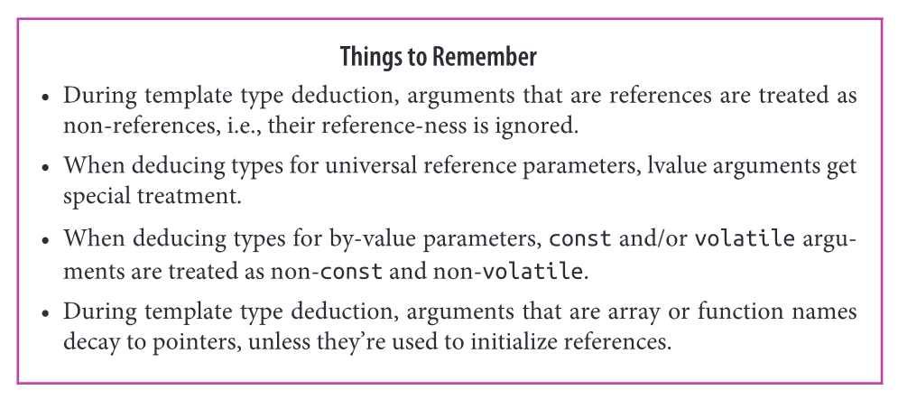

### Item 1 - Understand template type deduction



- We use `expr` to deduce the types of `T` and `ParamType`.

```cpp
template <typename T> 
void f(ParamType param);

f(expr);
```

- These types are often different. In particular `ParamType` contains adornments such as `const` and `&` qualifiers.

```cpp
template <typename T> 
void f(const T& param); // ParamType is `const T&`

int x = 0 
f(0); // call f with an `int`
```

- The type deduced for `T` is dependent on both `expr` and `ParamType`.
- There are 3 cases:

```cpp
// 1. ParamType is a Reference or Pointer, but not a Universal Reference
/*
	- If expr type is a reference, ignore that
	- Pattern match expr type against ParamType to determine T.
	- const will be deduced as part of the type
*/

template<typename T>
void f(T& param); // param is a reference

int x = 27; // int
const int cx = x; // cx is a const int
const int& rx = x; // rx is a reference to x as a const int
f(x);  // T is int, param type is int&

// const maintained (as you would expect) and reference ignore for T deduction
f(cx); // T is const int, param type is const int&
f(rx); // T is const int, param type is const int&

// In the case of a const reference instead
template<typename T>
void f_cref(const T& param); // T = int for all above calls, and param type is const int&

// In the case of a pointer being used
template<typename T>
void f_ptr(T* param); // T = int for all above calls, and param type is const int&
int x = 27;
const int *px = &x;
f(&x); // T is int, param type is int *
f(px); // T is const int, param type is const int*

```

```cpp
// 2. ParamType is a Universal Reference
/*
	- A universal reference is a template that takes a rvalue reference param &&
	- The universal reference behaves differently when lvalues are passed in.
	- If expr is an lvalue, both T and ParamType are deduced as lvalue references
	- If expr is an rvalue, normal (1.) rules apply
*/

template<typename T>
void f(T&& param); // param is now a universal reference

int x = 27;        // as before
const int cx = x;  // as before
const int& rx = x; // as before

f(x);  // x is lvalue, so T is int&, param's type is also int&
f(cx); // cx is lvalue, so T is const int& ,param's type is also const int&
f(rx); // rx is lvalue, so T is const int& ,param's type is also const int&
f(27); // 27 is rvalue, so T is int , param's type is therefore int&&
```

- See item 24 for more information on this case

```cpp
// 3. ParamType is Neither Pointer nor a Reference
/*
	- Pass by value.
	- if expr is a reference, ignore the reference part
	- if expr is a const / volatile also ignore that.
*/

template<typename T>
void f(T param); // T passed by value

int x = 27; // as before
const int cx = x; // as before
const int& rx = x; // as before

f(x);  // T's and param's types are both int
f(cx); // T's and param's types are again both int
f(rx); // T's and param's types are still both int

// case wher expr is a const pointer to a const object, expr passed by value
// This is interesting as this is passing a pointer by value , but the constness of pointer itself is removed
// but obv not the type of the pointer which still points to a const char.
const char* const ptr = "Fun with pointers"; // ptr is const pointer to const object
f(ptr); // pass by arg of type const char * const, param is deduced as const char *
```

```cpp
// Array arguments

/*
	- Arrays in the function declaration like func(int param[]) is treated as func(int* param)
	- Basically the const char [] below is treated as a pointer therefore
*/

template <typename T>
void f(T param); // by value

const char name[] = "name";
f(name); // T = const char *, ParamType is const char *
    
template <typename T>
void f(T& param); // template with by-reference parameter
f(name); // T deduced as const char [12], ParamType is const char(&)[12]

// return size of array at compile time. T = array type N = size.
template<typename T, std::size_t N> 
constexpr std::size_t arraySize(T (&)[N]) noexcept {
    return N;
}

int keyVals[] = {1,3,7 ,9, 11, 22, 35}; // keyVals has 7 elements

std::array<int , arraySize(keyVals)> mappedVals; // mappedVals size is 7
int mappedVals[arraySize(keyVals)]; // so does mappedVals
```

```cpp
// Function Arguments
/*
	- Functions decay into pointers also
*/

void someFunc(int, double); // someFunc is a function, its type is void(int, double)

template<typename T>
void f1(T param);

template<typename T>
void f2(T& param);

f1(someFunc); // param is deduced at ptr-to-func; type is void(*)(int, double)
f2(someFunc); // param is deduced as ref-to-func; type is void(&)(int, double)
```

### 