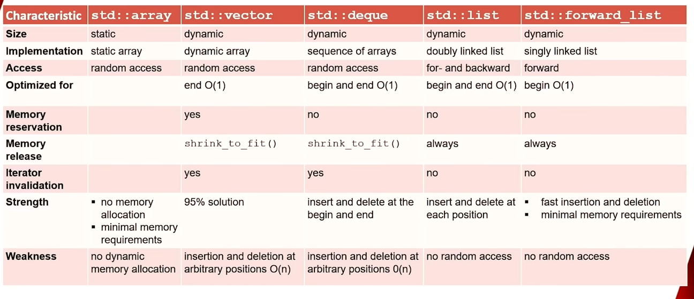

# Containers

- The STL is generic containers and generic algorithms. Iterators are used to link the two (C++20 ranges build on this to provide a more expressive view)

### Interface of containers (std::vector<T, Allocator> as an example)

- There is a type parameter and an allocator

  ```cpp
  template <typename T, typename Allocator = std::allocator<T>> class vector;
  ```

- Support the same basic functionality.

- Provide *value semantics* $\to$ the container itself owns the items as opposed to holding references to it via *reference semantics.*

- `std::string` is similar to `std::vector<char>`. `std::string` in general has a very similar interface to `std::vector`.

- **Exceptions**

  - `std::array` has a fixed size, we cannot change this size during run time.
  - `std::forward_list` does *not know* its own length. 

#### Create and Delete

- **Constructors**

  ```cpp
  std::vector<int> first; // Default constructor
  std::vector<int> second(5);// Constructor with count
  std::vector<int> third(second.begin(), second.end());// Range constructor
  std::vector<int> fourth(third);// Copy constructor
  std::vector<int> fifth(std::move(fourth));// Move constructor
  std::vector<int> sixth {1, 2, 3, 4, 5};// Initializer list constructor
  ```

- **Destructors**

  ```cpp
  std::vector<int> first;
  delete first;
  ```

- **Removing**

  ```cpp
  std::vector<int> sixth {1,2,3,4,5,6,7,8,9,10};
  sixth.clear(); // c++98
  
  std::erase(sixth, 5); // c++20
  std::erase_if(sixth, [](auto i){return i >= 3; });
  ```

#### Determine the size

```cpp
std::vector<std::string> first {"one", "two", "three", "four"};

// Empty?
first.empty();

// Number of elements (currently allocated for I presume?)
first.size();

// Maximal size on your system
first.max_size();
```

#### Assignment and Swap

```cpp
std::vector<std::string> first {"one", "two", "three", "four"};
std::vector<std::string> second {"five", "six"};

// Assignment
second = first; // copy assignment
second = std::move(first); // move assignment
second = {"seven", "eight"}; // assignment from an std::initializer_list<T> , T = std::string for this case. 

// Swap
second.swap(first); // direct
std::swap(second, first); // free function
```

#### Comparison

- **All containers** overload the `==` and `!=` to compare equality / inequality.
- **Sequence and Ordered Associative Containers** overload the  `<` , `>=`, `>` and `>=` operators, and `<=>` for C++20.
- **Rules**
  - Containers must have the *same type* when comparing.
  - Two containers are equal, if they have the elements in the same sequence (applies to sequence containers and ordered associative containers)
  - The containers are compared lexicographically (left = first, move right until the first element is compared incorrectly).

#### Range-Based for loop

```cpp
for (declaration: sequence) { ....
```

- The sequence could be: initializer list, C array, C++ String, STL container, or a Range (C++20).

```cpp
std::vector<int> vec {1,2,3,4,5};
for (auto v: vec) std::cout << v << " "; // 1 2 3 4 5 
```

- To modify the elements you must take them via `auto&` 

```cpp
std::vector<int> vec {1,2,3,4,5};
for (auto& a: vec) a *=2
for (auto a: vec) std::cout << a << " "; // 2 4 6 8 10
```

### Sequence containers

- This is our table for deciding the correct sequence container to use.

> Misc notes
>
> - vector reserve is useful to prevent allocations from needing to happen, as a dynamic array needs to reallocate every item when its reallocates memory which is incredibly time consuming and inefficient, notably it always has a bit of space left over pre defined.



- **Implementation**

  - `vector` is a dynamic *C style array*

  - `array` is a static *C style array*.

  - `deque` is a double ended queue and is stated they are a sequence of arrays.

  - `list` is a doubly linked list of double nodes.

  - `forward_list` is a singly linked list of single nodes.

- 