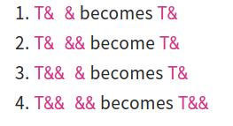

# Template metaprogramming

> - [Summary](https://www.vishalchovatiya.com/c-template-a-quick-uptodate-look/#TerminologyJargonIdiom_You_May_Face)
> - [C++17 Fold expressions](https://www.codingame.com/playgrounds/2205/7-features-of-c17-that-will-simplify-your-code/fold-expressions)

### Template Types

##### Class Template

```cpp
template <typename T1, typename T2>
class pair {
public:
    T1  first;
    T2  second;
};

pair<int, char> p1;
pair<float, float> p2;
```

##### Function template

```cpp
template <typename T>
T min(T a, T b) {
    return a < b ? a : b;
}
min<int>(4, 5);              // Case 1 
min<float>(4.1f, 5.1f);      // Case 2
```

- The compiler can infer the template parameters based on the parameters passed to the function.

##### Union template

- Things like `std::optional` and `std::variant` are templatized unions.
- Represent a type simultaneously as a **byte array**

```cpp
template <typename T>
union test {
    uint8_t     ch[sizeof(T)];
    T           variable;
};
```

##### Variable template

```cpp
template <class T>
constexpr T pi = T(3.1415926535897932385L); // variable template

cout << pi<float> << endl; // 3.14159
cout << pi<int> << endl;   // 3
```

- The code below shows an example of why you may want to do this

```cpp
template <uint32_t val>
constexpr auto fib = fib<val - 1> + fib<val - 2>;

template <> // specialisation
constexpr auto fib<0> = 0;

template <>
constexpr auto fib<1> = 1;
cout << fib<10> << endl;    // 55
```

- This gives the 10th Fibonacci term at compile time, without creating any classes or functions.

### C++ Template Argument

##### Overriding template argument deduction

```cpp
template <typename T>
T min(T a, T b) {
    std::cout << typeid(T).name() << std::endl; // T will be deduce as `int`
    return a < b ? a : b;
}
min<int>(5.5f, 6.6f);     // Implicit conversion happens here
```

##### Default template arguments

```cpp
template <class T, size_t N = 10>
struct array {
    T arr[N];
};
array<int> arr;
```

- Template parameters can have default values
- Must be declared at the end of the template parameter list.

##### **Function template Argument Deduction**

- Function template argument deduction is done by comparing the types of function arguments to function parameters.

- This makes function templates far more usable than they would be otherwise


```cpp
template <typename RanIt> 
void sort(RanIt first, RanIt last){
    // . . .
}
```

- Sort `std::vector<int>` without explicitly specifiying that `RanIt` is `std::vector<int>::iterator`.
- When the compiler sees `sort(v.begin(), v.end())`. It knows what the types of `v.begin()` and `v.end()`, and thus can determine what `RanIt` should be.

##### **Class template argument deduction (CTAD)**

```cpp
//...
pair p4{1, 'A'};               // Not OK until C++17: Can't deduce type in initialization 
//...
```

- Since C++17, The compiler can deduce types in a class/struct initialisation. For this to work, the class/struct require an appropriate constructor. 
- The limitation of A constructor required was relaxed in C++20 as we can construct the object with aggregate initialisation without specifying types explicitly.

##### Inferring Template argument through function template

- Many functions like `std::make_pair` , `std::make_unique` and `std::make_shared`
- May be implemented as such:

```cpp
template <typename T1, typename T2> pair<T1, T2> make_pair(T1&& t1, T2&& t2) {
    return {forward<T1>(t1), forward<T2>(t2)};
}
```

```cpp
pair<int, char> p1{1, 'A'};          // Rather than using this
auto p2 = make_pair(1, 2);           // Use this instead
auto p3 = make_pair<float>(1, 2.4f); // Or specify types explicitly
```

- Leverage the features of inferring the template argument from the function template to construct the object. 
- Create a `pair` object without explicitly specifying the type so `std::vector v{1,2,3,4}` is okay.

### Template Argument Forwarding

##### C++ Template reference collapsing Rules

- Can accept both lvalue and rvalue



```cpp
template <typename T>
void f(T &&t);

int x = 0;
f(0); // deduces as rvalue reference i.e. f(int&&)
f(x); // deduces as lvalue reference i.e. f(int&)
```

##### Perfect forward | Forwarding reference | Universal reference

- To perfectly forward `t` to another function, use `std::forward`

```cpp
template <typename T>
void func1(T &&t) {
    func2(std::forward<T>(t));  // Forward appropriate lvalue or rvalue reference to another function, maintain the value category, so for example move semantics is applied constantly.
}
```

### C++ Template Category

##### Function Template Specialisation

```cpp 
template <typename T>
T sqrt(T t) { /* Some generic implementation */ }
template<>
int sqrt<int>(int i) { /* Highly optimized integer implementation */ }
```

- In the above case, a user that writes `sqrt(4.0)`  gets the generic implementation whereas `sqrt(4)` gets the specialised implementation.

##### Class Template Specialisation

```cpp
template <typename T>       // Common case
struct Vector {
    void print() {}
};
template <>                 // Special case
struct Vector<bool> {
    void print_bool() {}
};
Vector<int> v1;
v1.print_bool();    // Not OK: Chose common case Vector<T>
v1.print()          // OK
Vector<bool> v2;    // OK : Chose special case Vector<bool>
```

##### Partial class template specialisation

```cpp
template <typename T1, typename T2>     // Common case
struct Pair {
    T1 first;
    T2 second;
    void print_first() {}
};
template <typename T>    // Partial specialization on first argument as int
struct Pair<int, T> {
    void print() {}
};
// Use case 1 ----------------------------------------------------------
Pair<char, float> p1;    // Chose common case
p1.print_first();        // OK
// p1.print();           // Not OK: p1 is common case & it doesn't have print() method

// Use case 2 ----------------------------------------------------------
Pair<int, float> p2;     // Chose special case
p2.print();              // OK
// p2.print_first();     // Not OK: p2 is special case & it does not have print_first()

// Use case 3 ----------------------------------------------------------
// Pair<int> p3;         // Not OK: Number of argument should be same as Primary template
```

##### Partial Function Template Specialisation

- You cannot partially specialise methods and functions. 

```CPP
template <typename T, typename U>
void foo(T t, U u) {
    cout << "Common case" << endl;
}

// OK.
template <>
void foo<int, int>(int a1, int a2) {
    cout << "Fully specialized case" << endl;
}
// Compilation error: partial function specialization is not allowed.
template <typename U>
void foo<string, U>(string t, U u) {
    cout << "Partial specialized case" << endl;
}
foo(1, 2.1); // Common case
foo(1, 2);   // Fully specialized case
```

- **Alternative**. Use **SFINAE**

```cpp
template <typename T, typename std::enable_if_t<!std::is_pointer<T>::value> * = nullptr>
void func(T val) {  
    cout << "Value" << endl; 
}
template <typename T, typename std::enable_if_t<std::is_pointer<T>::value> * = nullptr>
void func(T val) {  // NOTE: function signature is NOT-MODIFIED
    cout << "Pointer" << endl; 
}
int a = 0;
func(a);
func(&a);

```

##### Non-Type Template Parameter

- Declare template parameters as being constant expressions like addresses, references, integrals, `std::nullptr_t`, enums.
- Can be explicitly specified, defaulted, or derived implicitly via Template Argument Deduction.
- A more specific use case of a non-type template is passing a plain array into a function without specifying its size explicitly. An example is `std::begin()` and `std::end()`.

```cpp
template <  class T, 
            size_t size>     // Non Type Template
T* begin(T (&arr)[size]) {   // Array size deduced implicitly
    return arr;
}
int arr[] = {1,2,3,4};
begin(arr);                  // Do not have to pass size explicitly 
```

- One way to achieve **template recurrence**.

##### Nested template: Template Template Parameter

- We want to pass a templated type to another templated type.
- We not only have to take care of the main template type but also a nested template type.
- Very simple template-template parameter examples is:

```cpp
template<template <typename> class C, typename T>
void print_container(C<T> &c) {
    // . . .
}
template <typename T>
class My_Type {
    // . . .
};
My_Type<int> t;
print_container(t);
```

##### Variadic templates

###### Variadic class templates

- C++11 introduce `std::tuple` that accepts variable data members at compile time using the variadic template
- The variadic template usually starts with the general empty definition, that servers as the base-case for recursion termination in the later specialisation

```cpp
template <typename... T>
struct Tuple { };
```

- This allows us to define an empty structure such as `Tuple<> object`
- Recursive case specialisation

```cpp
template<typename T, typename... Rest>
struct Tuple<T, Rest...> {
    T first;
    Tuple<Rest...> rest; // Pass the variadic templates recursively
    
    Tuple(const T& f, const Rest& ... r): first(f), rest(r...) {}
};
Tuple<bool> t1(false);                      // Case 1
Tuple<int, char, string> t2(1, 'a', "ABC"); // Case 2
```

- To understand variadic class templates, consider use case 2 above `Tuple<int, char, string> t2(1, 'a', "ABC")` 
  - The declaration first matches against the specialisation $\to$ yields a structure with `int first;` and `Tuple<char, string> rest;` 
  - The rest definition again matches specialisation $\to$ yields a structure with `char first;` and `Tuple<string> rest;` data members.
  - The rest definition again matches this specialisation, creating its owns `string first;` and `Tuple<> rest;` members.
  - The last rest matches against the base-case definition, producing an empty structure.

```cpp
Tuple<int, char, string>
-> int first
-> Tuple<char, string> rest
    -> char first
    -> Tuple<string> rest
        -> string first
        -> Tuple<> rest
            -> (empty)
```

###### Variadic Function Template

- Start with an empty definition , the base case for recursion

```cpp
void print() {}
```

- Recursive case specialisation

```cpp
template<typename First, typename... Res /* Template parameter pack */ >     
void print(First first, Rest... rest) {         // Function parameter pack
    cout << first << endl;
    print(rest...);                             // Parameter pack expansion
} 

print(500, 'a', "ABC");
```

- Further optimise this print function with forwarding references, `if constexpr()` and `sizeof()` operator as:

```cpp
template< typename First, typename... Rest>     
void print(First&& first, Rest&&... rest) {         
    if constexpr(sizeof...(rest) > 0) {             // Size of parameter pack
        cout << first << endl;
        print(std::forward<Rest>(rest)...);         // Forwarding reference
    }
    else {
        cout << first << endl;
    }
} 
```

- For `print(500, 'a', "ABC")` 
- At the time of compilation, the compiler instantiates 3 different print functions as follows:
  - `void print(int first, char __rest1, const char* __rest2)`
  - `void print(char first, const char* __rest1)`
  - `void print(const char* first)`
- The first print accepts 3 arguments and it prints the first argument and the line `print(rest...`) expanded with the second print (that accepts 2 arguments). This goes on until the argument count reaches zero.
- In each call to print, the number of arguments is reduced by one and the rest of the arguments will be handled by a subsequent instance of print.

##### Fold Expression (C++17)

```cpp
template <typename... Args>
void print(Args &&... args) {
    (void(cout << std::forward<Args>(args) << endl), ...);
}
```

- The motivation for fold expressions is that to implement recursive logic in templates requires

### Misc

##### C++ Template `typename` vs `class` 

- `typename` and `class` are interchangeable in most of the cases.
- A general convention is `typename` is used with the concrete type (i.e in turn, does not depend on further template parameters).

##### Referring to dependent types

```cpp
template<typename container>
class Example {
    using t1 = typename container::value_type; // value_type depends on template argument of container
    using t2 = std::vector<int>::value_type;   // value_type is concrete type, so doesn't require typename
};
```

##### To specify template template type

```cpp
template<template <typename, typename> class C, typename T, typename Allocator>
void print_container(C<T, Allocator> container) {
    for (const T& v : container)
        cout << v << endl;
}
vector<int> v;
print_container(v);
```

##### C++11 Template Type Alias

```cpp
template<typename T> 
using pointer = T*;

pointer<int> p = new int;   // Equivalent to: int* p = new int;
template <typename T>
using v = vector<T>;

v<int> dynamic_arr;         // Equivalent to: vector<int> dynamic_arr;
```

- `typedef` works but not encouraged.

##### C++14/17 Template & `auto` keyword

```cpp
void print(auto &c) { /*. . .*/ }
// Equivalent to
template <typename T>
void print(T &c) { /*. . .*/ }
```

##### C++20 Template lambda expression

- A generic lambda expression is supported since C++14 which declares parameter as `auto`. But there was no way to change this template parameter to use real template arguments

```cpp
template <typename T>
void f(std::vector<T>&    vec) {
    //. . .

```

```cpp
auto f = []<typename T>(std::vector<T>&  vec) {
    // . . .
};
std::vector<int> v; // We can now effectively pass our vector type in.
f(v);
```

##### Explicit Template Instantiation

- An explicit instantiation creates and declares a concrete class/struct/union/function/variable from a template, without using it just yet.

- Generally, you have to implement the template in header files only. You can not put the implementation/definition of template methods in implementation files(i.e. cpp or .cc). If this seems new to you, then consider following minimalist example:

```cpp
// value.hpp

#pragma once
template <typename T>
class value {
    T val;
public:
    T get_value();
};

// value.cpp

#include "value.hpp"
template <typename T>
T value<T>::get_value() { 
    return val; 
}

// main.cpp

#include "value.hpp"
int main() {
    value<int> v1{9};
    cout << v1.get_value() << endl; // [error] undefined reference to value<int>::get_value() 
    return 0;
}
```

- If you do explicit initialisation i.e add `template class value<int>;` at the end of `value.cpp` Then the compilation is successful
- The template class command causes the compiler to explictily instantiate the template class. In the above case, the compiler will stencil out `value<int>` inside of `value.cpp` 

##### Passing any container to C++ template function

```cpp
template<template <typename...> class C, typename... Args>
void print_container(C<Args...> container) {
    for (const auto &v : container)
        cout << v << endl;
}
vector<int>     v{1, 2, 3, 4}; // takes total 2 template type argument
print_container(v); 
set<int>        s{1, 2, 3, 4}; // takes total 3 template type argument
print_container(s);
```

##### Passing Container-of-Container/2D std::vector as C++ Template argument

```cpp
template<typename T1,typename T2 = typename T1::value_type,typename T3 = typename T2::value_type>
void print_container(const T1 &container) {
    for (const T2 &e : container)
        for (const T3 &x : e)
            cout << x << endl;
}
```

- **Generic solution using variadic template**

```cpp
template<template <typename...> class C, typename... Args>
void print_container(C<Args...> container) {
    for (const auto &container_2nd : container)
        for (const auto &v : container_2nd)
            cout << v << endl;
}
```

##### Passing function to class template argument

- Passing class/struct/union to another class/struct/union as a template argument is a common thing.
- Passing a function to a class/struct/union is rarer, but its rarer.

```cpp
// Need partial specialization for this to work
template <typename T>
struct Logger;

// Return type and argument list
template <typename R, typename... Args>
struct Logger<R(Args...)> {
    std::function<R(Args...)>    m_func;
    std::string                  m_name;
    Logger(std::function<R(Args...)> f, const string &n) : m_func{f}, m_name{n} { }
 
    R operator()(Args... args) {
        cout << "Entering " << m_name << endl;
        R result = m_func(args...);
        cout << "Exiting " << m_name << endl;
        return result;
    }
};
template <typename R, typename... Args>
auto make_logger(R (*func)(Args...), const std::string &name) {
    return Logger<R(Args...)>(std::function<R(Args...)>(func), name);
}
double add(double a, double b) { return a + b; }
int main() {
    auto logged_add = make_logger(add, "Add");
    auto result = logged_add(2, 3);
    return EXIT_SUCCESS;
}
```

