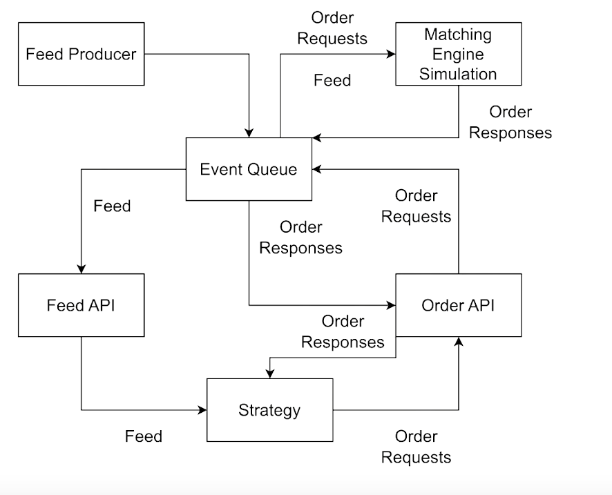

# High Frequency Trading

- Simulating a Low Latency Exchange in C++ - https://www.youtube.com/watch?v=QQrTE4YLkSE

- Matching Orders https://www.investopedia.com/terms/m/matchingorders.asp

- Python matching engine  - https://github.com/Surbeivol/PythonMatchingEngine

- Simulating a matching engine - https://www.linkedin.com/pulse/developing-matching-engine-simulating-effects-trading-rob-graumans

